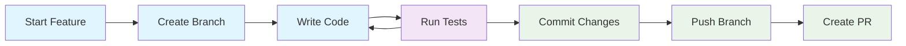

# Local Development Guide

This guide walks you through cloning, building, running, and debugging OpenFrame CLI locally. Whether you're fixing bugs, adding features, or just exploring the codebase, this guide will get you up and running quickly.

## 🎯 Quick Setup (TL;DR)

```bash
# Clone and setup
git clone https://github.com/flamingo-stack/openframe-cli.git
cd openframe-cli
make install  # Install development tools
make build    # Build binary

# Run locally
./bin/openframe bootstrap test-cluster --verbose

# Start development with hot reload
make dev
```

## 📥 Cloning the Repository

### Standard Clone

```bash
# Clone the main repository
git clone https://github.com/flamingo-stack/openframe-cli.git
cd openframe-cli

# Check repository status
git status
git branch -a
```

### Fork-Based Development

For contributing to the project:

```bash
# 1. Fork the repository on GitHub first
# 2. Clone your fork
git clone https://github.com/YOUR_USERNAME/openframe-cli.git
cd openframe-cli

# 3. Add upstream remote
git remote add upstream https://github.com/flamingo-stack/openframe-cli.git
git remote -v

# 4. Fetch latest changes
git fetch upstream
git checkout main
git merge upstream/main
```

### Repository Structure

Understanding the project layout will help you navigate:

```
openframe-cli/
├── cmd/                    # CLI command implementations
│   ├── bootstrap/         # Bootstrap command (complete setup)
│   ├── cluster/          # Cluster management commands
│   ├── chart/            # Chart installation commands
│   └── dev/              # Development tools commands
├── internal/             # Private application packages
│   ├── bootstrap/        # Bootstrap service logic
│   ├── cluster/          # Cluster management services
│   ├── chart/            # Chart management services
│   ├── dev/              # Development tool integrations
│   └── shared/           # Common utilities and UI
├── test/                 # Integration tests
├── examples/             # Usage examples and demos
├── docs/                 # Documentation
├── scripts/              # Build and utility scripts
├── .github/              # GitHub workflows and templates
├── Makefile              # Development task automation
├── go.mod                # Go module definition
└── main.go               # Application entry point
```

## 🏗️ Building the Project

### Prerequisites Check

Ensure you have all required tools installed:

```bash
# Check Go installation
go version  # Should be 1.21+

# Check required tools
docker --version
kubectl version --client
helm version
k3d --version

# Verify Docker is running
docker ps
```

### Build Commands

```bash
# Install development dependencies
make install

# Build for development (with debug symbols)
make build

# Build for production (optimized)
go build -ldflags "-w -s" -o bin/openframe-prod

# Build for multiple platforms
GOOS=darwin GOARCH=amd64 go build -o bin/openframe-darwin
GOOS=windows GOARCH=amd64 go build -o bin/openframe.exe
```

### Build Verification

```bash
# Check binary was created
ls -la bin/

# Test basic functionality
./bin/openframe --version
./bin/openframe --help

# Verify all commands are available
./bin/openframe bootstrap --help
./bin/openframe cluster --help
./bin/openframe chart --help
./bin/openframe dev --help
```

## 🚀 Running Locally

### Development Execution

```bash
# Run directly with go run (for development)
go run main.go bootstrap test-cluster --verbose

# Or use the built binary
./bin/openframe bootstrap test-cluster --verbose

# Run with development environment variables
OPENFRAME_LOG_LEVEL=debug ./bin/openframe cluster status
```

### Hot Reload Development

For rapid iteration during development:

```bash
# Start hot reload server (rebuilds on file changes)
make dev

# Or use air directly
air

# Customize air command for specific testing
air -- cluster create hot-reload-cluster --skip-wizard
```

### Environment Isolation

Create isolated environments for testing:

```bash
# Use separate config directory for development
export OPENFRAME_CONFIG_PATH=$HOME/.openframe-dev

# Create development cluster with unique name
./bin/openframe bootstrap dev-$(whoami)-$(date +%s) --verbose

# Use test mode to avoid conflicts
export OPENFRAME_TEST_MODE=true
./bin/openframe cluster create test-cluster
```

## 🔍 Debugging Commands

### Built-in Debugging

OpenFrame CLI includes several debugging features:

```bash
# Enable verbose output
./bin/openframe bootstrap test-cluster --verbose

# Enable debug logging
OPENFRAME_LOG_LEVEL=debug ./bin/openframe cluster status

# Dry run mode (where supported)
./bin/openframe cluster create test --dry-run
```

### VS Code Debugging

Use the pre-configured launch configurations:

1. **Open VS Code** in the project directory
2. **Set breakpoints** in your code
3. **Press F5** or use the Debug panel
4. **Select configuration:**
   - "Debug Bootstrap Command" - Debug complete setup
   - "Debug Cluster Create" - Debug cluster creation
   - "Debug Current Test" - Debug the current test file

### Delve Debugger (Command Line)

For terminal-based debugging:

```bash
# Install delve debugger
go install github.com/go-delve/delve/cmd/dlv@latest

# Debug bootstrap command
dlv debug -- bootstrap test-cluster --verbose

# Debug specific package
dlv test ./internal/cluster/services/

# Attach to running process
dlv attach $(pgrep openframe)
```

#### Delve Commands

```bash
# Common delve commands
(dlv) break main.main           # Set breakpoint
(dlv) break cluster.go:42       # Set breakpoint at line
(dlv) continue                  # Continue execution
(dlv) next                      # Step to next line
(dlv) step                      # Step into function
(dlv) print variable            # Print variable value
(dlv) locals                    # Show local variables
(dlv) goroutines                # Show goroutines
(dlv) stack                     # Show stack trace
```

### Debugging with External Tools

```bash
# Debug cluster creation with k3d directly
k3d cluster create debug-cluster --agents 2 --verbose

# Check Docker containers
docker ps -a
docker logs k3d-debug-cluster-server-0

# Debug kubectl connectivity
kubectl --kubeconfig ~/.k3d/kubeconfig-debug-cluster.yaml get nodes

# Debug Helm operations
helm --kubeconfig ~/.k3d/kubeconfig-debug-cluster.yaml list -A
```

### Logging and Tracing

Add debugging output to your code:

```go
// Add to any function for debugging
import "log"

log.Printf("DEBUG: Variable value: %+v", variable)
log.Printf("DEBUG: Entering function %s with args: %v", "functionName", args)

// Use structured logging (if available)
import "github.com/sirupsen/logrus"

logrus.WithFields(logrus.Fields{
    "cluster":   clusterName,
    "operation": "create",
}).Debug("Starting cluster creation")
```

## 🧪 Testing Your Changes

### Unit Tests

```bash
# Run all tests
make test

# Run tests with coverage
make coverage

# Run specific package tests
go test -v ./internal/cluster/...

# Run specific test function
go test -v ./internal/cluster/services/ -run TestCreateCluster

# Run tests with race detection
go test -race ./...
```

### Integration Tests

```bash
# Run integration tests (requires Docker)
make test-integration

# Run specific integration test
go test -tags=integration -v ./test/cluster_test.go

# Run integration tests with timeout
go test -tags=integration -timeout=30m ./test/...
```

### Manual Testing

Create test scenarios to verify your changes:

```bash
# Test cluster lifecycle
./bin/openframe cluster create manual-test-cluster
./bin/openframe cluster status manual-test-cluster
./bin/openframe cluster list
./bin/openframe cluster delete manual-test-cluster

# Test bootstrap flow
./bin/openframe bootstrap manual-bootstrap-test --deployment-mode=oss-tenant

# Test error handling
./bin/openframe cluster create "" # Test empty name
./bin/openframe cluster delete non-existent # Test missing cluster
```

### Performance Testing

```bash
# Benchmark specific functions
go test -bench=. -benchmem ./internal/cluster/services/

# Profile CPU usage
go test -cpuprofile cpu.prof -bench=. ./internal/cluster/services/
go tool pprof cpu.prof

# Profile memory usage  
go test -memprofile mem.prof -bench=. ./internal/cluster/services/
go tool pprof mem.prof

# Time command execution
time ./bin/openframe bootstrap perf-test-cluster
```

## 🔧 Development Workflows

### Feature Development



### Typical Development Session

```bash
# 1. Start development session
cd openframe-cli
git checkout main
git pull upstream main

# 2. Create feature branch
git checkout -b feature/new-cluster-provider

# 3. Start hot reload
make dev

# 4. Make changes and test iteratively
# Edit code -> save -> automatic rebuild -> test

# 5. Run tests before committing
make test
make lint

# 6. Commit and push
git add .
git commit -m "feat: add support for new cluster provider"
git push origin feature/new-cluster-provider
```

### Bug Fix Workflow

```bash
# 1. Reproduce the bug
./bin/openframe cluster create reproduce-bug

# 2. Create test case that demonstrates the bug
cat > test/bug_reproduction_test.go << 'EOF'
func TestBugReproduction(t *testing.T) {
    // Test case that fails before fix
    // and passes after fix
}
EOF

# 3. Fix the bug
# Edit the relevant code files

# 4. Verify the fix
go test -v ./test/bug_reproduction_test.go
./bin/openframe cluster create verify-fix

# 5. Clean up test resources
./bin/openframe cluster delete reproduce-bug
./bin/openframe cluster delete verify-fix
```

## 📋 Code Quality Checks

### Pre-commit Checks

```bash
# Format code
make fmt

# Run linter
make lint

# Check for security issues
gosec ./...

# Check for outdated dependencies
go list -u -m -json all | go-mod-outdated -update

# Tidy dependencies
make mod-tidy
```

### Git Hooks Setup

Create a pre-commit hook:

```bash
#!/bin/sh
# .git/hooks/pre-commit

echo "Running pre-commit checks..."

# Format code
make fmt

# Run tests
if ! make test; then
    echo "Tests failed. Commit aborted."
    exit 1
fi

# Run linter
if ! make lint; then
    echo "Linting failed. Commit aborted."
    exit 1
fi

echo "All checks passed!"
```

Make it executable:
```bash
chmod +x .git/hooks/pre-commit
```

## 🐛 Common Development Issues

### Build Issues

**Problem**: `go build` fails with module errors
```bash
# Solution: Clean and re-download modules
go clean -modcache
go mod download
go mod tidy
```

**Problem**: Import path issues
```bash
# Solution: Verify module name in go.mod
head -1 go.mod
# Should be: module github.com/flamingo-stack/openframe-cli

# Check import paths in code match module path
grep -r "github.com/flamingo-stack/openframe-cli" --include="*.go" .
```

### Runtime Issues

**Problem**: Cluster creation fails with permission errors
```bash
# Solution: Check Docker daemon and permissions
docker ps
sudo usermod -aG docker $USER
newgrp docker
```

**Problem**: kubectl not finding cluster
```bash
# Solution: Check kubeconfig
export KUBECONFIG=~/.k3d/kubeconfig-test-cluster.yaml
kubectl config current-context
kubectl get nodes
```

**Problem**: Hot reload not working
```bash
# Solution: Check air configuration and file permissions
air -v
cat .air.toml
# Ensure tmp/ directory is writable
mkdir -p tmp && chmod 755 tmp
```

### Debug Information

When reporting issues, include this information:

```bash
# System information
go env
docker version
kubectl version
k3d version

# OpenFrame CLI information
./bin/openframe --version
OPENFRAME_LOG_LEVEL=debug ./bin/openframe cluster list

# Build information
go version -m bin/openframe

# Environment
env | grep -E "(OPENFRAME|KUBECONFIG|GOPATH|GOPROXY)"
```

## 📚 Next Steps

Now that you have local development working:

1. **[Architecture Overview](../architecture/overview.md)** - Understand the system design
2. **[Testing Overview](../testing/overview.md)** - Learn the testing strategy  
3. **[Contributing Guidelines](../contributing/guidelines.md)** - Submit your changes

### Advanced Topics

- **Custom Builds**: Adding build tags and custom configurations
- **Cross-platform Testing**: Testing on different OS and architectures
- **Integration Development**: Adding new external tool integrations
- **Plugin Development**: Extending OpenFrame CLI with plugins

---

> **💡 Pro Tip**: Set up multiple terminal tabs/windows for efficient development:
> 1. **Code Editor** (VS Code, GoLand, etc.)
> 2. **Hot Reload** (`make dev`)
> 3. **Testing** (`make test`, manual testing)
> 4. **Git Operations** (commit, push, etc.)
> 
> This workflow allows you to iterate quickly while maintaining good testing practices.