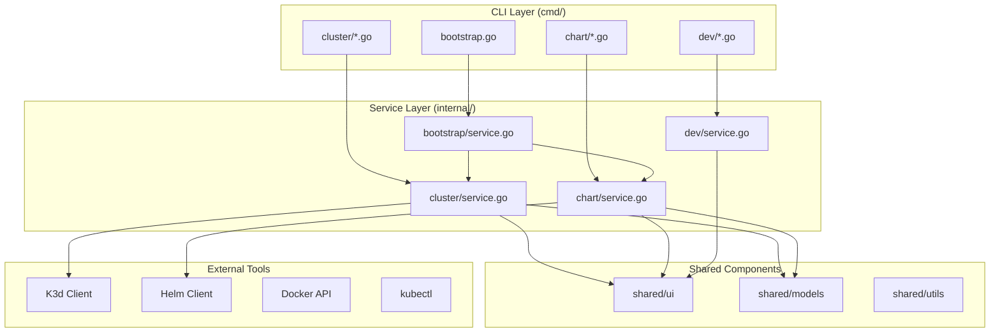

# Local Development Guide

This guide covers everything you need to know about developing OpenFrame CLI locally, from cloning the repository to running tests and debugging code. Whether you're fixing a bug, adding a feature, or just exploring the codebase, this guide will get you up and running quickly.

## Quick Start

```bash
# Clone the repository
git clone https://github.com/flamingo-stack/openframe-cli.git
cd openframe-cli

# Install dependencies
go mod download

# Build the binary
go build -o bin/openframe main.go

# Run a test command
./bin/openframe --help
```

## Repository Setup

### Clone and Initialize

```bash
# Clone the repository
git clone https://github.com/flamingo-stack/openframe-cli.git
cd openframe-cli

# Set up the upstream remote (for contributors)
git remote add upstream https://github.com/flamingo-stack/openframe-cli.git

# Verify remotes
git remote -v
# origin    https://github.com/YOUR_USERNAME/openframe-cli.git (fetch)
# origin    https://github.com/YOUR_USERNAME/openframe-cli.git (push)
# upstream  https://github.com/flamingo-stack/openframe-cli.git (fetch)
# upstream  https://github.com/flamingo-stack/openframe-cli.git (push)

# Install Git hooks (if you set up pre-commit)
pre-commit install
```

### Project Structure Overview

```
openframe-cli/
├── cmd/                     # CLI command definitions (entry points)
│   ├── bootstrap/           # Bootstrap command implementation
│   │   └── bootstrap.go     # Cobra command setup
│   ├── cluster/             # Cluster management commands
│   │   ├── cluster.go       # Main cluster command
│   │   ├── create.go        # Cluster creation
│   │   ├── delete.go        # Cluster deletion
│   │   ├── list.go          # List clusters
│   │   └── status.go        # Cluster status
│   ├── chart/               # Chart management commands
│   │   ├── chart.go         # Main chart command
│   │   └── install.go       # Chart installation
│   └── dev/                 # Development commands
│       └── dev.go           # Development tools entry
├── internal/                # Private application code
│   ├── bootstrap/           # Bootstrap service implementation
│   ├── cluster/             # Cluster management services
│   ├── chart/               # Chart installation services
│   ├── dev/                 # Development tools services
│   └── shared/              # Shared utilities and components
├── docs/                    # Documentation
├── tests/                   # Test files
├── scripts/                 # Build and utility scripts
├── go.mod                   # Go module dependencies
├── go.sum                   # Go module checksums
├── main.go                  # Application entry point
└── Makefile                 # Build automation
```

### Understanding the Architecture

The codebase follows a clean architecture pattern:



## Building the Application

### Build Commands

```bash
# Simple build
go build -o bin/openframe main.go

# Build with version information
go build -ldflags="-X main.version=dev -X main.commit=$(git rev-parse HEAD)" -o bin/openframe main.go

# Build for multiple platforms
GOOS=linux GOARCH=amd64 go build -o bin/openframe-linux-amd64 main.go
GOOS=darwin GOARCH=amd64 go build -o bin/openframe-darwin-amd64 main.go
GOOS=windows GOARCH=amd64 go build -o bin/openframe-windows-amd64.exe main.go

# Using Makefile (if available)
make build
```

### Build Optimization

```bash
# Optimized build (smaller binary)
go build -ldflags="-s -w" -o bin/openframe main.go

# Build with race detector (for testing)
go build -race -o bin/openframe-race main.go

# Static binary (useful for containers)
CGO_ENABLED=0 GOOS=linux go build -a -ldflags="-extldflags '-static'" -o bin/openframe-static main.go
```

### Verify Build

```bash
# Check if binary works
./bin/openframe --version
./bin/openframe --help

# Test basic functionality (requires Docker)
./bin/openframe cluster list
./bin/openframe bootstrap --help
```

## Development Workflow

### Hot Reloading Development

For rapid development, use Air for hot reloading:

```bash
# Install Air (if not done in environment setup)
go install github.com/cosmtrek/air@latest

# Start development server with hot reload
air

# This will rebuild and restart on code changes
```

### Manual Development Cycle

```bash
# 1. Make code changes
vim internal/cluster/service.go

# 2. Build
go build -o bin/openframe main.go

# 3. Test your changes
./bin/openframe cluster status --verbose

# 4. Run tests
go test ./internal/cluster/...

# 5. Repeat
```

### Testing Your Changes

```bash
# Test specific functionality
./bin/openframe bootstrap test-cluster --verbose --dry-run

# Test cluster operations
./bin/openframe cluster create test --verbose
./bin/openframe cluster status test
./bin/openframe cluster delete test

# Test chart operations
./bin/openframe chart install --deployment-mode=oss-tenant --verbose
```

## Running Tests

### Unit Tests

```bash
# Run all tests
go test ./...

# Run tests with verbose output
go test -v ./...

# Run tests with race detection
go test -race ./...

# Run specific package tests
go test ./internal/cluster/...
go test ./cmd/bootstrap/...

# Run specific test
go test -run TestBootstrapService_Execute ./internal/bootstrap/...
```

### Integration Tests

```bash
# Run integration tests (requires Docker)
go test -tags=integration ./tests/...

# Run integration tests with verbose output
go test -tags=integration -v ./tests/...

# Run specific integration test
go test -tags=integration -run TestBootstrapIntegration ./tests/...
```

### Test Coverage

```bash
# Generate coverage report
go test -coverprofile=coverage.out ./...

# View coverage in terminal
go tool cover -func=coverage.out

# Generate HTML coverage report
go tool cover -html=coverage.out -o coverage.html

# Open coverage report in browser
open coverage.html  # macOS
xdg-open coverage.html  # Linux
```

### Benchmark Tests

```bash
# Run benchmark tests
go test -bench=. ./...

# Run specific benchmark
go test -bench=BenchmarkClusterCreate ./internal/cluster/...

# Profile benchmarks
go test -bench=. -cpuprofile=cpu.prof ./internal/cluster/...
```

## Debugging

### Debugging with Delve

```bash
# Build with debug symbols
go build -gcflags="all=-N -l" -o bin/openframe-debug main.go

# Debug with delve
dlv exec bin/openframe-debug -- bootstrap test-cluster --verbose

# Set breakpoints
(dlv) break internal/bootstrap/service.go:45
(dlv) continue

# Common dlv commands
(dlv) print variable_name
(dlv) locals
(dlv) stack
(dlv) next
(dlv) step
```

### Debugging with VS Code

If using VS Code with the Go extension:

1. Set breakpoints by clicking in the gutter
2. Press F5 or use "Run > Start Debugging"
3. Use the debug configuration from `.vscode/launch.json`

### Debug Logging

Enable debug logging for development:

```bash
# Set debug log level
export OPENFRAME_LOG_LEVEL=debug

# Run with debug output
./bin/openframe bootstrap test-cluster --verbose

# Debug specific components (if implemented)
export OPENFRAME_DEBUG_CLUSTER=true
export OPENFRAME_DEBUG_CHART=true
./bin/openframe bootstrap test-cluster
```

### Debugging External Tool Integration

```bash
# Debug K3d calls
export K3D_LOG_LEVEL=debug

# Debug Helm calls  
export HELM_DEBUG=true

# Debug kubectl calls
export KUBECTL_EXTERNAL_DIFF=1

# Trace system calls (Linux/macOS)
strace -e trace=execve ./bin/openframe cluster create test
```

## Code Generation

### Generate Mocks for Testing

```bash
# Install mockgen
go install github.com/golang/mock/mockgen@latest

# Generate mocks for interfaces
mockgen -source=internal/cluster/interfaces.go -destination=internal/cluster/mocks/mocks.go

# Generate mocks with Makefile
make mocks
```

### Generate Documentation

```bash
# Generate CLI documentation
go run tools/gendocs/main.go

# Generate code documentation
godoc -http=:6060
# Open http://localhost:6060/pkg/github.com/flamingo-stack/openframe-cli/
```

## Working with Dependencies

### Managing Dependencies

```bash
# Download dependencies
go mod download

# Clean up dependencies
go mod tidy

# Update all dependencies
go get -u ./...

# Update specific dependency
go get -u github.com/spf13/cobra

# Add new dependency
go get github.com/new/dependency

# View dependency graph
go mod graph
```

### Vendor Dependencies (if needed)

```bash
# Create vendor directory
go mod vendor

# Build using vendor
go build -mod=vendor -o bin/openframe main.go
```

## Local Testing Environment

### Setting Up Test Clusters

```bash
# Create dedicated test cluster
k3d cluster create openframe-test --api-port 6444

# Use test cluster for development
export KUBECONFIG=$(k3d kubeconfig write openframe-test)

# Test your changes
./bin/openframe cluster status openframe-test

# Clean up test cluster
k3d cluster delete openframe-test
```

### Testing with Different Configurations

```bash
# Test different deployment modes
./bin/openframe bootstrap test1 --deployment-mode=oss-tenant
./bin/openframe bootstrap test2 --deployment-mode=saas-tenant
./bin/openframe bootstrap test3 --deployment-mode=saas-shared

# Test non-interactive mode
./bin/openframe bootstrap ci-test --non-interactive --deployment-mode=oss-tenant

# Test with verbose output
./bin/openframe bootstrap verbose-test --verbose --deployment-mode=oss-tenant
```

## Performance Profiling

### CPU Profiling

```bash
# Build with profiling
go build -o bin/openframe main.go

# Add profiling to main.go (temporarily):
import _ "net/http/pprof"
go func() {
    log.Println(http.ListenAndServe("localhost:6060", nil))
}()

# Run with profiling
./bin/openframe bootstrap test-cluster &

# Capture CPU profile
go tool pprof http://localhost:6060/debug/pprof/profile?seconds=30

# Analyze profile
(pprof) top10
(pprof) web
```

### Memory Profiling

```bash
# Capture memory profile
go tool pprof http://localhost:6060/debug/pprof/heap

# Analyze memory usage
(pprof) top10
(pprof) list functionName
```

## Common Development Tasks

### Adding a New Command

1. **Create command file**: `cmd/newcommand/newcommand.go`
2. **Implement service**: `internal/newcommand/service.go`
3. **Add tests**: `internal/newcommand/service_test.go`
4. **Register command**: Add to root command
5. **Update documentation**: Add help text and examples

### Adding a New Feature

1. **Write tests first** (TDD approach)
2. **Implement feature** in service layer
3. **Update CLI commands** if needed
4. **Add integration tests**
5. **Update documentation**

### Fixing a Bug

1. **Reproduce the bug** with a test case
2. **Write a failing test** that demonstrates the bug
3. **Fix the code** to make the test pass
4. **Verify fix** doesn't break existing functionality
5. **Update documentation** if behavior changed

## Troubleshooting Development Issues

### Common Build Issues

**Issue**: `cannot find package`
```bash
# Solution: Update dependencies
go mod tidy
go mod download
```

**Issue**: `version conflict`
```bash
# Solution: Clean module cache
go clean -modcache
go mod download
```

**Issue**: `binary not executable`
```bash
# Solution: Check file permissions
chmod +x bin/openframe
```

### Common Runtime Issues

**Issue**: `docker: command not found`
```bash
# Solution: Ensure Docker is installed and running
docker --version
docker info
```

**Issue**: `cluster already exists`
```bash
# Solution: Clean up existing clusters
k3d cluster delete --all
```

**Issue**: `port already in use`
```bash
# Solution: Find and kill process using port
sudo lsof -i :6443
kill -9 <PID>
```

### Debug Information Collection

```bash
# Collect system information for bug reports
echo "Go version: $(go version)"
echo "Docker version: $(docker --version)"
echo "K3d version: $(k3d version)"
echo "Helm version: $(helm version)"
echo "kubectl version: $(kubectl version --client)"
echo "OS: $(uname -a)"

# Collect OpenFrame CLI debug info
./bin/openframe --version
./bin/openframe cluster list --verbose
```

## Next Steps

Now that you have a local development environment running:

1. **[Architecture Overview](../architecture/overview.md)** - Understand the system design
2. **[Testing Guide](../testing/overview.md)** - Learn about testing practices
3. **[Contributing Guidelines](../contributing/guidelines.md)** - Review the contribution process

## Quick Reference

### Essential Commands
```bash
# Build and test cycle
go build -o bin/openframe main.go
go test ./...
./bin/openframe --help

# Development with hot reload
air

# Test specific functionality
./bin/openframe bootstrap test --verbose

# Run tests with coverage
go test -cover ./...

# Debug with delve
dlv debug main.go -- bootstrap test
```

### Useful Aliases
```bash
# Add to ~/.bashrc or ~/.zshrc
alias ofb="go build -o bin/openframe main.go"
alias oft="go test ./..."
alias ofr="./bin/openframe"
alias ofd="dlv debug main.go --"
```

---

> 💡 **Pro Tip**: Use the hot reload development setup with Air to get immediate feedback on your changes. This dramatically speeds up the development cycle and helps you catch issues early.