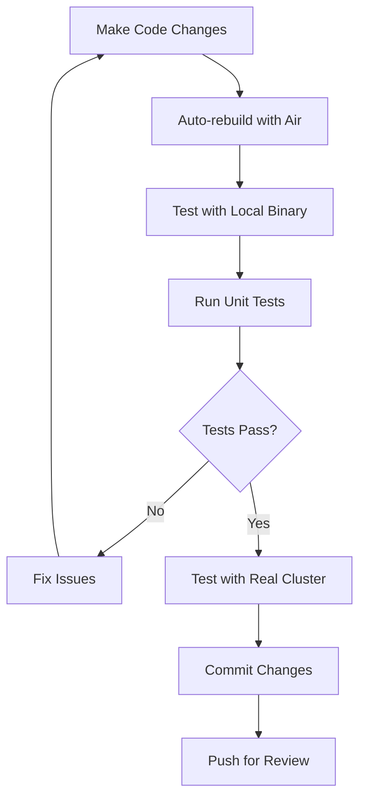

# Local Development Guide

This guide walks you through cloning, building, and running OpenFrame CLI locally for development. You'll learn how to set up hot reloading, debug configurations, and efficient development workflows.

## Prerequisites

Before starting, ensure you have completed the **[Environment Setup](environment.md)** guide and have all required tools installed:

- Go 1.21+
- Docker (running)
- kubectl
- K3d  
- Helm
- Git

## Clone and Setup

### 1. Clone the Repository

```bash
# Clone the OpenFrame CLI repository
git clone https://github.com/flamingo-stack/openframe-cli.git
cd openframe-cli

# Or if you have a fork:
git clone https://github.com/YOUR-USERNAME/openframe-cli.git
cd openframe-cli
git remote add upstream https://github.com/flamingo-stack/openframe-cli.git
```

### 2. Explore the Project Structure

```bash
# View the project layout
tree -L 3 openframe-cli/
```

Expected structure:
```text
openframe-cli/
├── cmd/                    # Command definitions
│   ├── bootstrap/         # Bootstrap command
│   ├── cluster/           # Cluster management
│   ├── chart/            # Chart operations  
│   └── dev/              # Development tools
├── internal/             # Internal packages
│   ├── bootstrap/        # Bootstrap services
│   ├── cluster/          # Cluster services
│   ├── chart/           # Chart services
│   ├── dev/             # Dev services
│   └── shared/          # Common utilities
├── docs/                # Documentation
├── scripts/             # Build scripts
├── go.mod              # Go module definition
├── go.sum              # Dependency checksums
├── Makefile            # Build automation
└── README.md           # Project overview
```

### 3. Install Dependencies

```bash
# Download Go dependencies
go mod download

# Verify dependencies
go mod verify

# Tidy up any issues
go mod tidy
```

## Building OpenFrame CLI

### Build from Source

```bash
# Build the CLI binary
go build -o bin/openframe ./cmd/openframe

# Or use the Makefile (if available)
make build

# Verify the build
./bin/openframe --help
```

### Build with Debug Information

```bash
# Build with debug symbols for easier debugging
go build -gcflags="all=-N -l" -o bin/openframe-debug ./cmd/openframe
```

### Cross-Platform Builds

```bash
# Build for different platforms
GOOS=linux GOARCH=amd64 go build -o bin/openframe-linux ./cmd/openframe
GOOS=darwin GOARCH=amd64 go build -o bin/openframe-darwin ./cmd/openframe
GOOS=windows GOARCH=amd64 go build -o bin/openframe.exe ./cmd/openframe
```

## Running Locally

### Basic Execution

```bash
# Run from source (slower but always current)
go run ./cmd/openframe --help

# Run built binary (faster)
./bin/openframe --help

# Test core functionality
./bin/openframe cluster --help
```

### Development Mode

Set environment variables for development:

```bash
# Enable development mode
export OPENFRAME_DEV=true
export OPENFRAME_LOG_LEVEL=debug

# Run with debug logging
./bin/openframe cluster list --verbose
```

### Test with Local Cluster

```bash
# Create a test cluster
./bin/openframe bootstrap test-dev-cluster --verbose

# Check cluster status  
./bin/openframe cluster status test-dev-cluster

# Clean up when done
./bin/openframe cluster delete test-dev-cluster
```

## Hot Reload / Watch Mode

### Using Air (Recommended)

Install Air for automatic rebuilds on file changes:

```bash
# Install Air
go install github.com/cosmtrek/air@latest

# Create .air.toml configuration
cat > .air.toml << 'EOF'
root = "."
testdata_dir = "testdata"
tmp_dir = "tmp"

[build]
args_bin = ["--help"]
bin = "./tmp/openframe"
cmd = "go build -o ./tmp/openframe ./cmd/openframe"
delay = 1000
exclude_dir = ["assets", "tmp", "vendor", "testdata", "docs"]
exclude_file = []
exclude_regex = ["_test.go"]
exclude_unchanged = false
follow_symlink = false
full_bin = ""
include_dir = []
include_ext = ["go", "tpl", "tmpl", "html"]
kill_delay = "0s"
log = "build-errors.log"
send_interrupt = false
stop_on_root = false

[color]
app = ""
build = "yellow"
main = "magenta"
runner = "green"
watcher = "cyan"

[log]
time = false

[misc]
clean_on_exit = false
EOF

# Start hot reload
air
```

### Manual Watch Script

Create a simple watch script:

```bash
#!/bin/bash
# scripts/watch.sh

echo "🔄 Starting OpenFrame CLI watch mode..."

# Kill any existing processes
pkill -f "tmp/openframe"

while true; do
    # Build on changes
    find cmd internal -name "*.go" | entr -r sh -c '
        echo "🔨 Building..."
        go build -o tmp/openframe ./cmd/openframe
        echo "✅ Build complete. Binary ready at tmp/openframe"
    '
done
```

Make it executable:
```bash
chmod +x scripts/watch.sh
./scripts/watch.sh
```

## Debug Configuration

### VS Code Debugging

Ensure you have the `.vscode/launch.json` from the [Environment Setup](environment.md):

1. Open the project in VS Code
2. Set breakpoints in the code
3. Press `F5` or use the Debug panel
4. Choose "Debug OpenFrame CLI" configuration

### Command Line Debugging with Delve

```bash
# Install Delve debugger
go install github.com/go-delve/delve/cmd/dlv@latest

# Debug a specific command
dlv debug ./cmd/openframe -- cluster list

# Debug with breakpoints
dlv debug ./cmd/openframe -- bootstrap test-cluster --verbose
```

In the Delve prompt:
```text
(dlv) break main.main
(dlv) continue
(dlv) next
(dlv) print variable_name
(dlv) quit
```

### Printf Debugging

For quick debugging, add strategic log statements:

```go
// Import log package
import "log"

// Add debug prints
log.Printf("DEBUG: Variable value: %+v", myVariable)
log.Printf("DEBUG: Reached function %s", functionName)
```

## Testing During Development

### Run All Tests

```bash
# Run all tests
go test ./...

# Run tests with verbose output
go test -v ./...

# Run tests with coverage
go test -cover ./...
```

### Run Specific Tests

```bash
# Test specific package
go test ./internal/cluster/...

# Test specific function
go test -run TestSpecificFunction ./internal/cluster

# Run tests with race detection
go test -race ./...
```

### Test with Live Clusters

```bash
# Create test cluster for integration tests
./bin/openframe cluster create test-integration

# Run tests that require cluster
KUBECONFIG=~/.kube/config go test -tags=integration ./tests/integration/

# Clean up
./bin/openframe cluster delete test-integration
```

## Development Workflow

### Typical Development Cycle



### Branch Management

```bash
# Create feature branch
git checkout -b feature/my-new-feature

# Keep branch up to date
git fetch upstream
git rebase upstream/main

# Push changes  
git push origin feature/my-new-feature
```

### Code Quality Checks

Run these before committing:

```bash
# Format code
go fmt ./...
goimports -w .

# Lint code
golangci-lint run

# Vet code
go vet ./...

# Run tests
go test ./...
```

Create a pre-commit script (`scripts/pre-commit.sh`):

```bash
#!/bin/bash

echo "🔍 Running pre-commit checks..."

# Format
echo "📝 Formatting code..."
go fmt ./...
goimports -w .

# Lint  
echo "🔍 Linting..."
if ! golangci-lint run; then
    echo "❌ Linting failed"
    exit 1
fi

# Vet
echo "🔬 Vetting..."
if ! go vet ./...; then
    echo "❌ Vet failed"
    exit 1
fi

# Test
echo "🧪 Testing..."
if ! go test ./...; then
    echo "❌ Tests failed"
    exit 1
fi

echo "✅ All checks passed!"
```

## Working with External Dependencies

### Update Dependencies

```bash
# Update all dependencies
go get -u ./...

# Update specific dependency
go get -u github.com/spf13/cobra

# Verify updates
go mod tidy
go mod verify
```

### Add New Dependencies

```bash
# Add new dependency
go get github.com/new/package

# Import in code
import "github.com/new/package"

# Tidy modules
go mod tidy
```

## Debugging Common Issues

### Build Issues

```bash
# Clean build cache
go clean -cache

# Clean module cache
go clean -modcache

# Rebuild from scratch
go mod download
go build -a -o bin/openframe ./cmd/openframe
```

### Import Path Issues

```bash
# Check module name
head -1 go.mod

# Ensure imports match module path
grep -r "github.com/flamingo-stack/openframe-cli" . --include="*.go"
```

### Kubernetes Connection Issues

```bash
# Check kubectl context
kubectl config current-context

# Verify cluster access
kubectl cluster-info

# Debug cluster connection
kubectl get nodes -v=8
```

### Docker Issues

```bash
# Restart Docker
sudo systemctl restart docker

# Check Docker daemon
docker info

# Clean Docker resources
docker system prune
```

## Performance Optimization

### Build Performance

```bash
# Use build cache
export GOCACHE=$HOME/.cache/go-build

# Parallel builds
go build -p 4 ./...

# Disable CGO for faster builds (if possible)
CGO_ENABLED=0 go build ./...
```

### Runtime Performance

```bash
# Profile CPU usage
go build -o bin/openframe ./cmd/openframe
./bin/openframe cluster list --cpuprofile=cpu.prof

# Profile memory usage  
./bin/openframe cluster list --memprofile=mem.prof

# Analyze profiles
go tool pprof cpu.prof
go tool pprof mem.prof
```

## IDE Integration Tips

### VS Code Tips

```bash
# Open project in VS Code
code .

# Use command palette
Ctrl+Shift+P (Linux/Windows)
Cmd+Shift+P (macOS)

# Quick file navigation
Ctrl+P / Cmd+P

# Go to definition
F12 or Ctrl+Click / Cmd+Click
```

### Useful VS Code Extensions Configuration

Add to `.vscode/settings.json`:

```json
{
    "go.testFlags": ["-v", "-race"],
    "go.buildTags": "integration",
    "go.testTimeout": "30s",
    "go.coverOnSingleTest": true,
    "files.watcherExclude": {
        "**/bin/**": true,
        "**/tmp/**": true,
        "**/.git/**": true
    }
}
```

## Next Steps

Now that you have OpenFrame CLI running locally:

1. **[Architecture Overview](../architecture/overview.md)** - Understand the codebase structure
2. **[Testing Overview](../testing/overview.md)** - Learn testing patterns and practices  
3. **[Contributing Guidelines](../contributing/guidelines.md)** - Follow our development process

## Troubleshooting Development Issues

### Port Conflicts
```bash
# Check what's using ports
lsof -i :8080
sudo netstat -tulpn | grep :8080

# Kill conflicting processes
kill -9 $(lsof -t -i:8080)
```

### Module Issues
```bash
# Reset modules completely
rm go.sum
go mod download
go mod tidy
```

### IDE Performance
```bash
# Clear VS Code workspace
rm -rf .vscode/settings.json
# Restart VS Code

# Clear Go language server cache
go clean -cache
```

---

**Happy Developing!** You now have a complete local development setup for OpenFrame CLI. The next step is understanding the [architecture](../architecture/overview.md) to work effectively with the codebase.