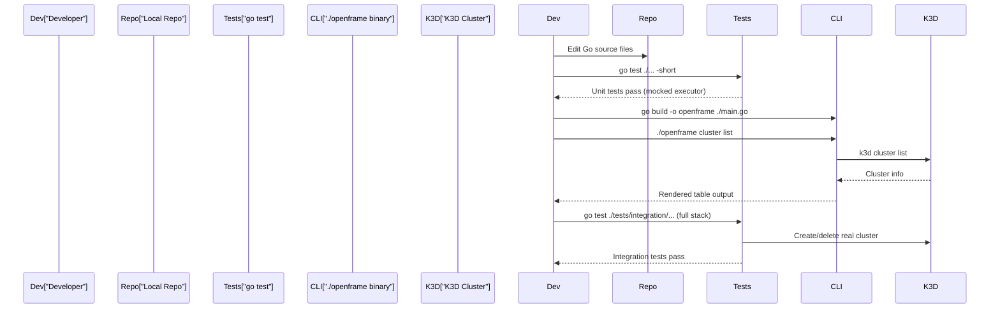

# Local Development Guide

This guide walks you through cloning the repository, running the CLI locally, and setting up your debug configuration for active development on OpenFrame CLI.

---

## Clone the Repository

```bash
git clone https://github.com/flamingo-stack/openframe-cli.git
cd openframe-cli
```

---

## Install Dependencies

Go modules are used for dependency management. Fetch all dependencies:

```bash
go mod download
go mod verify
```

---

## Build the CLI

```bash
# Build the binary to the project root
go build -o openframe ./main.go

# Verify it works
./openframe --version
```

For cross-platform builds:

```bash
# Linux AMD64
GOOS=linux GOARCH=amd64 go build -o openframe-linux-amd64 ./main.go

# macOS ARM64 (Apple Silicon)
GOOS=darwin GOARCH=arm64 go build -o openframe-darwin-arm64 ./main.go

# Windows AMD64
GOOS=windows GOARCH=amd64 go build -o openframe-windows-amd64.exe ./main.go
```

---

## Running the CLI Locally

After building, run the local binary directly:

```bash
# Run locally built binary
./openframe --help

# Run with verbose output
./openframe --verbose cluster list

# Run in dry-run mode (no actual k3d/helm calls)
./openframe bootstrap --deployment-mode=oss-tenant --dry-run
```

---

## Run Without Building (go run)

For rapid iteration during development:

```bash
# Run directly without building
go run ./main.go --help

# Run a specific command
go run ./main.go cluster list

# Bootstrap with verbose output
go run ./main.go bootstrap --deployment-mode=oss-tenant -v
```

---

## Watch Mode / Hot Reload

Go does not have built-in watch mode, but you can use `air` for automatic rebuilds on file changes:

```bash
# Install air
go install github.com/air-verse/air@latest

# Run in watch mode (rebuilds and restarts on .go file changes)
air
```

Create a minimal `.air.toml` config:

```toml
[build]
  cmd = "go build -o ./tmp/openframe ./main.go"
  bin = "./tmp/openframe"
  include_ext = ["go"]
  exclude_dir = ["tests", "vendor"]

[log]
  time = true
```

---

## Running Tests

```bash
# Run all unit tests
go test ./...

# Run with verbose output
go test ./... -v

# Run a specific package
go test ./internal/cluster/...

# Run with race detection
go test -race ./...

# Run short tests only (skips integration tests)
go test ./... -short

# Run integration tests (requires Docker, k3d, kubectl, helm)
go test ./tests/integration/...
```

---

## Debug Configuration

### VS Code Debug Configuration

Create `.vscode/launch.json`:

```json
{
  "version": "0.2.0",
  "configurations": [
    {
      "name": "Debug: bootstrap",
      "type": "go",
      "request": "launch",
      "mode": "auto",
      "program": "${workspaceFolder}/main.go",
      "args": ["bootstrap", "--deployment-mode=oss-tenant", "-v"],
      "env": {
        "CI": "true"
      }
    },
    {
      "name": "Debug: cluster list",
      "type": "go",
      "request": "launch",
      "mode": "auto",
      "program": "${workspaceFolder}/main.go",
      "args": ["cluster", "list"]
    },
    {
      "name": "Debug: dev intercept",
      "type": "go",
      "request": "launch",
      "mode": "auto",
      "program": "${workspaceFolder}/main.go",
      "args": ["dev", "intercept", "my-service", "--port", "8080"]
    }
  ]
}
```

### GoLand Debug Configuration

1. Open **Run > Edit Configurations**
2. Add a new **Go Application** configuration
3. Set **Program arguments** to e.g. `bootstrap --deployment-mode=oss-tenant -v`
4. Set **Working directory** to your project root

---

## Test Mode

The CLI includes a `TestMode` flag that disables interactive UI elements (logo rendering, spinners) during automated testing:

```go
// In test files
testutil.InitializeTestMode()
```

This prevents terminal output issues when running tests in CI environments or headless shells.

---

## Mock Executor

All external command execution (k3d, helm, kubectl, git) is abstracted through the `CommandExecutor` interface. During development and testing, you can use the `MockCommandExecutor` to simulate responses without running real binaries:

```go
// Create a mock executor
executor := testutil.NewTestMockExecutor()

// Inject into service layers for isolated unit testing
flags := testutil.CreateStandardTestFlags()
```

The mock executor pattern-matches command strings and returns pre-configured responses, making it safe to run the full business logic without a real Kubernetes cluster.

---

## Typical Development Workflow


```mermaid
sequenceDiagram
    participant Dev["Developer"]
    participant Repo["Local Repo"]
    participant Tests["go test"]
    participant CLI["./openframe binary"]
    participant K3D["K3D Cluster"]

    Dev->>Repo: Edit Go source files
    Dev->>Tests: go test ./... -short
    Tests-->>Dev: Unit tests pass (mocked executor)
    Dev->>CLI: go build -o openframe ./main.go
    Dev->>CLI: ./openframe cluster list
    CLI->>K3D: k3d cluster list
    K3D-->>CLI: Cluster info
    CLI-->>Dev: Rendered table output
    Dev->>Tests: go test ./tests/integration/... (full stack)
    Tests->>K3D: Create/delete real cluster
    Tests-->>Dev: Integration tests pass
```

---

## Project Configuration Files

| File | Purpose |
|------|---------|
| `go.mod` | Go module definition and dependencies |
| `go.sum` | Dependency checksums |
| `main.go` | Binary entrypoint — delegates to `cmd.Execute()` |
| `cmd/root.go` | Root Cobra command, global flags, version info |

---

## Common Development Tasks

```bash
# Tidy up unused dependencies
go mod tidy

# Run the linter
golangci-lint run ./...

# Format all Go files
goimports -w .

# Check for compilation errors without building
go vet ./...

# Generate test coverage report
go test -coverprofile=coverage.out ./...
go tool cover -html=coverage.out -o coverage.html
```

---

## Next Steps

- Review the [Architecture Overview](../architecture/README.md) to understand how the code is organized
- Read the [Testing Guide](../testing/README.md) to learn how to write effective tests
- Check the [Contributing Guidelines](../contributing/guidelines.md) before submitting a PR
