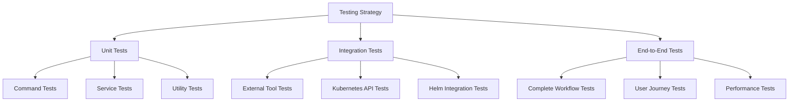

# Testing Overview

OpenFrame CLI uses a comprehensive testing strategy that ensures reliability, maintainability, and confidence in deployments. This guide covers our testing philosophy, structure, tools, and best practices.

## Testing Philosophy

Our testing approach follows the **Test Pyramid** principle with emphasis on:

### 🎯 **Quality Over Quantity**
- Focus on meaningful tests that catch real issues
- Prefer readable, maintainable tests over complex ones
- Test behavior, not implementation details

### ⚡ **Fast Feedback**
- Unit tests run in milliseconds
- Quick integration tests for critical paths
- Slow E2E tests for complete workflows

### 🔒 **Confidence in Changes**
- Tests enable safe refactoring
- Comprehensive coverage of critical paths
- Automated testing in CI/CD pipeline

## Testing Structure

Our tests are organized in a hierarchical structure:



### Test Organization

```text
openframe-cli/
├── cmd/                          # Command layer tests
│   ├── bootstrap/
│   │   ├── bootstrap.go
│   │   └── bootstrap_test.go     # Command interface tests
│   ├── cluster/
│   │   ├── create.go
│   │   └── create_test.go        # Command logic tests
│   └── ...
├── internal/                     # Service layer tests
│   ├── cluster/
│   │   ├── service.go
│   │   ├── service_test.go       # Business logic tests
│   │   └── testdata/             # Test fixtures
│   └── ...
├── tests/                        # Integration and E2E tests
│   ├── integration/              # Integration test suite
│   │   ├── cluster_test.go       # External tool integration
│   │   ├── chart_test.go         # Helm integration
│   │   └── fixtures/             # Shared test data
│   ├── e2e/                      # End-to-end test suite
│   │   ├── bootstrap_test.go     # Complete workflows
│   │   └── scenarios/            # Test scenarios
│   └── helpers/                  # Shared test utilities
│       ├── cluster.go            # Test cluster helpers
│       ├── mock.go               # Mock implementations
│       └── assertions.go         # Custom assertions
```

## Unit Testing

Unit tests focus on testing individual components in isolation using mocks and stubs.

### Testing Commands

Command tests verify CLI interface behavior:

```go
// cmd/cluster/create_test.go
func TestCreateCommand(t *testing.T) {
    tests := []struct {
        name     string
        args     []string
        flags    map[string]string
        wantErr  bool
        wantName string
    }{
        {
            name:     "create with valid name",
            args:     []string{"test-cluster"},
            wantErr:  false,
            wantName: "test-cluster",
        },
        {
            name:    "create without name",
            args:    []string{},
            wantErr: true,
        },
        {
            name:     "create with flags",
            args:     []string{"test-cluster"},
            flags:    map[string]string{"k8s-version": "1.27.1"},
            wantErr:  false,
            wantName: "test-cluster",
        },
    }

    for _, tt := range tests {
        t.Run(tt.name, func(t *testing.T) {
            cmd := GetCreateCmd()
            
            // Set flags
            for key, value := range tt.flags {
                cmd.Flags().Set(key, value)
            }
            
            // Execute command
            err := cmd.RunE(cmd, tt.args)
            
            if tt.wantErr {
                assert.Error(t, err)
            } else {
                assert.NoError(t, err)
                // Verify behavior
            }
        })
    }
}
```

### Testing Services

Service tests focus on business logic with mocked dependencies:

```go
// internal/cluster/service_test.go
func TestClusterService_CreateCluster(t *testing.T) {
    tests := []struct {
        name          string
        config        ClusterConfig
        mockSetup     func(*mocks.MockK3dProvider)
        wantErr       bool
        expectedCalls int
    }{
        {
            name: "successful cluster creation",
            config: ClusterConfig{
                Name:       "test-cluster",
                K8sVersion: "1.27.1",
                NodeCount:  1,
            },
            mockSetup: func(m *mocks.MockK3dProvider) {
                m.On("CreateCluster", "test-cluster", mock.Anything).Return(nil)
            },
            wantErr:       false,
            expectedCalls: 1,
        },
        {
            name: "k3d creation fails",
            config: ClusterConfig{
                Name: "test-cluster",
            },
            mockSetup: func(m *mocks.MockK3dProvider) {
                m.On("CreateCluster", "test-cluster", mock.Anything).Return(
                    errors.New("k3d creation failed"))
            },
            wantErr:       true,
            expectedCalls: 1,
        },
    }

    for _, tt := range tests {
        t.Run(tt.name, func(t *testing.T) {
            // Setup mocks
            mockK3d := &mocks.MockK3dProvider{}
            mockUI := &mocks.MockUI{}
            
            if tt.mockSetup != nil {
                tt.mockSetup(mockK3d)
            }
            
            // Create service with mocks
            service := &ClusterService{
                k3dProvider: mockK3d,
                ui:         mockUI,
            }
            
            // Execute test
            err := service.CreateCluster(context.Background(), tt.config)
            
            // Verify results
            if tt.wantErr {
                assert.Error(t, err)
            } else {
                assert.NoError(t, err)
            }
            
            // Verify mock interactions
            mockK3d.AssertNumberOfCalls(t, "CreateCluster", tt.expectedCalls)
        })
    }
}
```

### Mock Implementations

We use testify/mock for creating mocks:

```go
// tests/helpers/mock.go
type MockK3dProvider struct {
    mock.Mock
}

func (m *MockK3dProvider) CreateCluster(name string, config ClusterConfig) error {
    args := m.Called(name, config)
    return args.Error(0)
}

func (m *MockK3dProvider) DeleteCluster(name string) error {
    args := m.Called(name)
    return args.Error(0)
}

func (m *MockK3dProvider) ListClusters() ([]ClusterInfo, error) {
    args := m.Called()
    return args.Get(0).([]ClusterInfo), args.Error(1)
}
```

## Integration Testing

Integration tests verify that components work correctly with external dependencies.

### External Tool Integration

Test real interactions with K3d, Helm, kubectl:

```go
// tests/integration/cluster_test.go
//go:build integration

func TestClusterIntegration(t *testing.T) {
    // Skip if integration tests disabled
    if testing.Short() {
        t.Skip("Skipping integration test in short mode")
    }
    
    // Require Docker for K3d
    helpers.RequireDocker(t)
    
    t.Run("create and delete cluster", func(t *testing.T) {
        clusterName := helpers.RandomClusterName()
        
        // Cleanup function
        defer func() {
            cmd := exec.Command("k3d", "cluster", "delete", clusterName)
            cmd.Run() // Ignore errors in cleanup
        }()
        
        // Test cluster creation
        service := cluster.NewService()
        config := cluster.ClusterConfig{
            Name:       clusterName,
            K8sVersion: "1.27.1",
            NodeCount:  1,
        }
        
        err := service.CreateCluster(context.Background(), config)
        assert.NoError(t, err)
        
        // Verify cluster exists
        clusters, err := service.ListClusters()
        assert.NoError(t, err)
        assert.Contains(t, clusterNames(clusters), clusterName)
        
        // Test cluster deletion
        err = service.DeleteCluster(clusterName)
        assert.NoError(t, err)
        
        // Verify cluster removed
        clusters, err = service.ListClusters()
        assert.NoError(t, err)
        assert.NotContains(t, clusterNames(clusters), clusterName)
    })
}

func clusterNames(clusters []cluster.ClusterInfo) []string {
    names := make([]string, len(clusters))
    for i, c := range clusters {
        names[i] = c.Name
    }
    return names
}
```

### Kubernetes API Integration

Test interactions with Kubernetes APIs:

```go
// tests/integration/kubernetes_test.go
//go:build integration

func TestKubernetesIntegration(t *testing.T) {
    // Setup test cluster
    clusterName := helpers.CreateTestCluster(t)
    defer helpers.CleanupTestCluster(t, clusterName)
    
    t.Run("deploy and verify resources", func(t *testing.T) {
        // Get kubernetes client
        config, err := helpers.GetKubeConfig(clusterName)
        require.NoError(t, err)
        
        client, err := kubernetes.NewForConfig(config)
        require.NoError(t, err)
        
        // Test namespace creation
        namespace := &v1.Namespace{
            ObjectMeta: metav1.ObjectMeta{
                Name: "test-namespace",
            },
        }
        
        _, err = client.CoreV1().Namespaces().Create(
            context.Background(), 
            namespace, 
            metav1.CreateOptions{},
        )
        assert.NoError(t, err)
        
        // Verify namespace exists
        _, err = client.CoreV1().Namespaces().Get(
            context.Background(),
            "test-namespace",
            metav1.GetOptions{},
        )
        assert.NoError(t, err)
    })
}
```

## End-to-End Testing

E2E tests validate complete user workflows using the actual CLI binary.

### Complete Workflow Tests

Test entire user journeys:

```go
// tests/e2e/bootstrap_test.go
//go:build e2e

func TestBootstrapWorkflow(t *testing.T) {
    if testing.Short() {
        t.Skip("Skipping E2E test in short mode")
    }
    
    helpers.RequireDocker(t)
    
    t.Run("complete bootstrap workflow", func(t *testing.T) {
        clusterName := helpers.RandomClusterName()
        
        // Cleanup
        defer func() {
            helpers.RunCLI(t, "cluster", "delete", clusterName, "--force")
        }()
        
        // Test bootstrap command
        output := helpers.RunCLI(t, "bootstrap", clusterName, 
            "--deployment-mode=oss-tenant", 
            "--non-interactive",
            "--verbose")
        
        assert.Contains(t, output, "Environment 'test-cluster' is ready!")
        
        // Verify cluster exists
        output = helpers.RunCLI(t, "cluster", "list")
        assert.Contains(t, output, clusterName)
        
        // Verify ArgoCD is running
        output = helpers.RunCLI(t, "cluster", "status", clusterName)
        assert.Contains(t, output, "ArgoCD: ✅ Deployed")
        
        // Test kubectl connectivity
        kubectlOutput := helpers.RunKubectl(t, "get", "nodes")
        assert.Contains(t, kubectlOutput, "Ready")
        
        // Verify ArgoCD applications
        argoApps := helpers.RunKubectl(t, "get", "applications", "-n", "argocd")
        assert.Contains(t, argoApps, "app-of-apps")
    })
}
```

### CLI Helper Functions

Shared utilities for E2E testing:

```go
// tests/helpers/cli.go
func RunCLI(t *testing.T, args ...string) string {
    t.Helper()
    
    cmd := exec.Command("./bin/openframe", args...)
    
    output, err := cmd.CombinedOutput()
    if err != nil {
        t.Fatalf("CLI command failed: %v\nOutput: %s", err, output)
    }
    
    return string(output)
}

func RunKubectl(t *testing.T, args ...string) string {
    t.Helper()
    
    cmd := exec.Command("kubectl", args...)
    
    output, err := cmd.CombinedOutput()
    if err != nil {
        t.Fatalf("kubectl command failed: %v\nOutput: %s", err, output)
    }
    
    return string(output)
}

func CreateTestCluster(t *testing.T) string {
    t.Helper()
    
    clusterName := RandomClusterName()
    
    RunCLI(t, "cluster", "create", clusterName)
    
    // Wait for cluster to be ready
    WaitForCluster(t, clusterName, 30*time.Second)
    
    return clusterName
}

func RandomClusterName() string {
    return fmt.Sprintf("test-%d", time.Now().Unix())
}
```

## Running Tests

### Running All Tests

```bash
# Run all tests (excluding integration and E2E)
go test ./...

# Run with verbose output
go test -v ./...

# Run with race detection
go test -race ./...

# Run with coverage
go test -cover ./... -coverprofile=coverage.out

# View coverage report
go tool cover -html=coverage.out
```

### Running Specific Test Types

```bash
# Unit tests only (default)
go test ./cmd/... ./internal/...

# Integration tests
go test -tags=integration ./tests/integration/...

# End-to-end tests  
go test -tags=e2e ./tests/e2e/...

# Run specific test
go test -run TestClusterService_CreateCluster ./internal/cluster

# Run specific package
go test ./internal/cluster/...
```

### Running Tests with Prerequisites

```bash
# Ensure Docker is running for integration tests
docker info

# Run integration tests
make test-integration

# Run E2E tests (requires built binary)
make build
make test-e2e

# Run all tests including integration
make test-all
```

## Test Configuration

### Environment Variables

Configure test behavior with environment variables:

```bash
# Skip integration tests
export SKIP_INTEGRATION=true

# Use custom Docker host
export DOCKER_HOST=tcp://localhost:2376

# Set test timeout
export TEST_TIMEOUT=10m

# Enable test debugging
export TEST_DEBUG=true

# Use custom kubeconfig
export KUBECONFIG=/tmp/test-kubeconfig
```

### Test Makefile Targets

```makefile
# Makefile test targets
.PHONY: test test-unit test-integration test-e2e test-all

test: test-unit

test-unit:
	go test ./cmd/... ./internal/... -race

test-integration:
	go test -tags=integration ./tests/integration/... -v

test-e2e: build
	go test -tags=e2e ./tests/e2e/... -v

test-all: test-unit test-integration test-e2e

test-coverage:
	go test ./... -coverprofile=coverage.out
	go tool cover -html=coverage.out -o coverage.html
```

## Writing New Tests

### Unit Test Checklist

- ✅ Test one function/method per test file
- ✅ Use table-driven tests for multiple scenarios
- ✅ Mock external dependencies
- ✅ Test both success and error cases
- ✅ Use descriptive test names
- ✅ Follow Arrange-Act-Assert pattern

### Integration Test Checklist

- ✅ Use build tags (`//go:build integration`)
- ✅ Check prerequisites in test setup
- ✅ Clean up resources in test teardown
- ✅ Use real external tools (K3d, Helm, kubectl)
- ✅ Test realistic scenarios
- ✅ Handle test timeouts appropriately

### E2E Test Checklist

- ✅ Use build tags (`//go:build e2e`)
- ✅ Test complete user workflows
- ✅ Use the actual CLI binary
- ✅ Verify end-user visible behavior
- ✅ Clean up all resources
- ✅ Make tests independent and idempotent

### Test Naming Conventions

```go
// Good test names - describe what is being tested
func TestClusterService_CreateCluster_WithValidConfig_ReturnsSuccess(t *testing.T) {}
func TestBootstrapCommand_WithMissingPrerequisites_ReturnsError(t *testing.T) {}
func TestChartInstaller_WhenHelmFails_ReturnsHelmError(t *testing.T) {}

// Less clear test names
func TestCreate(t *testing.T) {}
func TestBootstrap(t *testing.T) {}
func TestInstall(t *testing.T) {}
```

## Coverage Requirements

### Coverage Targets

| Component | Target Coverage | Required |
|-----------|-----------------|----------|
| **Commands** | 80%+ | High-level functionality |
| **Services** | 90%+ | Core business logic |
| **Utilities** | 95%+ | Shared components |
| **Overall** | 85%+ | Project-wide minimum |

### Coverage Analysis

```bash
# Generate coverage report
go test ./... -coverprofile=coverage.out

# View coverage by package
go tool cover -func=coverage.out

# Find uncovered code
go tool cover -html=coverage.out

# Coverage for specific package
go test ./internal/cluster -coverprofile=cluster-coverage.out
go tool cover -func=cluster-coverage.out
```

## Continuous Integration

### GitHub Actions Testing

```yaml
# .github/workflows/test.yml
name: Test

on: [push, pull_request]

jobs:
  unit-tests:
    runs-on: ubuntu-latest
    steps:
      - uses: actions/checkout@v3
      - uses: actions/setup-go@v3
        with:
          go-version: '1.21'
      
      - name: Run unit tests
        run: go test ./cmd/... ./internal/... -race -coverprofile=coverage.out
      
      - name: Upload coverage
        uses: codecov/codecov-action@v3
        with:
          file: ./coverage.out

  integration-tests:
    runs-on: ubuntu-latest
    steps:
      - uses: actions/checkout@v3
      - uses: actions/setup-go@v3
        with:
          go-version: '1.21'
      
      - name: Install dependencies
        run: |
          curl -s https://raw.githubusercontent.com/k3d-io/k3d/main/install.sh | bash
          curl https://raw.githubusercontent.com/helm/helm/main/scripts/get-helm-3 | bash
      
      - name: Run integration tests
        run: go test -tags=integration ./tests/integration/... -v

  e2e-tests:
    runs-on: ubuntu-latest
    steps:
      - uses: actions/checkout@v3
      - uses: actions/setup-go@v3
        with:
          go-version: '1.21'
      
      - name: Install dependencies
        run: |
          curl -s https://raw.githubusercontent.com/k3d-io/k3d/main/install.sh | bash
          curl https://raw.githubusercontent.com/helm/helm/main/scripts/get-helm-3 | bash
      
      - name: Build CLI
        run: go build -o bin/openframe ./cmd/openframe
      
      - name: Run E2E tests
        run: go test -tags=e2e ./tests/e2e/... -v
```

## Performance Testing

### Benchmarks

```go
// internal/cluster/service_bench_test.go
func BenchmarkClusterService_CreateCluster(b *testing.B) {
    service := cluster.NewService()
    config := cluster.ClusterConfig{
        Name:       "bench-cluster",
        K8sVersion: "1.27.1",
        NodeCount:  1,
    }
    
    b.ResetTimer()
    for i := 0; i < b.N; i++ {
        // Setup
        clusterName := fmt.Sprintf("bench-cluster-%d", i)
        config.Name = clusterName
        
        // Benchmark creation
        err := service.CreateCluster(context.Background(), config)
        if err != nil {
            b.Fatal(err)
        }
        
        // Cleanup
        service.DeleteCluster(clusterName)
    }
}
```

### Load Testing

```go
// tests/performance/load_test.go
func TestConcurrentClusterOperations(t *testing.T) {
    const numWorkers = 5
    
    var wg sync.WaitGroup
    errChan := make(chan error, numWorkers)
    
    for i := 0; i < numWorkers; i++ {
        wg.Add(1)
        go func(workerID int) {
            defer wg.Done()
            
            clusterName := fmt.Sprintf("load-test-%d", workerID)
            
            service := cluster.NewService()
            err := service.CreateCluster(context.Background(), cluster.ClusterConfig{
                Name: clusterName,
            })
            
            if err != nil {
                errChan <- err
                return
            }
            
            // Cleanup
            service.DeleteCluster(clusterName)
        }(i)
    }
    
    wg.Wait()
    close(errChan)
    
    // Check for errors
    for err := range errChan {
        t.Errorf("Worker error: %v", err)
    }
}
```

## Testing Best Practices

### DO ✅

- **Write tests first** when adding new features (TDD)
- **Use table-driven tests** for multiple scenarios
- **Mock external dependencies** in unit tests
- **Clean up resources** in integration/E2E tests
- **Test error conditions** as well as success cases
- **Use meaningful assertions** with clear error messages
- **Keep tests independent** - no test should depend on another

### DON'T ❌

- **Don't test implementation details** - test behavior
- **Don't use real clusters** in unit tests
- **Don't ignore test cleanup** - always clean up resources
- **Don't make tests dependent** on external state
- **Don't write overly complex tests** - keep them simple
- **Don't forget edge cases** - test boundary conditions
- **Don't skip writing tests** for critical functionality

## Next Steps

Now that you understand our testing approach:

1. **[Contributing Guidelines](../contributing/guidelines.md)** - Learn our development process
2. **[Local Development Guide](../setup/local-development.md)** - Set up your development environment
3. **[Architecture Overview](../architecture/overview.md)** - Understand the codebase structure

## Testing Resources

### Tools and Libraries

- **[testify](https://github.com/stretchr/testify)** - Testing framework with assertions and mocks
- **[gomega](https://github.com/onsi/gomega)** - Matcher/assertion library
- **[ginkgo](https://github.com/onsi/ginkgo)** - BDD testing framework (optional)
- **[Go testing package](https://pkg.go.dev/testing)** - Built-in testing support

### External Documentation

- [Go Testing Documentation](https://golang.org/doc/testing)
- [Testify Documentation](https://github.com/stretchr/testify#readme)
- [Table-Driven Tests in Go](https://go.dev/wiki/TableDrivenTests)

---

**Testing is a crucial part of OpenFrame CLI development.** Well-tested code enables confident refactoring, faster development cycles, and reliable user experiences.