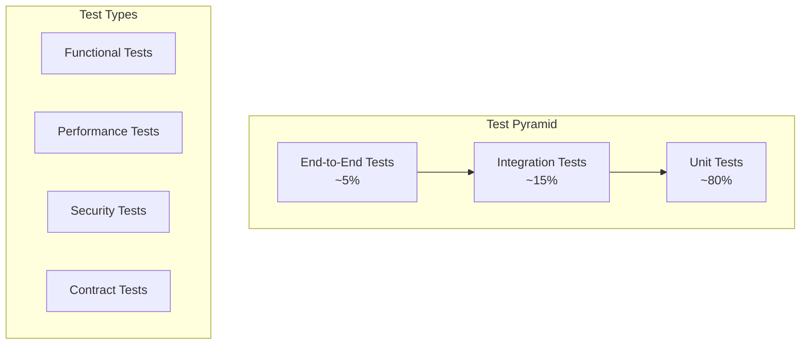
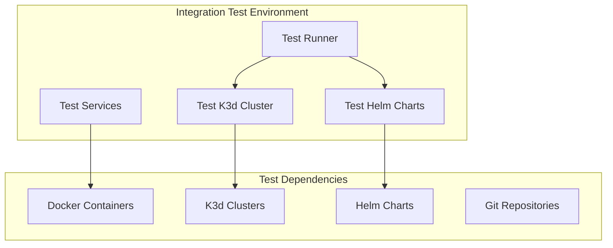
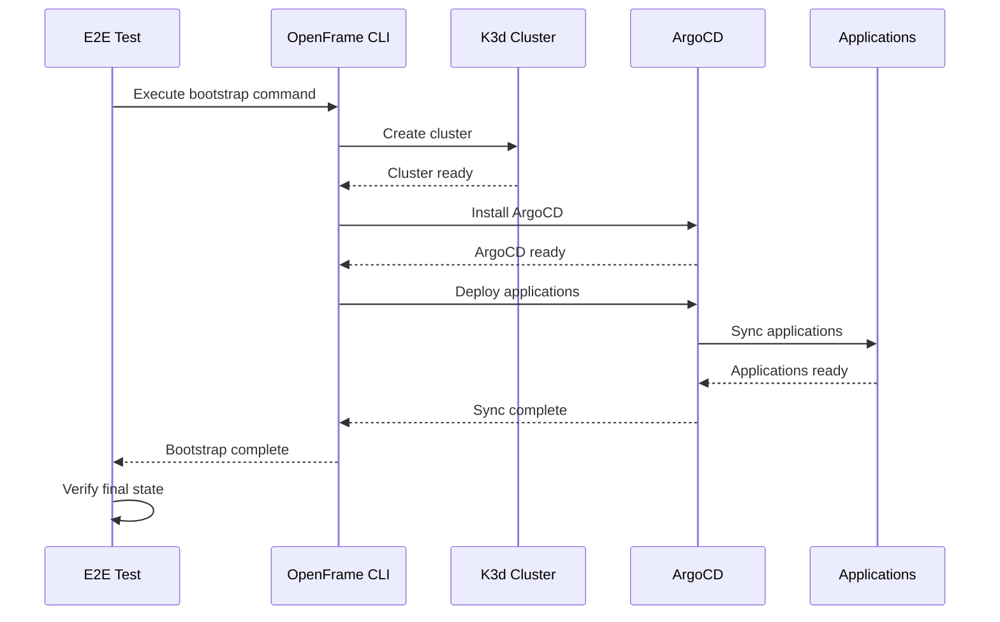
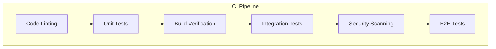

# Testing Overview

OpenFrame CLI employs a comprehensive testing strategy that ensures reliability, maintainability, and confidence in deployments. This document covers the testing architecture, strategies, and best practices used throughout the project.

## Testing Philosophy

### Core Testing Principles

- **Test Pyramid**: More unit tests, fewer integration tests, minimal E2E tests
- **Fast Feedback**: Quick test execution for rapid development cycles
- **Reliable Tests**: Deterministic tests that don't produce false positives
- **Comprehensive Coverage**: Both happy path and error scenarios
- **Real-World Scenarios**: Tests that reflect actual usage patterns

### Test Categories



## Test Structure

### Directory Organization

```text
tests/
├── integration/           # Integration test suites
│   ├── common/           # Shared integration utilities
│   ├── bootstrap/        # Bootstrap workflow tests
│   ├── cluster/          # Cluster management tests
│   ├── chart/            # Chart installation tests
│   └── dev/              # Development tools tests
├── mocks/                # Generated mock objects
│   ├── cluster/          # Cluster service mocks
│   ├── chart/            # Chart service mocks
│   └── dev/              # Development service mocks
├── testutil/             # Test utility functions
│   ├── assertions.go     # Custom assertion helpers
│   ├── cluster.go        # Cluster test utilities
│   ├── setup.go          # Test environment setup
│   └── patterns.go       # Common test patterns
└── fixtures/             # Test data and configuration
    ├── charts/           # Test Helm charts
    ├── configs/          # Test configurations
    └── manifests/        # Test Kubernetes manifests
```

## Unit Testing

### Unit Test Strategy

Unit tests focus on individual functions, methods, and components in isolation using mocked dependencies.

#### Example Unit Test Structure

```go
package cluster_test

import (
    "context"
    "testing"
    
    "github.com/golang/mock/gomock"
    "github.com/stretchr/testify/assert"
    "github.com/stretchr/testify/require"
    
    "github.com/flamingo-stack/openframe-cli/internal/cluster"
    "github.com/flamingo-stack/openframe-cli/tests/mocks/cluster"
)

func TestClusterService_Create(t *testing.T) {
    tests := []struct {
        name     string
        input    cluster.Config
        setupMock func(*mocks.MockClusterProvider)
        want     error
    }{
        {
            name: "successful cluster creation",
            input: cluster.Config{
                Name: "test-cluster",
                Nodes: 3,
            },
            setupMock: func(m *mocks.MockClusterProvider) {
                m.EXPECT().
                    Create(gomock.Any(), gomock.Any()).
                    Return(nil)
            },
            want: nil,
        },
        {
            name: "cluster creation failure",
            input: cluster.Config{
                Name: "invalid-cluster",
            },
            setupMock: func(m *mocks.MockClusterProvider) {
                m.EXPECT().
                    Create(gomock.Any(), gomock.Any()).
                    Return(errors.New("creation failed"))
            },
            want: errors.New("creation failed"),
        },
    }
    
    for _, tt := range tests {
        t.Run(tt.name, func(t *testing.T) {
            ctrl := gomock.NewController(t)
            defer ctrl.Finish()
            
            mockProvider := mocks.NewMockClusterProvider(ctrl)
            tt.setupMock(mockProvider)
            
            service := cluster.NewService(mockProvider)
            
            err := service.Create(context.Background(), tt.input)
            
            if tt.want != nil {
                assert.Error(t, err)
                assert.Equal(t, tt.want.Error(), err.Error())
            } else {
                assert.NoError(t, err)
            }
        })
    }
}
```

### Mock Generation

We use `mockgen` to generate mocks from interfaces:

```bash
# Generate mocks for cluster interfaces
mockgen -source=internal/cluster/interfaces.go \
        -destination=tests/mocks/cluster/provider.go \
        -package=mocks

# Generate all mocks
make generate-mocks
```

### Unit Test Best Practices

| Practice | Description | Example |
|----------|-------------|---------|
| **AAA Pattern** | Arrange, Act, Assert structure | Setup → Execute → Verify |
| **Table-Driven Tests** | Multiple test cases in one function | `tests := []struct{...}` |
| **Descriptive Names** | Clear test case descriptions | `TestClusterService_Create_WithInvalidName` |
| **Setup/Teardown** | Proper test isolation | `t.Cleanup()` functions |
| **Error Testing** | Both success and failure scenarios | Happy path + edge cases |

## Integration Testing

### Integration Test Architecture

Integration tests verify component interactions with real or containerized dependencies.



#### Integration Test Example

```go
package integration_test

import (
    "context"
    "testing"
    "time"
    
    "github.com/stretchr/testify/suite"
    
    "github.com/flamingo-stack/openframe-cli/internal/bootstrap"
    "github.com/flamingo-stack/openframe-cli/tests/testutil"
)

type BootstrapIntegrationSuite struct {
    suite.Suite
    clusterName string
    cleanup     func()
}

func (s *BootstrapIntegrationSuite) SetupSuite() {
    s.clusterName = testutil.GenerateClusterName()
    
    // Setup test environment
    cleanup, err := testutil.SetupTestEnvironment(s.clusterName)
    s.Require().NoError(err)
    s.cleanup = cleanup
}

func (s *BootstrapIntegrationSuite) TearDownSuite() {
    if s.cleanup != nil {
        s.cleanup()
    }
}

func (s *BootstrapIntegrationSuite) TestBootstrap_FullWorkflow() {
    ctx, cancel := context.WithTimeout(context.Background(), 5*time.Minute)
    defer cancel()
    
    // Arrange
    config := bootstrap.Config{
        ClusterName: s.clusterName,
        Mode:        "oss-tenant",
        Interactive: false,
    }
    
    service := bootstrap.NewService(/* dependencies */)
    
    // Act
    err := service.Execute(ctx, config)
    
    // Assert
    s.NoError(err)
    
    // Verify cluster exists
    exists, err := testutil.ClusterExists(s.clusterName)
    s.NoError(err)
    s.True(exists)
    
    // Verify ArgoCD is running
    ready, err := testutil.WaitForArgoCD(ctx, s.clusterName)
    s.NoError(err)
    s.True(ready)
    
    // Verify applications are synced
    synced, err := testutil.WaitForApplicationSync(ctx, s.clusterName)
    s.NoError(err)
    s.True(synced)
}

func TestBootstrapIntegration(t *testing.T) {
    if testing.Short() {
        t.Skip("Skipping integration tests in short mode")
    }
    
    suite.Run(t, new(BootstrapIntegrationSuite))
}
```

### Integration Test Utilities

#### Test Cluster Management

```go
// tests/testutil/cluster.go
package testutil

import (
    "context"
    "fmt"
    "time"
)

// SetupTestCluster creates a test cluster for integration tests
func SetupTestCluster(name string) (func(), error) {
    config := ClusterConfig{
        Name:    name,
        Agents:  1,
        APIPort: GetAvailablePort(),
    }
    
    if err := CreateCluster(config); err != nil {
        return nil, fmt.Errorf("failed to create test cluster: %w", err)
    }
    
    cleanup := func() {
        DeleteCluster(name)
    }
    
    return cleanup, nil
}

// WaitForClusterReady waits for cluster to be ready
func WaitForClusterReady(ctx context.Context, name string) error {
    for {
        select {
        case <-ctx.Done():
            return ctx.Err()
        default:
            ready, err := IsClusterReady(name)
            if err != nil {
                return err
            }
            if ready {
                return nil
            }
            time.Sleep(2 * time.Second)
        }
    }
}
```

## End-to-End Testing

### E2E Test Strategy

End-to-end tests verify complete user workflows from CLI invocation to final state.



#### E2E Test Implementation

```go
package e2e_test

import (
    "os/exec"
    "testing"
    "time"
    
    "github.com/stretchr/testify/assert"
    "github.com/stretchr/testify/require"
)

func TestCLI_BootstrapWorkflow(t *testing.T) {
    if !*runE2E {
        t.Skip("E2E tests disabled")
    }
    
    clusterName := fmt.Sprintf("e2e-test-%d", time.Now().Unix())
    
    // Cleanup
    defer func() {
        exec.Command("./bin/openframe", "cluster", "delete", clusterName).Run()
    }()
    
    // Execute bootstrap
    cmd := exec.Command("./bin/openframe", "bootstrap",
        "--cluster-name", clusterName,
        "--mode", "oss-tenant",
        "--non-interactive",
        "--verbose")
    
    output, err := cmd.CombinedOutput()
    require.NoError(t, err, "Bootstrap command failed: %s", string(output))
    
    // Verify cluster exists
    cmd = exec.Command("./bin/openframe", "cluster", "list")
    output, err = cmd.Output()
    require.NoError(t, err)
    assert.Contains(t, string(output), clusterName)
    
    // Verify ArgoCD is running
    cmd = exec.Command("kubectl", "get", "pods", "-n", "argocd",
        "--context", fmt.Sprintf("k3d-%s", clusterName))
    output, err = cmd.Output()
    require.NoError(t, err)
    assert.Contains(t, string(output), "Running")
}
```

## Performance Testing

### Benchmarking

Performance tests ensure operations complete within acceptable time bounds.

```go
func BenchmarkClusterCreate(b *testing.B) {
    for i := 0; i < b.N; i++ {
        clusterName := fmt.Sprintf("bench-cluster-%d", i)
        
        b.StartTimer()
        err := createCluster(clusterName)
        b.StopTimer()
        
        require.NoError(b, err)
        
        // Cleanup
        deleteCluster(clusterName)
    }
}

func BenchmarkBootstrap(b *testing.B) {
    b.ResetTimer()
    
    for i := 0; i < b.N; i++ {
        clusterName := fmt.Sprintf("bench-bootstrap-%d", i)
        
        b.StartTimer()
        err := runBootstrap(clusterName)
        b.StopTimer()
        
        require.NoError(b, err)
        
        // Cleanup
        cleanup(clusterName)
    }
}
```

### Load Testing

```go
func TestConcurrentClusterCreation(t *testing.T) {
    const numClusters = 5
    
    results := make(chan error, numClusters)
    
    for i := 0; i < numClusters; i++ {
        go func(id int) {
            clusterName := fmt.Sprintf("load-test-%d", id)
            err := createCluster(clusterName)
            results <- err
            
            if err == nil {
                defer deleteCluster(clusterName)
            }
        }(i)
    }
    
    // Collect results
    for i := 0; i < numClusters; i++ {
        err := <-results
        assert.NoError(t, err)
    }
}
```

## Test Execution

### Running Tests

#### Local Development
```bash
# Run all unit tests
make test

# Run tests with coverage
make test-coverage

# Run integration tests
make test-integration

# Run E2E tests
make test-e2e

# Run specific test package
go test ./internal/cluster/...

# Run tests with race detection
go test -race ./...

# Run tests with verbose output
go test -v ./...
```

#### Continuous Integration
```bash
# CI test pipeline
make ci-test

# This runs:
# 1. Unit tests with coverage
# 2. Integration tests (if dependencies available)
# 3. Linting and security checks
# 4. Build verification
```

### Test Configuration

#### Environment Variables
```bash
# Test configuration
export TEST_TIMEOUT=300s
export TEST_CLUSTER_PREFIX=ci-test
export TEST_SKIP_CLEANUP=false
export TEST_VERBOSE=true

# Integration test settings
export INTEGRATION_TESTS_ENABLED=true
export E2E_TESTS_ENABLED=false
export TEST_KUBECONFIG=/tmp/test-kubeconfig

# Performance test settings
export BENCHMARK_DURATION=30s
export LOAD_TEST_CONCURRENCY=10
```

### Test Data Management

#### Test Fixtures
```go
// tests/fixtures/cluster.go
package fixtures

func NewClusterConfig() *cluster.Config {
    return &cluster.Config{
        Name:       "test-cluster",
        Agents:     1,
        APIPort:    6443,
        Traefik:    true,
        LoadBalancer: []string{"8080:80@loadbalancer"},
    }
}

func NewBootstrapConfig() *bootstrap.Config {
    return &bootstrap.Config{
        ClusterName:   "test-bootstrap",
        Mode:          "oss-tenant",
        Interactive:   false,
        SkipValidation: true,
    }
}
```

## Test Quality Metrics

### Coverage Requirements

| Component | Minimum Coverage | Target Coverage |
|-----------|------------------|-----------------|
| **Core Services** | 80% | 90% |
| **Providers** | 70% | 85% |
| **CLI Commands** | 60% | 75% |
| **Utilities** | 85% | 95% |
| **Overall** | 75% | 85% |

### Test Execution Metrics

```bash
# Generate coverage report
go test -coverprofile=coverage.out ./...
go tool cover -html=coverage.out -o coverage.html

# Show coverage by package
go tool cover -func=coverage.out

# Test execution summary
go test -json ./... | jq '.Action,.Test,.Package' | grep -E "(PASS|FAIL)"
```

## Testing Best Practices

### Do's and Don'ts

| ✅ DO | ❌ DON'T |
|-------|----------|
| Write tests before or alongside code | Write tests as an afterthought |
| Use descriptive test names | Use generic names like "Test1" |
| Test both success and error paths | Only test the happy path |
| Mock external dependencies | Use real external services in unit tests |
| Clean up test resources | Leave test clusters/resources running |
| Use table-driven tests for multiple scenarios | Duplicate test logic |
| Assert on specific values | Use generic "not nil" assertions |

### Test Patterns

#### The Arrange-Act-Assert Pattern
```go
func TestService_Method(t *testing.T) {
    // Arrange
    mockDep := setupMockDependency()
    service := NewService(mockDep)
    input := createTestInput()
    
    // Act
    result, err := service.Method(input)
    
    // Assert
    assert.NoError(t, err)
    assert.Equal(t, expectedResult, result)
}
```

#### The Given-When-Then Pattern
```go
func TestClusterCreation(t *testing.T) {
    // Given a cluster configuration
    config := givenValidClusterConfig()
    
    // When creating the cluster
    err := whenCreatingCluster(config)
    
    // Then the cluster should be created successfully
    thenClusterShouldExist(t, config.Name)
    thenNoErrorShouldOccur(t, err)
}
```

## Debugging Test Failures

### Common Test Failure Scenarios

#### Timeout Failures
```go
func TestWithTimeout(t *testing.T) {
    ctx, cancel := context.WithTimeout(context.Background(), 30*time.Second)
    defer cancel()
    
    // Use context in operations
    err := longRunningOperation(ctx)
    
    if err == context.DeadlineExceeded {
        t.Fatalf("Operation timed out - may need to increase timeout or optimize")
    }
}
```

#### Resource Cleanup Issues
```go
func TestWithCleanup(t *testing.T) {
    resource := createTestResource()
    
    // Always cleanup, even if test fails
    t.Cleanup(func() {
        if err := cleanupResource(resource); err != nil {
            t.Logf("Cleanup failed: %v", err)
        }
    })
    
    // Test logic here
}
```

#### Flaky Test Debugging
```bash
# Run test multiple times to identify flaky tests
go test -count=100 ./internal/cluster

# Run with race detection
go test -race ./...

# Verbose output for debugging
go test -v -run TestFlakyTest ./...
```

## Continuous Integration

### CI Test Pipeline



### Test Automation

```yaml
# .github/workflows/test.yml
name: Tests
on: [push, pull_request]

jobs:
  test:
    runs-on: ubuntu-latest
    steps:
      - uses: actions/checkout@v3
      - uses: actions/setup-go@v3
        with:
          go-version: '1.21'
      
      - name: Run unit tests
        run: make test-coverage
      
      - name: Run integration tests
        run: make test-integration
        env:
          INTEGRATION_TESTS_ENABLED: true
      
      - name: Upload coverage
        uses: codecov/codecov-action@v3
```

## What's Next?

To implement effective testing in your OpenFrame contributions:

1. **[Set up your test environment](../setup/local-development.md#testing-setup)** - Configure local testing
2. **[Write your first test](writing-tests.md)** - Practical test writing guide  
3. **[Mock external dependencies](mocking.md)** - Advanced mocking strategies
4. **[Review testing guidelines](../contributing/guidelines.md#testing)** - Team standards

> **💡 Testing Philosophy**: Remember that tests are documentation of your code's behavior. Write tests that clearly express intent and catch real problems, not just increase coverage numbers.