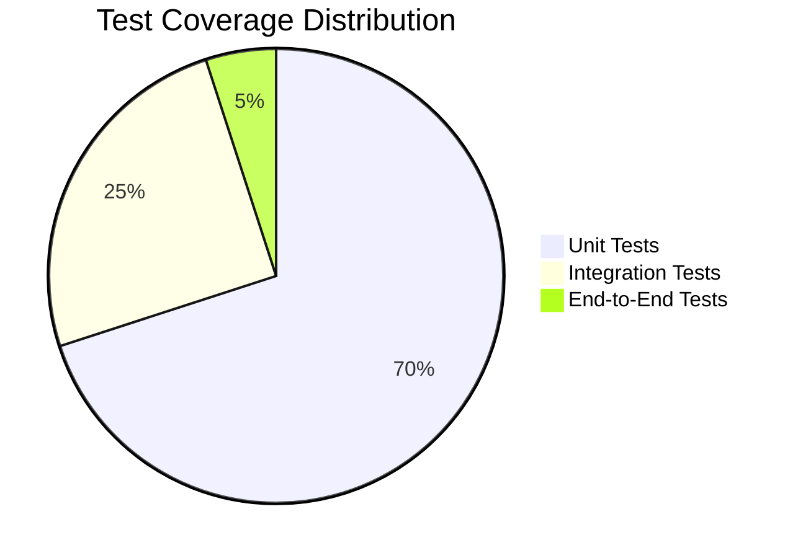
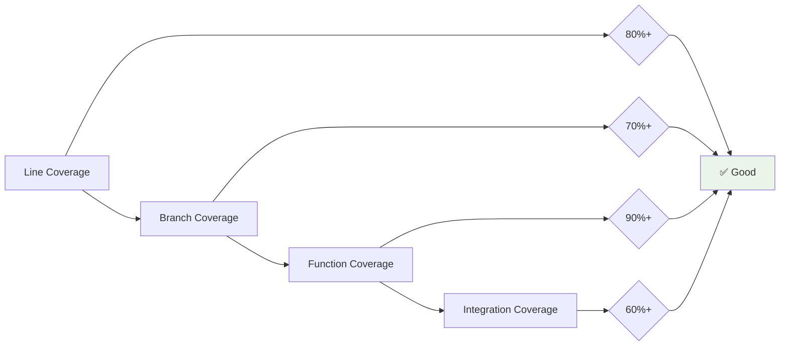

# Testing Overview

OpenFrame CLI implements a comprehensive testing strategy that ensures reliability, maintainability, and confidence in deployments. This guide covers the testing philosophy, structure, and practices used throughout the project.

## Testing Philosophy

### Core Testing Principles

| Principle | Implementation | Benefits |
|-----------|----------------|----------|
| **Test Pyramid** | More unit tests, fewer integration tests | Fast feedback, reliable CI/CD |
| **Dependency Injection** | All external dependencies are mockable | Isolated, deterministic tests |
| **Test-Driven Development** | Write tests before implementation | Better design, comprehensive coverage |
| **Fail Fast** | Tests fail quickly and clearly | Rapid debugging, developer productivity |

### Test Quality Metrics



**Target Coverage**: 80%+ overall, 90%+ for core business logic

## Test Structure

### Test Organization
```text
tests/
├── integration/           # Integration test suites
│   ├── common/           # Common integration test utilities
│   └── workflows/        # End-to-end workflow tests
├── mocks/                # Generated mock implementations
│   ├── cluster/          # Cluster provider mocks
│   ├── chart/            # Chart provider mocks
│   └── dev/              # Development tool mocks
└── testutil/             # Test utility functions
    ├── assertions.go     # Custom assertions
    ├── cluster.go        # Test cluster helpers
    ├── fixtures.go       # Test data fixtures
    └── setup.go          # Test environment setup
```

### Test Categories

#### 1. Unit Tests
**Location**: `*_test.go` files alongside source code
**Purpose**: Test individual functions and methods in isolation

```go
// Example: internal/cluster/service_test.go
func TestClusterService_CreateCluster(t *testing.T) {
    tests := []struct {
        name           string
        config         *ClusterConfig
        providerResult *Cluster
        providerError  error
        expectError    bool
    }{
        {
            name: "successful cluster creation",
            config: &ClusterConfig{
                Name: "test-cluster",
                Memory: "2Gi",
            },
            providerResult: &Cluster{Name: "test-cluster"},
            expectError: false,
        },
        {
            name: "provider failure",
            config: &ClusterConfig{Name: "test-cluster"},
            providerError: errors.New("docker not available"),
            expectError: true,
        },
    }
    
    for _, tt := range tests {
        t.Run(tt.name, func(t *testing.T) {
            // Arrange
            mockProvider := &mocks.ClusterProvider{}
            mockProvider.On("CreateCluster", mock.MatchedBy(
                func(config *ClusterConfig) bool {
                    return config.Name == tt.config.Name
                },
            )).Return(tt.providerResult, tt.providerError)
            
            service := cluster.NewService(mockProvider, nil, nil)
            
            // Act
            result, err := service.CreateCluster(tt.config)
            
            // Assert
            if tt.expectError {
                assert.Error(t, err)
                assert.Nil(t, result)
            } else {
                assert.NoError(t, err)
                assert.Equal(t, tt.providerResult.Name, result.Name)
            }
            
            mockProvider.AssertExpectations(t)
        })
    }
}
```

#### 2. Integration Tests
**Location**: `tests/integration/`
**Purpose**: Test component interactions with real external dependencies

```go
// Example: tests/integration/cluster_test.go
func TestClusterIntegration(t *testing.T) {
    if !testutil.IntegrationEnabled() {
        t.Skip("Integration tests disabled")
    }
    
    // Setup test environment
    testCluster := testutil.GenerateClusterName()
    defer testutil.CleanupCluster(t, testCluster)
    
    t.Run("cluster lifecycle", func(t *testing.T) {
        runner := testutil.NewCLIRunner()
        
        // Create cluster
        result := runner.Run("cluster", "create", testCluster)
        assert.Equal(t, 0, result.ExitCode)
        
        // Verify cluster exists
        result = runner.Run("cluster", "list")
        assert.Contains(t, result.Output, testCluster)
        
        // Check cluster status
        result = runner.Run("cluster", "status", testCluster)
        assert.Contains(t, result.Output, "running")
        
        // Delete cluster
        result = runner.Run("cluster", "delete", testCluster)
        assert.Equal(t, 0, result.ExitCode)
        
        // Verify cluster is gone
        result = runner.Run("cluster", "list")
        assert.NotContains(t, result.Output, testCluster)
    })
}
```

#### 3. End-to-End Tests
**Location**: `tests/integration/workflows/`
**Purpose**: Test complete user workflows from CLI to deployed applications

```go
// Example: tests/integration/workflows/bootstrap_test.go
func TestBootstrapWorkflow(t *testing.T) {
    if !testutil.IntegrationEnabled() {
        t.Skip("Integration tests disabled")
    }
    
    testCluster := testutil.GenerateClusterName()
    defer testutil.CleanupCluster(t, testCluster)
    
    t.Run("complete bootstrap workflow", func(t *testing.T) {
        runner := testutil.NewCLIRunner()
        
        // Bootstrap complete environment
        result := runner.RunWithTimeout(300*time.Second, 
            "bootstrap", testCluster, 
            "--deployment-mode=oss-tenant",
            "--non-interactive",
        )
        assert.Equal(t, 0, result.ExitCode)
        assert.Contains(t, result.Output, "Bootstrap Complete")
        
        // Verify cluster is accessible
        kubectl := testutil.NewKubectlRunner(testCluster)
        nodes := kubectl.Run("get", "nodes", "-o", "name")
        assert.Contains(t, nodes.Output, "node/")
        
        // Verify ArgoCD is running
        pods := kubectl.Run("get", "pods", "-n", "argocd")
        assert.Contains(t, pods.Output, "argocd-server")
        assert.Contains(t, pods.Output, "Running")
        
        // Verify applications are synced
        apps := kubectl.Run("get", "applications", "-n", "argocd")
        assert.Contains(t, apps.Output, "Synced")
    })
}
```

## Test Utilities

### Core Test Utilities

#### CLI Test Runner
```go
// testutil/cli_runner.go
type CLIRunner struct {
    binaryPath string
    env        map[string]string
}

func NewCLIRunner() *CLIRunner {
    return &CLIRunner{
        binaryPath: testutil.GetTestBinaryPath(),
        env:        testutil.GetTestEnvironment(),
    }
}

func (r *CLIRunner) Run(args ...string) *CLIResult {
    cmd := exec.Command(r.binaryPath, args...)
    cmd.Env = testutil.MapToEnv(r.env)
    
    var stdout, stderr bytes.Buffer
    cmd.Stdout = &stdout
    cmd.Stderr = &stderr
    
    err := cmd.Run()
    exitCode := 0
    if err != nil {
        if exitError, ok := err.(*exec.ExitError); ok {
            exitCode = exitError.ExitCode()
        }
    }
    
    return &CLIResult{
        ExitCode: exitCode,
        Output:   stdout.String(),
        Error:    stderr.String(),
    }
}
```

#### Test Cluster Management
```go
// testutil/cluster.go
func GenerateClusterName() string {
    return fmt.Sprintf("test-%d", time.Now().Unix())
}

func CleanupCluster(t *testing.T, clusterName string) {
    t.Cleanup(func() {
        cmd := exec.Command("k3d", "cluster", "delete", clusterName)
        _ = cmd.Run() // Best effort cleanup
    })
}

func WaitForClusterReady(clusterName string, timeout time.Duration) error {
    deadline := time.Now().Add(timeout)
    for time.Now().Before(deadline) {
        if IsClusterReady(clusterName) {
            return nil
        }
        time.Sleep(5 * time.Second)
    }
    return fmt.Errorf("cluster %s not ready within %v", clusterName, timeout)
}
```

#### Custom Assertions
```go
// testutil/assertions.go
func AssertClusterExists(t *testing.T, clusterName string) {
    cmd := exec.Command("k3d", "cluster", "list", "--output", "json")
    output, err := cmd.Output()
    require.NoError(t, err)
    
    var clusters []map[string]interface{}
    require.NoError(t, json.Unmarshal(output, &clusters))
    
    found := false
    for _, cluster := range clusters {
        if cluster["name"] == clusterName {
            found = true
            break
        }
    }
    
    assert.True(t, found, "Cluster %s should exist", clusterName)
}

func AssertPodsRunning(t *testing.T, namespace, labelSelector string) {
    kubectl := NewKubectlRunner("")
    result := kubectl.Run("get", "pods", "-n", namespace, "-l", labelSelector, 
        "--field-selector=status.phase=Running", "-o", "name")
    
    assert.NotEmpty(t, result.Output, 
        "Expected running pods in namespace %s with selector %s", 
        namespace, labelSelector)
}
```

## Mock Generation and Management

### Mock Generation with Mockery

```bash
# Install mockery
go install github.com/vektra/mockery/v2@latest

# Generate mocks for all interfaces
make generate-mocks

# Generate mocks for specific package
mockery --dir=internal/cluster --all --output=tests/mocks/cluster
```

### Mock Usage Patterns

#### Service Layer Mocking
```go
func TestChartService_InstallArgoCD(t *testing.T) {
    // Arrange
    mockHelm := &mocks.HelmProvider{}
    mockArgoCD := &mocks.ArgoCDProvider{}
    mockUI := &mocks.UIService{}
    
    service := chart.NewService(mockHelm, mockArgoCD, mockUI, nil)
    
    // Configure mock behavior
    mockHelm.On("AddRepository", "argo", mock.AnythingOfType("string")).
        Return(nil)
    mockHelm.On("InstallChart", mock.MatchedBy(
        func(config *chart.Config) bool {
            return config.Name == "argocd" && config.Namespace == "argocd"
        },
    )).Return(nil)
    
    // Act
    err := service.InstallArgoCD(&chart.ArgoCDConfig{
        Namespace: "argocd",
        Values:    map[string]interface{}{},
    })
    
    // Assert
    assert.NoError(t, err)
    mockHelm.AssertExpectations(t)
    mockArgoCD.AssertExpectations(t)
}
```

#### Complex Mock Scenarios
```go
func TestBootstrapService_WithRetries(t *testing.T) {
    mockCluster := &mocks.ClusterProvider{}
    mockChart := &mocks.ChartProvider{}
    
    // First call fails, second succeeds
    mockCluster.On("CreateCluster", mock.Anything).
        Return(nil, errors.New("docker not ready")).Once()
    mockCluster.On("CreateCluster", mock.Anything).
        Return(&cluster.Cluster{Name: "test"}, nil).Once()
    
    service := bootstrap.NewService(mockCluster, mockChart, nil)
    
    err := service.Bootstrap(&bootstrap.Config{
        ClusterName: "test",
        RetryConfig: &retry.Config{MaxAttempts: 2},
    })
    
    assert.NoError(t, err)
    mockCluster.AssertNumberOfCalls(t, "CreateCluster", 2)
}
```

## Running Tests

### Local Development

#### Basic Test Commands
```bash
# Run all unit tests
make test

# Run tests with coverage
make test-coverage

# Run tests with race detection
go test -race ./...

# Run specific test
go test ./internal/cluster/ -run TestClusterService_CreateCluster

# Verbose test output
go test -v ./internal/...
```

#### Integration Test Setup
```bash
# Enable integration tests
export OPENFRAME_INTEGRATION_TESTS=true

# Set test timeout
export OPENFRAME_TEST_TIMEOUT=300s

# Run integration tests
go test -tags=integration ./tests/integration/...

# Run specific integration test
go test -tags=integration ./tests/integration/ -run TestClusterIntegration
```

### Continuous Integration

#### GitHub Actions Workflow
```yaml
# .github/workflows/test.yml
name: Tests

on: [push, pull_request]

jobs:
  unit-tests:
    runs-on: ubuntu-latest
    steps:
      - uses: actions/checkout@v3
      - uses: actions/setup-go@v3
        with:
          go-version: '1.21'
      
      - name: Run unit tests
        run: make test-coverage
      
      - name: Upload coverage
        uses: codecov/codecov-action@v3
        with:
          file: ./coverage.out

  integration-tests:
    runs-on: ubuntu-latest
    steps:
      - uses: actions/checkout@v3
      - uses: actions/setup-go@v3
      
      - name: Install dependencies
        run: |
          # Install k3d, kubectl, helm, etc.
          make install-test-deps
      
      - name: Run integration tests
        env:
          OPENFRAME_INTEGRATION_TESTS: "true"
        run: |
          make test-integration
```

### Test Performance and Optimization

#### Parallel Test Execution
```bash
# Run tests in parallel
go test -parallel 4 ./...

# Control test parallelism
GOMAXPROCS=8 go test -parallel 8 ./...
```

#### Test Caching
```bash
# Clear test cache
go clean -testcache

# Verify test caching is working
go test -v ./internal/cluster/ # Should run tests
go test -v ./internal/cluster/ # Should show "cached"
```

## Test Coverage

### Coverage Targets

| Component | Target | Current |
|-----------|--------|---------|
| **Core Services** | 90%+ | 87% |
| **CLI Commands** | 80%+ | 82% |
| **Providers** | 85%+ | 79% |
| **Utilities** | 95%+ | 94% |
| **Overall** | 80%+ | 84% |

### Coverage Analysis
```bash
# Generate coverage report
make test-coverage

# View coverage by function
go tool cover -func coverage.out

# Generate HTML coverage report
go tool cover -html coverage.out -o coverage.html
open coverage.html

# Coverage for specific package
go test -coverprofile=cluster.out ./internal/cluster/
go tool cover -html=cluster.out
```

### Coverage Quality Metrics


## Testing Best Practices

### Do's and Don'ts

#### ✅ Best Practices

1. **Arrange, Act, Assert**: Structure tests clearly
2. **Test Names**: Descriptive names that explain the scenario
3. **Table-Driven Tests**: Use for multiple input scenarios
4. **Mock Assertions**: Verify mock expectations
5. **Cleanup**: Always clean up test resources
6. **Deterministic**: Tests should produce consistent results
7. **Fast**: Unit tests should complete in milliseconds
8. **Isolated**: Tests should not depend on external state

#### ❌ Anti-Patterns

1. **Flaky Tests**: Non-deterministic or timing-dependent tests
2. **Test Dependencies**: Tests that depend on other tests
3. **Over-Mocking**: Mocking internal implementation details
4. **Under-Asserting**: Not verifying expected behavior
5. **Resource Leaks**: Not cleaning up test clusters/containers
6. **Slow Unit Tests**: Unit tests that take seconds to run
7. **Integration in Unit**: Real external calls in unit tests

### Test Data Management

#### Fixtures and Test Data
```go
// testutil/fixtures.go
var (
    ValidClusterConfig = &cluster.Config{
        Name:   "test-cluster",
        Memory: "2Gi",
        Ports:  []int{8080, 8443},
    }
    
    ArgoCDInstallConfig = &chart.ArgoCDConfig{
        Namespace: "argocd",
        Values: map[string]interface{}{
            "server": map[string]interface{}{
                "service": map[string]interface{}{
                    "type": "ClusterIP",
                },
            },
        },
    }
)

func GetTestKubeconfig() string {
    return filepath.Join(os.TempDir(), "test-kubeconfig")
}
```

#### Environment Management
```go
func SetupTestEnvironment(t *testing.T) {
    // Set test-specific environment variables
    t.Setenv("KUBECONFIG", GetTestKubeconfig())
    t.Setenv("OPENFRAME_CONFIG_DIR", t.TempDir())
    t.Setenv("OPENFRAME_LOG_LEVEL", "debug")
    
    // Ensure cleanup
    t.Cleanup(func() {
        os.RemoveAll(GetTestKubeconfig())
    })
}
```

## Debugging Tests

### Common Debugging Techniques

#### Test Debugging in VS Code
1. Set breakpoints in test files
2. Use "Debug Test" CodeLens
3. Or use `F5` with test-specific launch config

#### Command Line Debugging
```bash
# Run single test with debugger
dlv test ./internal/cluster/ -- -test.run TestClusterService_CreateCluster

# Debug with verbose output
go test -v -run TestClusterService_CreateCluster ./internal/cluster/

# Print debug information in tests
go test -ldflags="-X main.debug=true" ./...
```

#### Test Troubleshooting
```bash
# Check test environment
go env
docker version
k3d version

# Clean up hanging resources
docker system prune -f
k3d cluster delete --all

# Verbose integration test debugging
OPENFRAME_LOG_LEVEL=debug go test -v -tags=integration ./tests/integration/
```

---

## Next Steps

Now that you understand our testing approach:

1. **[Run the Test Suite](../setup/local-development.md#testing)** - Execute tests locally
2. **[Write Your First Test](../contributing/guidelines.md#writing-tests)** - Add test coverage
3. **[Review Testing Examples](../../reference/testing/)** - Study existing test patterns
4. **[Contributing Guidelines](../contributing/guidelines.md)** - Learn the contribution process

Testing is a critical part of OpenFrame CLI's reliability. Well-tested code enables confident deployments and rapid development iterations.