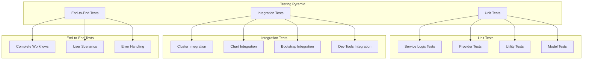

# Testing Overview

OpenFrame CLI follows a comprehensive testing strategy that ensures reliability, maintainability, and confidence in deployments. This document outlines the testing structure, strategies, and best practices used throughout the project.

## Testing Philosophy

Our testing approach is built on these principles:

- **Comprehensive Coverage**: Unit, integration, and end-to-end tests
- **Fast Feedback**: Quick test execution for rapid development cycles
- **Realistic Testing**: Integration tests use real tools when possible
- **Maintainable Tests**: Clear, readable, and well-organized test code
- **Confident Deployments**: Tests that catch issues before production

## Testing Structure

### Test Organization

```text
tests/
├── integration/           # Integration test suites
│   ├── bootstrap/        # Bootstrap workflow tests
│   ├── cluster/          # Cluster management tests
│   ├── chart/            # Chart installation tests
│   └── common/           # Shared integration utilities
├── mocks/                # Generated mocks and test doubles
│   ├── dev/             # Development service mocks
│   ├── cluster/         # Cluster service mocks
│   └── chart/           # Chart service mocks
└── testutil/             # Test utilities and helpers
    ├── assertions.go     # Custom assertions
    ├── cluster.go        # Cluster testing utilities
    ├── setup.go          # Test environment setup
    └── patterns.go       # Common test patterns
```

### Test Types and Scope



## Test Categories

### 1. Unit Tests

**Scope:** Individual components, functions, and methods in isolation.

**Location:** Alongside source code (`*_test.go` files)

**Purpose:**
- Test business logic without external dependencies
- Validate error handling and edge cases
- Ensure code contracts and interfaces work correctly
- Fast execution for rapid feedback

**Example Structure:**
```go
// internal/cluster/service_test.go
func TestClusterService_CreateCluster(t *testing.T) {
    tests := []struct {
        name           string
        config         models.ClusterConfig
        expectedError  bool
        setupMocks     func(*mocks.MockClusterProvider)
    }{
        {
            name: "successful cluster creation",
            config: models.ClusterConfig{
                Name: "test-cluster",
                Type: models.ClusterTypeK3d,
            },
            expectedError: false,
            setupMocks: func(m *mocks.MockClusterProvider) {
                m.EXPECT().CreateCluster(gomock.Any()).Return(nil)
            },
        },
        // Additional test cases...
    }
    
    for _, tt := range tests {
        t.Run(tt.name, func(t *testing.T) {
            // Test implementation
        })
    }
}
```

### 2. Integration Tests

**Scope:** Component interactions with real external tools.

**Location:** `tests/integration/` directory

**Purpose:**
- Validate tool integrations (K3d, Helm, kubectl)
- Test configuration generation and application
- Verify end-to-end workflows with real dependencies
- Catch integration issues between components

**Example Structure:**
```go
// tests/integration/cluster/cluster_test.go
func TestClusterIntegration(t *testing.T) {
    if testing.Short() {
        t.Skip("Skipping integration test in short mode")
    }
    
    // Setup test environment
    testClusterName := fmt.Sprintf("test-cluster-%d", time.Now().Unix())
    
    // Cleanup
    defer func() {
        exec.Command("k3d", "cluster", "delete", testClusterName).Run()
    }()
    
    // Test cluster creation
    service := cluster.NewClusterService(executor.NewRealExecutor())
    config := models.ClusterConfig{
        Name: testClusterName,
        Type: models.ClusterTypeK3d,
    }
    
    err := service.CreateCluster(config)
    require.NoError(t, err)
    
    // Verify cluster exists
    status, err := service.GetClusterStatus(testClusterName)
    require.NoError(t, err)
    assert.Equal(t, models.ClusterStatusRunning, status.Status)
}
```

### 3. End-to-End Tests

**Scope:** Complete user workflows from CLI to final result.

**Location:** `tests/e2e/` directory (planned)

**Purpose:**
- Test complete user scenarios
- Validate CLI user experience
- Ensure all components work together
- Catch regressions in user workflows

## Testing Tools and Frameworks

### Core Testing Stack

| Tool | Purpose | Usage |
|------|---------|-------|
| **Go testing** | Built-in test framework | Unit and integration tests |
| **testify** | Assertions and test utilities | `assert` and `require` functions |
| **gomock** | Mock generation and validation | Interface mocking |
| **testcontainers** | Integration test containers | Isolated test environments |

### Testing Dependencies

```bash
# Install testing dependencies
go install github.com/golang/mock/mockgen@latest
go install github.com/onsi/ginkgo/v2/ginkgo@latest

# Generate mocks
mockgen -source=internal/cluster/interfaces.go -destination=tests/mocks/cluster/interfaces.go
```

### Mock Generation

**Mock Interfaces:**
```go
//go:generate mockgen -source=interfaces.go -destination=../../tests/mocks/cluster/interfaces.go

type ClusterProvider interface {
    CreateCluster(config ClusterConfig) error
    DeleteCluster(name string) error
    GetClusterStatus(name string) (ClusterStatus, error)
}
```

**Generated Mock Usage:**
```go
func TestWithMock(t *testing.T) {
    ctrl := gomock.NewController(t)
    defer ctrl.Finish()
    
    mockProvider := mocks.NewMockClusterProvider(ctrl)
    mockProvider.EXPECT().CreateCluster(gomock.Any()).Return(nil)
    
    service := NewClusterService(mockProvider)
    err := service.CreateCluster(models.ClusterConfig{Name: "test"})
    assert.NoError(t, err)
}
```

## Running Tests

### Command Reference

```bash
# Unit tests only
make test

# All tests with coverage
make test-coverage

# Integration tests (requires Docker)
make test-integration

# Specific package tests
go test -v ./internal/cluster/...

# Run tests with race detection
go test -race ./...

# Run specific test
go test -v -run TestClusterService_CreateCluster ./internal/cluster/

# Short tests only (skip integration)
go test -short ./...

# Benchmark tests
go test -bench=. ./...
```

### Test Environment Setup

**Prerequisites for Integration Tests:**
```bash
# Required tools for integration testing
docker --version    # Docker for K3d
k3d version        # K3d for cluster testing
helm version       # Helm for chart testing
kubectl version    # kubectl for Kubernetes API
```

**Environment Variables:**
```bash
# Test configuration
export OPENFRAME_TEST_TIMEOUT=300s
export OPENFRAME_TEST_CLUSTER_PREFIX=openframe-test
export OPENFRAME_LOG_LEVEL=debug

# Skip integration tests
export OPENFRAME_SKIP_INTEGRATION=true

# Test with specific tools
export K3D_BINARY=/usr/local/bin/k3d
export HELM_BINARY=/usr/local/bin/helm
```

### Continuous Integration

**GitHub Actions Configuration:**
```yaml
name: Test
on: [push, pull_request]

jobs:
  test:
    runs-on: ubuntu-latest
    steps:
      - uses: actions/checkout@v3
      - uses: actions/setup-go@v3
        with:
          go-version: '1.21'
      
      - name: Install dependencies
        run: make dev-deps
      
      - name: Run unit tests
        run: make test
      
      - name: Run integration tests
        run: make test-integration
      
      - name: Upload coverage
        uses: codecov/codecov-action@v3
```

## Test Utilities and Helpers

### Common Test Patterns

**Test Setup Pattern:**
```go
func setupTestEnvironment(t *testing.T) (cleanup func()) {
    // Setup test resources
    testDir := t.TempDir()
    originalDir, _ := os.Getwd()
    os.Chdir(testDir)
    
    return func() {
        os.Chdir(originalDir)
    }
}

func TestWithSetup(t *testing.T) {
    cleanup := setupTestEnvironment(t)
    defer cleanup()
    
    // Test implementation
}
```

**Cluster Test Utilities:**
```go
// testutil/cluster.go
func CreateTestCluster(t *testing.T, name string) (cleanup func()) {
    ctx, cancel := context.WithTimeout(context.Background(), 5*time.Minute)
    defer cancel()
    
    // Create cluster
    cmd := exec.CommandContext(ctx, "k3d", "cluster", "create", name)
    require.NoError(t, cmd.Run())
    
    return func() {
        exec.Command("k3d", "cluster", "delete", name).Run()
    }
}

func WaitForClusterReady(t *testing.T, name string) {
    ctx, cancel := context.WithTimeout(context.Background(), 2*time.Minute)
    defer cancel()
    
    for {
        select {
        case <-ctx.Done():
            t.Fatal("Timeout waiting for cluster to be ready")
        case <-time.After(5 * time.Second):
            if isClusterReady(name) {
                return
            }
        }
    }
}
```

**Assertion Helpers:**
```go
// testutil/assertions.go
func AssertClusterExists(t *testing.T, name string) {
    cmd := exec.Command("k3d", "cluster", "list", "-o", "json")
    output, err := cmd.Output()
    require.NoError(t, err)
    
    var clusters []map[string]interface{}
    require.NoError(t, json.Unmarshal(output, &clusters))
    
    found := false
    for _, cluster := range clusters {
        if cluster["name"] == name {
            found = true
            break
        }
    }
    assert.True(t, found, "Cluster %s should exist", name)
}

func AssertPodRunning(t *testing.T, namespace, labelSelector string) {
    ctx, cancel := context.WithTimeout(context.Background(), 2*time.Minute)
    defer cancel()
    
    for {
        select {
        case <-ctx.Done():
            t.Fatal("Timeout waiting for pods to be running")
        case <-time.After(5 * time.Second):
            if arePodsRunning(namespace, labelSelector) {
                return
            }
        }
    }
}
```

## Test Coverage Requirements

### Coverage Targets

| Component | Target | Current | Status |
|-----------|---------|---------|--------|
| **Services** | 90% | 85% | 🟡 Improving |
| **Providers** | 80% | 75% | 🟡 Improving |
| **Commands** | 70% | 65% | 🟡 Improving |
| **Utilities** | 95% | 92% | 🟢 Good |
| **Overall** | 80% | 78% | 🟡 Improving |

### Coverage Analysis

```bash
# Generate coverage report
make test-coverage

# View coverage in browser
go tool cover -html=coverage.out

# Coverage by package
go tool cover -func=coverage.out

# Detailed coverage analysis
go test -coverprofile=coverage.out -covermode=count ./...
gocov convert coverage.out | gocov-html > coverage.html
```

## Writing Effective Tests

### Test Naming Convention

```go
// Format: Test<ComponentName>_<Method>_<Scenario>
func TestClusterService_CreateCluster_WithValidConfig(t *testing.T) {}
func TestClusterService_CreateCluster_WithInvalidName(t *testing.T) {}
func TestK3dProvider_DeleteCluster_WhenClusterNotExists(t *testing.T) {}
```

### Test Structure Pattern

```go
func TestExample(t *testing.T) {
    // Arrange: Setup test data and mocks
    ctrl := gomock.NewController(t)
    defer ctrl.Finish()
    
    mockProvider := mocks.NewMockProvider(ctrl)
    service := NewService(mockProvider)
    
    // Act: Execute the code under test
    result, err := service.Method(input)
    
    // Assert: Verify the results
    require.NoError(t, err)
    assert.Equal(t, expected, result)
}
```

### Error Testing

```go
func TestErrorHandling(t *testing.T) {
    tests := []struct {
        name          string
        input         Input
        mockSetup     func(*mocks.MockProvider)
        expectedError string
    }{
        {
            name:  "network error",
            input: validInput,
            mockSetup: func(m *mocks.MockProvider) {
                m.EXPECT().Call().Return(errors.New("network timeout"))
            },
            expectedError: "network timeout",
        },
    }
    
    for _, tt := range tests {
        t.Run(tt.name, func(t *testing.T) {
            // Test implementation
            err := service.Method(tt.input)
            require.Error(t, err)
            assert.Contains(t, err.Error(), tt.expectedError)
        })
    }
}
```

## Integration Test Best Practices

### Resource Management

```go
func TestIntegrationWithCleanup(t *testing.T) {
    // Setup resources
    clusterName := generateTestClusterName()
    
    // Ensure cleanup happens
    defer func() {
        cleanupCluster(clusterName)
        cleanupFiles(testFiles)
    }()
    
    // Test implementation
}
```

### Test Isolation

```go
func TestIsolated(t *testing.T) {
    // Use unique names to avoid conflicts
    testID := time.Now().UnixNano()
    clusterName := fmt.Sprintf("test-cluster-%d", testID)
    namespace := fmt.Sprintf("test-ns-%d", testID)
    
    // Test with isolated resources
}
```

### Parallel Test Safety

```go
func TestParallelSafe(t *testing.T) {
    t.Parallel() // Only if test is parallel-safe
    
    // Use unique resources per test
    // No shared global state
    // No conflicting ports or names
}
```

## Debugging Tests

### Test Debugging Tips

```bash
# Run single test with verbose output
go test -v -run TestSpecific ./package/

# Add debugging prints
t.Logf("Debug info: %+v", data)

# Skip cleanup for investigation
if !testing.Short() {
    defer cleanup()
}

# Use debugger with tests
dlv test ./package/ -- -test.run TestSpecific
```

### Integration Test Debugging

```bash
# Keep test resources for inspection
export OPENFRAME_KEEP_TEST_RESOURCES=true

# Increase test timeout
export OPENFRAME_TEST_TIMEOUT=600s

# Enable debug logging
export OPENFRAME_LOG_LEVEL=trace

# Connect to test cluster
export KUBECONFIG=/tmp/test-cluster-kubeconfig
kubectl get pods -A
```

## Test Performance

### Benchmarking

```go
func BenchmarkClusterCreation(b *testing.B) {
    service := NewClusterService(mockProvider)
    config := models.ClusterConfig{Name: "bench-test"}
    
    b.ResetTimer()
    for i := 0; i < b.N; i++ {
        service.CreateCluster(config)
    }
}
```

### Test Optimization

```bash
# Run tests with CPU profiling
go test -cpuprofile cpu.prof -bench=. ./...
go tool pprof cpu.prof

# Parallel test execution
go test -parallel 4 ./...

# Cache test results
go test -cache ./...
```

## Continuous Improvement

### Monitoring Test Health

- **Flaky Test Detection**: Monitor for inconsistent test results
- **Performance Regression**: Track test execution times
- **Coverage Trends**: Monitor coverage changes over time
- **Integration Reliability**: Track integration test success rates

### Test Maintenance

- Regular review of test effectiveness
- Cleanup of obsolete tests
- Update tests with API changes
- Refactor common test patterns

---

**Testing Excellence:** Our comprehensive testing strategy ensures OpenFrame CLI remains reliable and maintainable. Write tests that provide confidence, run quickly, and catch real issues. Good tests are documentation that never lies about how the system actually works.