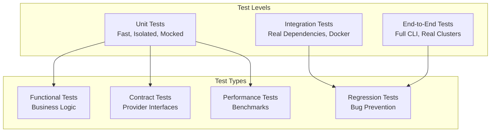

# Testing Overview

OpenFrame CLI uses a comprehensive testing strategy that ensures reliability, maintainability, and confidence in changes. This guide covers the testing philosophy, structure, tools, and best practices used in the project.

## Testing Philosophy

### Quality Principles

1. **Test Pyramid**: Heavy emphasis on unit tests, moderate integration tests, minimal end-to-end tests
2. **Fast Feedback**: Tests should run quickly to enable rapid development cycles  
3. **Reliability**: Tests should be deterministic and not flaky
4. **Maintainability**: Tests should be easy to understand and modify
5. **Real Value**: Every test should catch real bugs or prevent regressions

### Testing Strategy Overview



## Test Structure and Organization

### Directory Layout

```
tests/
├── integration/              # Integration tests
│   ├── common/              # Shared integration test utilities
│   │   ├── cli_runner.go    # CLI command execution helpers
│   │   ├── cluster_management.go # Test cluster setup/teardown
│   │   └── dependencies.go  # External dependency management
│   ├── cluster/             # Cluster management integration tests
│   ├── chart/               # Chart installation integration tests
│   └── dev/                 # Development tools integration tests
├── mocks/                   # Generated and manual mocks
│   └── dev/                 # Development tool mocks
├── testutil/                # Test utilities and helpers
│   ├── assertions.go        # Custom assertion helpers
│   ├── cluster.go          # Test cluster utilities
│   ├── patterns.go         # Common test patterns
│   ├── setup.go            # Test environment setup
│   └── utilities.go        # General test utilities
└── fixtures/               # Test data and fixtures
    ├── clusters/           # Cluster configuration examples
    ├── charts/            # Chart configuration examples
    └── configs/           # Configuration file examples
```

### Unit Test Organization

Unit tests are co-located with source code following Go conventions:

```
internal/
├── cluster/
│   ├── services/
│   │   ├── cluster_service.go
│   │   └── cluster_service_test.go    # Unit tests for service
│   ├── providers/
│   │   ├── k3d/
│   │   │   ├── manager.go
│   │   │   └── manager_test.go       # Unit tests for provider
│   └── models/
│       ├── cluster.go
│       └── cluster_test.go           # Unit tests for models
```

## Test Categories

### 1. Unit Tests

Unit tests focus on individual functions and methods with all dependencies mocked.

#### Characteristics
- **Fast**: Run in milliseconds
- **Isolated**: No external dependencies 
- **Deterministic**: Same input always produces same output
- **Comprehensive**: Test all code paths including edge cases

#### Example Unit Test
```go
// internal/cluster/services/cluster_service_test.go
package services

import (
    "testing"
    "github.com/stretchr/testify/assert"
    "github.com/stretchr/testify/mock"
    "github.com/flamingo-stack/openframe-cli/tests/mocks"
)

func TestClusterService_Create_Success(t *testing.T) {
    // Arrange
    mockProvider := &mocks.ClusterProvider{}
    mockUI := &mocks.UIProvider{}
    mockValidator := &mocks.ClusterValidator{}
    
    service := &ClusterService{
        provider:  mockProvider,
        ui:        mockUI,
        validator: mockValidator,
    }
    
    config := &models.ClusterConfig{
        Name:  "test-cluster",
        Nodes: 1,
    }
    
    // Setup expectations
    mockValidator.On("Validate", config).Return(nil)
    mockUI.On("ShowProgress", "Creating cluster", "test-cluster").Return()
    mockProvider.On("CreateCluster", config).Return(nil)
    
    // Act
    err := service.Create(config)
    
    // Assert
    assert.NoError(t, err)
    mockProvider.AssertExpectations(t)
    mockUI.AssertExpectations(t)
    mockValidator.AssertExpectations(t)
}

func TestClusterService_Create_ValidationError(t *testing.T) {
    // Arrange
    mockValidator := &mocks.ClusterValidator{}
    service := &ClusterService{validator: mockValidator}
    
    config := &models.ClusterConfig{Name: ""}
    validationErr := errors.New("name required")
    
    mockValidator.On("Validate", config).Return(validationErr)
    
    // Act
    err := service.Create(config)
    
    // Assert
    assert.Error(t, err)
    assert.Contains(t, err.Error(), "validation")
}
```

### 2. Integration Tests

Integration tests verify interactions between components using real external dependencies.

#### Characteristics
- **Realistic**: Use real Docker, k3d, kubectl
- **Slower**: May take seconds to minutes
- **Environment dependent**: Require Docker and other tools
- **Cleanup**: Must clean up resources after execution

#### Example Integration Test
```go
//go:build integration
// +build integration

// tests/integration/cluster/cluster_test.go
package cluster

import (
    "testing"
    "github.com/flamingo-stack/openframe-cli/tests/integration/common"
    "github.com/flamingo-stack/openframe-cli/tests/testutil"
)

func TestClusterLifecycle(t *testing.T) {
    if testing.Short() {
        t.Skip("Skipping integration test in short mode")
    }
    
    // Setup
    runner := common.NewCLIRunner(t)
    clusterName := testutil.GenerateTestClusterName()
    
    // Cleanup after test
    defer func() {
        runner.Run("cluster", "delete", clusterName)
    }()
    
    // Test cluster creation
    t.Run("create cluster", func(t *testing.T) {
        output, err := runner.Run("cluster", "create", clusterName, "--nodes", "1")
        assert.NoError(t, err)
        assert.Contains(t, output, "Cluster created successfully")
    })
    
    // Test cluster listing
    t.Run("list clusters", func(t *testing.T) {
        output, err := runner.Run("cluster", "list")
        assert.NoError(t, err)
        assert.Contains(t, output, clusterName)
    })
    
    // Test cluster status
    t.Run("cluster status", func(t *testing.T) {
        output, err := runner.Run("cluster", "status", clusterName)
        assert.NoError(t, err)
        assert.Contains(t, output, "running")
    })
    
    // Test cluster deletion
    t.Run("delete cluster", func(t *testing.T) {
        output, err := runner.Run("cluster", "delete", clusterName)
        assert.NoError(t, err)
        assert.Contains(t, output, "deleted successfully")
    })
}
```

### 3. Contract Tests

Contract tests verify that providers correctly implement their interfaces.

#### Example Contract Test
```go
// internal/cluster/providers/contract_test.go
package providers

import (
    "testing"
    "github.com/flamingo-stack/openframe-cli/internal/cluster/providers/k3d"
)

func TestK3dProvider_ImplementsInterface(t *testing.T) {
    // Verify that K3dProvider implements ClusterProvider interface
    var _ ClusterProvider = (*k3d.Manager)(nil)
}

func TestClusterProvider_Contract(t *testing.T) {
    providers := []struct {
        name     string
        provider ClusterProvider
    }{
        {"k3d", k3d.NewManager()},
        // Add other providers here as they're implemented
    }
    
    for _, tc := range providers {
        t.Run(tc.name, func(t *testing.T) {
            testClusterProviderContract(t, tc.provider)
        })
    }
}

func testClusterProviderContract(t *testing.T, provider ClusterProvider) {
    config := &models.ClusterConfig{
        Name:  "contract-test",
        Nodes: 1,
    }
    
    // Test that methods exist and handle basic cases
    clusters, err := provider.ListClusters()
    assert.NoError(t, err)
    assert.NotNil(t, clusters)
    
    // More contract verification...
}
```

## Running Tests

### Running All Tests
```bash
# Run all tests
make test

# Run tests with coverage
make test-coverage

# Run tests with race detection
go test -race ./...

# Run tests in verbose mode
go test -v ./...
```

### Running Specific Test Categories
```bash
# Run only unit tests (fast)
go test -short ./...

# Run only integration tests
make integration-test
# or
go test -tags=integration ./tests/integration/...

# Run specific package tests
go test ./internal/cluster/services/...

# Run specific test function
go test -run TestClusterService_Create ./internal/cluster/services/
```

### Running Tests with Different Configurations
```bash
# Run tests with different build tags
go test -tags=debug ./...
go test -tags=integration,debug ./...

# Run tests with environment variables
OPENFRAME_TEST_DEBUG=true go test ./...
OPENFRAME_TEST_TIMEOUT=300s go test ./...

# Run tests with specific parallelism
go test -parallel 4 ./...
```

## Test Utilities and Helpers

### CLI Test Runner
```go
// tests/integration/common/cli_runner.go
type CLIRunner struct {
    t      *testing.T
    binary string
    env    map[string]string
}

func NewCLIRunner(t *testing.T) *CLIRunner {
    return &CLIRunner{
        t:      t,
        binary: getBinaryPath(),
        env:    getTestEnvironment(),
    }
}

func (r *CLIRunner) Run(args ...string) (string, error) {
    cmd := exec.Command(r.binary, args...)
    cmd.Env = r.buildEnvironment()
    
    output, err := cmd.CombinedOutput()
    
    // Log command execution for debugging
    r.t.Logf("Command: %s %s", r.binary, strings.Join(args, " "))
    r.t.Logf("Output: %s", string(output))
    
    return string(output), err
}
```

### Test Cluster Management
```go
// tests/testutil/cluster.go
func CreateTestCluster(t *testing.T, name string) func() {
    t.Helper()
    
    // Create cluster
    cmd := exec.Command("k3d", "cluster", "create", name, "--wait")
    if err := cmd.Run(); err != nil {
        t.Fatalf("Failed to create test cluster: %v", err)
    }
    
    // Return cleanup function
    return func() {
        cmd := exec.Command("k3d", "cluster", "delete", name)
        cmd.Run() // Ignore errors in cleanup
    }
}

func GenerateTestClusterName() string {
    return fmt.Sprintf("test-%s-%d", 
        strings.ToLower(uuid.New().String()[:8]),
        time.Now().Unix())
}
```

### Custom Assertions
```go
// tests/testutil/assertions.go
func AssertClusterExists(t *testing.T, clusterName string) {
    t.Helper()
    
    cmd := exec.Command("k3d", "cluster", "list", "-o", "json")
    output, err := cmd.Output()
    require.NoError(t, err)
    
    var clusters []map[string]interface{}
    require.NoError(t, json.Unmarshal(output, &clusters))
    
    for _, cluster := range clusters {
        if cluster["name"] == clusterName {
            return // Found it
        }
    }
    
    t.Errorf("Cluster %s does not exist", clusterName)
}

func AssertCommandSucceeds(t *testing.T, cmd *exec.Cmd) string {
    t.Helper()
    
    output, err := cmd.CombinedOutput()
    require.NoError(t, err, "Command failed with output: %s", string(output))
    
    return string(output)
}
```

## Mocking Strategy

### Generated Mocks

We use `mockery` to generate mocks for interfaces:

```bash
# Install mockery
go install github.com/vektra/mockery/v2@latest

# Generate mocks
mockery --dir=internal/cluster/providers --name=ClusterProvider --output=tests/mocks
mockery --dir=internal/shared/ui --name=UIProvider --output=tests/mocks
```

### Mock Configuration
```yaml
# .mockery.yaml
with-expecter: true
dir: "tests/mocks"
packages:
  github.com/flamingo-stack/openframe-cli/internal/cluster/providers:
    interfaces:
      ClusterProvider:
  github.com/flamingo-stack/openframe-cli/internal/shared/ui:
    interfaces:
      UIProvider:
```

### Manual Mocks for Complex Scenarios
```go
// tests/mocks/command_executor.go
type MockCommandExecutor struct {
    mock.Mock
    commands map[string]MockCommandResult
}

type MockCommandResult struct {
    Output []byte
    Error  error
    ExitCode int
}

func (m *MockCommandExecutor) NewCommand(name string, args ...string) Command {
    key := fmt.Sprintf("%s %s", name, strings.Join(args, " "))
    
    result := m.commands[key]
    return &MockCommand{
        name:     name,
        args:     args,
        result:   result,
        executor: m,
    }
}

func (m *MockCommandExecutor) StubCommand(command string, result MockCommandResult) {
    if m.commands == nil {
        m.commands = make(map[string]MockCommandResult)
    }
    m.commands[command] = result
}
```

## Test Configuration and Environment

### Test Environment Setup
```bash
#!/bin/bash
# scripts/setup-test-env.sh

echo "Setting up test environment..."

# Ensure Docker is running
if ! docker info >/dev/null 2>&1; then
    echo "Error: Docker is not running"
    exit 1
fi

# Install test dependencies
go install github.com/vektra/mockery/v2@latest
go install gotest.tools/gotestsum@latest

# Create test directories
mkdir -p tests/{integration,mocks,testutil,fixtures}

# Set test environment variables
export OPENFRAME_TEST=true
export OPENFRAME_TEST_TIMEOUT=300s
export OPENFRAME_LOG_LEVEL=error

echo "Test environment ready!"
```

### CI/CD Test Configuration
```yaml
# .github/workflows/test.yml
name: Tests
on: [push, pull_request]

jobs:
  unit-tests:
    runs-on: ubuntu-latest
    steps:
      - uses: actions/checkout@v3
      - uses: actions/setup-go@v3
        with:
          go-version: '1.21'
      
      - name: Run unit tests
        run: |
          go test -short -race -coverprofile=coverage.out ./...
          go tool cover -html=coverage.out -o coverage.html
      
      - name: Upload coverage
        uses: codecov/codecov-action@v3

  integration-tests:
    runs-on: ubuntu-latest
    steps:
      - uses: actions/checkout@v3
      - uses: actions/setup-go@v3
        with:
          go-version: '1.21'
      
      - name: Setup test environment
        run: |
          curl -s https://raw.githubusercontent.com/k3d-io/k3d/main/install.sh | bash
          kubectl version --client
      
      - name: Run integration tests
        run: make integration-test
```

## Coverage Requirements and Reporting

### Coverage Goals
| Component | Target Coverage | Rationale |
|-----------|----------------|-----------|
| **Services** | 85%+ | Core business logic must be well tested |
| **Providers** | 80%+ | External integrations need thorough testing |
| **Models** | 90%+ | Data structures should be simple to test |
| **CLI Commands** | 70%+ | Integration tests cover command execution |
| **Utilities** | 85%+ | Shared code impacts entire application |

### Coverage Analysis
```bash
# Generate coverage report
go test -coverprofile=coverage.out ./...

# View coverage by function
go tool cover -func=coverage.out

# Generate HTML coverage report
go tool cover -html=coverage.out -o coverage.html

# Check coverage threshold
go tool cover -func=coverage.out | grep total | awk '{print $3}' | sed 's/%//' | awk '{if($1<80) exit 1}'
```

## Performance and Benchmark Testing

### Benchmark Tests
```go
// internal/cluster/services/cluster_service_bench_test.go
func BenchmarkClusterService_Create(b *testing.B) {
    mockProvider := &mocks.ClusterProvider{}
    service := &ClusterService{provider: mockProvider}
    
    config := &models.ClusterConfig{
        Name:  "bench-cluster",
        Nodes: 1,
    }
    
    mockProvider.On("CreateCluster", mock.AnythingOfType("*models.ClusterConfig")).Return(nil)
    
    b.ResetTimer()
    
    for i := 0; i < b.N; i++ {
        service.Create(config)
    }
}
```

### Running Benchmarks
```bash
# Run all benchmarks
go test -bench=. ./...

# Run specific benchmark
go test -bench=BenchmarkClusterService_Create ./internal/cluster/services/

# Generate CPU profile
go test -bench=. -cpuprofile=cpu.prof ./...
go tool pprof cpu.prof

# Generate memory profile
go test -bench=. -memprofile=mem.prof ./...
go tool pprof mem.prof
```

## Testing Best Practices

### 1. Test Organization
- **One test file per source file**: `service.go` → `service_test.go`
- **Group related tests**: Use subtests for related scenarios
- **Clear test names**: Names should describe what is being tested
- **Setup/teardown**: Use `t.Cleanup()` for resource cleanup

### 2. Assertion Patterns
```go
// Good: Clear, specific assertions
assert.Equal(t, expected, actual, "cluster name should match")
assert.Contains(t, output, "created successfully")
assert.True(t, cluster.IsRunning())

// Bad: Generic or unclear assertions
assert.True(t, result)
assert.NotNil(t, response)
```

### 3. Test Data Management
```go
// Good: Use test builders for complex data
func NewTestClusterConfig() *models.ClusterConfig {
    return &models.ClusterConfig{
        Name:     "test-cluster",
        Nodes:    1,
        APIPort:  6443,
        Created:  time.Now(),
    }
}

func (c *ClusterConfig) WithName(name string) *ClusterConfig {
    c.Name = name
    return c
}

// Usage
config := NewTestClusterConfig().WithName("custom-cluster")
```

### 4. Error Testing
```go
// Test both success and failure paths
func TestService_Operation(t *testing.T) {
    tests := []struct {
        name        string
        input       interface{}
        mockSetup   func(*mocks.Provider)
        expectError bool
        errorType   string
    }{
        {
            name:        "success case",
            input:       validInput,
            mockSetup:   func(m *mocks.Provider) { m.On("Method").Return(nil) },
            expectError: false,
        },
        {
            name:        "provider error",
            input:       validInput,
            mockSetup:   func(m *mocks.Provider) { m.On("Method").Return(errors.New("provider error")) },
            expectError: true,
            errorType:   "provider",
        },
    }
    
    for _, tc := range tests {
        t.Run(tc.name, func(t *testing.T) {
            // Test implementation
        })
    }
}
```

## Troubleshooting Test Issues

### Common Test Failures

#### Flaky Integration Tests
```bash
# Run test multiple times to identify flaky tests
go test -count=10 ./tests/integration/cluster/

# Add proper waits and retries
func waitForClusterReady(t *testing.T, clusterName string) {
    timeout := time.After(60 * time.Second)
    ticker := time.NewTicker(2 * time.Second)
    defer ticker.Stop()
    
    for {
        select {
        case <-timeout:
            t.Fatal("Timeout waiting for cluster to be ready")
        case <-ticker.C:
            if isClusterReady(clusterName) {
                return
            }
        }
    }
}
```

#### Mock Expectation Failures
```bash
# Enable mock debugging
mockProvider.Test(t) // Automatically fail if expectations not met

# Use more specific matchers
mockProvider.On("CreateCluster", 
    mock.MatchedBy(func(config *models.ClusterConfig) bool {
        return config.Name == "test-cluster" && config.Nodes == 1
    })).Return(nil)
```

#### Resource Cleanup Issues
```bash
# Use defer for cleanup
func TestIntegration(t *testing.T) {
    clusterName := createTestCluster(t)
    defer deleteCluster(t, clusterName)
    
    // Test implementation
}

# Clean up in CI environment
func TestMain(m *testing.M) {
    code := m.Run()
    
    // Global cleanup
    cleanupTestResources()
    
    os.Exit(code)
}
```

---

**Next**: Ready to contribute? Check out the [Contributing Guidelines](../contributing/guidelines.md) to understand the development workflow and code standards.