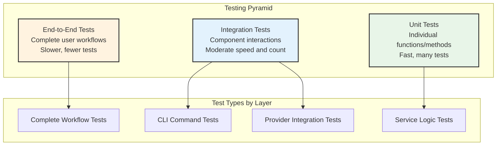

# Testing Overview

Comprehensive guide to OpenFrame CLI's testing strategy, patterns, and practices for maintaining high code quality and reliability.

## Testing Philosophy

OpenFrame CLI follows a **testing pyramid** approach with emphasis on:

- **Fast feedback** - Unit tests provide immediate feedback
- **Confidence** - Integration tests ensure components work together  
- **Real-world validation** - E2E tests verify complete workflows
- **Quality gates** - Tests prevent regression and ensure reliability



## Testing Structure

### Test Organization

```text
openframe-cli/
├── cmd/                    # Command tests alongside implementation
│   ├── bootstrap/
│   │   ├── bootstrap.go
│   │   └── bootstrap_test.go
│   └── cluster/
│       ├── create.go
│       └── create_test.go
├── internal/               # Service and logic tests
│   ├── bootstrap/
│   │   ├── service.go
│   │   └── service_test.go
│   └── shared/
│       ├── ui/
│       │   ├── ui.go
│       │   └── ui_test.go
├── test/                   # Integration and E2E tests
│   ├── integration/
│   │   ├── bootstrap_test.go
│   │   └── cluster_test.go
│   ├── e2e/
│   │   ├── complete_workflow_test.go
│   │   └── scenarios/
│   └── fixtures/           # Test data and configurations
│       ├── configs/
│       └── manifests/
└── scripts/
    └── test-setup.sh       # Test environment setup
```

### Test Categories

| Test Type | Location | Purpose | Speed | Dependencies |
|-----------|----------|---------|-------|--------------|
| **Unit Tests** | `*_test.go` next to source | Test individual functions | Fast (< 1s) | None |
| **Integration Tests** | `test/integration/` | Test component interactions | Medium (1-10s) | Docker |
| **E2E Tests** | `test/e2e/` | Test complete workflows | Slow (10s+) | Full environment |
| **Contract Tests** | `test/contracts/` | Test external API contracts | Medium | Mock servers |

## Unit Testing

### Testing Patterns

#### Service Layer Testing with Mocks

```go
// internal/cluster/service_test.go
package cluster

import (
    "testing"
    "github.com/stretchr/testify/assert"
    "github.com/stretchr/testify/mock"
)

// Mock provider for testing
type MockProvider struct {
    mock.Mock
}

func (m *MockProvider) Create(config ClusterConfig) error {
    args := m.Called(config)
    return args.Error(0)
}

func (m *MockProvider) List() ([]Cluster, error) {
    args := m.Called()
    return args.Get(0).([]Cluster), args.Error(1)
}

// Test service logic with mocked dependencies
func TestClusterService_Create_Success(t *testing.T) {
    // Arrange
    provider := &MockProvider{}
    ui := &MockUI{}
    service := &Service{
        provider: provider,
        ui:       ui,
    }
    
    config := ClusterConfig{
        Name: "test-cluster",
        CPU:  2,
        Memory: 4,
    }
    
    provider.On("Create", config).Return(nil)
    ui.On("Success", mock.AnythingOfType("string")).Return()
    
    // Act
    err := service.Create(config)
    
    // Assert
    assert.NoError(t, err)
    provider.AssertExpectations(t)
    ui.AssertExpectations(t)
}

func TestClusterService_Create_ValidationError(t *testing.T) {
    // Test input validation
    service := &Service{}
    
    config := ClusterConfig{
        Name: "", // Invalid empty name
    }
    
    err := service.Create(config)
    
    assert.Error(t, err)
    assert.Contains(t, err.Error(), "cluster name cannot be empty")
}
```

#### Command Layer Testing

```go
// cmd/bootstrap/bootstrap_test.go
package bootstrap

import (
    "bytes"
    "testing"
    "github.com/spf13/cobra"
    "github.com/stretchr/testify/assert"
)

func TestBootstrapCmd_ValidArgs(t *testing.T) {
    cmd := GetBootstrapCmd()
    
    // Test valid arguments
    cmd.SetArgs([]string{"test-cluster"})
    
    err := cmd.Args(cmd, []string{"test-cluster"})
    assert.NoError(t, err)
}

func TestBootstrapCmd_TooManyArgs(t *testing.T) {
    cmd := GetBootstrapCmd()
    
    // Test too many arguments
    err := cmd.Args(cmd, []string{"cluster1", "cluster2"})
    assert.Error(t, err)
}

func TestBootstrapCmd_Flags(t *testing.T) {
    cmd := GetBootstrapCmd()
    
    // Test flag configuration
    cmd.SetArgs([]string{"--deployment-mode=oss-tenant", "--verbose"})
    cmd.ParseFlags([]string{"--deployment-mode=oss-tenant", "--verbose"})
    
    deploymentMode, _ := cmd.Flags().GetString("deployment-mode")
    verbose, _ := cmd.Flags().GetBool("verbose")
    
    assert.Equal(t, "oss-tenant", deploymentMode)
    assert.True(t, verbose)
}
```

#### Table-Driven Tests

```go
func TestValidateClusterName(t *testing.T) {
    tests := []struct {
        name        string
        clusterName string
        wantErr     bool
        errContains string
    }{
        {
            name:        "valid name",
            clusterName: "my-cluster",
            wantErr:     false,
        },
        {
            name:        "empty name",
            clusterName: "",
            wantErr:     true,
            errContains: "cannot be empty",
        },
        {
            name:        "too long name",
            clusterName: "a" + strings.Repeat("b", 64),
            wantErr:     true,
            errContains: "too long",
        },
        {
            name:        "invalid characters",
            clusterName: "cluster_with_underscores",
            wantErr:     true,
            errContains: "invalid format",
        },
    }
    
    for _, tt := range tests {
        t.Run(tt.name, func(t *testing.T) {
            err := ValidateClusterName(tt.clusterName)
            
            if tt.wantErr {
                assert.Error(t, err)
                if tt.errContains != "" {
                    assert.Contains(t, err.Error(), tt.errContains)
                }
            } else {
                assert.NoError(t, err)
            }
        })
    }
}
```

### Running Unit Tests

```bash
# Run all unit tests
go test ./...

# Run specific package tests
go test ./internal/cluster -v

# Run with coverage
go test ./... -coverprofile=coverage.out
go tool cover -html=coverage.out -o coverage.html

# Run specific test function
go test ./internal/cluster -run TestClusterService_Create -v

# Run tests with race detection
go test ./... -race

# Run short tests only (skip slow tests)
go test ./... -short
```

## Integration Testing

Integration tests verify that components work together correctly with real dependencies.

### Setup and Teardown

```go
// test/integration/cluster_test.go
package integration

import (
    "os"
    "testing"
    "github.com/stretchr/testify/suite"
)

type ClusterIntegrationSuite struct {
    suite.Suite
    testClusterName string
}

func (suite *ClusterIntegrationSuite) SetupSuite() {
    // Setup that runs once before all tests
    if os.Getenv("INTEGRATION_TESTS") != "true" {
        suite.T().Skip("Skipping integration tests - set INTEGRATION_TESTS=true to run")
    }
    
    // Verify Docker is running
    if !isDockerRunning() {
        suite.T().Skip("Docker not running - required for integration tests")
    }
    
    suite.testClusterName = "openframe-test-" + generateRandomString(8)
}

func (suite *ClusterIntegrationSuite) TearDownSuite() {
    // Cleanup after all tests
    if suite.testClusterName != "" {
        cleanupCluster(suite.testClusterName)
    }
}

func (suite *ClusterIntegrationSuite) SetupTest() {
    // Setup before each test
}

func (suite *ClusterIntegrationSuite) TearDownTest() {
    // Cleanup after each test
}

func TestClusterIntegrationSuite(t *testing.T) {
    suite.Run(t, new(ClusterIntegrationSuite))
}
```

### Integration Test Examples

```go
func (suite *ClusterIntegrationSuite) TestCreateAndDeleteCluster() {
    // Test complete cluster lifecycle
    clusterService := cluster.NewService()
    
    config := cluster.ClusterConfig{
        Name:   suite.testClusterName,
        CPU:    1,
        Memory: 2,
    }
    
    // Create cluster
    err := clusterService.Create(config)
    suite.NoError(err)
    
    // Verify cluster exists
    clusters, err := clusterService.List()
    suite.NoError(err)
    
    found := false
    for _, c := range clusters {
        if c.Name == suite.testClusterName {
            found = true
            break
        }
    }
    suite.True(found, "Cluster should exist after creation")
    
    // Verify cluster is running
    status, err := clusterService.GetStatus(suite.testClusterName)
    suite.NoError(err)
    suite.Equal("running", status.State)
    
    // Delete cluster
    err = clusterService.Delete(suite.testClusterName)
    suite.NoError(err)
    
    // Verify cluster is deleted
    clusters, err = clusterService.List()
    suite.NoError(err)
    
    for _, c := range clusters {
        suite.NotEqual(c.Name, suite.testClusterName, "Cluster should not exist after deletion")
    }
}
```

### Running Integration Tests

```bash
# Run integration tests
INTEGRATION_TESTS=true go test ./test/integration/... -v

# Run with specific timeout
INTEGRATION_TESTS=true go test ./test/integration/... -timeout=10m

# Run integration tests with cleanup
make test-integration

# Run single integration test
INTEGRATION_TESTS=true go test ./test/integration -run TestClusterIntegrationSuite/TestCreateAndDeleteCluster -v
```

## End-to-End Testing

E2E tests validate complete user workflows from CLI invocation to final result.

### E2E Test Structure

```go
// test/e2e/bootstrap_test.go
package e2e

import (
    "os/exec"
    "testing"
    "time"
    "github.com/stretchr/testify/assert"
    "github.com/stretchr/testify/require"
)

func TestBootstrapCompleteWorkflow(t *testing.T) {
    if testing.Short() {
        t.Skip("Skipping E2E test in short mode")
    }
    
    clusterName := "e2e-test-" + generateRandomString(8)
    
    // Cleanup function
    defer func() {
        cleanupE2ETest(t, clusterName)
    }()
    
    // Test bootstrap command
    cmd := exec.Command("./bin/openframe", "bootstrap", clusterName,
        "--deployment-mode=oss-tenant", 
        "--non-interactive",
        "--verbose")
    
    output, err := cmd.CombinedOutput()
    require.NoError(t, err, "Bootstrap command should succeed. Output:\n%s", string(output))
    
    // Verify cluster was created
    verifyCluserExists(t, clusterName)
    
    // Verify ArgoCD is installed
    verifyArgoCDInstalled(t, clusterName)
    
    // Verify OpenFrame applications are deployed
    verifyOpenFrameApps(t, clusterName)
    
    // Test cluster status command
    cmd = exec.Command("./bin/openframe", "cluster", "status", clusterName)
    output, err = cmd.CombinedOutput()
    require.NoError(t, err, "Status command should succeed")
    assert.Contains(t, string(output), "running", "Cluster should be running")
}

func verifyClusterExists(t *testing.T, clusterName string) {
    cmd := exec.Command("k3d", "cluster", "list", clusterName)
    err := cmd.Run()
    require.NoError(t, err, "Cluster should exist")
}

func verifyArgoCDInstalled(t *testing.T, clusterName string) {
    // Switch kubectl context
    cmd := exec.Command("kubectl", "config", "use-context", "k3d-"+clusterName)
    require.NoError(t, cmd.Run())
    
    // Wait for ArgoCD to be ready (with timeout)
    timeout := 5 * time.Minute
    deadline := time.Now().Add(timeout)
    
    for time.Now().Before(deadline) {
        cmd := exec.Command("kubectl", "get", "deployment", "argocd-server", "-n", "argocd")
        if cmd.Run() == nil {
            cmd = exec.Command("kubectl", "rollout", "status", "deployment/argocd-server", "-n", "argocd", "--timeout=30s")
            if cmd.Run() == nil {
                return // ArgoCD is ready
            }
        }
        time.Sleep(10 * time.Second)
    }
    
    t.Fatal("ArgoCD not ready within timeout")
}
```

### E2E Test Scenarios

```go
// test/e2e/scenarios/scenarios_test.go
package scenarios

func TestNewUserWorkflow(t *testing.T) {
    // Simulate new user experience
    // 1. Install CLI
    // 2. Run bootstrap
    // 3. Explore environment
    // 4. Run first application
}

func TestDeveloperWorkflow(t *testing.T) {
    // Simulate developer workflow
    // 1. Create development cluster
    // 2. Deploy application
    // 3. Use dev tools (intercept, hot reload)
    // 4. Make changes and test
}

func TestCICDWorkflow(t *testing.T) {
    // Simulate CI/CD automation
    // 1. Non-interactive bootstrap
    // 2. Deploy applications
    // 3. Run tests
    // 4. Cleanup
}
```

### Running E2E Tests

```bash
# Build CLI first
make build

# Run E2E tests
go test ./test/e2e/... -v -timeout=20m

# Run specific E2E scenario
go test ./test/e2e -run TestBootstrapCompleteWorkflow -v

# Run E2E tests with cleanup
make test-e2e

# Skip E2E tests in short mode
go test ./... -short  # E2E tests are skipped
```

## Test Utilities and Helpers

### Test Fixtures

```go
// test/fixtures/configs.go
package fixtures

func GetTestClusterConfig() cluster.ClusterConfig {
    return cluster.ClusterConfig{
        Name:   "test-cluster",
        CPU:    1,
        Memory: 2,
        Ports: map[string]string{
            "8080": "80",
            "8443": "443",
        },
    }
}

func GetTestBootstrapConfig() bootstrap.Config {
    return bootstrap.Config{
        ClusterName:    "test-cluster",
        DeploymentMode: "oss-tenant",
        NonInteractive: true,
        Verbose:        true,
    }
}
```

### Mock Implementations

```go
// test/mocks/ui.go
package mocks

type MockUI struct {
    mock.Mock
}

func (m *MockUI) ShowLogo() {
    m.Called()
}

func (m *MockUI) Prompt(message string) (string, error) {
    args := m.Called(message)
    return args.String(0), args.Error(1)
}

func (m *MockUI) Select(message string, options []string) (int, error) {
    args := m.Called(message, options)
    return args.Int(0), args.Error(1)
}

// Pre-configured mock responses
func NewMockUIWithResponses(responses map[string]interface{}) *MockUI {
    ui := &MockUI{}
    
    for prompt, response := range responses {
        switch v := response.(type) {
        case string:
            ui.On("Prompt", prompt).Return(v, nil)
        case int:
            ui.On("Select", prompt, mock.Anything).Return(v, nil)
        }
    }
    
    return ui
}
```

### Test Environment Setup

```bash
# scripts/test-setup.sh
#!/bin/bash
set -e

echo "Setting up test environment..."

# Check Docker
if ! docker info >/dev/null 2>&1; then
    echo "Docker is required for testing"
    exit 1
fi

# Create test network
docker network create openframe-test-network 2>/dev/null || true

# Build test CLI binary
make build

# Set test environment variables
export OPENFRAME_CONFIG_DIR="$(pwd)/test/.openframe-test"
export OPENFRAME_LOG_LEVEL="debug"
export INTEGRATION_TESTS="true"

echo "Test environment ready!"
```

## Testing Best Practices

### 1. Test Naming Conventions

```go
// Good test names
func TestClusterService_Create_Success(t *testing.T) {}
func TestClusterService_Create_WithInvalidName_ReturnsError(t *testing.T) {}
func TestBootstrapCmd_WithNonInteractiveFlag_SkipsPrompts(t *testing.T) {}

// Pattern: TestUnitOfWork_StateUnderTest_ExpectedBehavior
```

### 2. Arrange-Act-Assert Pattern

```go
func TestExample(t *testing.T) {
    // Arrange - Set up test conditions
    service := NewService()
    config := Config{Name: "test"}
    
    // Act - Execute the behavior under test
    result, err := service.DoSomething(config)
    
    // Assert - Verify the results
    assert.NoError(t, err)
    assert.Equal(t, expectedResult, result)
}
```

### 3. Isolation and Independence

```go
func TestWithCleanup(t *testing.T) {
    // Setup
    tempDir := createTempDir(t)
    defer os.RemoveAll(tempDir) // Always cleanup
    
    // Test logic
    // ...
}

// Using testify suite for better cleanup management
type ServiceTestSuite struct {
    suite.Suite
    service *Service
}

func (s *ServiceTestSuite) SetupTest() {
    s.service = NewService()
}

func (s *ServiceTestSuite) TearDownTest() {
    s.service.Cleanup()
}
```

### 4. Error Testing

```go
func TestErrorHandling(t *testing.T) {
    tests := []struct {
        name      string
        input     Input
        wantError string
    }{
        {
            name:      "empty name",
            input:     Input{Name: ""},
            wantError: "name cannot be empty",
        },
        {
            name:      "invalid format", 
            input:     Input{Name: "invalid-format"},
            wantError: "invalid format",
        },
    }
    
    for _, tt := range tests {
        t.Run(tt.name, func(t *testing.T) {
            err := ValidateInput(tt.input)
            assert.Error(t, err)
            assert.Contains(t, err.Error(), tt.wantError)
        })
    }
}
```

## Coverage Requirements

### Coverage Goals

| Test Type | Coverage Target | Quality Gate |
|-----------|-----------------|--------------|
| **Unit Tests** | 80%+ | Required for PR merge |
| **Integration Tests** | 60%+ | Recommended |
| **E2E Tests** | Critical paths | Required scenarios |

### Checking Coverage

```bash
# Generate coverage report
go test ./... -coverprofile=coverage.out

# View coverage in browser
go tool cover -html=coverage.out

# Coverage by package
go test ./... -coverprofile=coverage.out
go tool cover -func=coverage.out

# Exclude generated files from coverage
go test ./... -coverprofile=coverage.out -coverpkg=./...
```

### Coverage Configuration

```bash
# .github/workflows/test.yml
- name: Test with coverage
  run: |
    go test ./... -race -coverprofile=coverage.out -covermode=atomic
    
- name: Check coverage
  run: |
    coverage=$(go tool cover -func=coverage.out | grep total | awk '{print $3}' | sed 's/%//')
    echo "Coverage: $coverage%"
    if (( $(echo "$coverage < 80" | bc -l) )); then
      echo "Coverage $coverage% is below threshold 80%"
      exit 1
    fi
```

## Continuous Integration

### Test Automation

```yaml
# .github/workflows/test.yml
name: Test

on:
  push:
    branches: [ main ]
  pull_request:
    branches: [ main ]

jobs:
  unit-tests:
    runs-on: ubuntu-latest
    steps:
      - uses: actions/checkout@v3
      - uses: actions/setup-go@v3
        with:
          go-version: 1.21
      
      - name: Run unit tests
        run: make test
        
      - name: Upload coverage
        uses: codecov/codecov-action@v3

  integration-tests:
    runs-on: ubuntu-latest
    steps:
      - uses: actions/checkout@v3
      - uses: actions/setup-go@v3
        with:
          go-version: 1.21
          
      - name: Run integration tests
        run: make test-integration
        env:
          INTEGRATION_TESTS: true

  e2e-tests:
    runs-on: ubuntu-latest
    if: github.event_name == 'push'
    steps:
      - uses: actions/checkout@v3
      - uses: actions/setup-go@v3
        with:
          go-version: 1.21
          
      - name: Build CLI
        run: make build
        
      - name: Run E2E tests
        run: make test-e2e
```

## Writing New Tests

### For New Features

1. **Start with unit tests** for core logic
2. **Add integration tests** for external dependencies  
3. **Write E2E tests** for user-facing workflows
4. **Include error cases** and edge conditions
5. **Test with real dependencies** when possible

### Test Checklist

- [ ] Unit tests for all public functions
- [ ] Error case testing
- [ ] Integration tests for external tools
- [ ] E2E test for complete workflow
- [ ] Mock interfaces for testing
- [ ] Cleanup and resource management
- [ ] Performance considerations
- [ ] Documentation for complex test scenarios

## Next Steps

1. **[Contributing Guidelines](../contributing/guidelines.md)** - Learn the development workflow
2. **Run the test suite** - `make test` to see current testing
3. **Write your first test** - Pick a small function and add comprehensive tests
4. **Study existing tests** - Look at patterns in `internal/cluster/service_test.go`

---

**Testing mastery achieved!** ✅ Next: **[Contributing Guidelines](../contributing/guidelines.md)** to learn how to contribute your tested changes to the project.