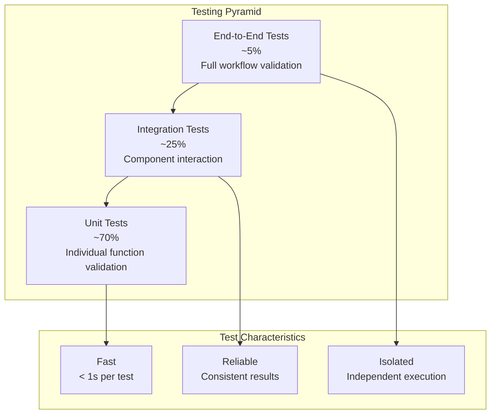
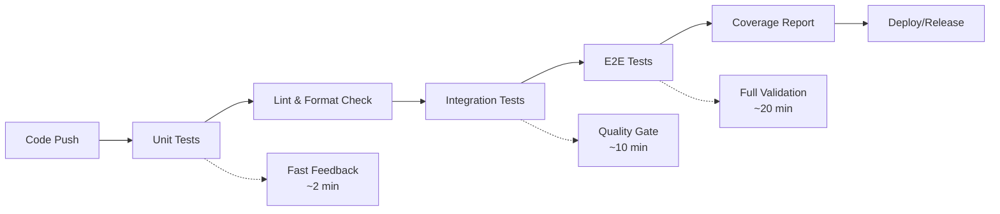

# Testing Overview

OpenFrame CLI follows a comprehensive testing strategy that ensures reliability, maintainability, and confidence in deployments. This guide covers our testing philosophy, structure, and practices.

## Testing Philosophy

### Testing Pyramid

OpenFrame CLI follows the testing pyramid approach with emphasis on fast, reliable tests:



### Core Testing Principles

| Principle | Implementation | Benefit |
|-----------|----------------|---------|
| **Fast Feedback** | Unit tests run in < 100ms each | Rapid development cycles |
| **Test Independence** | Each test can run in isolation | Parallel execution, reliable CI |
| **Real Dependencies** | Integration tests use actual K3d/Docker | Catch real-world issues |
| **Comprehensive Coverage** | Aim for >80% code coverage | Confidence in refactoring |

## Test Structure and Organization

### Directory Structure

```
openframe-cli/
├── cmd/                           # CLI commands
│   ├── bootstrap/
│   │   ├── bootstrap.go           # Implementation
│   │   └── bootstrap_test.go      # CLI integration tests
│   ├── cluster/
│   │   ├── create.go
│   │   ├── create_test.go         # Command tests
│   │   ├── delete.go
│   │   └── delete_test.go
│   └── ...
├── internal/                      # Internal packages
│   ├── bootstrap/
│   │   ├── service.go
│   │   ├── service_test.go        # Unit tests
│   │   └── integration_test.go    # Integration tests
│   ├── cluster/
│   │   ├── services/
│   │   │   ├── cluster.go
│   │   │   ├── cluster_test.go    # Service unit tests
│   │   │   └── cluster_integration_test.go
│   │   └── utils/
│   │       ├── utils.go
│   │       └── utils_test.go      # Utility function tests
│   └── shared/
│       ├── errors/
│       │   ├── errors.go
│       │   └── errors_test.go
│       └── ui/
│           ├── ui.go
│           └── ui_test.go
├── tests/                         # Integration and E2E tests
│   ├── integration/
│   │   ├── cluster_test.go        # Cross-component tests
│   │   ├── bootstrap_test.go
│   │   └── helpers/
│   │       └── test_helpers.go
│   └── e2e/
│       ├── full_workflow_test.go  # End-to-end scenarios
│       └── performance_test.go    # Performance benchmarks
└── testdata/                      # Test fixtures and data
    ├── configs/
    ├── charts/
    └── manifests/
```

### Test Types and Naming Conventions

| Test Type | File Pattern | Purpose |
|-----------|--------------|---------|
| **Unit Tests** | `*_test.go` | Test individual functions/methods |
| **Integration Tests** | `*_integration_test.go` | Test component interactions |
| **E2E Tests** | `tests/e2e/*_test.go` | Test complete workflows |
| **Benchmark Tests** | `*_bench_test.go` | Performance testing |

## Running Tests

### Quick Test Commands

```bash
# Run all tests
make test

# Run only unit tests (fast)
go test -short ./...

# Run tests with coverage
make test-coverage

# Run specific package tests
go test ./cmd/cluster/...
go test ./internal/bootstrap/...

# Run integration tests (requires Docker)
make test-integration

# Run E2E tests (requires Docker + K3d)
make test-e2e
```

### Detailed Test Execution

#### Unit Tests

```bash
# Run unit tests with verbose output
go test -v -short ./...

# Run specific test function
go test -run TestCreateCluster ./cmd/cluster/

# Run tests with race detection
go test -race ./...

# Generate test coverage report
go test -coverprofile=coverage.out ./...
go tool cover -html=coverage.out -o coverage.html
open coverage.html
```

#### Integration Tests

```bash
# Run integration tests (requires external dependencies)
go test -tags=integration ./tests/integration/...

# Run integration tests for specific component
go test -tags=integration ./internal/cluster/ -run Integration

# Run with Docker environment setup
docker run --rm -v /var/run/docker.sock:/var/run/docker.sock \
  -v $(pwd):/workspace -w /workspace \
  golang:1.19 go test -tags=integration ./tests/integration/...
```

#### End-to-End Tests

```bash
# Run complete E2E test suite
make test-e2e

# Run specific E2E scenario
go test -tags=e2e ./tests/e2e/ -run TestBootstrapWorkflow

# Run E2E tests with cleanup
CLEANUP_CLUSTERS=true go test -tags=e2e ./tests/e2e/...
```

### Test Configuration

#### Build Tags for Test Types

```go
// Unit tests (default)
package cluster_test

// Integration tests  
//go:build integration
package cluster_test

// E2E tests
//go:build e2e
package e2e_test

// Benchmark tests
//go:build bench
package cluster_test
```

#### Environment Variables for Testing

```bash
# Test configuration
export OPENFRAME_TEST_MODE=true           # Enable test mode
export OPENFRAME_TEST_LOG_LEVEL=debug     # Verbose test logging
export OPENFRAME_TEST_TIMEOUT=300s        # Test timeout
export CLEANUP_CLUSTERS=true              # Auto-cleanup test clusters

# Integration test dependencies
export TEST_DOCKER_HOST=unix:///var/run/docker.sock
export TEST_KUBECONFIG=/tmp/test-kubeconfig
export TEST_K3D_REGISTRY=localhost:5000

# E2E test configuration
export E2E_CLUSTER_PREFIX=test-e2e-        # Cluster naming prefix
export E2E_PARALLEL_TESTS=4                # Parallel test limit
```

## Writing New Tests

### Unit Test Example

```go
package services_test

import (
    "context"
    "testing"
    "github.com/stretchr/testify/assert"
    "github.com/stretchr/testify/mock"
    "github.com/flamingo-stack/openframe-cli/internal/cluster/services"
    "github.com/flamingo-stack/openframe-cli/internal/cluster/mocks"
)

func TestCreateCluster(t *testing.T) {
    // Arrange
    mockK3d := &mocks.K3dClient{}
    service := services.NewClusterService(mockK3d)
    
    ctx := context.Background()
    clusterName := "test-cluster"
    
    // Set up mock expectations
    mockK3d.On("CreateCluster", clusterName, mock.AnythingOfType("*config.ClusterConfig")).
        Return(nil)
    
    // Act
    err := service.CreateCluster(ctx, clusterName, &services.ClusterConfig{
        Nodes: 1,
        Port:  "8080:80",
    })
    
    // Assert
    assert.NoError(t, err)
    mockK3d.AssertExpectations(t)
}

func TestCreateCluster_Error(t *testing.T) {
    // Arrange
    mockK3d := &mocks.K3dClient{}
    service := services.NewClusterService(mockK3d)
    
    expectedError := errors.New("k3d create failed")
    mockK3d.On("CreateCluster", mock.Anything, mock.Anything).
        Return(expectedError)
    
    // Act
    err := service.CreateCluster(context.Background(), "test-cluster", &services.ClusterConfig{})
    
    // Assert
    assert.Error(t, err)
    assert.Contains(t, err.Error(), "k3d create failed")
}
```

### Integration Test Example

```go
//go:build integration

package integration_test

import (
    "context"
    "testing"
    "time"
    "github.com/stretchr/testify/require"
    "github.com/flamingo-stack/openframe-cli/internal/cluster/services"
)

func TestClusterIntegration(t *testing.T) {
    if testing.Short() {
        t.Skip("Skipping integration test in short mode")
    }
    
    // Setup
    clusterName := fmt.Sprintf("test-integration-%d", time.Now().Unix())
    service := services.NewClusterService(services.NewK3dClient())
    
    ctx, cancel := context.WithTimeout(context.Background(), 5*time.Minute)
    defer cancel()
    
    // Cleanup
    defer func() {
        _ = service.DeleteCluster(ctx, clusterName)
    }()
    
    t.Run("Create cluster", func(t *testing.T) {
        err := service.CreateCluster(ctx, clusterName, &services.ClusterConfig{
            Nodes: 1,
            Port:  "8080:80",
        })
        require.NoError(t, err)
    })
    
    t.Run("Cluster is running", func(t *testing.T) {
        status, err := service.GetClusterStatus(ctx, clusterName)
        require.NoError(t, err)
        require.Equal(t, "running", status.State)
    })
    
    t.Run("Delete cluster", func(t *testing.T) {
        err := service.DeleteCluster(ctx, clusterName)
        require.NoError(t, err)
    })
}
```

### E2E Test Example

```go
//go:build e2e

package e2e_test

import (
    "os/exec"
    "testing"
    "time"
    "github.com/stretchr/testify/require"
)

func TestBootstrapWorkflow(t *testing.T) {
    // Setup
    clusterName := fmt.Sprintf("e2e-bootstrap-%d", time.Now().Unix())
    
    // Cleanup
    defer func() {
        exec.Command("./bin/openframe", "cluster", "delete", clusterName).Run()
    }()
    
    t.Run("Bootstrap creates cluster and installs charts", func(t *testing.T) {
        // Execute bootstrap command
        cmd := exec.Command("./bin/openframe", "bootstrap", clusterName, 
            "--deployment-mode=oss-tenant", "--non-interactive")
        
        output, err := cmd.CombinedOutput()
        require.NoError(t, err, "Bootstrap command failed: %s", string(output))
        
        // Verify cluster exists
        cmd = exec.Command("./bin/openframe", "cluster", "status", clusterName)
        output, err = cmd.CombinedOutput()
        require.NoError(t, err)
        require.Contains(t, string(output), "Running")
        
        // Verify ArgoCD is installed
        cmd = exec.Command("kubectl", "get", "pods", "-n", "argocd")
        output, err = cmd.CombinedOutput()
        require.NoError(t, err)
        require.Contains(t, string(output), "argocd-server")
    })
}
```

## Test Utilities and Helpers

### Test Helper Functions

Create reusable test utilities in `tests/helpers/`:

```go
package helpers

import (
    "context"
    "fmt"
    "os/exec"
    "testing"
    "time"
)

// TestCluster manages a test K3d cluster lifecycle
type TestCluster struct {
    Name string
    t    *testing.T
}

// NewTestCluster creates a new test cluster helper
func NewTestCluster(t *testing.T) *TestCluster {
    return &TestCluster{
        Name: fmt.Sprintf("test-%d", time.Now().Unix()),
        t:    t,
    }
}

// Create creates the test cluster
func (tc *TestCluster) Create() {
    cmd := exec.Command("k3d", "cluster", "create", tc.Name)
    err := cmd.Run()
    if err != nil {
        tc.t.Fatalf("Failed to create test cluster: %v", err)
    }
    
    // Wait for cluster to be ready
    tc.WaitForReady()
}

// Delete removes the test cluster
func (tc *TestCluster) Delete() {
    exec.Command("k3d", "cluster", "delete", tc.Name).Run()
}

// WaitForReady waits for the cluster to be ready
func (tc *TestCluster) WaitForReady() {
    ctx, cancel := context.WithTimeout(context.Background(), 2*time.Minute)
    defer cancel()
    
    for {
        select {
        case <-ctx.Done():
            tc.t.Fatal("Timeout waiting for cluster to be ready")
        default:
            cmd := exec.Command("kubectl", "cluster-info", "--context", fmt.Sprintf("k3d-%s", tc.Name))
            if cmd.Run() == nil {
                return
            }
            time.Sleep(5 * time.Second)
        }
    }
}
```

### Mock Generation

Use `go generate` to create mocks:

```go
//go:generate mockery --name=K3dClient --output=mocks --outpkg=mocks

type K3dClient interface {
    CreateCluster(name string, config *ClusterConfig) error
    DeleteCluster(name string) error
    ListClusters() ([]ClusterInfo, error)
    GetClusterStatus(name string) (*ClusterStatus, error)
}
```

## Coverage Requirements

### Coverage Targets

| Component | Target Coverage | Rationale |
|-----------|----------------|-----------|
| **Service Layer** | >90% | Critical business logic |
| **CLI Commands** | >80% | User-facing functionality |
| **Utilities** | >95% | Pure functions, easy to test |
| **Models** | >70% | Data structures with validation |
| **Overall Project** | >80% | Maintain quality standards |

### Coverage Reporting

```bash
# Generate coverage report
go test -coverprofile=coverage.out ./...

# View coverage by package
go tool cover -func=coverage.out

# Generate HTML report
go tool cover -html=coverage.out -o coverage.html

# Check coverage thresholds
go test -coverprofile=coverage.out ./...
go tool cover -func=coverage.out | grep "total:" | awk '{print $3}' | sed 's/%//' | awk '{if ($1 < 80) exit 1}'
```

### Coverage in CI/CD

```yaml
# Example GitHub Actions workflow
- name: Run tests with coverage
  run: |
    go test -race -coverprofile=coverage.out ./...
    go tool cover -func=coverage.out

- name: Upload coverage to Codecov
  uses: codecov/codecov-action@v3
  with:
    file: ./coverage.out
```

## Performance Testing

### Benchmark Tests

```go
func BenchmarkCreateCluster(b *testing.B) {
    service := services.NewClusterService(services.NewK3dClient())
    
    b.ResetTimer()
    for i := 0; i < b.N; i++ {
        clusterName := fmt.Sprintf("bench-%d", i)
        _ = service.CreateCluster(context.Background(), clusterName, &services.ClusterConfig{})
        _ = service.DeleteCluster(context.Background(), clusterName)
    }
}

func BenchmarkCLIStartup(b *testing.B) {
    b.ResetTimer()
    for i := 0; i < b.N; i++ {
        cmd := exec.Command("./bin/openframe", "--help")
        _ = cmd.Run()
    }
}
```

### Performance Targets

| Operation | Target Time | Measurement |
|-----------|-------------|-------------|
| **CLI Startup** | <100ms | Time to show help |
| **Cluster Create** | <60s | K3d cluster ready |
| **Chart Install** | <120s | ArgoCD deployed and synced |
| **Bootstrap Complete** | <180s | End-to-end setup |

## Test Data Management

### Test Fixtures

Store test data in `testdata/`:

```
testdata/
├── configs/
│   ├── valid-cluster-config.yaml
│   ├── invalid-cluster-config.yaml
│   └── bootstrap-config.yaml
├── charts/
│   └── test-chart/
│       ├── Chart.yaml
│       └── values.yaml
└── manifests/
    ├── test-deployment.yaml
    └── test-service.yaml
```

### Dynamic Test Data

```go
func generateTestConfig() *ClusterConfig {
    return &ClusterConfig{
        Name:  fmt.Sprintf("test-cluster-%d", time.Now().Unix()),
        Nodes: 1,
        Ports: []string{"8080:80"},
    }
}
```

## Continuous Integration

### Test Pipeline Structure



### Test Parallelization

```bash
# Run tests in parallel
go test -parallel 4 ./...

# Run package tests concurrently
for pkg in $(go list ./...); do
    go test "$pkg" &
done
wait
```

## Troubleshooting Tests

### Common Test Issues

| Issue | Symptoms | Solution |
|-------|----------|----------|
| **Flaky integration tests** | Tests pass/fail inconsistently | Add proper wait conditions, increase timeouts |
| **Docker socket issues** | "Cannot connect to Docker daemon" | Check Docker service, mount socket correctly |
| **Resource leaks** | Tests slow down over time | Ensure proper cleanup in defer statements |
| **Port conflicts** | "Port already in use" errors | Use random ports or better cleanup |

### Debugging Test Failures

```bash
# Run specific failing test with verbose output
go test -v -run TestFailingFunction ./cmd/cluster/

# Run with race detection
go test -race ./...

# Run with detailed logs
OPENFRAME_LOG_LEVEL=debug go test -v ./...

# Check for resource leaks
go test -race -coverprofile=coverage.out ./...
go tool cover -func=coverage.out
```

---

This comprehensive testing strategy ensures OpenFrame CLI remains reliable, maintainable, and bug-free as it evolves. Well-tested code is the foundation of user confidence! 🧪