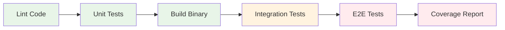

# Testing Overview

OpenFrame CLI follows a comprehensive testing strategy that ensures reliability, maintainability, and confidence in changes. This guide covers our testing philosophy, test organization, how to run tests, and how to write effective tests for new features.

## 🎯 Testing Philosophy

Our testing approach is built on these core principles:

### **Test Pyramid Structure**
We follow the classic test pyramid with emphasis on fast, reliable tests:

```mermaid
pyramid
    title Test Pyramid
    top Fast Feedback
    level1 E2E Tests
    level2 Integration Tests  
    level3 Unit Tests
    bottom High Coverage
```

| Test Level | Purpose | Speed | Coverage | Tools |
|------------|---------|-------|----------|-------|
| **Unit Tests** | Test individual functions/methods | Very Fast (ms) | ~70% | Go testing, testify |
| **Integration Tests** | Test component interactions | Fast (seconds) | ~25% | Docker, K3d |
| **E2E Tests** | Test complete user workflows | Slow (minutes) | ~5% | Real clusters |

### **Quality Gates**
- ✅ **90%+ code coverage** for unit tests
- ✅ **All tests must pass** before merge
- ✅ **No flaky tests** - tests must be deterministic
- ✅ **Fast feedback** - unit tests complete in <30s

## 📁 Test Organization

### Directory Structure

```
openframe-cli/
├── internal/                    # Source code
│   ├── bootstrap/
│   │   ├── services/           
│   │   │   ├── service.go
│   │   │   └── service_test.go  # Unit tests
│   │   └── integration_test.go  # Integration tests
│   ├── cluster/
│   │   ├── services/
│   │   │   ├── cluster_test.go
│   │   │   └── k3d_test.go
│   │   └── models/
│   │       └── config_test.go
│   └── shared/
│       ├── ui/
│       │   └── renderer_test.go
│       └── testutils/           # Shared test utilities
│           ├── mocks/           # Generated mocks
│           ├── fixtures/        # Test data
│           └── helpers/         # Test helpers
├── test/                        # Integration & E2E tests
│   ├── integration/
│   │   ├── cluster_test.go
│   │   ├── bootstrap_test.go
│   │   └── chart_test.go
│   ├── e2e/
│   │   ├── scenarios/
│   │   └── full_workflow_test.go
│   └── testdata/                # Test fixtures and data
└── scripts/
    ├── test.sh                  # Test runner scripts
    └── coverage.sh              # Coverage reporting
```

### Test Categories

#### 🔬 **Unit Tests**
Located alongside source code with `_test.go` suffix:

```go
// internal/cluster/services/service_test.go
func TestClusterService_CreateCluster(t *testing.T) {
    tests := []struct {
        name    string
        config  ClusterConfig
        want    error
        wantErr bool
    }{
        {
            name: "valid cluster creation",
            config: ClusterConfig{
                Name: "test-cluster",
                Nodes: 3,
            },
            want: nil,
            wantErr: false,
        },
        // More test cases...
    }
    
    for _, tt := range tests {
        t.Run(tt.name, func(t *testing.T) {
            // Test implementation
        })
    }
}
```

#### 🔗 **Integration Tests**
Test interactions between components:

```go
// test/integration/cluster_test.go
// +build integration

func TestClusterIntegration(t *testing.T) {
    // Requires Docker and K3d
    if testing.Short() {
        t.Skip("Skipping integration test in short mode")
    }
    
    // Test real cluster creation/deletion
    clusterName := fmt.Sprintf("integration-test-%d", time.Now().Unix())
    defer cleanupCluster(clusterName)
    
    // Test implementation with real tools
}
```

#### 🎭 **End-to-End Tests**
Complete workflow validation:

```go
// test/e2e/full_workflow_test.go
func TestCompleteBootstrap(t *testing.T) {
    // Test complete user workflow
    // Bootstrap -> Verify -> Deploy App -> Cleanup
}
```

## 🚀 Running Tests

### Quick Commands

```bash
# Run all unit tests
make test

# Run all tests including integration
make test-all

# Run tests with coverage
make test-coverage

# Run specific package tests
go test ./internal/cluster/...

# Run specific test function
go test -run TestCreateCluster ./internal/cluster/services/

# Run tests in verbose mode
go test -v ./...

# Run tests with race detection
go test -race ./...
```

### Detailed Test Commands

#### Unit Tests Only
```bash
# Fast unit tests (exclude integration)
go test -short ./...

# With coverage report
go test -short -coverprofile=coverage.out ./...
go tool cover -html=coverage.out -o coverage.html

# Parallel execution (faster)
go test -parallel 4 ./...

# With timeout
go test -timeout=5m ./...
```

#### Integration Tests
```bash
# Run integration tests (requires Docker)
go test -tags=integration ./test/integration/

# With verbose output
go test -tags=integration -v ./test/integration/

# Specific integration test
go test -tags=integration -run TestClusterIntegration ./test/integration/
```

#### End-to-End Tests  
```bash
# Full E2E workflow (slow, requires clean environment)
go test -tags=e2e ./test/e2e/

# With extended timeout
go test -tags=e2e -timeout=30m ./test/e2e/
```

### Continuous Integration

Our CI pipeline runs tests in this order:



```yaml
# .github/workflows/test.yml example
- name: Run unit tests
  run: go test -short -race -coverprofile=coverage.out ./...

- name: Run integration tests  
  run: go test -tags=integration -v ./test/integration/
  
- name: Run E2E tests
  run: go test -tags=e2e -timeout=30m ./test/e2e/
```

## ✍️ Writing Tests

### Unit Test Best Practices

#### **Table-Driven Tests**
Use table-driven tests for multiple scenarios:

```go
func TestValidateClusterConfig(t *testing.T) {
    tests := []struct {
        name    string
        config  ClusterConfig
        wantErr bool
        errMsg  string
    }{
        {
            name: "valid config",
            config: ClusterConfig{
                Name:  "valid-cluster",
                Nodes: 3,
                Memory: "4gb",
            },
            wantErr: false,
        },
        {
            name: "empty cluster name",
            config: ClusterConfig{
                Name:  "",
                Nodes: 3,
            },
            wantErr: true,
            errMsg:  "cluster name cannot be empty",
        },
        {
            name: "invalid node count",
            config: ClusterConfig{
                Name:  "test-cluster", 
                Nodes: 0,
            },
            wantErr: true,
            errMsg:  "nodes must be greater than 0",
        },
    }
    
    for _, tt := range tests {
        t.Run(tt.name, func(t *testing.T) {
            err := ValidateClusterConfig(tt.config)
            
            if tt.wantErr {
                assert.Error(t, err)
                assert.Contains(t, err.Error(), tt.errMsg)
            } else {
                assert.NoError(t, err)
            }
        })
    }
}
```

#### **Mocking Dependencies**
Use interfaces and mocks for external dependencies:

```go
// Define interface
type K3dClient interface {
    CreateCluster(name string, config K3dConfig) error
    DeleteCluster(name string) error
}

// Mock implementation
type MockK3dClient struct {
    mock.Mock
}

func (m *MockK3dClient) CreateCluster(name string, config K3dConfig) error {
    args := m.Called(name, config)
    return args.Error(0)
}

// Test with mock
func TestClusterService_CreateCluster_Success(t *testing.T) {
    mockK3d := new(MockK3dClient)
    mockK3d.On("CreateCluster", "test-cluster", mock.Any).Return(nil)
    
    service := NewClusterService(mockK3d)
    err := service.CreateCluster(ClusterConfig{Name: "test-cluster"})
    
    assert.NoError(t, err)
    mockK3d.AssertExpectations(t)
}
```

#### **Test Helpers**
Create reusable test utilities:

```go
// internal/shared/testutils/helpers/cluster.go
func CreateTestClusterConfig(name string) ClusterConfig {
    return ClusterConfig{
        Name:   name,
        Nodes:  3,
        Memory: "4gb",
        Ports:  []string{"8080:80"},
    }
}

func AssertClusterExists(t *testing.T, name string) {
    cmd := exec.Command("k3d", "cluster", "list", name)
    output, err := cmd.Output()
    assert.NoError(t, err)
    assert.Contains(t, string(output), name)
}
```

### Integration Test Patterns

#### **Setup and Teardown**
```go
func TestClusterLifecycle(t *testing.T) {
    if testing.Short() {
        t.Skip("Skipping integration test")
    }
    
    clusterName := fmt.Sprintf("integration-test-%d", time.Now().Unix())
    
    // Setup
    defer func() {
        // Cleanup - always runs
        cleanupCluster(t, clusterName)
    }()
    
    // Test cluster creation
    service := NewClusterService(realK3dClient())
    err := service.CreateCluster(ClusterConfig{Name: clusterName})
    require.NoError(t, err)
    
    // Verify cluster exists
    clusters, err := service.ListClusters()
    require.NoError(t, err)
    
    found := false
    for _, cluster := range clusters {
        if cluster.Name == clusterName {
            found = true
            break
        }
    }
    assert.True(t, found, "Cluster should exist after creation")
    
    // Test cluster deletion
    err = service.DeleteCluster(clusterName)
    assert.NoError(t, err)
}
```

#### **Docker Test Containers**
For services that need databases or external dependencies:

```go
func TestWithRedis(t *testing.T) {
    // Start Redis container
    req := testcontainers.ContainerRequest{
        Image:        "redis:latest",
        ExposedPorts: []string{"6379/tcp"},
    }
    
    redisContainer, err := testcontainers.GenericContainer(ctx, 
        testcontainers.GenericContainerRequest{
            ContainerRequest: req,
            Started:         true,
        })
    require.NoError(t, err)
    defer redisContainer.Terminate(ctx)
    
    // Get container connection details
    host, err := redisContainer.Host(ctx)
    require.NoError(t, err)
    port, err := redisContainer.MappedPort(ctx, "6379")
    require.NoError(t, err)
    
    // Test with real Redis
    // ...
}
```

### Test Data Management

#### **Fixtures**
Store test data in dedicated files:

```go
// test/testdata/cluster-configs.yaml
validConfigs:
  - name: "small-cluster"
    nodes: 1
    memory: "2gb"
  - name: "medium-cluster" 
    nodes: 3
    memory: "4gb"

invalidConfigs:
  - name: ""
    nodes: 3
    error: "name cannot be empty"
```

Load fixtures in tests:
```go
func LoadClusterFixtures(t *testing.T) []ClusterConfig {
    data, err := os.ReadFile("testdata/cluster-configs.yaml")
    require.NoError(t, err)
    
    var fixtures struct {
        ValidConfigs []ClusterConfig `yaml:"validConfigs"`
    }
    
    err = yaml.Unmarshal(data, &fixtures)
    require.NoError(t, err)
    
    return fixtures.ValidConfigs
}
```

## 📊 Coverage Requirements

### Coverage Targets

| Component | Target Coverage | Current |
|-----------|-----------------|---------|
| **Core Services** | 90%+ | 85% |
| **CLI Commands** | 80%+ | 75% |  
| **Utilities** | 95%+ | 92% |
| **Models** | 85%+ | 88% |
| **Overall** | 85%+ | 82% |

### Coverage Commands

```bash
# Generate coverage report
go test -coverprofile=coverage.out ./...

# View coverage by package
go tool cover -func=coverage.out

# Generate HTML coverage report
go tool cover -html=coverage.out -o coverage.html

# Check coverage meets threshold
go tool cover -func=coverage.out | grep total | awk '{print $3}' | sed 's/%//' | awk '{if($1<85) exit 1}'
```

### Coverage Analysis

```bash
# Find untested functions
go test -coverprofile=coverage.out ./...
go tool cover -func=coverage.out | grep ":0.0%" 

# Package-level coverage breakdown
go test -coverprofile=coverage.out ./...
go tool cover -func=coverage.out | grep -E "^(github.com/flamingo-stack/openframe-cli/internal/[^/]+).*total:"
```

## 🐛 Test Debugging

### Debugging Failing Tests

```bash
# Run single test with verbose output
go test -v -run TestSpecificFunction ./internal/cluster/

# Add debug prints to tests
func TestDebugExample(t *testing.T) {
    t.Logf("Debug: variable value = %+v", variable)
    // Test logic
}

# Run tests with delve debugger
dlv test ./internal/cluster/ -- -test.run TestSpecificFunction

# Show test output even on success
go test -v ./... | tee test-output.log
```

### Common Test Issues

#### **Flaky Tests**
```go
// Bad: Time-dependent test
func TestTimeout(t *testing.T) {
    start := time.Now()
    doSomething()
    elapsed := time.Since(start)
    assert.True(t, elapsed < 100*time.Millisecond) // Flaky!
}

// Good: Deterministic test
func TestTimeoutWithMock(t *testing.T) {
    mockTimer := &MockTimer{}
    mockTimer.On("Sleep", 50*time.Millisecond).Return()
    
    doSomethingWithTimer(mockTimer)
    mockTimer.AssertExpectations(t)
}
```

#### **Resource Cleanup**
```go
func TestWithCleanup(t *testing.T) {
    // Setup
    resource := createResource()
    
    // Ensure cleanup happens even if test fails
    t.Cleanup(func() {
        cleanupResource(resource)
    })
    
    // Test logic that might fail
    // ...
}
```

#### **Parallel Test Safety**
```go
func TestParallelSafe(t *testing.T) {
    t.Parallel() // Safe to run in parallel
    
    // Use unique test data to avoid conflicts
    testID := uuid.New().String()
    clusterName := fmt.Sprintf("test-cluster-%s", testID)
    
    // Test logic
}
```

## 🤖 Test Automation

### Make Targets

```makefile
# Makefile test targets
.PHONY: test test-unit test-integration test-e2e test-coverage

test: test-unit

test-unit:
	go test -short -race ./...

test-integration:
	go test -tags=integration -v ./test/integration/

test-e2e:
	go test -tags=e2e -timeout=30m ./test/e2e/

test-coverage:
	go test -short -race -coverprofile=coverage.out ./...
	go tool cover -html=coverage.out -o coverage.html
	go tool cover -func=coverage.out

test-all: test-unit test-integration

test-watch:
	find . -name "*.go" | entr -r make test-unit
```

### GitHub Actions Integration

```yaml
name: Test Suite
on: [push, pull_request]

jobs:
  test:
    runs-on: ubuntu-latest
    steps:
      - uses: actions/checkout@v3
      - uses: actions/setup-go@v3
        with:
          go-version: '1.21'
      
      - name: Run unit tests
        run: make test-unit
        
      - name: Run integration tests  
        run: make test-integration
        
      - name: Upload coverage
        uses: codecov/codecov-action@v3
        with:
          file: ./coverage.out
```

## 📋 Testing Checklist

When adding new features, ensure:

### **New Code**
- [ ] Unit tests written for all new functions
- [ ] Integration tests for component interactions  
- [ ] Error cases covered
- [ ] Edge cases identified and tested
- [ ] Mock dependencies properly

### **Existing Code**
- [ ] All existing tests still pass
- [ ] No reduction in coverage percentage
- [ ] No new flaky tests introduced
- [ ] Performance impact measured

### **Documentation**
- [ ] Test scenarios documented
- [ ] Complex test setup explained
- [ ] Test data requirements noted

---

> **🎯 Testing Goals**: Our comprehensive testing strategy ensures OpenFrame CLI is reliable, maintainable, and gives contributors confidence when making changes. Focus on writing clear, deterministic tests that provide good coverage and fast feedback. When in doubt, err on the side of more testing rather than less.