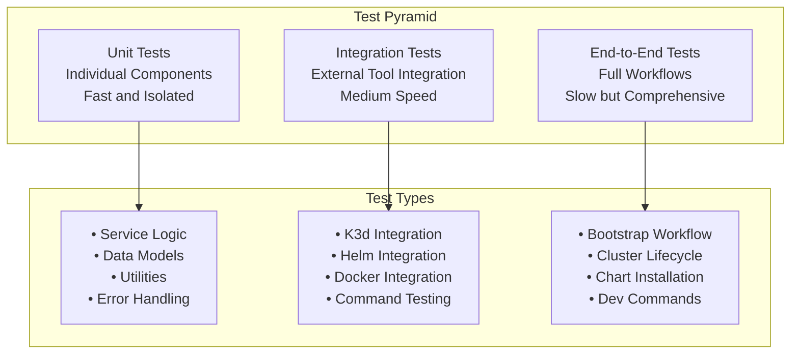

# Testing Overview

OpenFrame CLI uses a comprehensive testing strategy that ensures code quality, reliability, and maintainability. This guide covers the testing structure, how to run tests, write new tests, and maintain test coverage across the project.

## Testing Philosophy

Our testing approach follows the **Test Pyramid** principle with emphasis on:

- **Fast Feedback**: Unit tests provide immediate feedback during development
- **Confidence**: Integration tests ensure external tool compatibility  
- **Real-world Validation**: End-to-end tests validate complete user workflows
- **Maintainability**: Tests serve as living documentation of expected behavior

## Test Organization

### Test Structure

```
openframe-cli/
├── internal/                    # Source code with co-located tests
│   ├── bootstrap/
│   │   ├── service.go
│   │   └── service_test.go     # Unit tests
│   ├── cluster/
│   │   ├── service.go
│   │   ├── service_test.go     # Unit tests
│   │   └── mocks/              # Generated mocks
│   ├── chart/
│   │   ├── service.go
│   │   └── service_test.go     # Unit tests
│   └── shared/
│       ├── ui/
│       │   ├── ui.go
│       │   └── ui_test.go      # Unit tests
│       └── models/
│           ├── models.go
│           └── models_test.go  # Unit tests
├── cmd/                         # Command tests
│   ├── bootstrap/
│   │   └── bootstrap_test.go   # Command integration tests
│   └── cluster/
│       └── cluster_test.go     # Command integration tests
├── tests/                       # Dedicated test directory
│   ├── integration/            # Integration tests with real tools
│   │   ├── k3d_test.go
│   │   ├── helm_test.go
│   │   └── bootstrap_test.go
│   ├── e2e/                    # End-to-end tests
│   │   ├── full_workflow_test.go
│   │   └── ci_test.go
│   ├── fixtures/               # Test data and configurations
│   │   ├── cluster-configs/
│   │   └── helm-values/
│   └── testutils/              # Test utilities and helpers
│       ├── cluster_helpers.go
│       └── mock_helpers.go
└── scripts/
    ├── test-unit.sh            # Unit test runner
    ├── test-integration.sh     # Integration test runner
    └── test-e2e.sh             # E2E test runner
```

### Test Categories



## Running Tests

### Unit Tests

Unit tests are fast and run without external dependencies:

```bash
# Run all unit tests
go test ./...

# Run unit tests with verbose output
go test -v ./...

# Run unit tests with race detection
go test -race ./...

# Run specific package tests
go test ./internal/cluster/...
go test ./internal/bootstrap/...

# Run specific test function
go test -run TestBootstrapService_Execute ./internal/bootstrap/...

# Run tests with coverage
go test -cover ./...
go test -coverprofile=coverage.out ./...
```

### Integration Tests

Integration tests require external tools (Docker, K3d, Helm) to be installed:

```bash
# Run integration tests
go test -tags=integration ./tests/integration/...

# Run integration tests with verbose output
go test -tags=integration -v ./tests/integration/...

# Run specific integration test
go test -tags=integration -run TestK3dIntegration ./tests/integration/...

# Run integration tests with timeout
go test -tags=integration -timeout 10m ./tests/integration/...
```

### End-to-End Tests

E2E tests run complete workflows and may take several minutes:

```bash
# Run end-to-end tests
go test -tags=e2e ./tests/e2e/...

# Run E2E tests with extended timeout
go test -tags=e2e -timeout 20m ./tests/e2e/...

# Run specific E2E test
go test -tags=e2e -run TestFullBootstrapWorkflow ./tests/e2e/...

# Run E2E tests in CI mode (non-interactive)
CI=true go test -tags=e2e ./tests/e2e/...
```

### Using Test Scripts

Use the provided scripts for convenient test execution:

```bash
# Run all unit tests
./scripts/test-unit.sh

# Run integration tests with cleanup
./scripts/test-integration.sh

# Run E2E tests with full environment setup
./scripts/test-e2e.sh

# Run all tests (unit + integration + e2e)
./scripts/test-all.sh
```

## Writing Unit Tests

### Basic Unit Test Structure

```go
// internal/cluster/service_test.go
package cluster

import (
    "testing"
    "github.com/stretchr/testify/assert"
    "github.com/stretchr/testify/mock"
    "github.com/flamingo-stack/openframe-cli/internal/cluster/mocks"
)

func TestService_Create(t *testing.T) {
    // Arrange
    mockProvider := &mocks.K3dProvider{}
    service := NewService(mockProvider)
    clusterName := "test-cluster"
    
    mockProvider.On("CreateCluster", clusterName, mock.AnythingOfType("ClusterConfig")).
        Return(nil)
    
    // Act
    err := service.Create(clusterName)
    
    // Assert
    assert.NoError(t, err)
    mockProvider.AssertExpectations(t)
}

func TestService_Create_InvalidName(t *testing.T) {
    // Arrange
    mockProvider := &mocks.K3dProvider{}
    service := NewService(mockProvider)
    invalidName := ""
    
    // Act
    err := service.Create(invalidName)
    
    // Assert
    assert.Error(t, err)
    assert.Contains(t, err.Error(), "cluster name cannot be empty")
}
```

### Table-Driven Tests

Use table-driven tests for testing multiple scenarios:

```go
func TestValidateClusterName(t *testing.T) {
    tests := []struct {
        name        string
        clusterName string
        wantErr     bool
        errContains string
    }{
        {
            name:        "valid name",
            clusterName: "my-cluster",
            wantErr:     false,
        },
        {
            name:        "empty name",
            clusterName: "",
            wantErr:     true,
            errContains: "cluster name cannot be empty",
        },
        {
            name:        "invalid characters",
            clusterName: "cluster_with_underscores",
            wantErr:     true,
            errContains: "invalid character",
        },
        {
            name:        "too long",
            clusterName: strings.Repeat("a", 64),
            wantErr:     true,
            errContains: "name too long",
        },
    }

    for _, tt := range tests {
        t.Run(tt.name, func(t *testing.T) {
            err := ValidateClusterName(tt.clusterName)
            
            if tt.wantErr {
                assert.Error(t, err)
                assert.Contains(t, err.Error(), tt.errContains)
            } else {
                assert.NoError(t, err)
            }
        })
    }
}
```

### Testing with Mocks

Generate and use mocks for external dependencies:

```bash
# Generate mocks using mockgen
mockgen -source=internal/cluster/interfaces.go -destination=internal/cluster/mocks/mocks.go
```

```go
// internal/cluster/interfaces.go
type K3dProvider interface {
    CreateCluster(name string, config ClusterConfig) error
    DeleteCluster(name string) error
    ListClusters() ([]Cluster, error)
}

// internal/cluster/service_test.go
func TestService_Delete_Success(t *testing.T) {
    // Arrange
    mockProvider := &mocks.K3dProvider{}
    service := NewService(mockProvider)
    clusterName := "test-cluster"
    
    mockProvider.On("DeleteCluster", clusterName).Return(nil)
    
    // Act
    err := service.Delete(clusterName)
    
    // Assert
    assert.NoError(t, err)
    mockProvider.AssertCalled(t, "DeleteCluster", clusterName)
}

func TestService_Delete_ClusterNotFound(t *testing.T) {
    // Arrange
    mockProvider := &mocks.K3dProvider{}
    service := NewService(mockProvider)
    clusterName := "nonexistent"
    
    mockProvider.On("DeleteCluster", clusterName).
        Return(errors.New("cluster not found"))
    
    // Act
    err := service.Delete(clusterName)
    
    // Assert
    assert.Error(t, err)
    assert.Contains(t, err.Error(), "cluster not found")
}
```

## Writing Integration Tests

### K3d Integration Test Example

```go
// tests/integration/k3d_test.go
//go:build integration
// +build integration

package integration

import (
    "testing"
    "time"
    "github.com/stretchr/testify/assert"
    "github.com/stretchr/testify/require"
    "github.com/flamingo-stack/openframe-cli/internal/cluster"
)

func TestK3dIntegration_CreateAndDelete(t *testing.T) {
    if testing.Short() {
        t.Skip("skipping integration test in short mode")
    }
    
    // Setup
    service := cluster.NewService()
    clusterName := "test-integration-" + time.Now().Format("20060102-150405")
    
    // Cleanup function
    defer func() {
        _ = service.Delete(clusterName)
    }()
    
    // Test cluster creation
    err := service.Create(clusterName)
    require.NoError(t, err)
    
    // Verify cluster exists
    clusters, err := service.List()
    require.NoError(t, err)
    
    found := false
    for _, cluster := range clusters {
        if cluster.Name == clusterName {
            found = true
            break
        }
    }
    assert.True(t, found, "cluster should exist after creation")
    
    // Test cluster status
    status, err := service.GetStatus(clusterName)
    require.NoError(t, err)
    assert.Equal(t, "running", status.State)
    
    // Test cluster deletion
    err = service.Delete(clusterName)
    require.NoError(t, err)
    
    // Verify cluster is gone
    clusters, err = service.List()
    require.NoError(t, err)
    
    for _, cluster := range clusters {
        assert.NotEqual(t, clusterName, cluster.Name, "cluster should not exist after deletion")
    }
}
```

### Helm Integration Test Example

```go
// tests/integration/helm_test.go
//go:build integration
// +build integration

package integration

import (
    "testing"
    "github.com/stretchr/testify/assert"
    "github.com/stretchr/testify/require"
    "github.com/flamingo-stack/openframe-cli/internal/chart"
    "github.com/flamingo-stack/openframe-cli/tests/testutils"
)

func TestHelmIntegration_InstallArgoCD(t *testing.T) {
    if testing.Short() {
        t.Skip("skipping integration test in short mode")
    }
    
    // Setup test cluster
    clusterName := testutils.CreateTestCluster(t)
    defer testutils.CleanupTestCluster(t, clusterName)
    
    // Test chart installation
    chartService := chart.NewService()
    
    err := chartService.InstallArgoCD(chart.InstallRequest{
        DeploymentMode: "oss-tenant",
        ClusterName:    clusterName,
        Verbose:        true,
    })
    
    require.NoError(t, err)
    
    // Verify ArgoCD is running
    pods, err := testutils.GetPodsInNamespace(clusterName, "argocd")
    require.NoError(t, err)
    
    assert.True(t, len(pods) > 0, "ArgoCD pods should be running")
    
    for _, pod := range pods {
        assert.Equal(t, "Running", pod.Status, "Pod %s should be running", pod.Name)
    }
}
```

## Writing End-to-End Tests

### Full Bootstrap Workflow Test

```go
// tests/e2e/bootstrap_test.go
//go:build e2e
// +build e2e

package e2e

import (
    "context"
    "os/exec"
    "testing"
    "time"
    "github.com/stretchr/testify/assert"
    "github.com/stretchr/testify/require"
    "github.com/flamingo-stack/openframe-cli/tests/testutils"
)

func TestBootstrapE2E_FullWorkflow(t *testing.T) {
    if testing.Short() {
        t.Skip("skipping e2e test in short mode")
    }
    
    // Generate unique cluster name
    clusterName := testutils.GenerateClusterName("e2e-bootstrap")
    
    // Cleanup function
    defer func() {
        // Clean up the cluster
        cmd := exec.Command("./bin/openframe", "cluster", "cleanup", "--all")
        _ = cmd.Run()
    }()
    
    // Test bootstrap command
    ctx, cancel := context.WithTimeout(context.Background(), 10*time.Minute)
    defer cancel()
    
    cmd := exec.CommandContext(ctx, "./bin/openframe", 
        "bootstrap", clusterName,
        "--deployment-mode=oss-tenant",
        "--non-interactive",
        "--verbose")
    
    output, err := cmd.CombinedOutput()
    require.NoError(t, err, "bootstrap command should succeed: %s", string(output))
    
    // Verify cluster is created
    clusters, err := testutils.ListClusters()
    require.NoError(t, err)
    
    found := false
    for _, cluster := range clusters {
        if cluster == clusterName {
            found = true
            break
        }
    }
    assert.True(t, found, "cluster should exist after bootstrap")
    
    // Verify ArgoCD is installed and running
    err = testutils.WaitForArgoCD(clusterName, 5*time.Minute)
    require.NoError(t, err, "ArgoCD should be running")
    
    // Verify OpenFrame applications are synced
    apps, err := testutils.GetArgoCDApplications(clusterName)
    require.NoError(t, err)
    
    for _, app := range apps {
        assert.Equal(t, "Synced", app.SyncStatus, "Application %s should be synced", app.Name)
        assert.Equal(t, "Healthy", app.HealthStatus, "Application %s should be healthy", app.Name)
    }
    
    // Test cluster status command
    cmd = exec.Command("./bin/openframe", "cluster", "status", clusterName)
    output, err = cmd.CombinedOutput()
    require.NoError(t, err, "cluster status command should succeed")
    assert.Contains(t, string(output), "✅", "status should show success indicators")
}
```

## Test Utilities and Helpers

### Test Utilities Package

```go
// tests/testutils/cluster_helpers.go
package testutils

import (
    "fmt"
    "os/exec"
    "testing"
    "time"
    "github.com/stretchr/testify/require"
)

// CreateTestCluster creates a test cluster and returns its name
func CreateTestCluster(t *testing.T) string {
    clusterName := GenerateClusterName("test")
    
    cmd := exec.Command("k3d", "cluster", "create", clusterName)
    err := cmd.Run()
    require.NoError(t, err, "failed to create test cluster")
    
    // Wait for cluster to be ready
    err = WaitForClusterReady(clusterName, 2*time.Minute)
    require.NoError(t, err, "cluster should be ready")
    
    return clusterName
}

// CleanupTestCluster removes a test cluster
func CleanupTestCluster(t *testing.T, clusterName string) {
    cmd := exec.Command("k3d", "cluster", "delete", clusterName)
    _ = cmd.Run() // Don't fail test if cleanup fails
}

// GenerateClusterName generates a unique cluster name with timestamp
func GenerateClusterName(prefix string) string {
    return fmt.Sprintf("%s-%d", prefix, time.Now().Unix())
}

// WaitForClusterReady waits for a cluster to be ready
func WaitForClusterReady(clusterName string, timeout time.Duration) error {
    deadline := time.Now().Add(timeout)
    
    for time.Now().Before(deadline) {
        cmd := exec.Command("kubectl", "--context", "k3d-"+clusterName, 
            "get", "nodes", "--no-headers")
        
        if err := cmd.Run(); err == nil {
            return nil
        }
        
        time.Sleep(5 * time.Second)
    }
    
    return fmt.Errorf("cluster %s not ready within %v", clusterName, timeout)
}
```

### Mock Helpers

```go
// tests/testutils/mock_helpers.go
package testutils

import (
    "github.com/golang/mock/gomock"
    "github.com/flamingo-stack/openframe-cli/internal/cluster/mocks"
)

// CreateMockK3dProvider creates a configured mock K3d provider
func CreateMockK3dProvider(ctrl *gomock.Controller) *mocks.K3dProvider {
    mock := mocks.NewMockK3dProvider(ctrl)
    
    // Common default behaviors
    mock.EXPECT().
        ListClusters().
        Return([]string{}, nil).
        AnyTimes()
    
    return mock
}
```

## Test Configuration

### Test Build Tags

Use build tags to organize different test types:

```go
// Unit tests (no build tag required)
// tests run by default

// Integration tests
//go:build integration
// +build integration

// End-to-end tests  
//go:build e2e
// +build e2e

// CI-specific tests
//go:build ci
// +build ci
```

### Environment Variables for Tests

```bash
# Test configuration
export OPENFRAME_TEST_TIMEOUT=10m
export OPENFRAME_TEST_VERBOSE=true
export OPENFRAME_TEST_KEEP_CLUSTERS=false

# CI configuration
export CI=true
export GITHUB_ACTIONS=true
```

## Coverage Requirements

### Coverage Goals

| Test Type | Coverage Target | Current Status |
|-----------|----------------|---------------|
| **Unit Tests** | 85%+ | Target for all service logic |
| **Integration** | Key workflows | External tool integration |
| **E2E** | Critical paths | User-facing workflows |

### Generating Coverage Reports

```bash
# Generate coverage for unit tests
go test -coverprofile=coverage.out ./...

# View coverage summary
go tool cover -func=coverage.out

# Generate HTML coverage report
go tool cover -html=coverage.out -o coverage.html

# Open coverage report
open coverage.html  # macOS
xdg-open coverage.html  # Linux
```

### Coverage Analysis

```bash
# Find untested packages
go tool cover -func=coverage.out | grep "0.0%"

# Check coverage by package
go tool cover -func=coverage.out | sort -k3 -nr

# Detailed coverage for specific package
go test -coverprofile=cluster.out ./internal/cluster/...
go tool cover -html=cluster.out
```

## Continuous Integration

### GitHub Actions Test Workflow

```yaml
# .github/workflows/test.yml
name: Test

on: [push, pull_request]

jobs:
  unit-tests:
    runs-on: ubuntu-latest
    steps:
      - uses: actions/checkout@v3
      - uses: actions/setup-go@v4
        with:
          go-version: '1.21'
      
      - name: Run unit tests
        run: |
          go test -race -coverprofile=coverage.out ./...
          go tool cover -func=coverage.out

  integration-tests:
    runs-on: ubuntu-latest
    steps:
      - uses: actions/checkout@v3
      - uses: actions/setup-go@v4
        with:
          go-version: '1.21'
      
      - name: Install dependencies
        run: |
          # Install k3d, helm, etc.
          curl -s https://raw.githubusercontent.com/k3d-io/k3d/main/install.sh | bash
      
      - name: Run integration tests
        run: go test -tags=integration -timeout=10m ./tests/integration/...

  e2e-tests:
    runs-on: ubuntu-latest
    steps:
      - uses: actions/checkout@v3
      - uses: actions/setup-go@v4
        with:
          go-version: '1.21'
      
      - name: Build binary
        run: go build -o bin/openframe main.go
      
      - name: Run E2E tests
        run: go test -tags=e2e -timeout=20m ./tests/e2e/...
```

## Testing Best Practices

### 1. Test Naming Conventions

```go
// Function being tested: Service.Create
// Test function: TestService_Create

// Happy path
func TestService_Create(t *testing.T)

// Error cases
func TestService_Create_InvalidName(t *testing.T)
func TestService_Create_ClusterExists(t *testing.T)
func TestService_Create_ProviderError(t *testing.T)
```

### 2. Test Organization

- **One test file per source file**: `service.go` → `service_test.go`
- **Group related tests**: Use subtests for variations
- **Clear test names**: Describe what's being tested and expected outcome
- **Arrange-Act-Assert**: Structure tests clearly

### 3. Mock Usage

- **Mock external dependencies**: Don't test external tools
- **Verify interactions**: Assert that mocks were called correctly
- **Keep mocks simple**: Only mock what you need
- **Reset mocks**: Clean state between tests

### 4. Test Data Management

- **Use fixtures**: Store test data in `tests/fixtures/`
- **Generate test data**: Create unique data for each test
- **Clean up**: Always clean up test resources
- **Isolate tests**: Each test should be independent

## Debugging Tests

### Debug Test Failures

```bash
# Run specific failing test with verbose output
go test -v -run TestSpecificTest ./package/...

# Debug with delve
dlv test ./package/... -- -test.run TestSpecificTest

# Run test with race detector
go test -race -run TestSpecificTest ./package/...

# Get stack trace on panic
go test -v -run TestSpecificTest ./package/... 2>&1 | grep -A 20 "panic"
```

### Test Debugging Tips

1. **Add debug logging**: Use `t.Logf()` for test-specific logs
2. **Check test isolation**: Ensure tests don't affect each other
3. **Verify mocks**: Check that mock expectations are correct
4. **Use test helpers**: Create utilities to reduce test complexity
5. **Run tests individually**: Isolate the failing test

---

This comprehensive testing strategy ensures OpenFrame CLI remains reliable, maintainable, and ready for production use. Regular testing at all levels provides confidence in changes and helps catch issues early in the development process.