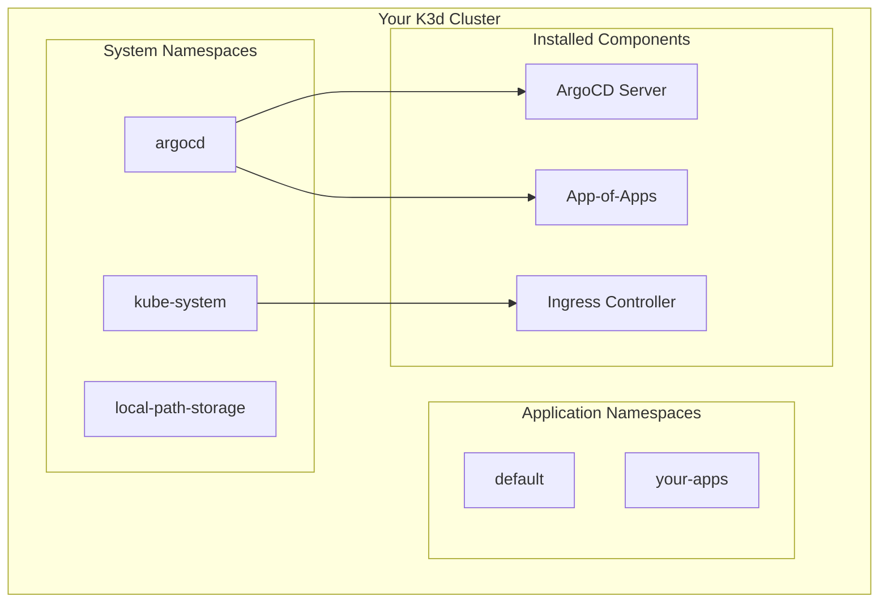
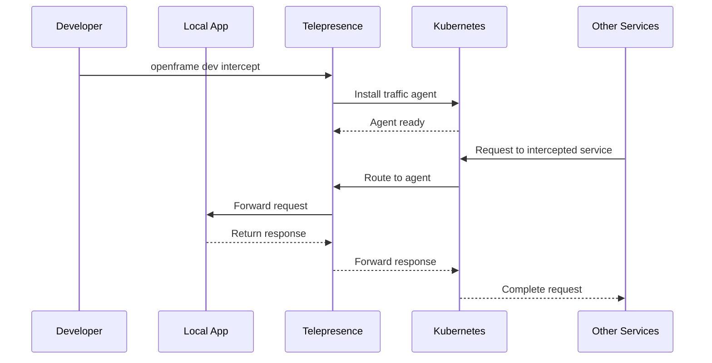

# First Steps with OpenFrame CLI

Now that you have OpenFrame CLI installed and your first environment bootstrapped, let's explore the essential features and workflows. This guide covers the first five things you should do to get productive with OpenFrame.

> **Prerequisites**: Complete the [Quick Start Guide](quick-start.md) before proceeding.

[](https://www.youtube.com/watch?v=O8hbBO5Mym8)

## The Five Essential First Steps

### 1. Explore Your Cluster Environment

Let's start by understanding what was created during bootstrap:

```bash
# Check your cluster status
openframe cluster status

# List all available clusters
openframe cluster list

# Get detailed cluster information
kubectl cluster-info
kubectl get nodes
kubectl get namespaces
```

#### Understanding Your Cluster Layout



**Key namespaces to know:**

| Namespace | Purpose | Key Components |
|-----------|---------|----------------|
| `argocd` | GitOps management | ArgoCD server, applications |
| `kube-system` | Kubernetes core | DNS, proxy, scheduler |
| `local-path-storage` | Storage provisioner | Persistent volume management |
| `default` | Your applications | Where you'll deploy workloads |

### 2. Access the ArgoCD Dashboard

ArgoCD provides a visual interface for managing your GitOps workflows:

```bash
# Get the ArgoCD admin password
kubectl -n argocd get secret argocd-initial-admin-secret -o jsonpath="{.data.password}" | base64 -d

# Port forward to access the UI
kubectl port-forward svc/argocd-server -n argocd 8080:443

# Open browser to https://localhost:8080
# Username: admin
# Password: (from the command above)
```

#### Exploring the ArgoCD Interface

Once logged in, you'll see:

- **Applications**: Your deployed applications and their sync status
- **Repositories**: Connected Git repositories
- **Clusters**: Connected Kubernetes clusters
- **Settings**: Configuration and user management

> **Pro Tip**: ArgoCD automatically syncs your applications from Git repositories. Any changes committed to your repos will be automatically deployed!

### 3. Create Your First Application

Let's scaffold a new application using OpenFrame's built-in templates:

```bash
# Start the interactive scaffolding process
openframe dev scaffold

# Or create a specific application type
openframe dev scaffold my-web-app
```

#### Following the Scaffolding Wizard

The interactive wizard will ask you:

1. **Application name**: Choose a descriptive name (e.g., `my-api`, `frontend-app`)
2. **Application type**: Select from available templates (web app, API, microservice)
3. **Deployment configuration**: Choose development settings
4. **Git integration**: Optionally connect to a Git repository

#### Generated Project Structure

```text
my-web-app/
├── Dockerfile                 # Container build instructions
├── k8s/                      # Kubernetes manifests
│   ├── deployment.yaml       # Application deployment
│   ├── service.yaml          # Service definition
│   └── ingress.yaml          # External access (optional)
├── argocd/                   # ArgoCD application definition
│   └── application.yaml      # GitOps configuration  
├── helm/                     # Helm chart (if selected)
│   ├── Chart.yaml
│   ├── values.yaml
│   └── templates/
└── src/                      # Application source code
    └── main.go              # Sample application
```

### 4. Set Up Local Development with Service Intercepts

One of OpenFrame's most powerful features is the ability to intercept traffic from cluster services and route it to your local development environment:

```bash
# List available services to intercept
openframe dev intercept

# Follow the interactive prompts to select:
# 1. Namespace (usually 'default')
# 2. Service to intercept
# 3. Port mapping
# 4. Local development server details
```

#### How Service Intercepts Work



#### Example Intercept Workflow

```bash
# 1. Deploy your application to the cluster
kubectl apply -f my-web-app/k8s/

# 2. Start your local development server
cd my-web-app/src
go run main.go

# 3. Set up the intercept
openframe dev intercept
# Select: my-web-app service
# Local port: 8080
# Cluster port: 80

# 4. Test the intercept
curl http://my-web-app.default.svc.cluster.local
# This request now goes to your local development server!
```

### 5. Configure Your Development Workflow

Establish a productive development routine with these configurations:

#### Set Up Your kubeconfig

```bash
# Ensure OpenFrame cluster is your default context
kubectl config current-context

# If not, set it as default
kubectl config use-context openframe-dev

# Verify cluster access
kubectl get nodes
```

#### Configure Useful Aliases

Add these to your shell profile (`~/.bashrc`, `~/.zshrc`, etc.):

```bash
# OpenFrame aliases
alias of="openframe"
alias ofc="openframe cluster"
alias ofd="openframe dev"
alias ofb="openframe bootstrap"

# Kubernetes aliases
alias k="kubectl"
alias kgp="kubectl get pods"
alias kgs="kubectl get services"
alias kgn="kubectl get nodes"

# ArgoCD aliases
alias argopass='kubectl -n argocd get secret argocd-initial-admin-secret -o jsonpath="{.data.password}" | base64 -d'
alias argoportforward='kubectl port-forward svc/argocd-server -n argocd 8080:443'
```

#### Set Up Environment Variables

```bash
# Add to your shell profile
export KUBECONFIG=~/.kube/config
export OPENFRAME_LOG_LEVEL=info
export OPENFRAME_CONFIG_DIR=~/.openframe

# For development
export DOCKER_BUILDKIT=1
export COMPOSE_DOCKER_CLI_BUILD=1
```

## Exploring Key Features

### Cluster Management

```bash
# Create additional clusters for different environments
openframe cluster create staging-cluster
openframe cluster create test-cluster

# Switch between clusters
kubectl config get-contexts
kubectl config use-context <cluster-name>

# Clean up unused clusters
openframe cluster delete test-cluster
```

### Chart Management

```bash
# Install additional charts
openframe chart install

# View installed ArgoCD applications
kubectl get applications -n argocd

# Check application sync status
kubectl get app -n argocd -o wide
```

### Development Tools

```bash
# List active intercepts
telepresence list

# Check cluster connectivity
telepresence status

# Clean up intercepts
telepresence quit
```

## Common Workflows

### Daily Development Routine

1. **Start your day**:
   ```bash
   # Check cluster status
   openframe cluster status
   
   # Pull latest changes
   git pull origin main
   
   # Sync any configuration changes
   kubectl apply -f k8s/
   ```

2. **Development cycle**:
   ```bash
   # Start local development
   openframe dev intercept
   
   # Make changes to your code
   # Test locally with intercepted traffic
   
   # Build and push when ready
   docker build -t my-app:latest .
   docker push my-registry/my-app:latest
   ```

3. **End of day cleanup**:
   ```bash
   # Stop intercepts
   telepresence quit
   
   # Commit and push changes
   git add .
   git commit -m "Feature: add new functionality"
   git push origin feature-branch
   ```

### Testing New Features

1. **Create feature branch environment**:
   ```bash
   # Create new cluster for feature testing
   openframe cluster create feature-xyz
   
   # Deploy your feature branch
   kubectl apply -f k8s/
   ```

2. **Validate changes**:
   ```bash
   # Run integration tests
   kubectl apply -f tests/
   
   # Check application health
   kubectl get pods
   kubectl logs -l app=my-app
   ```

3. **Clean up**:
   ```bash
   # Remove feature cluster when done
   openframe cluster delete feature-xyz
   ```

## Getting Help

### Built-in Help System

```bash
# Get help for any command
openframe --help
openframe cluster --help
openframe dev intercept --help

# Get command examples
openframe cluster create --help
```

### Debugging Commands

```bash
# Verbose output for troubleshooting
openframe cluster status --verbose
openframe bootstrap --verbose

# Check system prerequisites
openframe cluster create --dry-run

# View logs
kubectl logs -n argocd -l app.kubernetes.io/name=argocd-server
```

### Community Support

- **Slack**: [OpenMSP Community](https://join.slack.com/t/openmsp/shared_invite/zt-36bl7mx0h-3~U2nFH6nqHqoTPXMaHEHA)
- **Documentation**: [OpenFrame Docs](https://openframe.ai)
- **Platform**: [Flamingo](https://flamingo.run)

## Next Steps

You're now ready to dive deeper into OpenFrame's advanced features:

### Immediate Learning Path
1. **[Environment Setup](../development/setup/environment.md)** - Configure your IDE and development tools
2. **[Local Development](../development/setup/local-development.md)** - Master the development workflow
3. **[Architecture Overview](../development/architecture/overview.md)** - Understand how OpenFrame works

### Advanced Topics
- **GitOps Workflows**: Learn advanced ArgoCD patterns
- **Multi-Cluster Management**: Deploy across environments  
- **Custom Charts**: Create your own Helm charts
- **CI/CD Integration**: Automate your deployment pipeline

### Development Focus Areas
- **[Testing Overview](../development/testing/overview.md)** - Set up comprehensive testing
- **[Contributing Guidelines](../development/contributing/guidelines.md)** - Contribute to the project

---

*Ready to become an OpenFrame power user? Let's set up your [development environment](../development/setup/environment.md)!*