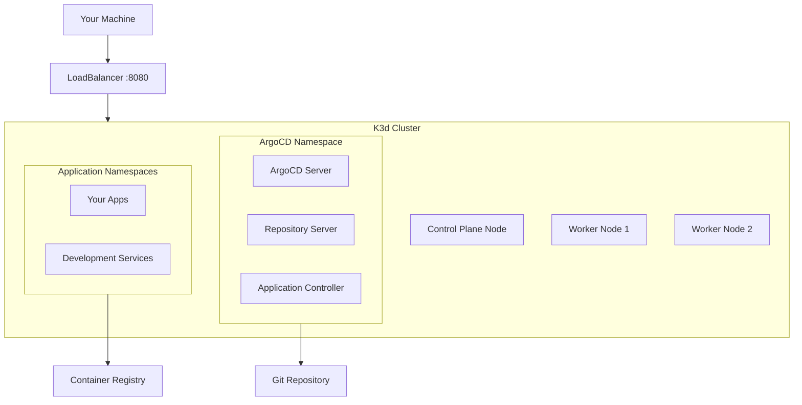

# First Steps with OpenFrame CLI

Now that you have OpenFrame CLI installed and your first cluster running, let's explore the essential features and workflows that will make you productive immediately. This guide covers the first 5 things you should do after installation.

## Step 1: Explore Your Cluster

Start by understanding what you've created and how to navigate your new environment.

### Check Cluster Status
```bash
# View all your clusters
openframe cluster list

# Get detailed information about your cluster
openframe cluster status my-cluster

# See what's running in your cluster
kubectl get pods -A

# Check cluster resource usage
kubectl top nodes  # Requires metrics-server
```

### Understand Your Cluster Architecture


### Key Components Installed
| Component | Namespace | Purpose | Access |
|-----------|-----------|---------|---------|
| **ArgoCD Server** | `argocd` | GitOps deployment platform | https://localhost:8080 |
| **ArgoCD ApplicationSet** | `argocd` | Manages multiple applications | Via ArgoCD UI |
| **Ingress Controller** | `kube-system` | Traffic routing | Automatic |
| **CoreDNS** | `kube-system` | Service discovery | Automatic |
| **Local Path Provisioner** | `kube-system` | Storage provisioning | Automatic |

## Step 2: Access the ArgoCD Dashboard

ArgoCD is your GitOps control center. Let's get familiar with it.

### Get ArgoCD Credentials
```bash
# Get the admin password
ARGOCD_PASSWORD=$(kubectl -n argocd get secret argocd-initial-admin-secret -o jsonpath="{.data.password}" | base64 -d)
echo "ArgoCD Admin Password: $ARGOCD_PASSWORD"

# Save credentials for later use
echo "admin:$ARGOCD_PASSWORD" > ~/.argocd-credentials
chmod 600 ~/.argocd-credentials
```

### Access the Dashboard
```bash
# Port-forward to access the UI
kubectl port-forward svc/argocd-server -n argocd 8080:443 &

# Open your browser to https://localhost:8080
# Username: admin
# Password: (from previous step)
```

### ArgoCD Dashboard Overview
Once logged in, you'll see:
- **Applications**: Your deployed apps and their sync status
- **Repositories**: Connected Git repositories
- **Clusters**: Kubernetes clusters managed by ArgoCD
- **Settings**: User management and configuration

> **💡 Tip**: Bookmark the ArgoCD dashboard and keep the credentials handy. You'll use this frequently for deployment management.

## Step 3: Deploy Your First Application

Let's deploy a real application using GitOps principles.

### Create a Sample Application Repository
```bash
# Create a new directory for your first app
mkdir my-first-app && cd my-first-app

# Create a simple web application manifest
cat <<EOF > deployment.yaml
apiVersion: apps/v1
kind: Deployment
metadata:
  name: hello-openframe
  namespace: default
spec:
  replicas: 2
  selector:
    matchLabels:
      app: hello-openframe
  template:
    metadata:
      labels:
        app: hello-openframe
    spec:
      containers:
      - name: web
        image: nginxdemos/hello:plain-text
        ports:
        - containerPort: 80
---
apiVersion: v1
kind: Service
metadata:
  name: hello-openframe
  namespace: default
spec:
  selector:
    app: hello-openframe
  ports:
  - port: 80
    targetPort: 80
  type: LoadBalancer
EOF

# Create ArgoCD Application manifest
cat <<EOF > application.yaml
apiVersion: argoproj.io/v1alpha1
kind: Application
metadata:
  name: hello-openframe
  namespace: argocd
spec:
  project: default
  source:
    repoURL: 'file:///tmp/my-first-app'  # For local testing
    targetRevision: HEAD
    path: .
  destination:
    server: 'https://kubernetes.default.svc'
    namespace: default
  syncPolicy:
    automated:
      prune: true
      selfHeal: true
EOF
```

### Deploy Using kubectl (Quick Test)
```bash
# Apply the application directly first
kubectl apply -f deployment.yaml

# Check if it's running
kubectl get pods -l app=hello-openframe

# Test the application
kubectl port-forward svc/hello-openframe 3000:80 &
curl http://localhost:3000
```

### Clean Up Direct Deployment
```bash
# Remove direct deployment to prepare for GitOps
kubectl delete -f deployment.yaml
```

## Step 4: Set Up Development Tools

Configure your local environment for productive development.

### Set Up kubectl Aliases
```bash
# Add these to your ~/.bashrc or ~/.zshrc
echo 'alias k="kubectl"' >> ~/.bashrc
echo 'alias kgp="kubectl get pods"' >> ~/.bashrc
echo 'alias kgs="kubectl get services"' >> ~/.bashrc
echo 'alias kgd="kubectl get deployments"' >> ~/.bashrc
echo 'alias kaf="kubectl apply -f"' >> ~/.bashrc
echo 'alias kdel="kubectl delete"' >> ~/.bashrc

# For ArgoCD
echo 'alias argocd="kubectl -n argocd"' >> ~/.bashrc

# Reload shell configuration
source ~/.bashrc
```

### Configure kubectl Context
```bash
# Ensure you're using the right context
kubectl config current-context
# Should show: k3d-my-cluster

# Set default namespace to avoid typing -n repeatedly
kubectl config set-context --current --namespace=default

# Verify configuration
kubectl config view --minify
```

### Install Useful kubectl Plugins
```bash
# Install krew (kubectl plugin manager)
(
  set -x; cd "$(mktemp -d)" &&
  OS="$(uname | tr '[:upper:]' '[:lower:]')" &&
  ARCH="$(uname -m | sed -e 's/x86_64/amd64/' -e 's/\(arm\)\(64\)\?.*/\1\2/' -e 's/aarch64$/arm64/')" &&
  KREW="krew-${OS}_${ARCH}" &&
  curl -fsSLO "https://github.com/kubernetes-sigs/krew/releases/latest/download/${KREW}.tar.gz" &&
  tar zxvf "${KREW}.tar.gz" &&
  ./"${KREW}" install krew
)

# Add krew to PATH
export PATH="${KREW_ROOT:-$HOME/.krew}/bin:$PATH"

# Install useful plugins
kubectl krew install ctx      # Switch contexts
kubectl krew install ns       # Switch namespaces  
kubectl krew install tree     # View resource relationships
kubectl krew install tail     # Tail pod logs
```

## Step 5: Explore Development Workflows

Now let's set up common development patterns you'll use daily.

### A. Live Development with Hot Reload

Set up a development environment that automatically reloads when you change code:

```bash
# Create a development directory
mkdir dev-workflow && cd dev-workflow

# Create a simple Node.js app
cat <<EOF > package.json
{
  "name": "hello-dev",
  "version": "1.0.0",
  "main": "server.js",
  "scripts": {
    "start": "node server.js"
  },
  "dependencies": {
    "express": "^4.18.0"
  }
}
EOF

cat <<EOF > server.js
const express = require('express');
const app = express();
const port = process.env.PORT || 3000;

app.get('/', (req, res) => {
  res.json({ 
    message: 'Hello from OpenFrame Development!',
    timestamp: new Date().toISOString(),
    version: '1.0.0'
  });
});

app.listen(port, () => {
  console.log(\`Server running on port \${port}\`);
});
EOF

# Create Dockerfile
cat <<EOF > Dockerfile
FROM node:16-alpine
WORKDIR /app
COPY package*.json ./
RUN npm install
COPY . .
EXPOSE 3000
CMD ["npm", "start"]
EOF

# Initialize Skaffold for live development
openframe dev scaffold init
```

### B. Service Mesh and Traffic Interception

Set up Telepresence for debugging services:

```bash
# Install a sample microservice to intercept
kubectl create deployment api-service --image=kennethreitz/httpbin
kubectl expose deployment api-service --port=80 --target-port=80

# Start Telepresence intercept
openframe dev intercept api-service --port=8000

# Now traffic to api-service in the cluster will be redirected to localhost:8000
```

### C. Multi-Environment Management

Create environments for different stages:

```bash
# Create staging cluster
openframe cluster create staging-cluster --nodes 2 --api-port 8081

# Create production-like cluster
openframe cluster create prod-cluster --nodes 3 --api-port 8082

# Switch between clusters
kubectl config use-context k3d-staging-cluster
kubectl config use-context k3d-prod-cluster
kubectl config use-context k3d-my-cluster  # Back to development
```

## Essential Daily Commands

Here are the commands you'll use most often:

### Cluster Management
```bash
# List all clusters
openframe cluster list

# Check cluster health
openframe cluster status <cluster-name>

# Create new cluster
openframe cluster create <name> --nodes 3

# Delete cluster
openframe cluster delete <name>

# Clean up unused resources
openframe cluster cleanup
```

### Application Deployment
```bash
# Install ArgoCD on existing cluster
openframe chart install

# Check ArgoCD applications
kubectl get applications -n argocd

# Sync specific application
kubectl patch app <app-name> -n argocd -p '{"metadata":{"annotations":{"argocd.argoproj.io/refresh":"hard"}}}' --type merge
```

### Development Tools
```bash
# Start traffic intercept
openframe dev intercept <service-name> --port <local-port>

# Start live development
openframe dev scaffold dev

# Stop all intercepts
telepresence quit  # If installed globally
```

### Troubleshooting
```bash
# Check cluster logs
kubectl logs -n kube-system -l app=k3d

# Check ArgoCD logs
kubectl logs -n argocd -l app.kubernetes.io/name=argocd-server

# Get pod details
kubectl describe pod <pod-name>

# Check events
kubectl get events --sort-by=.metadata.creationTimestamp
```

## Next Steps and Learning Resources

Now that you're familiar with the basics, here's where to go next:

### Dive Deeper
1. **[Development Environment Setup](../development/setup/environment.md)** - Configure your IDE and advanced tools
2. **[Architecture Overview](../development/architecture/overview.md)** - Understand the system design
3. **[Contributing Guidelines](../development/contributing/guidelines.md)** - Join the OpenFrame community

### Common Use Cases
- **Microservices Development**: Use traffic intercepts to test service-to-service communication
- **GitOps Workflows**: Set up automatic deployments from Git repositories
- **Multi-Environment Testing**: Create staging environments that mirror production
- **Local-to-Cloud Development**: Bridge local development with cloud resources

### Troubleshooting Resources
| Issue Type | Command | Documentation |
|------------|---------|---------------|
| **Cluster Problems** | `openframe cluster status` | [Cluster Troubleshooting](../development/setup/local-development.md) |
| **ArgoCD Issues** | `kubectl logs -n argocd -l app.kubernetes.io/component=server` | [Chart Management](../development/testing/overview.md) |
| **Development Tools** | `openframe dev --help` | [Development Guide](../development/) |

## Quick Reference Card

Keep this handy for daily use:

```bash
# Essential OpenFrame Commands
openframe cluster list                    # Show all clusters
openframe cluster status <name>           # Cluster details
openframe chart install                   # Install ArgoCD
openframe dev intercept <svc> --port <p>  # Traffic intercept
openframe bootstrap                       # Create complete environment

# Essential kubectl Commands
kubectl get pods -A                       # All pods
kubectl get svc                          # Services
kubectl logs <pod> -f                    # Follow logs
kubectl port-forward svc/<svc> <port>    # Port forward
kubectl apply -f <file>                  # Apply manifest

# ArgoCD Access
kubectl port-forward svc/argocd-server -n argocd 8080:443
```

---

**Previous**: [Quick Start](quick-start.md) | **Next**: [Development Setup](../development/setup/environment.md)

> 🎉 **Congratulations!** You've completed the OpenFrame CLI getting started journey. You now have a solid foundation for Kubernetes development with GitOps. The development section contains advanced topics and best practices for power users.