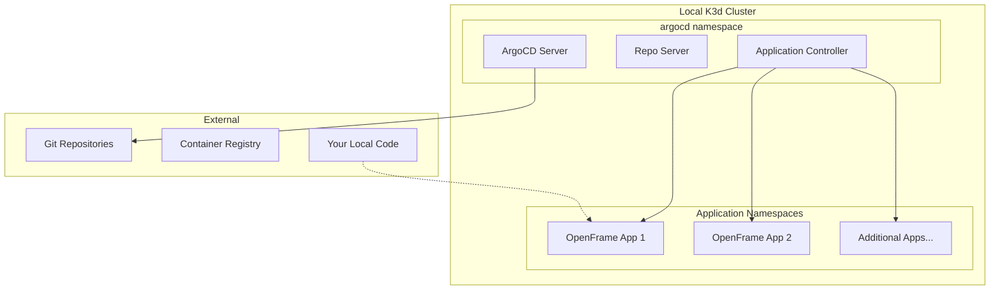

# First Steps with OpenFrame CLI

Now that you have OpenFrame CLI installed and bootstrapped, let's explore the essential tasks and features that will help you become productive quickly. This guide covers the first 5 things you should do after installation and provides practical examples for common workflows.

## 1. Understand Your Environment

After bootstrapping, it's important to understand what was created and how to navigate your new OpenFrame environment.

### Explore Your Cluster
```bash
# Check overall cluster status
openframe cluster status

# See all available clusters
openframe cluster list

# Get detailed cluster information
kubectl cluster-info
kubectl get nodes
```

### Explore ArgoCD Applications
```bash
# Access ArgoCD UI
# Navigate to http://localhost:8080
# Username: admin
# Password: (shown during bootstrap)

# Or check applications via CLI
kubectl get applications -n argocd
kubectl get pods -n argocd
```

### Understanding the Architecture

Your environment now includes:



## 2. Configure Your Development Workflow

### Set Up kubectl Context
```bash
# Verify your cluster is the active context
kubectl config current-context

# If you have multiple clusters, switch context
kubectl config get-contexts
kubectl config use-context k3d-openframe-dev
```

### Configure Aliases for Efficiency
Add these to your shell profile (`~/.bashrc`, `~/.zshrc`, etc.):

```bash
# OpenFrame CLI shortcuts
alias of="openframe"
alias ofc="openframe cluster"
alias ofch="openframe chart"
alias ofd="openframe dev"

# kubectl shortcuts
alias k="kubectl"
alias kg="kubectl get"
alias kd="kubectl describe"
alias kl="kubectl logs"

# Common OpenFrame tasks
alias cluster-status="openframe cluster status"
alias cluster-cleanup="openframe cluster cleanup"
```

Apply the changes:
```bash
source ~/.bashrc  # or ~/.zshrc
```

## 3. Explore Common Development Tasks

### Local Service Development with Telepresence

If you have Telepresence installed, you can intercept services for local development:

```bash
# List available services for interception
openframe dev intercept --list

# Intercept a service (example)
# openframe dev intercept my-service --port 8080

# This redirects traffic from the cluster service to your local machine
```

### Hot Reloading with Skaffold

For rapid development iterations:

```bash
# Start skaffold development mode (if configured)
# openframe dev skaffold my-service

# This will watch for code changes and automatically rebuild/redeploy
```

### Port Forwarding for Services

Access cluster services locally:

```bash
# Forward ArgoCD (if not already running)
kubectl port-forward svc/argocd-server -n argocd 8080:443 &

# Forward other services as needed
kubectl port-forward svc/my-service -n my-namespace 3000:80 &

# List active port forwards
ps aux | grep "kubectl port-forward"
```

## 4. Master Essential Commands

### Cluster Management Commands

| Command | Purpose | When to Use |
|---------|---------|-------------|
| `openframe cluster status` | Check cluster health | Daily health checks |
| `openframe cluster list` | Show all clusters | Working with multiple environments |
| `openframe cluster create` | Create new cluster | Setting up additional environments |
| `openframe cluster delete` | Remove cluster | Cleaning up test environments |
| `openframe cluster cleanup` | Clean up resources | Freeing up system resources |

### Chart Management Commands

| Command | Purpose | When to Use |
|---------|---------|-------------|
| `openframe chart install` | Install OpenFrame charts | Manual chart deployment |
| `helm list -n argocd` | List installed charts | Troubleshooting deployments |
| `helm status argocd -n argocd` | Check chart status | Verifying installations |

### Development Commands

| Command | Purpose | When to Use |
|---------|---------|-------------|
| `openframe dev intercept` | Local service development | Testing local changes |
| `openframe dev skaffold` | Hot reloading workflow | Rapid development cycles |
| `kubectl logs -f` | Stream pod logs | Debugging applications |
| `kubectl exec -it` | Access pod shell | Troubleshooting |

### Example Workflow Session

Here's a typical development session:

```bash
# Start your day - check environment health
openframe cluster status

# Start developing a service locally
kubectl port-forward svc/my-api -n default 8080:80 &

# Make code changes, then test
curl http://localhost:8080/health

# Check logs if something's wrong
kubectl logs -f deployment/my-api -n default

# When done, clean up port forwards
pkill -f "kubectl port-forward"
```

## 5. Access and Navigate Key Features

### ArgoCD Dashboard Navigation

1. **Access the UI**: http://localhost:8080
2. **Login**: admin / (password from bootstrap)
3. **Key sections to explore**:
   - **Applications**: See all deployed apps and their sync status
   - **Repositories**: Connected Git repositories
   - **Clusters**: Connected Kubernetes clusters
   - **Settings**: Configuration and access management

### Essential ArgoCD Tasks

**View Application Details:**
```bash
# Via CLI
kubectl get applications -n argocd

# Get application status
kubectl describe application my-app -n argocd
```

**Manual Sync (if needed):**
- In ArgoCD UI: Click application → "Sync" button
- Via CLI: `argocd app sync my-app` (requires argocd CLI)

**Check Application Health:**
- Green status = Healthy and Synced
- Yellow status = Out of sync (needs update)
- Red status = Degraded (needs attention)

### Useful kubectl Commands for OpenFrame

```bash
# See all namespaces and resources
kubectl get all --all-namespaces

# Check pod status across all namespaces
kubectl get pods --all-namespaces

# See events (helpful for troubleshooting)
kubectl get events --sort-by='.lastTimestamp'

# Check resource usage
kubectl top nodes
kubectl top pods --all-namespaces
```

## Configuration Best Practices

### 1. Set Default Deployment Mode
```bash
# Add to your shell profile
export OPENFRAME_DEPLOYMENT_MODE=oss-tenant

# Or create a config file
mkdir -p ~/.config/openframe
echo "deployment_mode: oss-tenant" > ~/.config/openframe/config.yaml
```

### 2. Organize Multiple Environments
```bash
# Create different clusters for different purposes
openframe cluster create development
openframe cluster create staging  
openframe cluster create testing

# Switch between them using kubectl contexts
kubectl config use-context k3d-development
kubectl config use-context k3d-staging
```

### 3. Setup Persistent Volumes (Optional)
```bash
# Create persistent storage for data that should survive cluster restarts
kubectl apply -f - <<EOF
apiVersion: v1
kind: PersistentVolume
metadata:
  name: local-storage
spec:
  capacity:
    storage: 10Gi
  accessModes:
    - ReadWriteOnce
  persistentVolumeReclaimPolicy: Retain
  storageClassName: local-path
  hostPath:
    path: /tmp/openframe-data
EOF
```

## Common Initial Configuration

### 1. ArgoCD Password Management
```bash
# Get the initial admin password
kubectl -n argocd get secret argocd-initial-admin-secret -o jsonpath="{.data.password}" | base64 -d

# Change the password via ArgoCD UI:
# Settings → Accounts → admin → Update Password
```

### 2. Git Repository Configuration
If using private repositories with ArgoCD:

```bash
# Add repository credentials via ArgoCD UI:
# Settings → Repositories → Connect Repo
# Or use kubectl to create secret
kubectl create secret generic private-repo \
  --from-literal=type=git \
  --from-literal=url=https://github.com/yourorg/repo \
  --from-literal=username=youruser \
  --from-literal=password=yourtoken \
  -n argocd
```

### 3. Resource Limits (Optional)
```bash
# Set resource quotas for namespaces
kubectl create quota dev-quota \
  --hard=requests.cpu=2,requests.memory=4Gi,limits.cpu=4,limits.memory=8Gi \
  -n development
```

## Where to Get Help

### Built-in Help
```bash
# Command-specific help
openframe --help
openframe cluster --help
openframe bootstrap --help

# Verbose output for debugging
openframe cluster status --verbose
```

### Useful Resources

| Resource | URL/Command | Purpose |
|----------|-------------|---------|
| **ArgoCD Docs** | https://argo-cd.readthedocs.io | ArgoCD configuration and troubleshooting |
| **K3d Docs** | https://k3d.io | K3d cluster management |
| **kubectl Cheat Sheet** | https://kubernetes.io/docs/reference/kubectl/cheatsheet/ | kubectl command reference |
| **Local Logs** | `kubectl logs` | Application debugging |
| **Cluster Events** | `kubectl get events` | System-level troubleshooting |

### Troubleshooting Commands
```bash
# Check system health
openframe cluster status
kubectl get nodes
kubectl get pods --all-namespaces

# Check specific issues
kubectl describe pod <pod-name> -n <namespace>
kubectl logs <pod-name> -n <namespace> --previous

# Resource usage
kubectl top nodes
kubectl top pods --all-namespaces
```

## Next Steps

You're now ready to dive deeper into OpenFrame CLI! Choose your next adventure:

### For Application Development
- **[Development Environment Setup](../development/setup/environment.md)** - Configure your IDE and tools
- **[Local Development Guide](../development/setup/local-development.md)** - Learn development workflows

### For Platform Engineering  
- **[Architecture Overview](../development/architecture/overview.md)** - Understand the system design
- **[Contributing Guidelines](../development/contributing/guidelines.md)** - Contribute to OpenFrame CLI

### For Operations
- **[Testing Guide](../development/testing/overview.md)** - Learn testing strategies
- Advanced cluster management techniques

---

> 🚀 **You're Ready!** You now have a solid foundation for using OpenFrame CLI effectively. The key is to practice these commands regularly and gradually explore more advanced features as your needs grow.