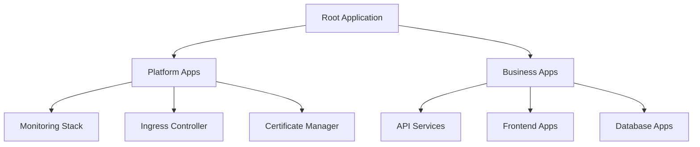
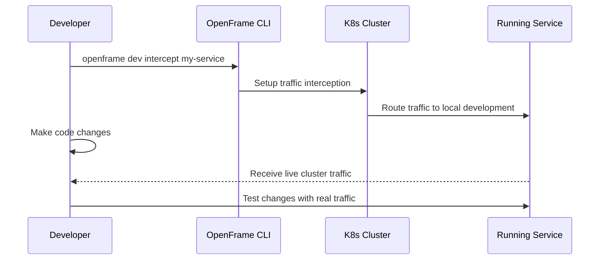

# First Steps

Congratulations on getting OpenFrame CLI up and running! This guide covers the first 5 essential tasks you should complete after installation to get the most out of your OpenFrame environment.

[](https://www.youtube.com/watch?v=bINdW0CQbvY)

## 1. Verify Your Environment Setup

Before diving into development, let's ensure everything is properly configured:

### Check Cluster Health
```bash
# Verify cluster is running
openframe cluster status

# Check all pods are ready
kubectl get pods --all-namespaces

# Verify ArgoCD is operational
kubectl get applications -n argocd
```

### Test Connectivity
```bash
# Test kubectl connectivity
kubectl cluster-info

# Check cluster nodes
kubectl get nodes

# Verify Helm is working
helm list --all-namespaces
```

**Expected Output:**
```text
📊 Cluster Status: my-cluster
Cluster: ✅ Running
Nodes: 1/1 Ready
ArgoCD: ✅ Deployed
OpenFrame: ✅ Installed
```

> **✅ Success Check**: All services should show as ✅ Ready/Running. If any show as ❌ or pending, troubleshoot before continuing.

## 2. Configure Your Development Environment

Set up your local environment for optimal OpenFrame development:

### Set Default Cluster Context
```bash
# View available contexts
kubectl config get-contexts

# Set your OpenFrame cluster as default
kubectl config use-context k3d-my-cluster

# Verify current context
kubectl config current-context
```

### Configure kubectl Aliases (Optional but Recommended)
```bash
# Add helpful aliases to your shell profile
echo 'alias k=kubectl' >> ~/.bashrc
echo 'alias kgp="kubectl get pods"' >> ~/.bashrc
echo 'alias kgs="kubectl get services"' >> ~/.bashrc
echo 'alias of=openframe' >> ~/.bashrc

# Reload your shell or run:
source ~/.bashrc
```

### Set Up Namespace Management
```bash
# Create a development namespace
kubectl create namespace development

# Set as default namespace (optional)
kubectl config set-context --current --namespace=development
```

## 3. Explore ArgoCD and GitOps Workflows

ArgoCD is your central hub for application deployment and management:

### Access ArgoCD Dashboard
```bash
# Start port forwarding in a separate terminal
kubectl port-forward svc/argocd-server -n argocd 8080:443

# Get the admin password
kubectl get secret argocd-initial-admin-secret -n argocd -o jsonpath="{.data.password}" | base64 -d
```

Open `https://localhost:8080` in your browser and login with:
- **Username**: `admin`  
- **Password**: (from command above)

### Explore Installed Applications
```bash
# List ArgoCD applications
kubectl get applications -n argocd

# View application details
kubectl describe application <app-name> -n argocd

# Check application status
kubectl get application <app-name> -n argocd -o yaml
```

### Understanding the App-of-Apps Pattern


## 4. Set Up Your First Development Workflow

Learn to use OpenFrame's development tools for efficient coding:

### Option A: Traffic Interception (Recommended for Service Development)
```bash
# List available services
kubectl get services --all-namespaces

# Start intercepting traffic to a service
openframe dev intercept my-service

# Your local code now receives traffic from the cluster!
```

### Option B: Live Development with Skaffold
```bash
# Initialize Skaffold configuration (if not exists)
skaffold init --generate-manifests

# Start live development
openframe dev skaffold my-service

# Code changes automatically deploy to cluster
```

### Development Workflow Example


## 5. Learn Essential Cluster Management Tasks

Master the key commands for day-to-day cluster management:

### Cluster Operations
```bash
# Create additional clusters for different environments
openframe cluster create staging-cluster
openframe cluster create production-cluster

# List all managed clusters
openframe cluster list

# Get detailed cluster status
openframe cluster status staging-cluster

# Clean up cluster resources
openframe cluster cleanup my-cluster
```

### Managing Multiple Environments
```bash
# Switch between cluster contexts
kubectl config use-context k3d-development-cluster
kubectl config use-context k3d-staging-cluster

# View current context
kubectl config current-context

# Set different deployment modes per environment
openframe bootstrap dev-cluster --deployment-mode=oss-tenant
openframe bootstrap staging --deployment-mode=saas-tenant
```

### Backup and Restore
```bash
# Export cluster configuration
kubectl config view --raw > my-cluster-config.yaml

# Backup important resources
kubectl get all --all-namespaces -o yaml > cluster-backup.yaml

# Export ArgoCD applications
kubectl get applications -n argocd -o yaml > argocd-apps-backup.yaml
```

## Common Initial Configuration Tasks

### 1. Set Up Container Registry Access (if needed)
```bash
# Create registry secret for private images
kubectl create secret docker-registry my-registry-secret \
  --docker-server=ghcr.io \
  --docker-username=<username> \
  --docker-password=<token> \
  --docker-email=<email>

# Use in pod specifications
kubectl patch serviceaccount default -p '{"imagePullSecrets": [{"name": "my-registry-secret"}]}'
```

### 2. Configure Resource Limits
```bash
# Create resource quota for namespace
kubectl create quota dev-quota --hard=requests.cpu=2,requests.memory=4Gi,limits.cpu=4,limits.memory=8Gi -n development

# View quota usage
kubectl describe quota dev-quota -n development
```

### 3. Set Up Ingress (if needed)
```bash
# Install ingress controller (example with nginx)
helm upgrade --install ingress-nginx ingress-nginx \
  --repo https://kubernetes.github.io/ingress-nginx \
  --namespace ingress-nginx --create-namespace

# Create simple ingress for your app
kubectl create ingress my-app --rule="my-app.local/*=my-service:80"
```

## Key Commands Cheat Sheet

| Task | Command | Description |
|------|---------|-------------|
| **Environment Status** | `openframe cluster status` | Check overall cluster health |
| **Development** | `openframe dev intercept <service>` | Start traffic interception |
| **Deployment** | `openframe chart install` | Install/update charts |
| **Cluster Management** | `openframe cluster list` | View all clusters |
| **ArgoCD Access** | `kubectl port-forward svc/argocd-server -n argocd 8080:443` | Access GitOps dashboard |
| **Context Switching** | `kubectl config use-context <context-name>` | Switch between clusters |
| **Resource Viewing** | `kubectl get pods --all-namespaces` | View all running workloads |
| **Logs** | `kubectl logs -f <pod-name>` | Follow pod logs |

## Exploring Key Features

### Deployment Modes
OpenFrame supports three deployment modes:

| Mode | Description | Use Case |
|------|-------------|----------|
| **oss-tenant** | Open source tenant deployment | Development and small teams |
| **saas-tenant** | Software-as-a-Service tenant | Isolated customer environments |
| **saas-shared** | Multi-tenant shared environment | High-density shared hosting |

### Development Tools Integration
```bash
# Explore all development commands
openframe dev --help

# Check what development tools are available
which telepresence skaffold
```

## Where to Get Help

### Built-in Help
```bash
# General help
openframe --help

# Command-specific help
openframe cluster --help
openframe dev --help

# Verbose mode for detailed logging
openframe cluster status --verbose
```

### Troubleshooting Common Issues
```bash
# Check prerequisites
openframe cluster create --help  # Runs prereq checks

# View detailed logs
openframe bootstrap my-cluster --verbose

# Clean up and restart
openframe cluster cleanup
openframe cluster delete my-cluster
openframe bootstrap my-cluster
```

### Community and Documentation
- **Command Reference**: Use `--help` with any command
- **Verbose Logging**: Add `-v` or `--verbose` to any command
- **ArgoCD Dashboard**: Your primary interface for application management
- **Kubernetes Dashboard**: `kubectl proxy` for cluster-wide view

## Next Steps

Now that you've completed the first steps:

1. **[Development Environment Setup](../development/setup/environment.md)** - Configure your IDE and development tools
2. **[Local Development Guide](../development/setup/local-development.md)** - Set up advanced development workflows  
3. **[Architecture Overview](../development/architecture/overview.md)** - Understand OpenFrame's architecture
4. **[Testing Guide](../development/testing/overview.md)** - Learn testing strategies and best practices

> **🎯 Pro Tip**: Bookmark the ArgoCD dashboard (`https://localhost:8080`) as your main operational interface. It's where you'll monitor and manage all your applications!