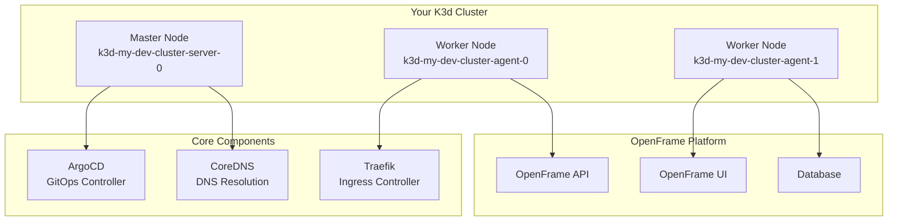

# First Steps with OpenFrame CLI

Now that you have OpenFrame CLI installed and your first environment running, let's explore the key features and workflows that will make you productive. This guide covers the 5 essential things every user should do after their initial setup.

## 1. 🎯 Understand Your Environment

Before diving into development, let's explore what was created during bootstrap:

### Examine Your Cluster

```bash
# Get detailed cluster information
openframe cluster status

# List all available clusters
openframe cluster list

# Check cluster resource usage
kubectl top nodes
kubectl top pods -A
```

**What you'll see:**



### Explore ArgoCD Applications

ArgoCD is managing your OpenFrame applications. Let's see what's deployed:

```bash
# List ArgoCD applications
kubectl get applications -n argocd

# Get detailed application status
kubectl describe application openframe-platform -n argocd

# Access ArgoCD UI
kubectl port-forward svc/argocd-server -n argocd 8080:443
# Open https://localhost:8080
# Username: admin
# Password: kubectl get secret argocd-initial-admin-secret -n argocd -o jsonpath="{.data.password}" | base64 -d
```

### Check OpenFrame Platform Components

```bash
# See all OpenFrame components
kubectl get all -n openframe

# Check logs for any component
kubectl logs -n openframe deployment/openframe-api
kubectl logs -n openframe deployment/openframe-ui
```

## 2. 🔧 Configure Your Development Environment

### Set Up kubectl Context

Ensure kubectl is pointing to your OpenFrame cluster:

```bash
# Check current context
kubectl config current-context

# Should show: k3d-my-dev-cluster
# If not, switch to the correct context:
kubectl config use-context k3d-my-dev-cluster

# Verify cluster access
kubectl cluster-info
```

### Create a Development Namespace

It's a good practice to work in your own namespace:

```bash
# Create your development namespace
kubectl create namespace dev-$(whoami)

# Set it as default for convenience
kubectl config set-context --current --namespace=dev-$(whoami)

# Verify
kubectl config get-contexts
```

### Configure Shell Completion

Make your CLI experience smoother:

```bash
# For bash
echo 'source <(openframe completion bash)' >> ~/.bashrc
echo 'source <(kubectl completion bash)' >> ~/.bashrc

# For zsh
echo 'source <(openframe completion zsh)' >> ~/.zshrc
echo 'source <(kubectl completion zsh)' >> ~/.zshrc

# Reload your shell
source ~/.bashrc  # or ~/.zshrc
```

### Set Up Aliases

Common aliases that will save you time:

```bash
# Add to your ~/.bashrc or ~/.zshrc
cat >> ~/.bashrc << 'EOF'
# OpenFrame aliases
alias of='openframe'
alias ofb='openframe bootstrap'
alias ofc='openframe cluster'
alias ofch='openframe chart'

# Kubernetes aliases
alias k='kubectl'
alias kgp='kubectl get pods'
alias kgs='kubectl get svc'
alias kgd='kubectl get deployment'
alias kdesc='kubectl describe'
alias klogs='kubectl logs'
EOF

source ~/.bashrc
```

## 3. 🚀 Deploy Your First Application

Let's deploy a sample application to understand the workflow:

### Create a Simple Application

```bash
# Switch to your dev namespace
kubectl config set-context --current --namespace=dev-$(whoami)

# Create a sample application
cat << 'EOF' > sample-app.yaml
apiVersion: apps/v1
kind: Deployment
metadata:
  name: hello-openframe
  labels:
    app: hello-openframe
spec:
  replicas: 2
  selector:
    matchLabels:
      app: hello-openframe
  template:
    metadata:
      labels:
        app: hello-openframe
    spec:
      containers:
      - name: app
        image: hashicorp/http-echo:latest
        args:
          - "-text=Hello from OpenFrame! 🚀"
        ports:
        - containerPort: 5678
---
apiVersion: v1
kind: Service
metadata:
  name: hello-openframe
spec:
  selector:
    app: hello-openframe
  ports:
    - port: 80
      targetPort: 5678
  type: ClusterIP
---
apiVersion: networking.k8s.io/v1
kind: Ingress
metadata:
  name: hello-openframe
  annotations:
    traefik.ingress.kubernetes.io/router.entrypoints: web
spec:
  rules:
  - host: hello.local
    http:
      paths:
      - path: /
        pathType: Prefix
        backend:
          service:
            name: hello-openframe
            port:
              number: 80
EOF

# Deploy the application
kubectl apply -f sample-app.yaml
```

### Verify Deployment

```bash
# Check deployment status
kubectl get deployments
kubectl get pods
kubectl get services
kubectl get ingress

# Wait for pods to be ready
kubectl wait --for=condition=ready pod -l app=hello-openframe --timeout=60s

# Check pod logs
kubectl logs -l app=hello-openframe
```

### Access Your Application

```bash
# Port forward to access locally
kubectl port-forward svc/hello-openframe 8080:80 &

# Test the application
curl http://localhost:8080

# Or access via ingress (add to /etc/hosts first)
echo "127.0.0.1 hello.local" | sudo tee -a /etc/hosts
curl http://hello.local:8080  # If you have Traefik configured
```

Expected response: `Hello from OpenFrame! 🚀`

## 4. 🔍 Learn Essential Debugging Workflows

### Monitor Your Application

```bash
# Watch pods in real-time
kubectl get pods -w

# Stream logs from all replicas
kubectl logs -l app=hello-openframe -f

# Get resource usage
kubectl top pods
kubectl describe pod <pod-name>
```

### Debug Common Issues

<details>
<summary>🐛 <strong>Pod Won't Start</strong></summary>

```bash
# Check pod status and events
kubectl describe pod <pod-name>

# Check if image can be pulled
kubectl get events --field-selector involvedObject.name=<pod-name>

# Check resource constraints
kubectl top nodes
kubectl describe nodes
```

</details>

<details>
<summary>🌐 <strong>Service Not Accessible</strong></summary>

```bash
# Verify service endpoints
kubectl get endpoints hello-openframe

# Test service connectivity from inside cluster
kubectl run debug --image=busybox --rm -it -- sh
# Inside the pod:
wget -qO- http://hello-openframe.dev-$(whoami).svc.cluster.local

# Check ingress configuration
kubectl describe ingress hello-openframe
```

</details>

<details>
<summary>📊 <strong>Performance Issues</strong></summary>

```bash
# Check resource usage
kubectl top pods -l app=hello-openframe
kubectl top nodes

# Check limits and requests
kubectl describe deployment hello-openframe

# Scale up if needed
kubectl scale deployment hello-openframe --replicas=3
```

</details>

### Use Development Tools

```bash
# Set up traffic interception for local development
openframe dev intercept hello-openframe --port 8080

# This will redirect traffic to your local machine
# Useful for debugging and development
```

## 5. 🛠️ Explore Advanced Features

### GitOps Workflow

OpenFrame uses ArgoCD for GitOps. Let's create a GitOps-managed application:

```bash
# Create a simple ArgoCD application
cat << 'EOF' > argocd-app.yaml
apiVersion: argoproj.io/v1alpha1
kind: Application
metadata:
  name: my-app
  namespace: argocd
spec:
  project: default
  source:
    repoURL: https://github.com/your-username/your-app-repo
    targetRevision: HEAD
    path: k8s
  destination:
    server: https://kubernetes.default.svc
    namespace: dev-$(whoami)
  syncPolicy:
    automated:
      prune: true
      selfHeal: true
EOF

# Apply (after setting up your git repo)
# kubectl apply -f argocd-app.yaml
```

### Multiple Environment Management

```bash
# Create additional environments
openframe bootstrap staging-cluster --deployment-mode=saas-shared
openframe bootstrap prod-cluster --deployment-mode=saas-tenant

# Switch between environments
kubectl config use-context k3d-staging-cluster
kubectl config use-context k3d-prod-cluster
kubectl config use-context k3d-my-dev-cluster  # Back to dev
```

### Custom Configuration

```bash
# View current configuration
ls ~/.openframe/
cat ~/.openframe/config.yaml

# Customize cluster defaults
openframe cluster create custom-cluster \
  --nodes 5 \
  --memory 4gb \
  --ports "8080:80@loadbalancer"
```

## Common Next Steps Checklist

After completing these first steps, you should be ready to:

- [ ] **Deploy applications** to your OpenFrame cluster
- [ ] **Use kubectl** effectively with aliases and completion
- [ ] **Monitor and debug** applications using logs and describes
- [ ] **Understand ArgoCD** and GitOps workflows
- [ ] **Access applications** via port-forwarding and ingress
- [ ] **Scale applications** up and down as needed
- [ ] **Work with multiple environments** using contexts

## Essential Commands Summary

| Task | Command | Notes |
|------|---------|-------|
| **Cluster Status** | `openframe cluster status` | Health and resource info |
| **List Clusters** | `openframe cluster list` | All available clusters |
| **Switch Context** | `kubectl config use-context <name>` | Change active cluster |
| **Check Pods** | `kubectl get pods -A` | All pods across namespaces |
| **Port Forward** | `kubectl port-forward svc/<svc> <local>:<remote>` | Access services locally |
| **View Logs** | `kubectl logs -f <pod-name>` | Stream logs in real-time |
| **Debug Pod** | `kubectl describe pod <pod-name>` | Detailed pod information |
| **ArgoCD UI** | `kubectl port-forward svc/argocd-server -n argocd 8080:443` | Access GitOps dashboard |

## Where to Get Help

When you encounter issues or need guidance:

### Documentation
- **[Architecture Overview](../development/architecture/overview.md)** - Understand system design
- **[Development Setup](../development/setup/environment.md)** - IDE and tool configuration
- **[Testing Guide](../development/testing/overview.md)** - Write and run tests
- **[Contributing](../development/contributing/guidelines.md)** - Code contribution guidelines

### Community Resources
- 🐛 **GitHub Issues**: Report bugs and request features
- 💬 **Discord Community**: Real-time help and discussions
- 📖 **Documentation**: Search the complete docs
- 🎥 **Video Tutorials**: Visual learning resources

### Built-in Help
```bash
# CLI help for any command
openframe --help
openframe cluster --help
openframe bootstrap --help

# Kubernetes help
kubectl --help
kubectl explain pod
kubectl explain service
```

---

> **🎉 Congratulations!** You've completed the essential first steps with OpenFrame CLI. You now have the foundation to build, deploy, and manage applications effectively. The next step is to dive deeper into development workflows or explore the architecture to understand how everything works together.