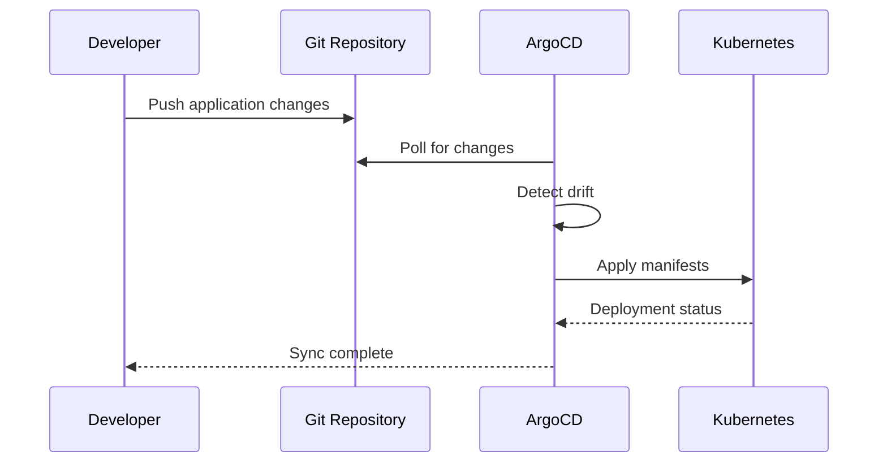
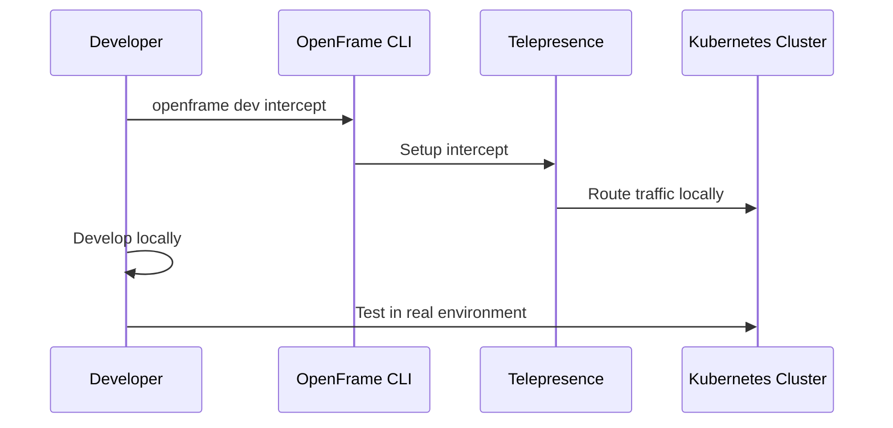

# First Steps with OpenFrame

Congratulations! You've successfully bootstrapped OpenFrame. This guide covers the essential operations and workflows to get you productive quickly.

## Essential OpenFrame Operations

### 1. Explore Your Cluster

Start by understanding what was created during bootstrap:

```bash
# View cluster information
openframe cluster status

# List all running clusters
openframe cluster list

# Check cluster details
kubectl cluster-info
kubectl get nodes
```

You should see output similar to:
```text
Kubernetes control plane is running at https://0.0.0.0:6443
k3s is running at https://0.0.0.0:6443
```

### 2. Access ArgoCD Dashboard

ArgoCD is your GitOps control center. Access it through port forwarding:

```bash
# Forward ArgoCD server port
kubectl port-forward svc/argocd-server -n argocd 8080:443

# Get initial admin password
kubectl get secret argocd-initial-admin-secret -n argocd -o jsonpath="{.data.password}" | base64 -d
```

Open your browser to `https://localhost:8080` and login with:
- **Username**: `admin`
- **Password**: (from command above)

> **💡 Pro Tip**: Accept the self-signed certificate warning in your browser for local development.

### 3. Understand Your Applications

View applications managed by ArgoCD:

```bash
# List all ArgoCD applications
kubectl get applications -n argocd

# Describe a specific application
kubectl describe application app-of-apps -n argocd
```

### 4. Explore Namespaces

See what namespaces were created:

```bash
# List all namespaces
kubectl get namespaces

# Check resources in ArgoCD namespace
kubectl get all -n argocd
```

### 5. Monitor Application Health

Check the status of your applications:

```bash
# View application sync status
kubectl get applications -n argocd -o wide

# Check pod status across namespaces
kubectl get pods --all-namespaces
```

## Common Initial Configuration

### Configure kubectl Context

Ensure your kubectl is using the correct context:

```bash
# View current context
kubectl config current-context

# List available contexts
kubectl config get-contexts

# Switch to OpenFrame cluster (if needed)
kubectl config use-context k3d-openframe-local
```

### Set Default Namespace (Optional)

To avoid typing `-n namespace` repeatedly:

```bash
# Set default namespace for kubectl
kubectl config set-context --current --namespace=argocd

# Or use kubens if available
kubens argocd
```

### Configure ArgoCD CLI (Optional)

For advanced ArgoCD operations:

```bash
# Download ArgoCD CLI
curl -sSL -o argocd-linux-amd64 https://github.com/argoproj/argo-cd/releases/latest/download/argocd-linux-amd64
sudo install -m 555 argocd-linux-amd64 /usr/local/bin/argocd

# Login to ArgoCD
argocd login localhost:8080 --username admin --password <password>
```

## Key Features to Explore

### 1. Application Deployment

Deploy a new application through ArgoCD:

<details>
<summary>📦 Deploy Sample Application</summary>

Create a simple application manifest:

```yaml
# sample-app.yaml
apiVersion: argoproj.io/v1alpha1
kind: Application
metadata:
  name: sample-nginx
  namespace: argocd
spec:
  project: default
  source:
    repoURL: https://github.com/flamingo-stack/openframe-examples
    targetRevision: HEAD
    path: nginx-example
  destination:
    server: https://kubernetes.default.svc
    namespace: default
  syncPolicy:
    automated:
      prune: true
      selfHeal: true
```

Apply the application:
```bash
kubectl apply -f sample-app.yaml
```

</details>

### 2. Development Workflows

Start development with service intercepts:

```bash
# List available services for intercept
openframe dev intercept

# Scaffold a new service
openframe dev scaffold
```

### 3. Cluster Management

Manage multiple clusters:

```bash
# Create additional clusters
openframe cluster create --name dev-cluster

# List all managed clusters
openframe cluster list

# Switch between clusters
kubectl config use-context k3d-dev-cluster
```

## Essential Workflows

### Workflow 1: Deploy and Update Applications



### Workflow 2: Local Development with Intercepts



## Troubleshooting Common Issues

### Application Not Syncing

```bash
# Check application status
kubectl describe application <app-name> -n argocd

# Force sync application
kubectl patch application <app-name> -n argocd --type merge -p '{"operation":{"initiatedBy":{"username":"admin"},"sync":{"revision":"HEAD"}}}'
```

### Cluster Connection Issues

```bash
# Verify cluster is running
docker ps | grep k3d

# Restart cluster if needed
openframe cluster delete openframe-local
openframe cluster create --name openframe-local
```

### Port Conflicts

```bash
# Check what's using port 6443
lsof -i :6443

# Create cluster with different port
openframe cluster create --name test-cluster --api-port 6444
```

## Where to Get Help

### 1. Built-in Help System
```bash
# General help
openframe --help

# Command-specific help
openframe cluster --help
openframe bootstrap --help
```

### 2. Verbose Mode for Debugging
```bash
# Run commands with detailed output
openframe cluster create --name debug-cluster --verbose
```

### 3. Check Application Logs
```bash
# View ArgoCD logs
kubectl logs -n argocd -l app.kubernetes.io/name=argocd-server

# Check specific application
kubectl logs -n <namespace> -l app=<app-name>
```

## Next Learning Paths

Based on your role and interests, explore these areas:

### For Platform Engineers
- **[Development Environment Setup](../development/setup/environment.md)** - IDE and tooling setup
- **[Architecture Overview](../development/architecture/overview.md)** - Deep dive into OpenFrame architecture

### For Developers
- **Local Development** - Telepresence intercepts and debugging
- **Service Deployment** - Building and deploying applications

### For DevOps Engineers
- **Cluster Management** - Multi-cluster setups and scaling
- **GitOps Workflows** - Advanced ArgoCD configurations

## Quick Reference Commands

| Task | Command |
|------|---------|
| **Cluster Status** | `openframe cluster status` |
| **List Clusters** | `openframe cluster list` |
| **View Applications** | `kubectl get applications -n argocd` |
| **ArgoCD Dashboard** | `kubectl port-forward svc/argocd-server -n argocd 8080:443` |
| **Delete Cluster** | `openframe cluster delete <name>` |
| **Bootstrap New Environment** | `openframe bootstrap` |
| **Start Intercept** | `openframe dev intercept` |
| **Scaffold Service** | `openframe dev scaffold` |

> **🚀 You're Ready!** You now have a solid foundation in OpenFrame operations. Continue exploring the platform's capabilities or dive deeper into specific areas that interest you most.