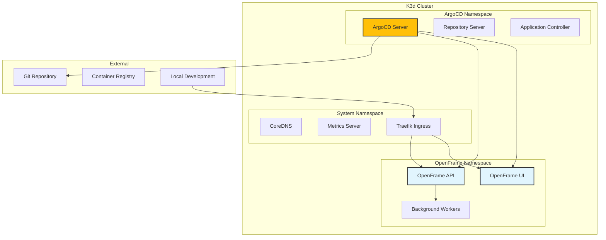

# First Steps with OpenFrame

Now that you have OpenFrame up and running, let's explore the essential tasks to get you productive quickly.

## The First 5 Things to Do

### 1. Explore Your Environment

First, let's see what was created during bootstrap:

```bash
# Check overall cluster status
openframe cluster status

# View all Kubernetes namespaces  
kubectl get namespaces

# Check ArgoCD applications
kubectl get applications -n argocd

# View running pods across all namespaces
kubectl get pods --all-namespaces
```

**What you should see:**
- Active K3d cluster with OpenFrame components
- ArgoCD namespace with running applications
- System namespaces (kube-system, argocd)
- OpenFrame application pods in various states

### 2. Access ArgoCD Dashboard

ArgoCD is your GitOps control center for managing deployments:

```bash
# Get ArgoCD admin password
kubectl -n argocd get secret argocd-initial-admin-secret -o jsonpath="{.data.password}" | base64 -d

# Forward ArgoCD UI port
kubectl port-forward svc/argocd-server -n argocd 8080:443

# Open in browser
echo "ArgoCD UI: https://localhost:8080"
echo "Username: admin"
echo "Password: [use password from above]"
```

**In the ArgoCD UI, explore:**
- Application dashboard showing deployment status
- Sync status of OpenFrame applications  
- Application health and resource details
- Git repository connections

### 3. Configure Your kubectl Context

Make sure your kubectl is pointing to the right cluster:

```bash
# View current context
kubectl config current-context

# List all available contexts
kubectl config get-contexts

# Switch to OpenFrame cluster if needed
kubectl config use-context k3d-openframe-dev

# Verify connection
kubectl cluster-info
```

**Set up aliases for efficiency:**
```bash
# Add to your ~/.bashrc or ~/.zshrc
alias k='kubectl'
alias kgp='kubectl get pods'
alias kgs='kubectl get svc'
alias kgn='kubectl get nodes'

# Reload your shell
source ~/.bashrc  # or source ~/.zshrc
```

### 4. Understand the Deployment Architecture

Let's examine what was deployed:

```bash
# Check OpenFrame-specific resources
kubectl get all -l app.kubernetes.io/part-of=openframe

# View deployment modes and configurations
kubectl get configmaps -n openframe

# Examine service mesh components (if applicable)
kubectl get all -n istio-system 2>/dev/null || echo "Istio not installed"

# Check ingress controllers
kubectl get ingress --all-namespaces
```

**Architecture Overview:**



### 5. Set Up Local Development Workflow

Configure your environment for efficient development:

```bash
# Set default namespace to avoid typing -n every time
kubectl config set-context --current --namespace=openframe

# Install useful kubectl plugins
kubectl krew install ctx ns view-secret

# Set up directory structure
mkdir -p ~/openframe-workspace/{apps,configs,scripts}
cd ~/openframe-workspace

# Create development helper scripts
cat > scripts/dev-helpers.sh << 'EOF'
#!/bin/bash
# OpenFrame development helpers

# Quick log viewing
logs() {
    kubectl logs -f deployment/$1 -n ${2:-openframe}
}

# Port forward helper
forward() {
    local service=$1
    local port=${2:-8080}
    kubectl port-forward svc/$service $port:$port -n openframe
}

# Quick pod shell access
shell() {
    kubectl exec -it deployment/$1 -n ${2:-openframe} -- /bin/sh
}
EOF

chmod +x scripts/dev-helpers.sh
source scripts/dev-helpers.sh
```

## Common Initial Configuration

### Configure Persistent Storage

Set up persistent volumes for development data:

```bash
# Check existing storage classes
kubectl get storageclass

# Create a PVC for development
cat > configs/dev-storage.yaml << EOF
apiVersion: v1
kind: PersistentVolumeClaim
metadata:
  name: openframe-dev-data
  namespace: openframe
spec:
  accessModes:
    - ReadWriteOnce
  resources:
    requests:
      storage: 5Gi
  storageClassName: local-path
EOF

kubectl apply -f configs/dev-storage.yaml
```

### Set Up Environment Variables

Create a configuration file for common settings:

```bash
# Create environment configuration
cat > configs/dev-env.yaml << EOF
apiVersion: v1
kind: ConfigMap
metadata:
  name: openframe-dev-config
  namespace: openframe
data:
  ENVIRONMENT: "development"
  LOG_LEVEL: "debug"
  DEBUG_MODE: "true"
  API_BASE_URL: "http://localhost:8080"
  UI_BASE_URL: "http://localhost:3000"
EOF

kubectl apply -f configs/dev-env.yaml
```

### Configure Network Access

Set up ingress or port forwarding for easy access:

```bash
# Create ingress for local development
cat > configs/local-ingress.yaml << EOF
apiVersion: networking.k8s.io/v1
kind: Ingress
metadata:
  name: openframe-local
  namespace: openframe
  annotations:
    traefik.ingress.kubernetes.io/router.entrypoints: web
spec:
  rules:
  - host: openframe.local
    http:
      paths:
      - path: /
        pathType: Prefix
        backend:
          service:
            name: openframe-ui
            port:
              number: 80
  - host: api.openframe.local  
    http:
      paths:
      - path: /
        pathType: Prefix
        backend:
          service:
            name: openframe-api
            port:
              number: 8080
EOF

kubectl apply -f configs/local-ingress.yaml

# Add to /etc/hosts
echo "127.0.0.1 openframe.local api.openframe.local" | sudo tee -a /etc/hosts
```

## Exploring Key Features

### Feature 1: Application Management

```bash
# List all deployed applications
kubectl get applications -n argocd

# View specific application details  
kubectl describe application openframe-api -n argocd

# Check application sync status
argocd app list  # if argocd CLI is installed
```

### Feature 2: Development Tools Integration

```bash
# Test traffic interception (requires Telepresence)
openframe dev intercept openframe-api --port 8080

# Start development with hot reloading (requires Skaffold)
openframe dev skaffold openframe-dev --watch
```

### Feature 3: Monitoring and Observability

```bash
# Check cluster resource usage
kubectl top nodes
kubectl top pods -n openframe

# View cluster events
kubectl get events --sort-by=.metadata.creationTimestamp

# Access metrics (if monitoring is installed)
kubectl get prometheus -n monitoring 2>/dev/null || echo "Monitoring not installed"
```

## Where to Get Help

### Built-in Help

```bash
# CLI help system
openframe --help
openframe cluster --help  
openframe bootstrap --help

# Kubernetes built-in help
kubectl explain deployment
kubectl explain service
```

### Useful Resources

| Resource | Description | Link |
|----------|-------------|------|
| **CLI Documentation** | Complete command reference | `openframe --help` |
| **Kubernetes Docs** | Official K8s documentation | [kubernetes.io](https://kubernetes.io) |
| **ArgoCD Docs** | GitOps workflow guides | [argoproj.github.io](https://argoproj.github.io/argo-cd/) |
| **K3d Documentation** | Local cluster management | [k3d.io](https://k3d.io) |

### Community Support

- **GitHub Issues**: Report bugs and request features
- **Discord/Slack**: Real-time community support  
- **Stack Overflow**: Tag questions with `openframe`
- **YouTube Channel**: Video tutorials and walkthroughs

### Troubleshooting Commands

```bash
# Check cluster health
kubectl get nodes
kubectl get pods --all-namespaces | grep -v Running

# View recent events
kubectl get events --sort-by=.metadata.creationTimestamp | tail -20

# Check ArgoCD status
kubectl get pods -n argocd

# Restart a deployment if needed
kubectl rollout restart deployment/openframe-api -n openframe
```

## Development Workflow Tips

### Daily Development Commands

```bash
# Start your development session
cd ~/openframe-workspace
source scripts/dev-helpers.sh

# Check what's running  
kubectl get pods -n openframe

# View logs for debugging
logs openframe-api

# Forward ports for local access
forward openframe-api 8080 &
forward openframe-ui 3000 &
```

### Git Integration

```bash
# Set up git hooks for ArgoCD sync
cat > .git/hooks/post-commit << 'EOF'
#!/bin/bash
echo "Triggering ArgoCD sync..."
kubectl patch application openframe-api -n argocd --type='merge' -p='{"operation": {"sync": {}}}'
EOF

chmod +x .git/hooks/post-commit
```

## Next Steps

You're now ready to dive deeper into OpenFrame development:

1. **[Development Environment Setup](../development/setup/environment.md)** - Configure your IDE and tools
2. **[Local Development Guide](../development/setup/local-development.md)** - Set up hot reloading and debugging  
3. **[Architecture Deep Dive](../development/architecture/overview.md)** - Understand OpenFrame's design
4. **[Testing Guide](../development/testing/overview.md)** - Learn the testing workflows
5. **[Contributing Guidelines](../development/contributing/guidelines.md)** - Join the development community

## Quick Reference

### Essential Commands

| Task | Command |
|------|---------|
| Check cluster status | `openframe cluster status` |
| View all pods | `kubectl get pods --all-namespaces` |
| Access ArgoCD | `kubectl port-forward svc/argocd-server -n argocd 8080:443` |
| View logs | `kubectl logs -f deployment/app-name` |
| Restart deployment | `kubectl rollout restart deployment/app-name` |

---

**🎉 You're all set!** Your OpenFrame environment is configured and ready for development. 

Next: **[Development Environment Setup](../development/setup/environment.md)** to configure your IDE and development tools!