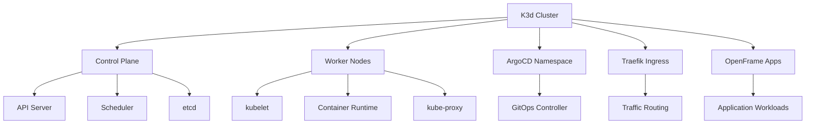
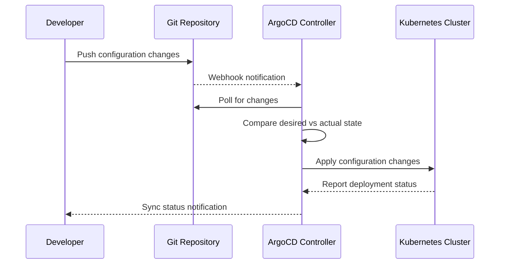

# First Steps with OpenFrame CLI

Now that you have OpenFrame CLI installed and running, let's explore the key features and establish productive workflows. This guide covers the first 5 essential things to do after your initial setup.

## 1. Explore Your Cluster Environment

### Check Cluster Status

Understanding your cluster's current state is crucial for effective management:

```bash
# Get comprehensive cluster information
openframe cluster status my-first-cluster

# View all managed clusters
openframe cluster list

# Check cluster nodes and resources
kubectl get nodes
kubectl get pods -A
kubectl top nodes  # Resource usage
```

### Examine Cluster Components

```bash
# View system components
kubectl get pods -n kube-system

# Check ArgoCD installation
kubectl get pods -n argocd

# View ingress controllers
kubectl get pods -n kube-system -l app.kubernetes.io/name=traefik
```

### Cluster Resource Overview



## 2. Master Basic Cluster Operations

### Cluster Lifecycle Management

Learn the essential cluster operations:

```bash
# Create additional clusters
openframe cluster create staging-cluster

# List all clusters with details
openframe cluster list

# Get detailed status
openframe cluster status staging-cluster

# Delete clusters when no longer needed
openframe cluster delete staging-cluster

# Cleanup unused resources and images
openframe cluster cleanup
```

### Working with Multiple Clusters

```bash
# Switch between cluster contexts
kubectl config get-contexts
kubectl config use-context k3d-my-first-cluster
kubectl config use-context k3d-staging-cluster

# Quick cluster switching with aliases
alias kc-dev='kubectl config use-context k3d-my-first-cluster'
alias kc-staging='kubectl config use-context k3d-staging-cluster'
```

## 3. Understand ArgoCD and GitOps Workflows

### Access ArgoCD UI

```bash
# Get ArgoCD admin password
ARGO_PASSWORD=$(kubectl -n argocd get secret argocd-initial-admin-secret -o jsonpath="{.data.password}" | base64 -d)
echo "ArgoCD Password: $ARGO_PASSWORD"

# Port forward to access UI
kubectl port-forward svc/argocd-server -n argocd 8080:443 &

# Open browser to https://localhost:8080
# Username: admin
# Password: (from command above)
```

### Basic ArgoCD Operations

```bash
# Install ArgoCD CLI (optional)
curl -sSL -o argocd-linux-amd64 https://github.com/argoproj/argo-cd/releases/latest/download/argocd-linux-amd64
sudo install -m 555 argocd-linux-amd64 /usr/local/bin/argocd

# Login via CLI
argocd login localhost:8080 --username admin --password $ARGO_PASSWORD --insecure

# List applications
argocd app list
kubectl get applications -n argocd
```

### GitOps Workflow Example



## 4. Set Up Development Workflows

### Configure Development Tools

Set up tools for local development against your cluster:

```bash
# Verify development tool prerequisites
telepresence version
skaffold version

# Create development namespace
kubectl create namespace development

# Set default namespace for convenience
kubectl config set-context --current --namespace=development
```

### Telepresence Traffic Interception

```bash
# Connect Telepresence to cluster
telepresence connect

# List available services for interception
telepresence list

# Intercept a service (example)
telepresence intercept my-service --port 8080:80

# Your local service on port 8080 now receives cluster traffic
# Test with: curl http://my-service.development.svc.cluster.local
```

### Skaffold Live Development

Create a basic `skaffold.yaml` for live development:

```yaml
# skaffold.yaml
apiVersion: skaffold/v4beta1
kind: Config
metadata:
  name: my-app
build:
  local:
    push: false
  artifacts:
    - image: my-app
      docker:
        dockerfile: Dockerfile
deploy:
  kubectl:
    manifests:
      - k8s/*.yaml
portForward:
  - resourceType: deployment
    resourceName: my-app
    port: 8080
```

```bash
# Start live development mode
skaffold dev

# Or build and deploy once
skaffold run
```

## 5. Learn Common Configuration Patterns

### Environment-Specific Configurations

Create different configurations for various environments:

```bash
# Create namespace-based environments
kubectl create namespace development
kubectl create namespace staging
kubectl create namespace production

# Label namespaces for organization
kubectl label namespace development environment=dev
kubectl label namespace staging environment=staging
kubectl label namespace production environment=prod
```

### Resource Management Best Practices

```yaml
# resource-limits.yaml
apiVersion: v1
kind: LimitRange
metadata:
  name: default-limits
  namespace: development
spec:
  limits:
  - default:
      cpu: 100m
      memory: 128Mi
    defaultRequest:
      cpu: 50m
      memory: 64Mi
    type: Container
```

```bash
# Apply resource limits
kubectl apply -f resource-limits.yaml
```

### Secret Management

```bash
# Create secrets for development
kubectl create secret generic app-secrets \
  --from-literal=database-url="postgresql://localhost:5432/mydb" \
  --from-literal=api-key="your-api-key" \
  --namespace=development

# Use in deployments
kubectl create deployment my-app --image=nginx --namespace=development
kubectl set env deployment/my-app --from=secret/app-secrets --namespace=development
```

## Essential Daily Commands

Create aliases for common operations:

```bash
# Add to ~/.bashrc or ~/.zshrc
alias of='openframe'
alias ofc='openframe cluster'
alias ofch='openframe chart'
alias ofd='openframe dev'

# Kubectl shortcuts
alias k='kubectl'
alias kgp='kubectl get pods'
alias kgs='kubectl get services'
alias kgn='kubectl get nodes'
alias kdp='kubectl describe pod'
alias kl='kubectl logs'

# ArgoCD shortcuts
alias argo='argocd'
alias argoapps='argocd app list'
alias argosync='argocd app sync'
```

## Quick Reference Card

| Task | Command | Description |
|------|---------|-------------|
| **Cluster Status** | `openframe cluster status <name>` | Show detailed cluster information |
| **List Clusters** | `openframe cluster list` | Show all managed clusters |
| **Switch Context** | `kubectl config use-context k3d-<name>` | Switch to specific cluster |
| **ArgoCD Password** | `kubectl -n argocd get secret argocd-initial-admin-secret -o jsonpath="{.data.password}" \| base64 -d` | Get admin password |
| **Port Forward ArgoCD** | `kubectl port-forward svc/argocd-server -n argocd 8080:443` | Access ArgoCD UI |
| **Telepresence Connect** | `telepresence connect` | Connect to cluster for interception |
| **Skaffold Dev** | `skaffold dev` | Start live development mode |
| **Cleanup** | `openframe cluster cleanup` | Remove unused resources |

## Configuration Tips

### 1. Customize Cluster Defaults

Create a configuration file for consistent cluster settings:

```yaml
# ~/.openframe/config.yaml
clusters:
  defaults:
    nodes: 3
    ports:
      http: 80
      https: 443
      api: 6443
    features:
      argocd: true
      ingress: traefik
deployment:
  mode: oss-tenant
  namespace: openframe
```

### 2. Set Up Monitoring

```bash
# Install basic monitoring (example)
kubectl apply -f https://raw.githubusercontent.com/kubernetes/dashboard/v2.7.0/aio/deploy/recommended.yaml

# Create monitoring namespace
kubectl create namespace monitoring
```

### 3. Configure Ingress

```yaml
# ingress.yaml
apiVersion: networking.k8s.io/v1
kind: Ingress
metadata:
  name: my-app-ingress
  namespace: development
  annotations:
    kubernetes.io/ingress.class: traefik
spec:
  rules:
  - host: my-app.local
    http:
      paths:
      - path: /
        pathType: Prefix
        backend:
          service:
            name: my-app
            port:
              number: 80
```

## Where to Get Help

### Built-in Help
```bash
# Command help
openframe --help
openframe cluster --help
openframe bootstrap --help

# Verbose output for debugging
openframe cluster create --verbose
```

### Community Resources
- **Documentation**: Browse the [Development Documentation](../development/README.md)
- **Issues**: Report problems on GitHub
- **Examples**: Check the examples directory
- **Community**: Join discussions and get support

### Troubleshooting Common Issues

```bash
# Check cluster health
kubectl get nodes
kubectl get pods -A | grep -v Running

# View recent events
kubectl get events --sort-by=.metadata.creationTimestamp

# Check ArgoCD application status
kubectl get applications -n argocd
argocd app list
```

## Next Steps

You've now mastered the basics! Here's what to explore next:

1. **[Development Environment Setup](../development/setup/environment.md)** - Configure your IDE and development tools
2. **[Architecture Overview](../development/architecture/overview.md)** - Understand OpenFrame's architecture deeply
3. **[Contributing Guidelines](../development/contributing/guidelines.md)** - Learn how to contribute to the project

### Advanced Topics to Explore

- **Multi-cluster management**: Running multiple environments
- **Custom chart development**: Creating your own ArgoCD applications
- **CI/CD integration**: Automating with OpenFrame CLI
- **Production deployments**: Scaling beyond development

---

> **🎯 Key Takeaway**: OpenFrame CLI is designed to grow with your needs. Start with these basics, then gradually explore advanced features as your requirements evolve.

You're now ready to be productive with OpenFrame CLI! The foundation you've built here will support both simple development tasks and complex multi-environment workflows.