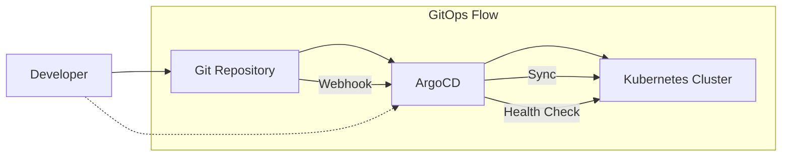
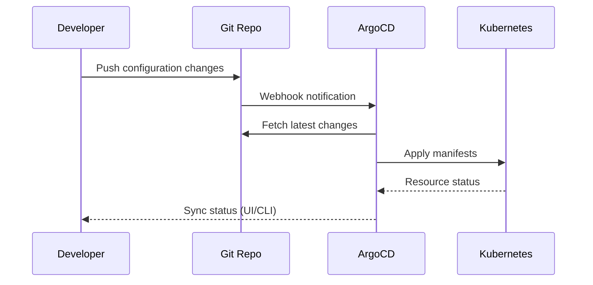

# First Steps with OpenFrame CLI

Now that you have OpenFrame CLI installed and a cluster running, let's explore the essential workflows and features that will make you productive immediately.

## The First 5 Things to Do

### 1. 🎯 Explore Your Cluster

Get familiar with what was created during bootstrap:

```bash
# View your cluster details
openframe cluster status

# List all clusters (in case you have multiple)
openframe cluster list

# Check Kubernetes nodes and system pods
kubectl get nodes -o wide
kubectl get pods -A

# View cluster resources and usage
kubectl top nodes  # If metrics-server is installed
```

**What to look for:**
- ✅ Cluster status shows "Running"
- ✅ All nodes are "Ready" 
- ✅ ArgoCD pods are running in `argocd` namespace
- ✅ Core services (CoreDNS, Traefik) are healthy

### 2. 🚀 Navigate ArgoCD (GitOps Dashboard)

ArgoCD is your GitOps control center - learn to use it effectively:

```bash
# Access ArgoCD (if not already open)
open https://localhost:8080

# Get admin password if needed
kubectl -n argocd get secret argocd-initial-admin-secret -o jsonpath="{.data.password}" | base64 -d
```

**ArgoCD Exploration Checklist:**
- [ ] Login with admin/admin credentials
- [ ] Browse the "Applications" view - see your app-of-apps
- [ ] Click on an application to view its resources
- [ ] Check application health and sync status
- [ ] Explore the "Repository" connections

### 3. 📋 Learn Essential Commands

Master the core OpenFrame CLI workflows:

```bash
# Cluster management
openframe cluster --help           # See all cluster options
openframe cluster create staging   # Create additional clusters  
openframe cluster delete staging   # Clean up test clusters

# Chart management  
openframe chart --help            # Chart installation options
openframe chart install           # Install charts on current cluster

# Development tools
openframe dev --help              # Development workflows
openframe bootstrap --help        # Bootstrap options and flags
```

**Command Aliases to Remember:**
- `openframe k` = `openframe cluster` (k for Kubernetes)
- `openframe c` = `openframe chart` (c for charts)

### 4. 🔧 Configure Your Development Environment

Set up your local tools to work seamlessly with OpenFrame:

```bash
# Configure kubectl context switching
kubectl config get-contexts        # See all contexts
kubectl config use-context k3d-openframe  # Switch to OpenFrame cluster

# Set up helpful aliases  
echo 'alias k=kubectl' >> ~/.bashrc
echo 'alias of=openframe' >> ~/.bashrc
source ~/.bashrc

# Configure shell completion
openframe completion bash > /tmp/openframe_completion
sudo mv /tmp/openframe_completion /etc/bash_completion.d/openframe
```

### 5. 🧪 Deploy Your First Application

Deploy a real application to understand the workflow:

```bash
# Create a simple web application
kubectl create deployment demo-app --image=nginx:alpine --replicas=2

# Create a service
kubectl expose deployment demo-app --port=80 --type=LoadBalancer

# Check deployment status
kubectl get deployments
kubectl get pods -l app=demo-app

# Access the application (K3d automatically maps LoadBalancer)
kubectl get services demo-app
# Note the external IP, should be accessible at http://localhost:PORT
```

## Common Initial Configuration

### Setting Up Development Namespaces

Organize your work with dedicated namespaces:

```bash
# Create development namespaces
kubectl create namespace development
kubectl create namespace staging  
kubectl create namespace testing

# Set default namespace for convenience
kubectl config set-context --current --namespace=development

# Verify current context
kubectl config current-context
kubectl config view --minify | grep namespace
```

### Configuring Resource Quotas

Set up basic resource management:

```bash
# Create a resource quota for development namespace
cat <<EOF | kubectl apply -f -
apiVersion: v1
kind: ResourceQuota
metadata:
  name: dev-quota
  namespace: development
spec:
  hard:
    requests.cpu: "2"
    requests.memory: 4Gi
    limits.cpu: "4"
    limits.memory: 8Gi
    pods: "10"
EOF

# Check quota status
kubectl describe quota -n development
```

## Key Features to Explore

### GitOps Workflows with ArgoCD



**Try this GitOps workflow:**

1. **Fork the OpenFrame charts repository** (if available)
2. **Modify a chart configuration** in your fork
3. **Update ArgoCD** to point to your fork
4. **Watch ArgoCD automatically sync** the changes

### Local Development with Port Forwarding

```bash
# Port-forward ArgoCD for external access
kubectl port-forward -n argocd svc/argocd-server 8080:80 &

# Port-forward your applications
kubectl port-forward svc/demo-app 3000:80 &

# List active port-forwards  
jobs
# Kill background jobs when done: kill %1 %2
```

### Cluster Resource Monitoring

```bash
# Watch resource usage in real-time
watch kubectl get pods -o wide

# Monitor events for troubleshooting
kubectl get events --sort-by=.metadata.creationTimestamp

# Check logs for specific pods
kubectl logs -f deployment/demo-app
```

## Understanding the Architecture

### What's Running in Your Cluster

| Namespace | Component | Purpose |
|-----------|-----------|---------|
| `kube-system` | CoreDNS | Cluster DNS resolution |
| `kube-system` | Traefik | Ingress controller & load balancer |
| `argocd` | ArgoCD Server | GitOps management interface |
| `argocd` | ArgoCD Controller | Application synchronization |
| `argocd` | ArgoCD Repo Server | Git repository management |

### Data Flow Overview



## Where to Get Help

### Built-in Help System

```bash
# Command-specific help
openframe --help
openframe cluster --help
openframe cluster create --help

# Verbose output for troubleshooting
openframe cluster status --verbose
openframe bootstrap --verbose
```

### Kubernetes Troubleshooting

```bash
# Check cluster health
kubectl cluster-info
kubectl get componentstatuses

# Debug pod issues
kubectl describe pod <pod-name>
kubectl logs <pod-name> --previous  # Previous container logs

# Check resource usage
kubectl top pods --all-namespaces
kubectl describe node k3d-openframe-server-0
```

### ArgoCD Troubleshooting

```bash
# Check ArgoCD status
kubectl get pods -n argocd
kubectl logs -n argocd deployment/argocd-server

# ArgoCD CLI (if installed)
argocd app list
argocd app sync <app-name>
```

## Cleanup and Reset

### Clean Up Test Resources

```bash
# Remove demo application
kubectl delete deployment demo-app
kubectl delete service demo-app

# Clean up development resources
kubectl delete namespace development --wait=false
```

### Reset Environment

```bash
# Complete cluster reset
openframe cluster delete openframe
openframe bootstrap  # Start fresh
```

## Next Steps

### Immediate Actions
- [ ] **Bookmark ArgoCD URL** (https://localhost:8080) for quick access
- [ ] **Set up shell aliases** for faster CLI usage
- [ ] **Create dedicated namespaces** for your projects
- [ ] **Deploy a test application** to verify your setup

### Dive Deeper
- **[Local Development Setup](../development/setup/local-development.md)** - Configure IDE and development workflows
- **[Architecture Overview](../development/architecture/overview.md)** - Learn how OpenFrame components interact
- **[Development Workflows](../development/setup/environment.md)** - Set up advanced development tools

### Common Next Projects
```bash
# Try Telepresence for local development
openframe dev intercept my-service

# Set up a multi-environment workflow
openframe cluster create production
openframe cluster create staging

# Explore custom chart deployment
openframe chart install --help
```

---

🎯 **You're now ready to be productive with OpenFrame CLI!** The foundation is set - time to build amazing cloud-native applications with confidence.