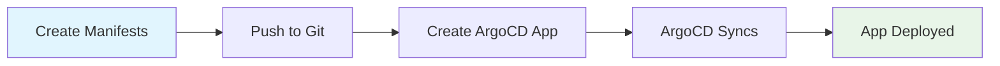
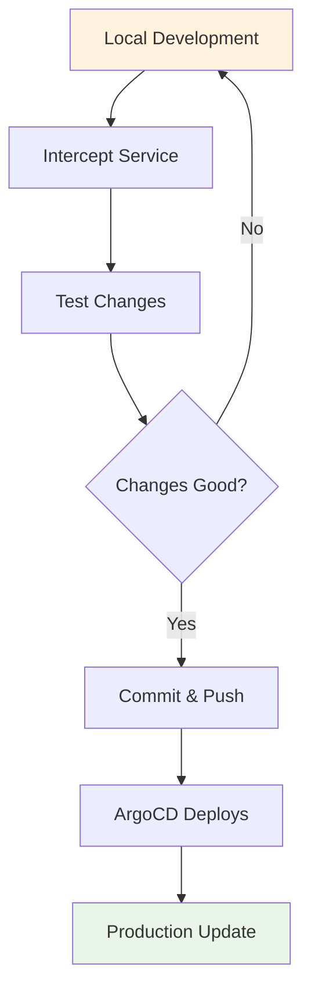

# First Steps with OpenFrame

Congratulations! You have OpenFrame up and running. This guide walks through the first 5 essential activities to get comfortable with your new Kubernetes environment and unlock OpenFrame's key features.

## 1. Explore Your Cluster

Start by understanding what was created and how to interact with it.

### View Cluster Information
```bash
# Get cluster overview
openframe cluster status

# Detailed cluster information  
kubectl cluster-info
kubectl get nodes -o wide

# Check all running workloads
kubectl get pods -A
```

### Understand the Namespaces
```bash
# List all namespaces
kubectl get namespaces

# Key namespaces in your environment:
# - argocd: GitOps deployment platform
# - kube-system: Core Kubernetes components  
# - default: Default application namespace
```

### Explore ArgoCD
```bash
# View ArgoCD applications
kubectl get applications -n argocd

# Check application details
kubectl describe application app-of-apps -n argocd

# Access ArgoCD Web UI
kubectl port-forward svc/argocd-server -n argocd 8080:443
# Open https://localhost:8080 (admin/password from quick-start)
```

**ArgoCD Dashboard**: Your central control panel for managing deployments, viewing sync status, and troubleshooting applications.

## 2. Deploy Your First Application

Learn how to add applications to your GitOps workflow.

### Create a Simple Application
```bash
# Create a sample nginx deployment
kubectl create deployment nginx --image=nginx:alpine
kubectl expose deployment nginx --port=80 --type=ClusterIP

# Verify deployment
kubectl get pods -l app=nginx
kubectl get svc nginx
```

### Test Application Access
```bash
# Port-forward to test locally
kubectl port-forward svc/nginx 8081:80

# Test in browser: http://localhost:8081
# Or via curl: curl http://localhost:8081
```

### Add to ArgoCD (GitOps Pattern)
```yaml
# Create file: nginx-app.yaml
apiVersion: argoproj.io/v1alpha1
kind: Application
metadata:
  name: nginx-example
  namespace: argocd
spec:
  project: default
  source:
    repoURL: https://github.com/your-org/k8s-manifests
    targetRevision: HEAD
    path: nginx
  destination:
    server: https://kubernetes.default.svc
    namespace: default
  syncPolicy:
    automated:
      prune: true
      selfHeal: true
```

```bash
# Apply the application
kubectl apply -f nginx-app.yaml

# Watch ArgoCD sync the application
kubectl get application nginx-example -n argocd -w
```

## 3. Explore Development Tools

OpenFrame includes powerful development features for local-to-remote workflows.

### Traffic Interception Setup
```bash
# Check if telepresence is available
openframe dev --help

# List available services for interception
openframe dev intercept --list

# Create a development namespace
kubectl create namespace development
```

### Service Scaffolding
```bash
# Generate boilerplate service configuration
openframe dev scaffold

# Follow the interactive prompts to:
# - Choose service type (API, worker, frontend)
# - Configure basic settings
# - Generate Kubernetes manifests
```

### Local Development Workflow
```bash
# Intercept traffic from a service
# This redirects production traffic to your local development environment
openframe dev intercept my-service --namespace development

# Your local service now receives live traffic
# Make changes locally and see them reflected immediately
```

## 4. Configuration Management

Understand how to customize your OpenFrame environment.

### View Current Configuration
```bash
# Check cluster configuration
openframe cluster list
k3d cluster list

# View deployment mode
kubectl get configmap openframe-config -n kube-system -o yaml
```

### Deployment Modes

| Mode | Description | Use Case |
|------|-------------|----------|
| **oss-tenant** | Open source tenant deployment | Development, testing, OSS projects |
| **saas-shared** | SaaS shared environment | Multi-tenant staging environments |
| **saas-dedicated** | SaaS dedicated tenant | Production, isolated environments |

```bash
# Create cluster with specific deployment mode
openframe bootstrap --deployment-mode=saas-shared --non-interactive

# Reconfigure existing cluster
openframe chart install --deployment-mode=saas-dedicated
```

### Custom Helm Values
```bash
# View current Helm values
helm get values argocd -n argocd

# Create custom values file
cat > custom-values.yaml << EOF
server:
  service:
    type: LoadBalancer
  config:
    url: https://argocd.your-domain.com
EOF

# Upgrade with custom values
helm upgrade argocd argo/argo-cd -n argocd -f custom-values.yaml
```

## 5. Monitoring and Maintenance

Set up monitoring and learn essential maintenance tasks.

### Health Monitoring
```bash
# Check cluster health
kubectl get nodes
kubectl get pods -A | grep -v Running

# Monitor resource usage
kubectl top nodes
kubectl top pods -A --sort-by=memory

# Check ArgoCD application health
kubectl get applications -n argocd
```

### Log Management
```bash
# View application logs
kubectl logs -l app=nginx -f

# ArgoCD server logs
kubectl logs -n argocd deployment/argocd-server -f

# Cluster events
kubectl get events --sort-by=.metadata.creationTimestamp
```

### Cleanup and Maintenance
```bash
# Remove unused resources
kubectl delete pods --field-selector=status.phase=Succeeded -A
kubectl delete pods --field-selector=status.phase=Failed -A

# Cleanup Docker images (frees disk space)
docker system prune -f

# Restart cluster components if needed
k3d cluster restart openframe-cluster
```

### Backup Important Data
```bash
# Backup ArgoCD configuration
kubectl get applications -n argocd -o yaml > argocd-apps-backup.yaml

# Backup cluster configuration
kubectl config view --raw > kubeconfig-backup.yaml

# Export cluster as container image (advanced)
k3d image export openframe-cluster
```

## Common Workflows

### Adding New Applications


1. **Prepare manifests**: Create Kubernetes YAML files
2. **Version control**: Commit to Git repository  
3. **ArgoCD application**: Define source and destination
4. **Automatic sync**: ArgoCD deploys and monitors
5. **Verify deployment**: Check pods and services

### Development Cycle


## Getting Help

### Built-in Help
```bash
# Command-specific help
openframe cluster --help
openframe chart install --help

# Verbose output for troubleshooting
openframe bootstrap --verbose
```

### Useful Resources
- **Kubernetes Documentation**: [kubernetes.io](https://kubernetes.io/docs/)
- **ArgoCD Guide**: [argo-cd.readthedocs.io](https://argo-cd.readthedocs.io/)
- **K3D Documentation**: [k3d.io](https://k3d.io/)
- **Helm Charts**: [artifacthub.io](https://artifacthub.io/)

### Community Support
- **Issues**: Report problems on the GitHub repository
- **Discussions**: Join community forums for questions
- **Documentation**: Reference docs at `/docs/reference/`

## What's Next?

You're now ready to use OpenFrame effectively! Consider these next steps:

### For Application Development
- **[Development Environment Setup](../development/setup/environment.md)** - Configure IDE and dev tools
- **[Testing Guide](../development/testing/overview.md)** - Write and run tests
- **[Contributing Guidelines](../development/contributing/guidelines.md)** - Contribute to the project

### For Operations
- **Production Deployment**: Move to cloud Kubernetes clusters
- **CI/CD Integration**: Connect your build pipelines to ArgoCD
- **Monitoring Setup**: Add Prometheus, Grafana for observability
- **Security Hardening**: Configure RBAC, network policies, secrets management

### Advanced Features
- **Multi-cluster Management**: Connect multiple Kubernetes clusters
- **Custom Application Sets**: Use ArgoCD ApplicationSets for complex deployments
- **Progressive Delivery**: Implement canary deployments and feature flags

---

> **Congratulations!** 🎉 You've completed the essential first steps with OpenFrame. You now have the foundation to build, deploy, and manage applications effectively in your Kubernetes environment.