# First Steps After Installation

Congratulations! You have OpenFrame CLI installed and a cluster running. This guide covers the essential tasks you should complete to get comfortable with your new environment and start being productive.

## Your First 5 Tasks

### 1. 🔍 Explore Your Environment

Get familiar with what you've created and verify everything is working correctly.

#### Check Cluster Status
```bash
# View detailed cluster information
openframe cluster status

# See cluster resource usage
kubectl top nodes  # (if metrics-server is installed)

# List all running pods across namespaces
kubectl get pods --all-namespaces
```

#### Access Web Interfaces
| Interface | URL | Credentials | Purpose |
|-----------|-----|-------------|---------|
| **OpenFrame Dashboard** | http://localhost:8080 | None | Main application interface |
| **ArgoCD UI** | http://localhost:8443 | `admin` / Get password below | GitOps management |
| **Kubernetes Dashboard** | http://localhost:8081 | Token-based | Cluster visualization |

**Get ArgoCD Password:**
```bash
# Retrieve ArgoCD admin password
kubectl -n argocd get secret argocd-initial-admin-secret -o jsonpath="{.data.password}" | base64 -d && echo
```

#### Explore the Dashboard

Open http://localhost:8080 and familiarize yourself with:
- **Application overview** - See deployed services
- **Health status** - Monitor application health
- **Logs and metrics** - View real-time application data
- **Configuration** - Understand current settings

### 2. ⚙️ Configure Your Development Environment

Set up your local environment for optimal development workflow.

#### Configure kubectl Context
```bash
# Verify current context
kubectl config current-context

# View all available contexts  
kubectl config get-contexts

# Switch contexts if needed
kubectl config use-context k3d-<cluster-name>
```

#### Set Up Helpful Aliases
```bash
# Add to your shell profile (.bashrc, .zshrc, etc.)
echo 'alias of="openframe"' >> ~/.bashrc
echo 'alias k="kubectl"' >> ~/.bashrc
echo 'alias kgp="kubectl get pods"' >> ~/.bashrc
echo 'alias kgs="kubectl get services"' >> ~/.bashrc

# Reload shell
source ~/.bashrc

# Test aliases
of cluster status
k get nodes
```

#### Configure Default Namespace (Optional)
```bash
# Set default namespace to avoid typing -n flag
kubectl config set-context --current --namespace=openframe

# Verify
kubectl config view --minify --output 'jsonpath={..namespace}'; echo
```

### 3. 📦 Understand Application Architecture

Learn how your applications are organized and deployed.

#### Explore Deployed Applications
```bash
# View ArgoCD applications
kubectl get applications -n argocd

# See application details
kubectl get applications -n argocd -o wide

# Describe a specific application
kubectl describe application <app-name> -n argocd
```

#### Understanding the Deployment Structure

```mermaid
flowchart TD
    ArgoCD[🔄 ArgoCD] --> Apps{📱 Applications}
    
    Apps --> Core[🏗️ Core Services]
    Apps --> Platform[🚀 Platform Services] 
    Apps --> Monitoring[📊 Monitoring Stack]
    
    Core --> API[API Gateway]
    Core --> Auth[Authentication]
    Core --> DB[(Database)]
    
    Platform --> Queue[Message Queue]
    Platform --> Cache[Redis Cache]
    Platform --> Storage[Object Storage]
    
    Monitoring --> Prometheus[📈 Prometheus]
    Monitoring --> Grafana[📊 Grafana]
    Monitoring --> Logs[📝 Log Aggregation]
    
    style ArgoCD fill:#e1f5fe
    style Apps fill:#f3e5f5
    style Core fill:#e8f5e8
    style Platform fill:#fff3e0
    style Monitoring fill:#fce4ec
```



#### View Resource Organization
```bash
# List all namespaces
kubectl get namespaces

# See resources in each namespace
kubectl get all -n openframe
kubectl get all -n argocd
kubectl get all -n monitoring  # (if monitoring is installed)
```

### 4. 🚀 Deploy Your First Custom Application

Practice deploying a simple application to understand the workflow.

#### Create a Development Namespace
```bash
# Create namespace for your apps
kubectl create namespace dev-apps

# Label namespace for easy identification
kubectl label namespace dev-apps purpose=development
```

#### Deploy a Sample Application
```bash
# Create a simple web application
cat <<EOF | kubectl apply -f -
apiVersion: apps/v1
kind: Deployment
metadata:
  name: hello-openframe
  namespace: dev-apps
spec:
  replicas: 2
  selector:
    matchLabels:
      app: hello-openframe
  template:
    metadata:
      labels:
        app: hello-openframe
    spec:
      containers:
      - name: web
        image: nginx:alpine
        ports:
        - containerPort: 80
        volumeMounts:
        - name: html
          mountPath: /usr/share/nginx/html
      volumes:
      - name: html
        configMap:
          name: hello-html
---
apiVersion: v1
kind: ConfigMap
metadata:
  name: hello-html
  namespace: dev-apps
data:
  index.html: |
    <!DOCTYPE html>
    <html>
    <head><title>Hello OpenFrame!</title></head>
    <body>
      <h1>🎉 Hello from OpenFrame CLI!</h1>
      <p>This is your first custom application deployment.</p>
      <p>Cluster: $(hostname)</p>
    </body>
    </html>
---
apiVersion: v1
kind: Service
metadata:
  name: hello-openframe
  namespace: dev-apps
spec:
  selector:
    app: hello-openframe
  ports:
  - port: 80
    targetPort: 80
  type: ClusterIP
EOF
```

#### Access Your Application
```bash
# Port-forward to access locally
kubectl port-forward service/hello-openframe 3001:80 -n dev-apps

# Open in browser: http://localhost:3001
# Or test with curl
curl http://localhost:3001
```

#### Monitor Your Deployment
```bash
# Watch deployment status
kubectl get deployments -n dev-apps -w

# View pod logs
kubectl logs -l app=hello-openframe -n dev-apps

# Describe resources for troubleshooting
kubectl describe deployment hello-openframe -n dev-apps
```

### 5. 🔧 Configure Development Workflows

Set up tools and workflows for efficient development.

#### Enable Development Commands
```bash
# Check available development tools
openframe dev --help

# See what's available (these may require additional setup)
openframe dev intercept --help  # Traffic interception
openframe dev skaffold --help   # Live reloading
```

#### Set Up File Watching (if developing locally)
```bash
# Install skaffold for live reloading (optional)
# Skaffold installation: https://skaffold.dev/docs/install/

# Example skaffold.yaml for your app
cat <<EOF > skaffold.yaml
apiVersion: skaffold/v2beta29
kind: Config
build:
  artifacts:
  - image: hello-openframe
    context: .
deploy:
  kubectl:
    manifests:
    - k8s/*.yaml
EOF
```

## Common Initial Configuration

### Environment Variables
Set up useful environment variables for your development workflow:

```bash
# Add to shell profile
echo 'export KUBECONFIG=$HOME/.kube/config' >> ~/.bashrc
echo 'export OPENFRAME_CLUSTER=$(kubectl config current-context)' >> ~/.bashrc  
echo 'export OPENFRAME_NAMESPACE=openframe' >> ~/.bashrc

source ~/.bashrc
```

### Shell Completion
Enable command completion for faster CLI usage:

```bash
# Bash
openframe completion bash > /etc/bash_completion.d/openframe
kubectl completion bash > /etc/bash_completion.d/kubectl

# Zsh  
openframe completion zsh > ~/.oh-my-zsh/completions/_openframe
kubectl completion zsh > ~/.oh-my-zsh/completions/_kubectl

# Fish
openframe completion fish > ~/.config/fish/completions/openframe.fish
kubectl completion fish > ~/.config/fish/completions/kubectl.fish
```

### Development Shortcuts

Create useful scripts for common operations:

```bash
# Create ~/bin/of-reset for quick environment reset
mkdir -p ~/bin
cat <<'EOF' > ~/bin/of-reset
#!/bin/bash
echo "🔄 Resetting OpenFrame environment..."
kubectl delete namespace dev-apps --ignore-not-found
kubectl create namespace dev-apps
echo "✅ Environment reset complete"
EOF
chmod +x ~/bin/of-reset

# Add ~/bin to PATH if not already there
echo 'export PATH=$PATH:$HOME/bin' >> ~/.bashrc
```

## Essential Daily Commands

Bookmark these commands for regular use:

### Cluster Management
```bash
# Quick health check
openframe cluster status

# View cluster resources
kubectl get nodes,pods,services --all-namespaces

# Check cluster events
kubectl get events --sort-by='.lastTimestamp'
```

### Application Management
```bash
# See all applications
kubectl get applications -n argocd

# Sync an application manually
argocd app sync <app-name>

# View application logs
kubectl logs -l app=<app-name> --tail=100
```

### Development Workflow
```bash
# Deploy changes
kubectl apply -f ./k8s/

# Watch deployment progress
kubectl rollout status deployment/<name> -n <namespace>

# Debug pod issues
kubectl describe pod <pod-name>
kubectl exec -it <pod-name> -- /bin/sh
```

## Where to Get Help

When you encounter issues or want to learn more:

### Built-in Help
```bash
# Command help
openframe --help
openframe cluster --help
kubectl explain pod.spec

# Get resource documentation
kubectl explain deployment
kubectl explain service.spec
```

### Useful Resources
- **Kubernetes Documentation**: https://kubernetes.io/docs/
- **ArgoCD Documentation**: https://argo-cd.readthedocs.io/
- **K3d Documentation**: https://k3d.io/
- **OpenFrame CLI GitHub**: Issues and discussions

### Debugging Common Issues

| Issue | Command | Solution |
|-------|---------|----------|
| Pod not starting | `kubectl describe pod <name>` | Check events and resource limits |
| Service not accessible | `kubectl get endpoints` | Verify selector matches pod labels |
| ArgoCD sync failed | `kubectl logs -n argocd -l app.kubernetes.io/name=argocd-server` | Check ArgoCD server logs |
| Cluster not responding | `openframe cluster status` | Restart cluster or check Docker |

## Next Steps

Now that you've completed the first steps:

1. **🏗️ Architecture Deep Dive** - Learn about [OpenFrame architecture](../development/architecture/overview.md)
2. **🛠️ Development Setup** - Set up [advanced development tools](../development/setup/environment.md)  
3. **📝 Contributing** - Read [contributing guidelines](../development/contributing/guidelines.md)
4. **🧪 Testing** - Explore [testing frameworks](../development/testing/overview.md)

## Quick Reference Card

Save this reference for daily use:

```bash
# Essential OpenFrame CLI commands
openframe bootstrap                    # Create new environment  
openframe cluster status               # Check cluster health
openframe cluster list                # List all clusters
openframe cluster delete <name>       # Remove cluster

# Essential kubectl commands  
kubectl get pods --all-namespaces     # See all pods
kubectl logs <pod-name> --tail=50     # View recent logs
kubectl describe <resource> <name>    # Debug resource issues
kubectl port-forward svc/<name> <local-port>:<remote-port>  # Access services

# Quick troubleshooting
docker ps                             # Check Docker containers
kubectl get events                    # See cluster events  
openframe cluster cleanup             # Clean unused resources
```

Congratulations! 🎉 You're now ready to be productive with OpenFrame CLI. You understand the basics, have deployed your first application, and know where to get help. Happy developing!