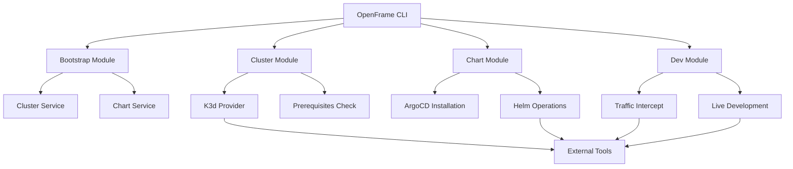

# OpenFrame CLI Introduction

Welcome to OpenFrame CLI - a comprehensive command-line interface for managing Kubernetes clusters and deploying OpenFrame environments. This tool streamlines the entire process of setting up and managing your OpenFrame infrastructure with powerful automation and intuitive workflows.

## What is OpenFrame CLI?

OpenFrame CLI is your one-stop solution for:
- **Kubernetes Cluster Management**: Create, manage, and maintain K3d clusters
- **ArgoCD Integration**: Automated GitOps deployment workflows
- **Development Tools**: Live reloading and traffic interception for local development
- **Complete Environment Bootstrap**: One-command setup for entire OpenFrame environments

## Key Features and Benefits

### 🚀 **Streamlined Setup**
- Single command to bootstrap complete OpenFrame environments
- Interactive configuration wizards for easy customization
- Support for multiple deployment modes (OSS Tenant, SaaS Tenant, SaaS Shared)

### 🔧 **Powerful Cluster Management**
- K3d-based Kubernetes clusters with optimized configuration
- Automatic prerequisites validation and installation
- Comprehensive cluster lifecycle management (create, delete, status, cleanup)

### 🛠 **Development Workflows**
- Telepresence integration for traffic interception
- Skaffold support for live development and hot reloading
- Seamless local-to-cluster development experience

### 📊 **GitOps Ready**
- Built-in ArgoCD installation and configuration
- Helm chart management for OpenFrame applications
- App-of-apps pattern for scalable deployments

## Architecture Overview

## Target Audience

### **DevOps Engineers**
- Platform teams building Kubernetes infrastructure
- Engineers deploying and managing OpenFrame environments
- Teams implementing GitOps workflows

### **Developers**
- Application developers working on OpenFrame applications
- Teams needing local development environments
- Engineers requiring traffic interception and debugging capabilities

### **System Administrators**
- Infrastructure teams managing multiple clusters
- Operations teams maintaining OpenFrame deployments
- Teams requiring automated environment provisioning

## Core Components

| Component | Purpose | Key Commands |
|-----------|---------|--------------|
| **Bootstrap** | Complete environment setup | `openframe bootstrap` |
| **Cluster** | Kubernetes cluster management | `openframe cluster create/delete/list` |
| **Chart** | Helm chart and ArgoCD management | `openframe chart install` |
| **Dev** | Development workflow tools | `openframe dev intercept/skaffold` |

## Quick Overview

### Typical Workflow
1. **Bootstrap**: `openframe bootstrap my-cluster` - Creates cluster and installs charts
2. **Develop**: `openframe dev intercept my-service` - Start developing with traffic interception
3. **Deploy**: Use ArgoCD for automated deployments
4. **Manage**: `openframe cluster status` - Monitor cluster health

### Supported Deployment Modes
- **OSS Tenant**: Open source tenant deployment
- **SaaS Tenant**: Software-as-a-Service tenant setup
- **SaaS Shared**: Multi-tenant shared environment

> **💡 Pro Tip**: Start with the bootstrap command for the fastest way to get a complete OpenFrame environment running!

## Next Steps

Ready to get started? Here's your path forward:

1. **[Prerequisites](prerequisites.md)** - Check system requirements and install dependencies
2. **[Quick Start](quick-start.md)** - Get OpenFrame running in 5 minutes
3. **[First Steps](first-steps.md)** - Learn your first tasks after installation

## Getting Help

- **Command Help**: Use `openframe --help` or `openframe <command> --help`
- **Verbose Mode**: Add `-v` flag for detailed logging
- **Documentation**: Explore the full documentation in `/docs/development/`

---

*Ready to transform your Kubernetes and OpenFrame experience? Let's get started!*