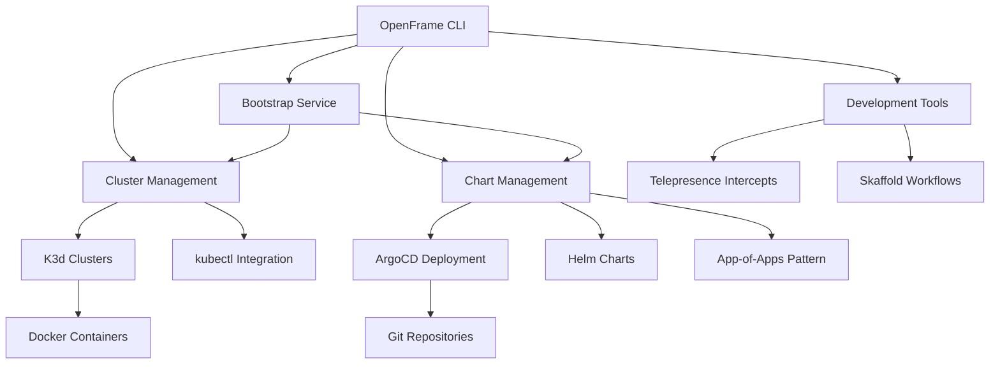

# OpenFrame CLI Introduction

Welcome to OpenFrame CLI - a modern command-line tool that simplifies Kubernetes cluster management and development workflows. Whether you're a developer looking to quickly spin up local clusters or a DevOps engineer managing complex GitOps deployments, OpenFrame CLI provides the tools you need.

## What is OpenFrame CLI?

OpenFrame CLI is a comprehensive Kubernetes bootstrapping and development tool that combines cluster management, GitOps deployment, and local development workflows into a single, user-friendly interface. It's designed to bridge the gap between local development and production-ready Kubernetes environments.

## Key Features

### 🚀 **Rapid Cluster Deployment**
- One-command K3d cluster creation
- Automated prerequisite installation
- Cross-platform support (Windows, macOS, Linux)
- Interactive configuration wizards

### 🎯 **GitOps-Ready Infrastructure**
- Automated ArgoCD installation
- App-of-Apps pattern deployment
- Helm chart management
- Git repository integration

### 🛠️ **Developer-Friendly Tools**
- Telepresence traffic intercepts
- Skaffold live development workflows
- Local service debugging against remote clusters
- Hot-reload development environments

### 📊 **Comprehensive Management**
- Cluster status monitoring
- Resource cleanup utilities
- Multi-cluster management
- Prerequisites validation

## Architecture Overview

## Target Audience

| Audience | Use Cases | Benefits |
|----------|-----------|----------|
| **Developers** | Local K8s development, service debugging, rapid prototyping | Fast cluster setup, traffic intercepts, hot-reload |
| **DevOps Engineers** | GitOps deployment, infrastructure automation, cluster management | ArgoCD integration, automated workflows, multi-cluster support |
| **Platform Teams** | Standardized development environments, onboarding automation | Consistent tooling, prerequisite management, interactive guides |
| **Students/Learners** | Kubernetes exploration, microservices development, GitOps learning | Guided wizards, comprehensive examples, educational resources |

## Core Commands Overview

| Command Group | Purpose | Key Operations |
|---------------|---------|----------------|
| `openframe cluster` | Cluster lifecycle management | create, delete, list, status, cleanup |
| `openframe chart` | GitOps and chart deployment | install (ArgoCD), configure app-of-apps |
| `openframe dev` | Development workflows | intercept, scaffold (Skaffold integration) |
| `openframe bootstrap` | Combined cluster + chart setup | One-command full environment |

## What Makes OpenFrame CLI Different?

### **Interactive Experience**
Unlike traditional CLI tools that require extensive configuration files, OpenFrame CLI provides guided wizards that walk you through setup processes step-by-step.

### **Production-Ready Defaults**
Every cluster created includes production-ready components like ArgoCD for GitOps, proper networking configuration, and security best practices.

### **Developer-Focused**
Built by developers for developers, with features like traffic intercepts and live debugging that make Kubernetes development as smooth as local development.

### **Zero-Configuration Start**
Get from zero to a running Kubernetes cluster with GitOps in under 5 minutes, with automatic prerequisite installation.

## Quick Feature Comparison

| Feature | OpenFrame CLI | kubectl + manual setup | Other Tools |
|---------|---------------|------------------------|-------------|
| **Cluster Creation** | ✅ Interactive wizard | ❌ Manual configuration | ⚠️ Limited options |
| **GitOps Setup** | ✅ Automated ArgoCD | ❌ Manual installation | ⚠️ Basic support |
| **Development Tools** | ✅ Integrated Telepresence | ❌ Separate installation | ❌ Not included |
| **Prerequisites** | ✅ Auto-install | ❌ Manual setup | ⚠️ Partial |
| **Cross-Platform** | ✅ Windows/Mac/Linux | ✅ Yes | ⚠️ Limited |

## Getting Started

Ready to dive in? Here's your next steps:

1. **[Prerequisites](prerequisites.md)** - Check system requirements and install dependencies
2. **[Quick Start](quick-start.md)** - Get your first cluster running in 5 minutes
3. **[First Steps](first-steps.md)** - Explore key features and common workflows

## Community and Support

- **Documentation**: Comprehensive guides and API references
- **GitHub**: Source code, issues, and contributions
- **Community**: Discord/Slack for questions and discussions
- **Examples**: Real-world use cases and deployment patterns

---

**Next**: Learn about the [prerequisites](prerequisites.md) needed to run OpenFrame CLI, or jump straight to the [quick start guide](quick-start.md) if you're ready to begin.