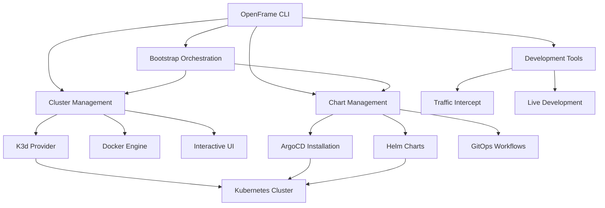

# Introduction to OpenFrame CLI

Welcome to OpenFrame CLI, a modern command-line tool designed to streamline Kubernetes cluster management and development workflows. OpenFrame CLI provides a comprehensive solution for creating K3d clusters, managing ArgoCD deployments, and supporting local development with GitOps practices.

## What is OpenFrame CLI?

OpenFrame CLI is a powerful Go-based command-line tool that simplifies the complexities of Kubernetes cluster management. It combines cluster creation, chart management, and development workflows into a single, intuitive interface that enables developers to:

- **Create and manage K3d clusters** with interactive configuration
- **Deploy ArgoCD and OpenFrame charts** with GitOps workflows
- **Integrate development tools** like Telepresence and Skaffold
- **Bootstrap complete environments** with a single command

## Key Features and Benefits

### 🚀 Streamlined Bootstrap Experience
- **One-command setup**: Get a complete OpenFrame environment running with `openframe bootstrap`
- **Interactive wizards**: Guided setup with smart defaults and validation
- **Multiple deployment modes**: OSS tenant, SaaS tenant, and SaaS shared configurations

### 🔧 Cluster Management
- **K3d integration**: Lightweight Kubernetes clusters using Docker
- **Lifecycle operations**: Create, delete, list, status, and cleanup commands
- **Prerequisites validation**: Automatic checking and guidance for required tools

### 📦 Chart Management
- **ArgoCD installation**: Automated GitOps controller setup
- **Helm integration**: Seamless chart deployment and management
- **App-of-apps pattern**: Scalable application configuration management

### 🛠️ Developer Experience
- **Telepresence support**: Traffic interception for local development
- **Skaffold integration**: Live development and hot reloading
- **Interactive UI**: Beautiful prompts and visual feedback

## Target Audience

OpenFrame CLI is designed for:

### **Platform Engineers**
Setting up and managing multiple Kubernetes environments with consistent configurations and GitOps workflows.

### **DevOps Teams**
Automating deployment pipelines and maintaining development/staging clusters with reproducible setups.

### **Application Developers**
Creating local development environments that mirror production, with tools for debugging and testing.

### **Kubernetes Newcomers**
Learning Kubernetes concepts through guided, interactive experiences without complex manual configuration.

## Architecture Overview



## Core Commands

| Command | Purpose | Example |
|---------|---------|---------|
| `bootstrap` | Complete environment setup | `openframe bootstrap my-cluster` |
| `cluster` | Cluster lifecycle management | `openframe cluster create` |
| `chart` | ArgoCD and chart operations | `openframe chart install` |
| `dev` | Development workflow tools | `openframe dev intercept my-service` |

## Quick Preview

Here's what a typical OpenFrame CLI workflow looks like:

```bash
# Bootstrap a complete environment
openframe bootstrap my-dev-cluster

# Or step by step:
openframe cluster create my-cluster
openframe chart install my-cluster

# Development workflow
openframe dev intercept my-service
openframe dev skaffold my-cluster
```

## What's Next?

Now that you understand what OpenFrame CLI offers, here's your learning path:

1. **[Prerequisites](./prerequisites.md)** - Ensure your system is ready
2. **[Quick Start](./quick-start.md)** - Get up and running in 5 minutes  
3. **[First Steps](./first-steps.md)** - Explore key features and workflows

For developers wanting to contribute or customize OpenFrame CLI, explore the [Development Documentation](../development/README.md).

---

> **💡 Pro Tip**: Start with the bootstrap command for the fastest setup experience. The interactive wizard will guide you through all necessary configurations while teaching you about the underlying components.

Ready to get started? Let's move on to checking your [prerequisites](./prerequisites.md)!