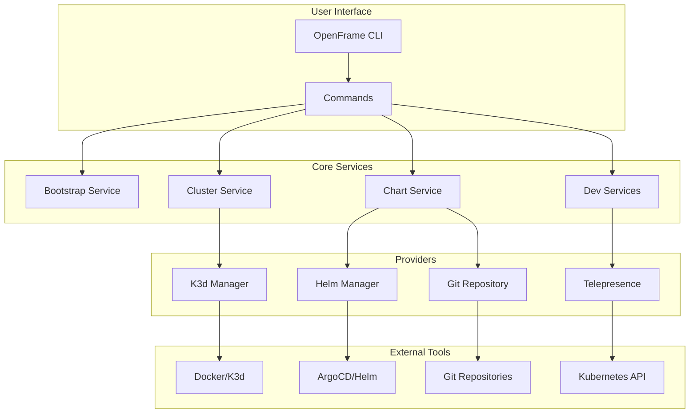

# Introduction to OpenFrame CLI

OpenFrame CLI is a modern Kubernetes platform bootstrapping tool that revolutionizes how you set up and manage OpenFrame deployments. It replaces complex shell scripts with an intuitive interactive terminal interface, making Kubernetes cluster management accessible to both beginners and experts.

## What is OpenFrame CLI?

OpenFrame CLI is your one-stop solution for:

- **Cluster Management**: Create, manage, and destroy Kubernetes clusters with ease
- **Chart Installation**: Deploy ArgoCD and OpenFrame applications seamlessly  
- **Developer Workflows**: Integrate Telepresence for local development and testing
- **Interactive Experience**: Guided setup with intelligent defaults and validation

## Key Features

| Feature | Description | Benefit |
|---------|-------------|---------|
| **Interactive Terminal UI** | Beautiful, intuitive prompts and progress indicators | Reduces learning curve and setup errors |
| **Automated Prerequisites** | Automatic detection and installation of required tools | Zero-config experience for new users |
| **Multiple Deployment Modes** | OSS Tenant, SaaS Tenant, and SaaS Shared configurations | Flexible deployment options for any use case |
| **Built-in Validation** | Comprehensive checks for system requirements and dependencies | Prevents common configuration issues |
| **Developer Integration** | Telepresence intercepts and Skaffold workflows | Streamlined local development experience |
| **ArgoCD Integration** | Automated GitOps workflow setup | Modern application delivery patterns |

## Architecture Overview

## Target Audience

OpenFrame CLI is designed for:

- **Platform Engineers** building Kubernetes infrastructure
- **DevOps Teams** implementing GitOps workflows
- **Developers** needing local Kubernetes environments
- **SREs** managing OpenFrame deployments
- **Teams** transitioning from manual deployment scripts

## Deployment Modes

OpenFrame CLI supports three deployment configurations:

| Mode | Use Case | Target Environment |
|------|----------|-------------------|
| **OSS Tenant** | Open source single-tenant deployments | Development, testing, small production |
| **SaaS Tenant** | Multi-tenant SaaS environments | Production SaaS platforms |
| **SaaS Shared** | Shared infrastructure deployments | Cost-optimized multi-tenancy |

## What You'll Learn

This documentation will guide you through:

1. **[Prerequisites](prerequisites.md)** - System requirements and tool dependencies
2. **[Quick Start](quick-start.md)** - 5-minute setup to get running
3. **[First Steps](first-steps.md)** - Initial configuration and exploration
4. **[Development Setup](../development/setup/environment.md)** - Advanced development workflows
5. **[Architecture Deep Dive](../development/architecture/overview.md)** - Understanding the internal structure

## Why Choose OpenFrame CLI?

> **Before OpenFrame CLI**: Complex bash scripts, manual configuration, error-prone setups
> 
> **With OpenFrame CLI**: Interactive guidance, automated validation, consistent deployments

### Traditional Approach Problems
- Manual prerequisite installation
- Complex configuration files
- No validation or error handling
- Difficult troubleshooting
- Inconsistent environments

### OpenFrame CLI Solutions
- ✅ Automated tool detection and installation  
- ✅ Interactive configuration with intelligent defaults
- ✅ Built-in validation and error recovery
- ✅ Detailed progress indicators and logging
- ✅ Consistent, reproducible environments

## Next Steps

Ready to get started? Choose your path:

- **New Users**: Start with [Prerequisites](prerequisites.md) to ensure your system is ready
- **Quick Setup**: Jump to [Quick Start](quick-start.md) for immediate results
- **Developers**: Check out [Development Setup](../development/setup/environment.md) for contributor workflows

---

**Need Help?** The OpenFrame CLI includes comprehensive built-in help. Run `openframe --help` or `openframe <command> --help` for detailed guidance on any command.