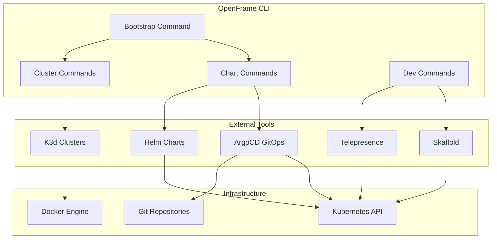

# Introduction to OpenFrame CLI

Welcome to OpenFrame CLI, a modern command-line tool designed to streamline the management of OpenFrame Kubernetes clusters and development workflows. Whether you're a developer looking to set up a local Kubernetes environment or a DevOps engineer managing OpenFrame deployments, this CLI provides everything you need in one comprehensive toolkit.

## What is OpenFrame CLI?

OpenFrame CLI is a unified command-line interface that simplifies the complex process of setting up and managing Kubernetes-based OpenFrame environments. It abstracts away the complexity of orchestrating multiple tools like K3d, Helm, ArgoCD, Telepresence, and Skaffold into simple, intuitive commands.

### 🚀 Key Features

- **One-Command Bootstrap**: Set up a complete OpenFrame environment with a single command
- **K3d Cluster Management**: Create, manage, and clean up lightweight Kubernetes clusters
- **Chart Installation**: Automated ArgoCD and OpenFrame chart deployment with app-of-apps pattern
- **Development Tools**: Integrated Telepresence and Skaffold for local development workflows
- **Multiple Deployment Modes**: Support for OSS Tenant, SaaS Tenant, and SaaS Shared configurations
- **Interactive & CI/CD Ready**: Works both interactively and in automated environments

### 🎯 Target Audience

| Audience | Use Case | Primary Commands |
|----------|----------|------------------|
| **Developers** | Local development environment setup | `bootstrap`, `dev intercept`, `dev skaffold` |
| **DevOps Engineers** | Cluster management and deployment | `cluster create`, `chart install`, `cluster cleanup` |
| **Platform Teams** | OpenFrame environment provisioning | `bootstrap --deployment-mode`, `cluster list` |
| **CI/CD Systems** | Automated testing environments | `bootstrap --non-interactive`, `cluster delete` |

## Architecture Overview

## Core Benefits

### For Developers
- **Fast Setup**: Get a working OpenFrame environment in under 5 minutes
- **Local Development**: Use Telepresence for seamless local-to-cluster development
- **Hot Reloading**: Skaffold integration for rapid iteration cycles
- **Clean Environments**: Easy cluster cleanup and recreation

### For Operations Teams
- **Standardized Deployments**: Consistent environment setup across teams
- **GitOps Ready**: Built-in ArgoCD for declarative deployments
- **Multiple Modes**: Support for different organizational deployment patterns
- **Automation Friendly**: CLI flags for scripted operations

### For Organizations
- **Reduced Onboarding Time**: New developers productive in minutes, not hours
- **Cost Efficiency**: Lightweight K3d clusters reduce resource usage
- **Consistency**: Eliminates "works on my machine" problems
- **Scalability**: Same tools work from laptop to production

## Quick Command Overview

| Command | Purpose | Example |
|---------|---------|---------|
| `openframe bootstrap` | Set up complete environment | `openframe bootstrap my-dev-cluster` |
| `openframe cluster create` | Create K3d cluster | `openframe cluster create production` |
| `openframe chart install` | Install OpenFrame charts | `openframe chart install --deployment-mode=oss-tenant` |
| `openframe dev intercept` | Local service development | `openframe dev intercept my-service` |
| `openframe cluster cleanup` | Clean up resources | `openframe cluster cleanup --all` |

## Deployment Modes

OpenFrame CLI supports three deployment modes to match different organizational needs:

| Mode | Description | Use Case |
|------|-------------|----------|
| **OSS Tenant** | Open-source single-tenant setup | Individual developers, small teams |
| **SaaS Tenant** | Software-as-a-Service tenant environment | Enterprise customers, isolated tenants |
| **SaaS Shared** | Shared SaaS infrastructure | Multi-tenant SaaS deployments |

## What's Next?

Ready to get started? Here's your learning path:

1. **[Prerequisites](prerequisites.md)** - Check what you need installed
2. **[Quick Start](quick-start.md)** - Get up and running in 5 minutes  
3. **[First Steps](first-steps.md)** - Essential tasks after installation

For developers wanting to contribute or customize:

4. **[Development Setup](../development/setup/environment.md)** - Set up your development environment
5. **[Architecture Deep Dive](../development/architecture/overview.md)** - Understand the system design

## Getting Help

- **Command Help**: Use `--help` flag with any command (e.g., `openframe bootstrap --help`)
- **Interactive Mode**: Most commands support interactive prompts for guidance
- **Verbose Output**: Add `--verbose` or `-v` for detailed logging
- **GitHub Issues**: Report bugs or request features on the project repository

---

> 💡 **Pro Tip**: Start with `openframe bootstrap` for the fastest way to experience OpenFrame CLI's capabilities. The bootstrap command handles all the complexity of setting up a complete environment in one simple command.