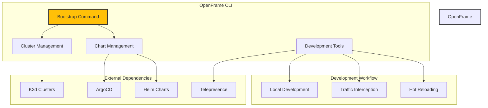

# OpenFrame CLI Introduction

Welcome to OpenFrame CLI - a comprehensive command-line interface for managing Kubernetes clusters and OpenFrame environments with streamlined workflows for local development.

## What is OpenFrame CLI?

OpenFrame CLI is a powerful tool that simplifies the complete lifecycle management of Kubernetes clusters and OpenFrame deployments. It provides an integrated experience for developers and teams who want to quickly set up, manage, and develop with OpenFrame in local environments.

### Elevator Pitch

**"One command to rule them all"** - OpenFrame CLI transforms complex Kubernetes and OpenFrame setup from hours of manual configuration to minutes of automated deployment. Whether you're a developer wanting to quickly spin up a local environment or a team lead standardizing development workflows, OpenFrame CLI provides the streamlined experience you need.

## Key Features & Benefits

| Feature | Benefit | Use Case |
|---------|---------|----------|
| **One-Command Bootstrap** | Complete environment setup in minutes | New team member onboarding |
| **Cluster Lifecycle Management** | Full K3d cluster automation | Local development environments |
| **ArgoCD Integration** | GitOps-ready deployments | Continuous deployment workflows |
| **Development Tools** | Traffic interception and hot reloading | Active development and debugging |
| **Interactive UI** | Guided setup with smart defaults | Reduced configuration errors |
| **Multiple Deployment Modes** | OSS-tenant, SaaS-tenant, SaaS-shared | Different organizational needs |

## Target Audience

### Primary Users
- **Local Developers** - Setting up development environments quickly
- **DevOps Engineers** - Standardizing cluster and deployment workflows  
- **Team Leads** - Onboarding new developers efficiently
- **Platform Engineers** - Managing multiple OpenFrame environments

### Prerequisites Knowledge
- Basic Kubernetes concepts
- Command-line interface familiarity
- Docker containerization understanding
- Git workflow knowledge

## Architecture Overview



## Quick Feature Tour

### 🚀 Bootstrap Command
```bash
openframe bootstrap
```
One command that creates a Kubernetes cluster and installs all OpenFrame components with interactive configuration.

### 🎯 Cluster Management
```bash
openframe cluster create my-dev-cluster
openframe cluster list
openframe cluster status
```
Complete lifecycle management of local K3d clusters for development.

### 📦 Chart Management
```bash
openframe chart install
```
Automated ArgoCD and OpenFrame chart installation with deployment mode selection.

### ⚡ Development Tools
```bash
openframe dev intercept my-service
openframe dev skaffold my-cluster  
```
Live development workflows with traffic interception and hot reloading.

## Product Walkthrough Video

Get a comprehensive overview of OpenFrame and its capabilities:



## Next Steps

Ready to get started? Here's your learning path:

1. **[Check Prerequisites](./prerequisites.md)** - Ensure your system is ready
2. **[Quick Start Guide](./quick-start.md)** - 5-minute setup and "Hello World"
3. **[First Steps](./first-steps.md)** - Essential post-installation tasks
4. **[Development Setup](../development/setup/environment.md)** - Configure your development environment

## Getting Help

- **Documentation**: Browse the complete documentation in this repository
- **Issues**: Report bugs and feature requests on GitHub  
- **Community**: Join our community channels for support and discussions
- **Video Tutorials**: Check the OpenFrame YouTube channel for walkthroughs

---

**Welcome to the OpenFrame ecosystem!** 🎉