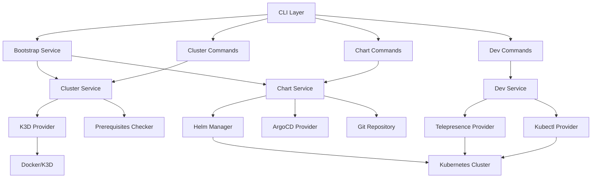

# OpenFrame CLI Introduction

Welcome to OpenFrame CLI, a modern, interactive command-line tool that revolutionizes how you manage Kubernetes clusters and development workflows for the OpenFrame platform.

## What is OpenFrame CLI?

OpenFrame CLI is a Go-based command-line interface that replaces traditional shell scripts with a polished, wizard-style interactive experience. It provides comprehensive Kubernetes cluster lifecycle management, streamlined chart installations with ArgoCD, and powerful development tools for modern cloud-native workflows.

## Key Features

### 🚀 **Interactive Wizard Experience**
- Step-by-step guided setup for new users
- Flag-based operation for automation and power users
- Consistent UI with progress tracking and validation

### 🏗️ **Cluster Management**
- K3d cluster lifecycle operations (create, delete, list, status)
- Automated prerequisite checking and installation
- Local development environment optimization

### 📦 **Chart Installation & Management**
- ArgoCD integration with app-of-apps pattern
- Helm chart management and validation
- Git repository integration for GitOps workflows

### 🛠️ **Developer Tools**
- Telepresence service intercepts for local development
- Skaffold integration for continuous development
- Service scaffolding and namespace management

### ✅ **Prerequisite Management**
- Automatic tool validation and installation
- Support for Docker, kubectl, Helm, ArgoCD, and more
- Cross-platform compatibility

## Architecture Overview

## Target Audience

OpenFrame CLI is designed for:

- **DevOps Engineers** managing Kubernetes infrastructure
- **Platform Engineers** building internal developer platforms  
- **Software Developers** needing local Kubernetes environments
- **Site Reliability Engineers** maintaining OpenFrame deployments
- **Development Teams** adopting GitOps and cloud-native practices

## Benefits

| Benefit | Description |
|---------|-------------|
| **Simplified Setup** | One command bootstrap for complete OpenFrame environment |
| **Developer Experience** | Interactive prompts with validation and error handling |
| **GitOps Ready** | Built-in ArgoCD integration with app-of-apps pattern |
| **Local Development** | Optimized K3d clusters with development tool integration |
| **Extensible** | Modular architecture supporting multiple providers |
| **Cross-Platform** | Works on Windows, macOS, and Linux |

## Common Use Cases

### 🎯 **Quick Local Development**
Set up a complete OpenFrame environment in minutes for local development and testing.

### 🎯 **CI/CD Pipeline Integration**
Automate cluster creation and application deployment in continuous integration workflows.

### 🎯 **Service Development**
Use Telepresence intercepts to develop and debug services in realistic Kubernetes environments.

### 🎯 **Platform Onboarding** 
Provide new team members with consistent, reproducible OpenFrame environments.

## What's Next?

Ready to get started? Here's your learning path:

1. **[Prerequisites](prerequisites.md)** - Check system requirements and install dependencies
2. **[Quick Start](quick-start.md)** - Get OpenFrame running in 5 minutes
3. **[First Steps](first-steps.md)** - Explore key features and common workflows

> **💡 Need Help?** Join our community channels or check the comprehensive reference documentation for detailed guides and troubleshooting tips.

---

*OpenFrame CLI replaces traditional shell scripts with a modern, interactive terminal experience following best practices for CLI design. Experience the future of Kubernetes platform management.*