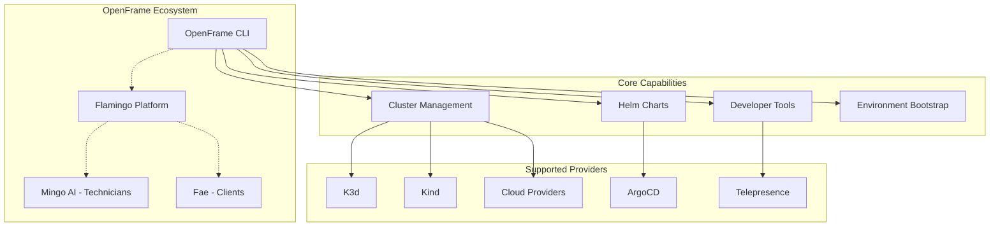
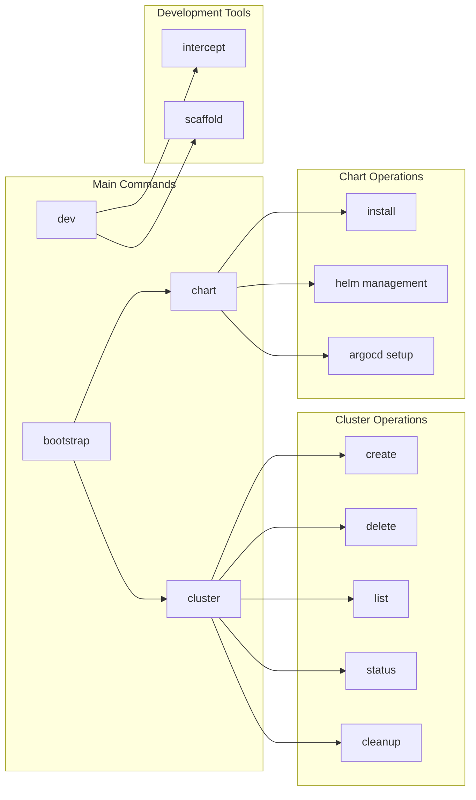

# Introduction to OpenFrame CLI

OpenFrame CLI is a modern, interactive command-line tool designed to revolutionize how you manage Kubernetes clusters and development workflows. As part of the Flamingo AI-powered MSP platform, it replaces complex shell scripts with intuitive wizard-style interfaces while providing the power and flexibility needed for professional development environments.

## What is OpenFrame CLI?

OpenFrame CLI is a unified platform that integrates multiple MSP (Managed Service Provider) tools into a single AI-driven interface. It automates IT support operations across your entire development stack, from local Kubernetes clusters to production deployments.

> **Key Insight**: OpenFrame CLI transforms the traditionally complex process of Kubernetes cluster management into an intuitive, guided experience suitable for developers of all skill levels.

## Platform Overview

## Key Features

| Feature | Description | Benefit |
|---------|-------------|---------|
| **Interactive Wizard** | Step-by-step guided setup process | Reduces learning curve and setup errors |
| **Cluster Management** | Support for K3d, Kind, and cloud providers | Flexibility across development environments |
| **Helm Integration** | App-of-Apps pattern with ArgoCD | GitOps best practices out of the box |
| **Developer Tools** | Telepresence intercepts and scaffolding | Streamlined local development workflows |
| **Prerequisite Checking** | Validates required tools before execution | Prevents common setup failures |
| **Cross-Platform** | Windows, macOS, and Linux support | Consistent experience across teams |

## Target Audience

### 🛠️ **Platform Engineers**
- Setting up and maintaining Kubernetes environments
- Implementing GitOps workflows with ArgoCD
- Managing infrastructure as code

### 👨‍💻 **Application Developers**  
- Local development with service intercepts
- Testing applications against remote clusters
- Scaffolding new microservices

### 🏢 **DevOps Teams**
- Automating environment provisioning
- Standardizing development workflows
- Implementing consistent deployment patterns

### 📚 **Kubernetes Learners**
- Learning Kubernetes concepts through guided workflows
- Experimenting with cloud-native technologies
- Understanding modern development practices

## Core Commands Overview

## Why Choose OpenFrame CLI?

### **Traditional Approach**
- Complex shell scripts
- Manual prerequisite management  
- Inconsistent environments
- Steep learning curve
- Error-prone setup processes

### **OpenFrame CLI Approach**
- Interactive guided workflows
- Automatic prerequisite validation
- Standardized environments  
- Gentle learning curve
- Robust error handling and recovery

## Quick Wins

After installing OpenFrame CLI, you'll be able to:

1. **Create a full Kubernetes environment in under 5 minutes**
2. **Bootstrap ArgoCD with production-ready configurations**
3. **Intercept microservices for local development**
4. **Deploy new applications using proven templates**
5. **Manage multiple cluster environments effortlessly**

## Community and Support

OpenFrame is backed by a vibrant open-source community:

- 🚀 **Open Source**: Fully transparent and community-driven
- 💬 **Slack Community**: Join the [OpenMSP Slack](https://join.slack.com/t/openmsp/shared_invite/zt-36bl7mx0h-3~U2nFH6nqHqoTPXMaHEHA) for real-time support
- 📖 **Comprehensive Documentation**: Detailed guides and API references
- 🔄 **Regular Updates**: Active development with frequent releases

> **Important**: We manage all support and discussions through our [OpenMSP Slack community](https://www.openmsp.ai/). GitHub Issues and Discussions are not monitored.

## Next Steps

Ready to get started? Here's your learning path:

1. **[Prerequisites Guide](prerequisites.md)** - Ensure your system is ready
2. **[Quick Start](quick-start.md)** - Get up and running in 5 minutes  
3. **[First Steps](first-steps.md)** - Explore key features and workflows
4. **[Development Setup](../development/setup/environment.md)** - Configure your development environment

## Hardware Requirements

Before proceeding, ensure your system meets these requirements:

| Resource | Minimum | Recommended | Notes |
|----------|---------|-------------|-------|
| **RAM** | 24GB | 32GB | Kubernetes overhead + applications |
| **CPU** | 6 cores | 12 cores | Container orchestration demands |
| **Disk** | 50GB | 100GB | Images, logs, and persistent volumes |
| **OS** | Windows 10+, macOS 10.15+, Linux | Latest versions | Cross-platform compatibility |

## Platform-Specific Downloads

Choose your platform to get started:

| Platform | Download Link | Notes |
|----------|---------------|-------|
| **Windows AMD64** | [openframe-cli_windows_amd64.zip](https://github.com/flamingo-stack/openframe-cli/releases/latest/download/openframe-cli_windows_amd64.zip) | Extract and run installer |
| **macOS** | [Latest Release](https://github.com/flamingo-stack/openframe-cli/releases/latest) | Universal binary available |
| **Linux** | [Latest Release](https://github.com/flamingo-stack/openframe-cli/releases/latest) | Multiple architectures supported |

---

*Ready to transform your Kubernetes development experience? Let's [check your prerequisites](prerequisites.md) and get started!*