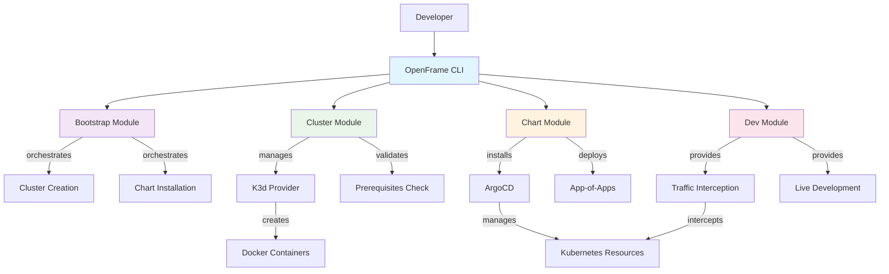

# OpenFrame CLI Introduction

## What is OpenFrame CLI?

OpenFrame CLI is a comprehensive Kubernetes cluster management tool designed to streamline local development workflows. It provides a unified command-line interface for creating K3d clusters, installing ArgoCD charts, and managing development environments with traffic interception capabilities.

**🎯 In one sentence:** OpenFrame CLI transforms complex Kubernetes development setup into simple, one-command workflows that get you from zero to a fully configured local cluster in minutes.

## Key Features & Benefits

| Feature | Description | Benefit |
|---------|-------------|---------|
| **One-Command Bootstrap** | Complete environment setup with `openframe bootstrap` | Eliminates multi-step setup complexity |
| **K3d Integration** | Native K3d cluster lifecycle management | Lightweight, fast local Kubernetes clusters |
| **ArgoCD Automation** | Automatic ArgoCD and app-of-apps installation | GitOps-ready from day one |
| **Development Tools** | Built-in Telepresence and Skaffold support | Seamless local development workflows |
| **Interactive Wizards** | Smart configuration prompts and validation | Reduces configuration errors |
| **Multiple Deployment Modes** | OSS-tenant, SaaS-tenant, SaaS-shared options | Flexible for different use cases |

## Target Audience

### 👨‍💻 Developers
- **Local Kubernetes development** - Set up clusters quickly for testing and development
- **Microservices development** - Traffic interception and live debugging capabilities
- **GitOps workflows** - ArgoCD integration for continuous deployment

### 🏢 DevOps Teams  
- **Environment standardization** - Consistent local development environments
- **CI/CD integration** - Non-interactive modes for automated workflows
- **Infrastructure as Code** - Version-controlled cluster configurations

### 🚀 Platform Engineers
- **Multi-tenant deployments** - Support for different deployment models
- **Developer productivity** - Self-service cluster provisioning
- **Kubernetes adoption** - Simplified onboarding to Kubernetes

## Architecture Overview



## Quick Start Preview

Here's what the OpenFrame experience looks like:

```bash
# Complete environment in one command
openframe bootstrap my-cluster

# Or step by step
openframe cluster create my-cluster
openframe chart install my-cluster
openframe dev intercept my-service
```

Expected output:
```text
🚀 OpenFrame CLI v1.0.0

✅ Prerequisites validated
✅ K3d cluster 'my-cluster' created
✅ ArgoCD installed and configured
✅ App-of-apps deployed successfully

🎉 Environment ready! Access ArgoCD at: http://localhost:8080
```

## Product Walkthrough

Get a comprehensive overview of OpenFrame's capabilities:



## What's Next?

### For First-Time Users
1. **[Prerequisites Guide](./prerequisites.md)** - Check system requirements
2. **[Quick Start Guide](./quick-start.md)** - 5-minute setup
3. **[First Steps Guide](./first-steps.md)** - Explore core features

### For Developers
1. **[Development Environment Setup](../development/setup/environment.md)** - Configure your IDE
2. **[Local Development Guide](../development/setup/local-development.md)** - Running locally
3. **[Architecture Overview](../development/architecture/overview.md)** - Understanding the system

### Common Use Cases

#### 🎯 Local Development
Perfect for developing and testing applications on a local Kubernetes cluster with GitOps workflows.

#### 🔄 CI/CD Integration
Non-interactive modes support automated testing and deployment pipelines.

#### 🏗️ Learning Kubernetes
Simplified way to experiment with Kubernetes concepts without complex setup.

#### 🔧 Prototyping
Quickly spin up environments to test new ideas or configurations.

## Getting Help

- **Commands help**: Run any command with `--help` flag
- **Interactive modes**: Most commands offer guided configuration
- **Prerequisites validation**: Built-in checks ensure proper setup
- **Detailed logging**: Use `--verbose` flag for troubleshooting

Ready to get started? Head to the [Prerequisites Guide](./prerequisites.md) to prepare your system!