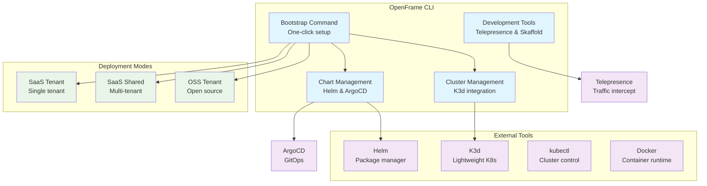

# OpenFrame CLI Introduction

Welcome to OpenFrame CLI - a comprehensive command-line tool designed to streamline Kubernetes cluster management and OpenFrame platform deployment. Whether you're a developer looking to set up a local development environment or an operator managing production workloads, OpenFrame CLI provides the tools you need to get started quickly.

## What is OpenFrame CLI?

OpenFrame CLI is a powerful command-line interface that combines cluster creation, chart management, and development tools into a single, cohesive workflow. Built on top of industry-standard tools like K3d, Helm, and kubectl, it abstracts away the complexity of Kubernetes operations while maintaining full control and flexibility.

**🚀 Elevator Pitch**: *Set up a complete OpenFrame development environment in under 5 minutes with a single command - from cluster creation to application deployment.*

## Key Features & Benefits

| Feature | Benefit | Use Case |
|---------|---------|----------|
| **One-Command Bootstrap** | Complete environment setup with `bootstrap` command | Quick project onboarding |
| **Multi-Provider Support** | K3d clusters for local development | Development flexibility |
| **Integrated ArgoCD** | GitOps-ready deployments out of the box | Production-ready workflows |
| **Development Tools** | Built-in Telepresence and Skaffold integration | Local development workflows |
| **Interactive & CI/CD Modes** | Both human-friendly and automation-ready | All environments |
| **Extensible Architecture** | Clean separation of concerns | Easy maintenance and updates |

## Target Audience

### 👩‍💻 **Developers**
- Need local Kubernetes environments for application development
- Want integrated debugging tools (Telepresence)
- Require fast iteration cycles with Skaffold

### 🔧 **DevOps Engineers**  
- Managing multiple cluster deployments
- Setting up CI/CD pipelines with GitOps
- Standardizing development environments across teams

### 🎯 **Platform Teams**
- Bootstrapping new environments quickly
- Managing OpenFrame platform deployments
- Ensuring consistent cluster configurations

## Architecture Overview



## Quick Start Preview

Here's what you can accomplish in just a few commands:

```bash
# Install OpenFrame CLI
curl -sSL https://get.openframe.io | bash

# Bootstrap complete environment (cluster + platform)
openframe bootstrap my-dev-cluster

# Start developing with traffic interception
openframe dev intercept my-service
```

That's it! You'll have a running Kubernetes cluster with OpenFrame deployed and ready for development.

## Core Commands at a Glance

| Command | Purpose | Example |
|---------|---------|---------|
| `bootstrap` | Complete environment setup | `openframe bootstrap` |
| `cluster create` | Create Kubernetes cluster | `openframe cluster create` |
| `cluster list` | Show available clusters | `openframe cluster list` |
| `chart install` | Deploy ArgoCD and apps | `openframe chart install` |
| `dev intercept` | Local development | `openframe dev intercept` |

## What's Next?

Ready to get started? Here's your learning path:

1. **[Prerequisites](prerequisites.md)** - Check system requirements and install dependencies
2. **[Quick Start](quick-start.md)** - Get your first environment running in 5 minutes  
3. **[First Steps](first-steps.md)** - Explore key features and workflows
4. **[Development Setup](../development/setup/environment.md)** - Configure your development environment

## Getting Help

- 📖 **Documentation**: Browse the complete docs in this repository
- 🐛 **Issues**: Report bugs and feature requests on GitHub
- 💬 **Community**: Join our Discord for real-time help
- 🎥 **Video Tutorial**: Watch our comprehensive walkthrough



---

> **💡 Pro Tip**: Start with the `bootstrap` command for the fastest way to get a complete environment. You can always customize individual components later using the specific `cluster` and `chart` commands.