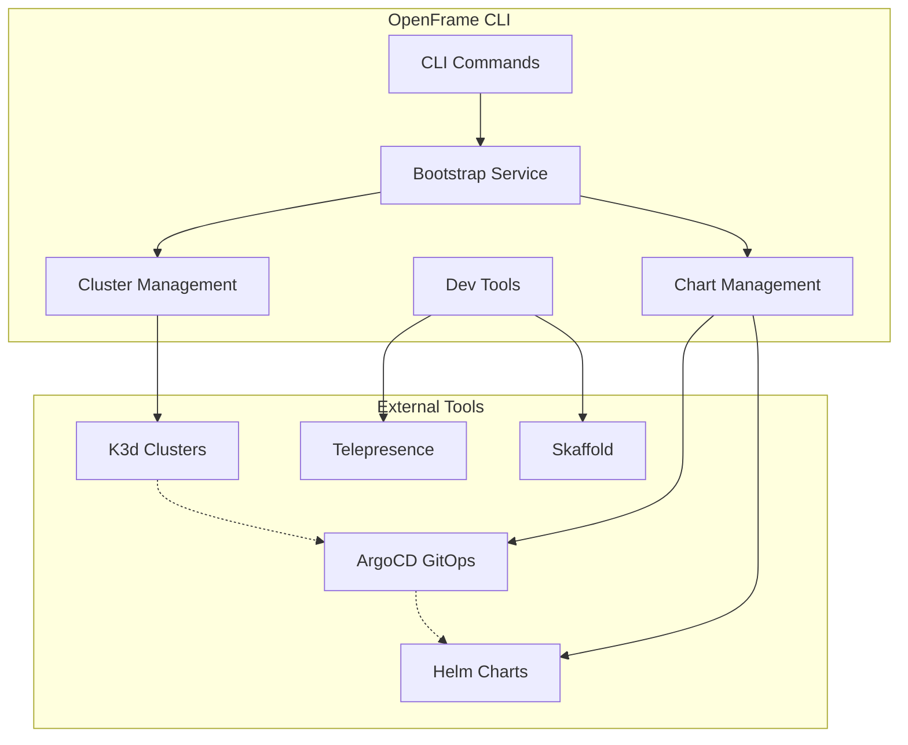

# OpenFrame CLI Introduction

Welcome to OpenFrame CLI - a modern command-line tool that streamlines Kubernetes development workflows and cluster management for local development environments.

## What is OpenFrame CLI?

OpenFrame CLI is a unified command-line interface that combines cluster lifecycle management, GitOps deployment, and local development tools into a single, cohesive workflow. It's designed to eliminate the complexity of setting up and managing Kubernetes development environments.

### 🎯 Elevator Pitch

**"OpenFrame CLI lets developers bootstrap production-ready Kubernetes environments in minutes, not hours - complete with GitOps, monitoring, and local development tools."**

## Key Features & Benefits

| Feature | Benefit | Use Case |
|---------|---------|----------|
| **One-Command Bootstrap** | Get from zero to working K8s environment in ~5 minutes | Quick prototyping, new team onboarding |
| **K3d Integration** | Lightweight K8s clusters without Docker Desktop overhead | Local development, CI/CD testing |
| **ArgoCD GitOps** | Production-ready deployment patterns from day one | Application lifecycle management |
| **Telepresence Support** | Debug services locally while connected to remote cluster | Microservice development & debugging |
| **Skaffold Integration** | Hot-reload development workflows | Rapid iteration cycles |

## Target Audience

### 👩‍💻 Primary Users
- **Kubernetes developers** building microservices and cloud-native applications
- **DevOps engineers** setting up development environments and CI/CD pipelines
- **Platform teams** standardizing local development workflows

### 🏢 Organizations
- **Startups** needing production-ready K8s patterns without complexity
- **Enterprise teams** migrating to Kubernetes-first development
- **Open-source projects** providing contributor onboarding

## Architecture Overview



## Deployment Modes

OpenFrame CLI supports three deployment modes to fit different use cases:

| Mode | Description | Best For |
|------|-------------|----------|
| **`oss-tenant`** | Single-tenant open-source setup | Individual developers, small teams |
| **`saas-tenant`** | Multi-tenant SaaS configuration | Enterprise development teams |
| **`saas-shared`** | Shared SaaS resources setup | Platform teams, shared environments |

## Quick Command Reference

```bash
# Complete environment setup
openframe bootstrap

# Cluster lifecycle
openframe cluster create
openframe cluster list
openframe cluster status
openframe cluster delete

# Chart management
openframe chart install

# Development tools
openframe dev intercept my-service
openframe dev skaffold my-app
```

## What You'll Learn

After working through the getting-started documentation, you'll be able to:

✅ **Install and configure** OpenFrame CLI on your development machine  
✅ **Bootstrap** a complete Kubernetes environment with GitOps in under 5 minutes  
✅ **Understand** the core components and how they work together  
✅ **Navigate** the CLI commands and common workflows  
✅ **Troubleshoot** common setup issues and get help when needed  

## Next Steps

Ready to get started? Follow this recommended path:

1. **[Prerequisites](./prerequisites.md)** - Check system requirements and install dependencies
2. **[Quick Start](./quick-start.md)** - Get OpenFrame running in 5 minutes  
3. **[First Steps](./first-steps.md)** - Explore key features and common workflows

## Getting Help

- 📖 **Documentation**: Browse the `/development` section for architecture and advanced topics
- 🐛 **Issues**: Report bugs and request features on GitHub
- 💬 **Community**: Join discussions and get support from other users

---

**Welcome to the OpenFrame ecosystem!** Let's build something amazing together. 🚀