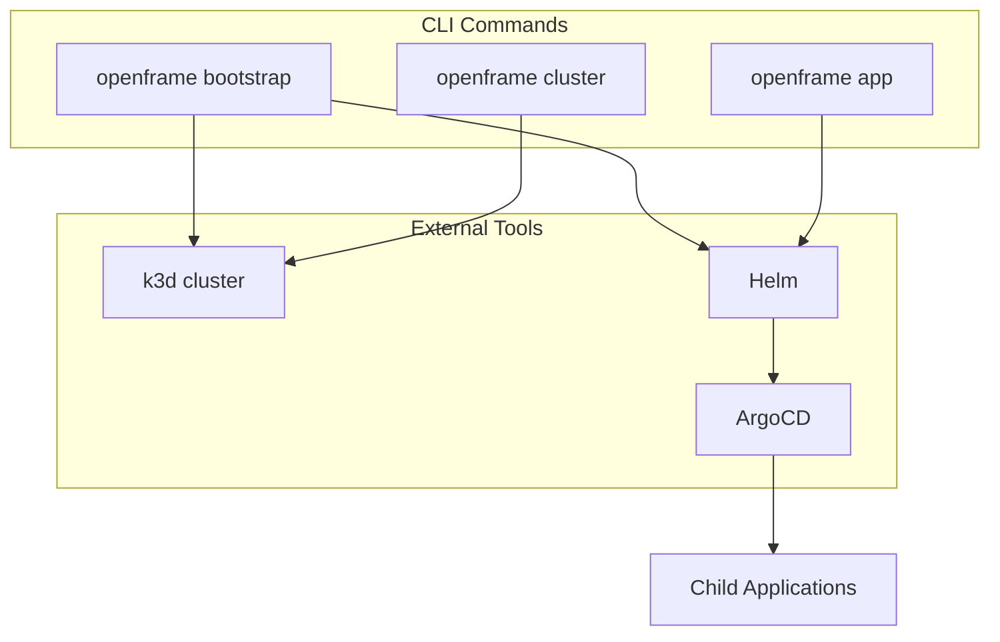

# Introduction to OpenFrame CLI

`openframe` is an interactive command-line tool for creating and managing OpenFrame Kubernetes environments. It provisions local k3d clusters and deploys the OpenFrame platform through an ArgoCD GitOps workflow.

## What is OpenFrame CLI?

OpenFrame is an open-source MSP platform that replaces expensive proprietary software with open-source alternatives — integrating tools such as Tactical RMM, MeshCentral, Fleet MDM, and Authentik. The CLI is how you stand up and manage an OpenFrame environment.

This repository (`flamingo-stack/openframe-cli`) is the CLI itself. The platform and application manifests it deploys live in [`flamingo-stack/openframe-oss-tenant`](https://github.com/flamingo-stack/openframe-oss-tenant).

## Key Features

### Environment bootstrapping

- `openframe bootstrap` creates a cluster and installs the platform in one step
- Deployment modes: `oss-tenant` (default, self-hosted), `saas-tenant`, `saas-shared`

### Cluster management

- Create, delete, list, and inspect local k3d clusters
- `openframe cluster status` reports cluster health

### Platform deployment

- `openframe app install` clones `openframe-oss-tenant` and helm-installs the `app-of-apps` chart
- The chart creates an ArgoCD root Application (`argocd-apps`) that fans out to all child applications
- Upgrade, inspect, access, and uninstall the deployment with `openframe app`

### Self-updating

- `openframe update` replaces the running binary with a checksum- and cosign-verified release, keeping a backup for rollback

## How It Works

1. **Bootstrap** — `openframe bootstrap` creates a k3d cluster and installs the platform
2. **Deploy / manage** — `openframe app` installs and manages the app-of-apps deployment
3. **Monitor** — `openframe cluster status` and `openframe app status` report health

The CLI handles cluster creation, tool installation, and GitOps wiring so you can focus on running the platform.

## Architecture Overview

```mermaid
graph TB
    subgraph "CLI Commands"
        Bootstrap[openframe bootstrap]
        Cluster[openframe cluster]
        App[openframe app]
    end

    subgraph "External Tools"
        K3D[k3d cluster]
        Helm[Helm]
        ArgoCD[ArgoCD]
    end

    Bootstrap --> K3D
    Bootstrap --> Helm
    Cluster --> K3D
    App --> Helm
    Helm --> ArgoCD
    ArgoCD --> Apps[Child Applications]
```

## Next Steps

- **[Prerequisites](prerequisites.md)** — Check system requirements and dependencies
- **[Quick Start](quick-start.md)** — Install and bootstrap your first environment
- **[First Steps](first-steps.md)** — Explore core commands and workflows

## Community and Support

- **OpenMSP Slack**: [Join the community](https://join.slack.com/t/openmsp/shared_invite/zt-36bl7mx0h-3~U2nFH6nqHqoTPXMaHEHA)
- **Website**: [https://flamingo.run](https://flamingo.run)
- **Platform**: [https://openframe.ai](https://openframe.ai)

All support happens in Slack — we don't monitor GitHub Issues.
