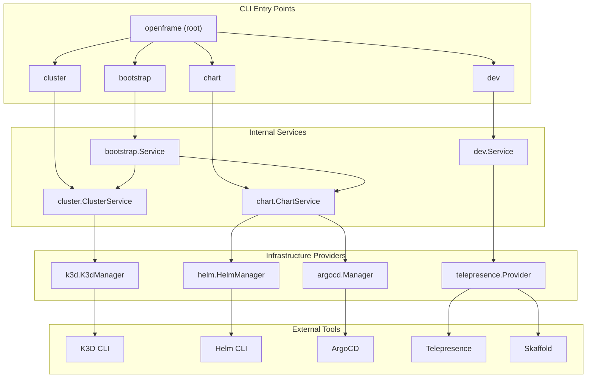

# Introduction to OpenFrame CLI

## What is OpenFrame CLI?

**OpenFrame CLI** is a modern, interactive command-line tool for bootstrapping and managing [OpenFrame](https://openframe.ai) Kubernetes environments. It is part of the [Flamingo](https://flamingo.run) platform — an AI-powered MSP solution that replaces expensive proprietary software with open-source alternatives enhanced by intelligent automation.

The CLI replaces fragile shell-script workflows with a structured Go application that supports both **guided wizard modes** for new users and fully **non-interactive CI/CD automation** for production pipelines.

> **In one command**, `openframe bootstrap`, you get a fully operational K3D Kubernetes cluster with ArgoCD GitOps pipelines and all OpenFrame services installed and healthy.

---

## Key Features

| Feature | Description |
|---|---|
| **Interactive Wizards** | Step-by-step guided setup for clusters, charts, and developer workflows |
| **One-Command Bootstrap** | Full environment setup: K3D cluster + ArgoCD + app-of-apps deployment |
| **Cluster Lifecycle Management** | Create, delete, list, and inspect K3D Kubernetes clusters |
| **GitOps via ArgoCD** | Automated chart installation using the App-of-Apps pattern |
| **Developer Intercepts** | Route Kubernetes service traffic to your local machine via Telepresence |
| **Live Reload Development** | Skaffold-powered hot-reload development sessions inside the cluster |
| **CI/CD Ready** | Non-interactive flags for every operation, suitable for automation pipelines |
| **Prerequisite Checking** | Automatically validates and guides installation of required tools |
| **WSL2 Support** | First-class Windows WSL2 compatibility with platform-specific optimizations |
| **Multiple Deployment Modes** | Supports `oss-tenant`, `saas-tenant`, and `saas-shared` deployment targets |

---

## Target Audience

OpenFrame CLI is designed for:

- **MSP Engineers** setting up self-hosted OpenFrame environments
- **Platform Engineers** automating Kubernetes cluster provisioning in CI/CD
- **Developers** who need to intercept and locally debug services running inside a Kubernetes cluster
- **DevOps Teams** managing GitOps deployments via ArgoCD on K3D

---

## Architecture Overview

```mermaid
graph TB
    subgraph CLI["CLI Entry Points"]
        Root["openframe (root)"]
        Bootstrap["bootstrap"]
        Cluster["cluster"]
        Chart["chart"]
        Dev["dev"]
    end

    subgraph Internal["Internal Services"]
        BootstrapSvc["bootstrap.Service"]
        ClusterSvc["cluster.ClusterService"]
        ChartSvc["chart.ChartService"]
        DevSvc["dev.Service"]
    end

    subgraph Providers["Infrastructure Providers"]
        K3dMgr["k3d.K3dManager"]
        HelmMgr["helm.HelmManager"]
        ArgoCDMgr["argocd.Manager"]
        TelepresenceProv["telepresence.Provider"]
    end

    subgraph External["External Tools"]
        K3D["K3D CLI"]
        HelmCLI["Helm CLI"]
        ArgoCD["ArgoCD"]
        TelepresenceCLI["Telepresence"]
        SkaffoldCLI["Skaffold"]
    end

    Root --> Bootstrap
    Root --> Cluster
    Root --> Chart
    Root --> Dev

    Bootstrap --> BootstrapSvc
    Cluster --> ClusterSvc
    Chart --> ChartSvc
    Dev --> DevSvc

    BootstrapSvc --> ClusterSvc
    BootstrapSvc --> ChartSvc
    ClusterSvc --> K3dMgr
    ChartSvc --> HelmMgr
    ChartSvc --> ArgoCDMgr
    DevSvc --> TelepresenceProv

    K3dMgr --> K3D
    HelmMgr --> HelmCLI
    ArgoCDMgr --> ArgoCD
    TelepresenceProv --> TelepresenceCLI
    TelepresenceProv --> SkaffoldCLI
```

---

## Command Overview

| Command | What It Does |
|---|---|
| `openframe bootstrap` | Full environment setup: cluster + ArgoCD + app-of-apps |
| `openframe cluster create` | Create a K3D Kubernetes cluster |
| `openframe cluster list` | List all managed clusters |
| `openframe cluster status` | Show cluster health and ArgoCD app status |
| `openframe cluster delete` | Delete a cluster |
| `openframe chart install` | Install ArgoCD and charts on an existing cluster |
| `openframe dev intercept` | Intercept Kubernetes service traffic locally via Telepresence |
| `openframe dev skaffold` | Run a live-reload development session with Skaffold |

---

## Deployment Modes

OpenFrame CLI supports three deployment modes targeting different repository configurations:

| Mode | Repository | Use Case |
|---|---|---|
| `oss-tenant` | `flamingo-stack/openframe-oss-tenant` | Default self-hosted OpenFrame |
| `saas-tenant` | `flamingo-stack/openframe-saas-tenant` | SaaS tenant deployment |
| `saas-shared` | `flamingo-stack/openframe-saas-shared` | Shared SaaS platform |

---

## Where to Get Help

- 💬 **Community**: Join the [OpenMSP Slack](https://join.slack.com/t/openmsp/shared_invite/zt-36bl7mx0h-3~U2nFH6nqHqoTPXMaHEHA)
- 🌐 **OpenMSP Community**: [https://www.openmsp.ai/](https://www.openmsp.ai/)
- 🌐 **OpenFrame**: [https://openframe.ai](https://openframe.ai)
- 🌐 **Flamingo**: [https://flamingo.run](https://flamingo.run)

---

## Continue Reading

- Review [Prerequisites](prerequisites.md) to prepare your environment
- Follow the [Quick Start Guide](quick-start.md) to get up and running in minutes
- Explore [First Steps](first-steps.md) after your first successful bootstrap
