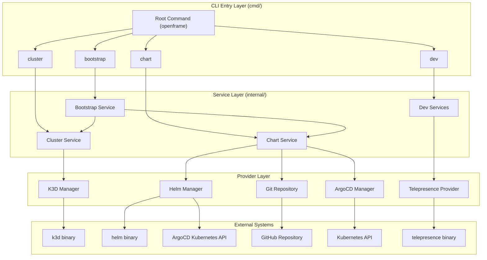

# Introduction to OpenFrame CLI

## What is OpenFrame CLI?

**OpenFrame CLI** is a modern, interactive command-line tool written in Go for bootstrapping and managing OpenFrame Kubernetes environments. It is the primary developer-facing entry point to the broader [OpenFrame](https://openframe.ai) AI-powered MSP platform — replacing brittle shell scripts with a wizard-style terminal interface that guides you through every step of your environment lifecycle.

From a single command you can spin up a fully operational local Kubernetes cluster, install ArgoCD, deploy the complete OpenFrame application stack via the App-of-Apps pattern, and begin intercepting live cluster traffic in your local IDE — all without memorizing dozens of manual steps.

> **Platform context:** OpenFrame is part of the [Flamingo](https://flamingo.run) ecosystem — an AI-powered MSP platform that replaces expensive proprietary software with open-source alternatives enhanced by intelligent automation (Mingo AI for technicians, Fae for clients).

---

## Key Features

| Feature | Description |
|---------|-------------|
| **One-Command Bootstrap** | `openframe bootstrap` creates a K3D cluster, installs ArgoCD, and deploys the full stack in one shot |
| **Interactive Wizard UI** | Step-by-step guided prompts for cluster names, deployment modes, ingress, and Docker registry settings |
| **Cluster Lifecycle Management** | Create, delete, list, check status, and clean up K3D clusters |
| **Helm & ArgoCD Integration** | Installs ArgoCD via Helm and waits for all Application CRDs to reach Healthy+Synced state |
| **Local Dev Workflows** | Telepresence-based service intercepts route live cluster traffic to your local process |
| **Skaffold Hot Reload** | `openframe dev skaffold` discovers `skaffold.yaml` files and starts live-reload dev sessions |
| **Prerequisite Checking** | Validates Docker, k3d, kubectl, helm, git, and mkcert before any operation |
| **Cross-Platform** | Full Linux, macOS, and Windows (WSL2) support with native path handling |
| **CI/CD Friendly** | `--non-interactive` and `--deployment-mode` flags for fully automated pipelines |

---

## Target Audience

OpenFrame CLI is designed for:

- **Platform Engineers** setting up OpenFrame environments for their MSP organization
- **Application Developers** who need a local Kubernetes stack with live traffic intercepts for service development
- **DevOps/CI Engineers** automating environment provisioning in pipelines
- **MSP Operators** evaluating the OpenFrame OSS tenant deployment

---

## Architecture Overview

```mermaid
graph TD
    subgraph CLI["CLI Entry Layer (cmd/)"]
        Root["Root Command (openframe)"]
        Bootstrap["bootstrap"]
        Cluster["cluster"]
        Chart["chart"]
        Dev["dev"]
    end

    subgraph Services["Service Layer (internal/)"]
        BootstrapSvc["Bootstrap Service"]
        ClusterSvc["Cluster Service"]
        ChartSvc["Chart Service"]
        DevSvc["Dev Services"]
    end

    subgraph Providers["Provider Layer"]
        K3D["K3D Manager"]
        HelmMgr["Helm Manager"]
        ArgoCDMgr["ArgoCD Manager"]
        GitRepo["Git Repository"]
        TelepresenceProv["Telepresence Provider"]
    end

    subgraph External["External Systems"]
        K3dBin["k3d binary"]
        HelmBin["helm binary"]
        ArgoCDAPI["ArgoCD Kubernetes API"]
        GitHubRepo["GitHub Repository"]
        K8sAPI["Kubernetes API"]
        TelepresenceBin["telepresence binary"]
    end

    Root --> Bootstrap
    Root --> Cluster
    Root --> Chart
    Root --> Dev

    Bootstrap --> BootstrapSvc
    Cluster --> ClusterSvc
    Chart --> ChartSvc
    Dev --> DevSvc

    BootstrapSvc --> ClusterSvc
    BootstrapSvc --> ChartSvc

    ClusterSvc --> K3D
    ChartSvc --> HelmMgr
    ChartSvc --> ArgoCDMgr
    ChartSvc --> GitRepo
    DevSvc --> TelepresenceProv

    K3D --> K3dBin
    HelmMgr --> HelmBin
    HelmMgr --> ArgoCDAPI
    ArgoCDMgr --> K8sAPI
    GitRepo --> GitHubRepo
    TelepresenceProv --> TelepresenceBin
```

---

## Command Summary

| Command | Alias | What It Does |
|---------|-------|--------------|
| `openframe bootstrap` | — | Full one-shot environment setup (cluster + charts) |
| `openframe cluster` | `k` | Manage K3D cluster lifecycle (create/delete/list/status/cleanup) |
| `openframe chart` | `c` | Manage Helm charts and ArgoCD installations |
| `openframe dev intercept` | — | Route live Kubernetes traffic to your local dev process |
| `openframe dev skaffold` | — | Run live hot-reload dev sessions with Skaffold |

---

## Deployment Modes

OpenFrame CLI supports three deployment modes selectable during bootstrap or chart installation:

| Mode | Description |
|------|-------------|
| `oss-tenant` | Open-source self-hosted tenant deployment |
| `saas-tenant` | SaaS tenant deployment with dedicated resources |
| `saas-shared` | SaaS shared infrastructure deployment |

---

## Get Started

Ready to jump in? Here are your next steps:

1. Review the **[Prerequisites Guide](prerequisites.md)** to verify your system is ready
2. Follow the **[Quick Start Guide](quick-start.md)** for a 5-minute environment setup
3. Read **[First Steps](first-steps.md)** to explore key features after installation

---

## Community & Support

- **OpenMSP Community Slack:** [Join here](https://join.slack.com/t/openmsp/shared_invite/zt-36bl7mx0h-3~U2nFH6nqHqoTPXMaHEHA) — all issues, discussions, and feature requests are managed here
- **OpenMSP Website:** [https://www.openmsp.ai/](https://www.openmsp.ai/)
- **OpenFrame Platform:** [https://openframe.ai](https://openframe.ai)
- **Flamingo Platform:** [https://flamingo.run](https://flamingo.run)
