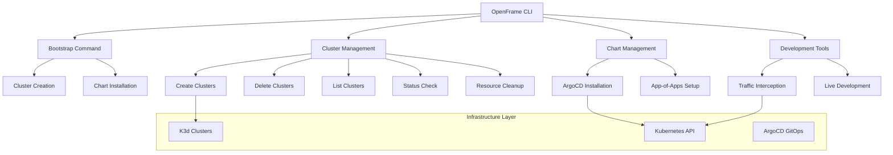

# Introduction to OpenFrame CLI

Welcome to OpenFrame CLI - a comprehensive command-line interface for bootstrapping and managing Kubernetes clusters with GitOps automation for MSP (Managed Service Provider) environments.

## What is OpenFrame CLI?

OpenFrame CLI is a streamlined tool that automates the complete setup and management of Kubernetes development environments. It combines cluster creation, ArgoCD installation, and development workflow tools into a single, unified interface.

### Elevator Pitch

**"From zero to GitOps-enabled Kubernetes cluster in minutes"** - OpenFrame CLI eliminates the complexity of setting up local development environments by automating cluster creation with K3d, installing ArgoCD for GitOps workflows, and providing integrated development tools.

## Key Features

- **🚀 One-Command Bootstrap**: Complete environment setup with `openframe bootstrap`
- **🎯 Interactive Wizards**: Guided cluster creation and configuration
- **📦 GitOps Integration**: Automatic ArgoCD installation and app-of-apps pattern
- **🔧 Development Tools**: Traffic interception and live reloading capabilities
- **🧹 Resource Management**: Cleanup and status monitoring commands
- **🌐 Multi-Platform**: Support for multiple deployment modes (OSS tenant, SaaS shared, SaaS tenant)

## Architecture Overview

```mermaid
graph TB
    CLI[OpenFrame CLI] --> Bootstrap[Bootstrap Command]
    CLI --> Cluster[Cluster Management] 
    CLI --> Chart[Chart Management]
    CLI --> Dev[Development Tools]
    
    Bootstrap --> ClusterCreate[Cluster Creation]
    Bootstrap --> ChartInstall[Chart Installation]
    
    Cluster --> Create[Create Clusters]
    Cluster --> Delete[Delete Clusters]
    Cluster --> List[List Clusters]
    Cluster --> Status[Status Check]
    Cluster --> Cleanup[Resource Cleanup]
    
    Chart --> ArgoCD[ArgoCD Installation]
    Chart --> AppOfApps[App-of-Apps Setup]
    
    Dev --> Intercept[Traffic Interception]
    Dev --> Skaffold[Live Development]
    
    subgraph Infrastructure[Infrastructure Layer]
        K3d[K3d Clusters]
        Kubernetes[Kubernetes API]
        ArgoCDSvc[ArgoCD GitOps]
    end
    
    Create --> K3d
    ArgoCD --> Kubernetes
    Intercept --> Kubernetes
```

## Target Audience

OpenFrame CLI is designed for:

- **DevOps Engineers** setting up local Kubernetes environments
- **Platform Engineers** standardizing development workflows
- **MSP Providers** deploying standardized environments for clients
- **Developers** needing local Kubernetes clusters with GitOps capabilities
- **Teams** adopting GitOps practices and ArgoCD workflows

## Core Benefits

| Benefit | Description |
|---------|-------------|
| **Speed** | Complete cluster setup in under 5 minutes |
| **Consistency** | Standardized environments across teams |
| **GitOps Ready** | ArgoCD pre-configured with app-of-apps pattern |
| **Developer Friendly** | Traffic interception and live reload capabilities |
| **Resource Efficient** | K3d-based lightweight clusters |
| **Easy Cleanup** | One-command resource cleanup and management |

## Getting Started Journey

Your journey with OpenFrame CLI follows this path:

1. **[Prerequisites](prerequisites.md)** - Install required tools and check system requirements
2. **[Quick Start](quick-start.md)** - Get your first cluster running in 5 minutes
3. **[First Steps](first-steps.md)** - Explore key features and workflows

## Command Categories

| Category | Commands | Purpose |
|----------|----------|---------|
| **Bootstrap** | `bootstrap` | Complete environment setup |
| **Cluster** | `create`, `delete`, `list`, `status`, `cleanup` | Cluster lifecycle management |
| **Chart** | `install` | ArgoCD and Helm chart management |
| **Development** | `intercept`, `skaffold` | Development workflow tools |

## What Makes OpenFrame CLI Different?

Unlike traditional Kubernetes setup tools, OpenFrame CLI:

- **Combines multiple tools** into a single workflow (K3d + ArgoCD + development tools)
- **Provides interactive wizards** instead of requiring complex configuration files
- **Includes cleanup and management** commands for ongoing operations
- **Integrates development workflows** with traffic interception and live reloading
- **Supports multiple deployment modes** for different MSP scenarios

## Community and Support

- **OpenMSP Slack Community**: [Join our Slack](https://join.slack.com/t/openmsp/shared_invite/zt-36bl7mx0h-3~U2nFH6nqHqoTPXMaHEHA)
- **Website**: [flamingo.run](https://flamingo.run)
- **OpenFrame Platform**: [openframe.ai](https://openframe.ai)

> 💡 **Note**: OpenFrame CLI is part of the larger OpenFrame ecosystem that integrates multiple MSP tools into a unified AI-driven platform for automating IT support operations.