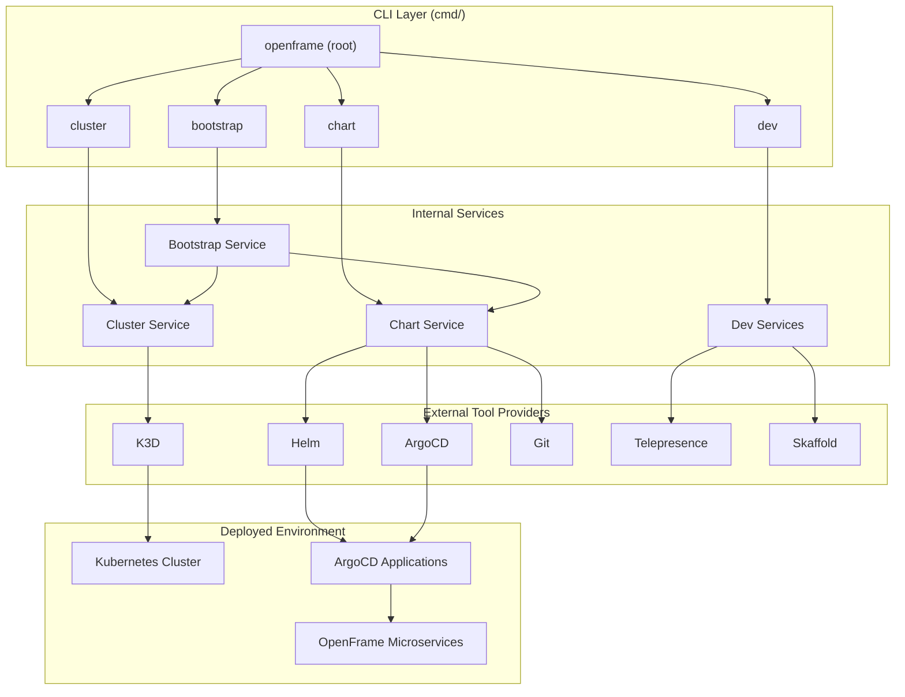

# OpenFrame CLI — Introduction

**OpenFrame CLI** is a modern, interactive command-line tool written in Go that bootstraps and manages OpenFrame Kubernetes environments. It is the primary entry point for spinning up fully functional, production-grade OpenFrame deployments on local or remote Kubernetes clusters — in minutes, not days.

---

## What Is OpenFrame CLI?

OpenFrame CLI (`openframe`) automates the full lifecycle of an OpenFrame environment:

- **Cluster provisioning** — Creates and manages local K3D Kubernetes clusters
- **GitOps installation** — Installs ArgoCD and deploys app-of-apps chart patterns
- **Interactive configuration** — Guides operators through Helm values via a built-in wizard
- **Developer tooling** — Provides Telepresence service intercepts and Skaffold hot-reload workflows

It is part of the broader [OpenFrame](https://openframe.ai) platform — the unified, AI-driven MSP operations suite built by [Flamingo](https://flamingo.run).

---

## Key Features

| Feature | Description |
|---|---|
| **One-command bootstrap** | `openframe bootstrap` provisions a cluster and installs all charts end-to-end |
| **Interactive wizard** | Guided Helm values configuration — branch, Docker registry, ingress, deployment mode |
| **K3D cluster management** | Create, delete, list, status, and cleanup local K3D clusters |
| **ArgoCD GitOps** | Installs ArgoCD and deploys app-of-apps patterns with health monitoring |
| **Telepresence intercepts** | Route live Kubernetes traffic to your local machine for rapid iteration |
| **Skaffold hot-reload** | Rebuild and sync containers on code change within a running cluster |
| **Non-interactive / CI mode** | All commands support `--non-interactive` flags for CI/CD pipelines |
| **Cross-platform** | Supports macOS, Linux, and Windows (WSL2) |
| **Prerequisite auto-installer** | Automatically detects and guides installation of Docker, k3d, kubectl, Helm, and more |

---

## Target Audience

OpenFrame CLI is designed for:

- **MSP operators** standing up self-hosted OpenFrame environments
- **Platform engineers** automating GitOps-based Kubernetes deployments
- **Developers** working on OpenFrame services who need local cluster environments with hot-reload
- **DevOps / CI/CD pipelines** running non-interactive bootstraps in automated workflows

---

## Architecture Overview

```mermaid
graph TB
    subgraph CLI["CLI Layer (cmd/)"]
        Root["openframe (root)"]
        BootstrapCmd["bootstrap"]
        ClusterCmd["cluster"]
        ChartCmd["chart"]
        DevCmd["dev"]
    end

    subgraph Services["Internal Services"]
        BootstrapSvc["Bootstrap Service"]
        ClusterSvc["Cluster Service"]
        ChartSvc["Chart Service"]
        DevSvc["Dev Services"]
    end

    subgraph Providers["External Tool Providers"]
        K3D["K3D"]
        Helm["Helm"]
        ArgoCD["ArgoCD"]
        Git["Git"]
        Telepresence["Telepresence"]
        Skaffold["Skaffold"]
    end

    subgraph Target["Deployed Environment"]
        K8s["Kubernetes Cluster"]
        Apps["ArgoCD Applications"]
        Services2["OpenFrame Microservices"]
    end

    Root --> BootstrapCmd
    Root --> ClusterCmd
    Root --> ChartCmd
    Root --> DevCmd

    BootstrapCmd --> BootstrapSvc
    ClusterCmd --> ClusterSvc
    ChartCmd --> ChartSvc
    DevCmd --> DevSvc

    BootstrapSvc --> ClusterSvc
    BootstrapSvc --> ChartSvc

    ClusterSvc --> K3D
    ChartSvc --> Helm
    ChartSvc --> ArgoCD
    ChartSvc --> Git
    DevSvc --> Telepresence
    DevSvc --> Skaffold

    K3D --> K8s
    Helm --> Apps
    ArgoCD --> Apps
    Apps --> Services2
```

---

## Deployment Modes

The CLI supports three deployment modes via the `--deployment-mode` flag:

| Mode | Repository | Use Case |
|---|---|---|
| `oss-tenant` | `openframe-oss-tenant` | Default self-hosted OpenFrame deployment |
| `saas-tenant` | `openframe-saas-tenant` | SaaS managed tenant deployment |
| `saas-shared` | `openframe-saas-shared` | Shared SaaS infrastructure deployment |

> For most operators getting started, `oss-tenant` is the recommended deployment mode.

---

## Community & Support

OpenFrame issues and discussions are managed in the **OpenMSP Slack community** — not GitHub Issues.

- **Join the community**: [openmsp.ai](https://www.openmsp.ai/)
- **Slack invite**: [Join OpenMSP Slack](https://join.slack.com/t/openmsp/shared_invite/zt-36bl7mx0h-3~U2nFH6nqHqoTPXMaHEHA)
- **OpenFrame platform**: [openframe.ai](https://openframe.ai)
- **Flamingo**: [flamingo.run](https://flamingo.run)

---

## Next Steps

- Review the [Prerequisites Guide](prerequisites.md) to ensure your environment is ready
- Follow the [Quick Start Guide](quick-start.md) for a 5-minute setup
- Explore the [First Steps Guide](first-steps.md) after your first successful bootstrap
