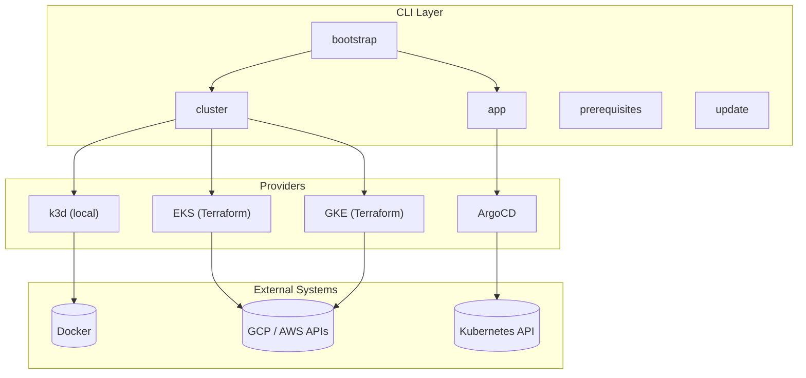

# Introduction to OpenFrame CLI

## What is OpenFrame CLI?

**OpenFrame CLI** (`openframe`) is a modern, interactive command-line tool for provisioning Kubernetes clusters — locally via k3d or in the cloud via GKE/EKS (using Terraform) — and deploying the [OpenFrame](https://openframe.ai) platform onto them using ArgoCD's app-of-apps pattern.

It is the primary bootstrap and lifecycle-management tool for [OpenFrame](https://www.flamingo.run/openframe), the unified, AI-driven MSP platform built by [Flamingo](https://flamingo.run). OpenFrame CLI handles the full lifecycle of an OpenFrame deployment: checking prerequisites, provisioning a cluster, installing the platform, monitoring status, upgrading, and tearing down — with both fully interactive wizards and non-interactive flags for CI/automation.

> **Note:** OpenFrame CLI is one component of the broader OpenFrame ecosystem. The main platform code lives in a separate repository, [`flamingo-stack/openframe-oss-tenant`](https://github.com/flamingo-stack/openframe-oss-tenant), which this CLI deploys and manages.

## Key Features

- **One-command bootstrap** — `openframe bootstrap` creates a local k3d cluster and installs the entire OpenFrame platform (ArgoCD + app-of-apps) in a single step.
- **Multi-provider cluster support** — Provision clusters locally with k3d (Docker-based, Kubernetes-in-Docker) or in the cloud with GKE (Google) and EKS (AWS), all through Terraform under the hood.
- **Platform lifecycle management** — Install, upgrade, monitor status, and uninstall the OpenFrame platform via ArgoCD, without touching the underlying cluster.
- **Interactive and CI-friendly** — Every workflow supports an interactive wizard (prompts, spinners, cost estimates) as well as `--non-interactive`/`--skip-wizard` flags for automation pipelines.
- **Built-in prerequisites management** — Detects missing tools (Docker, k3d, Helm, Terraform, gcloud, AWS CLI) and can auto-install them on macOS/Linux.
- **Live status dashboard** — An interactive, k9s-style terminal UI (`openframe app status --interactive`) for inspecting ArgoCD application health and triggering syncs.
- **Secure by default** — All tool binaries are downloaded with pinned versions and SHA256 checksum verification (no `curl | bash`), and CLI self-updates are verified with Sigstore/cosign signatures.
- **Self-updating** — `openframe update` checks for, downloads, verifies, and applies new CLI releases, with rollback support.

## Who is this for?

OpenFrame CLI is designed for:

- **MSP technicians and platform operators** who need to stand up an OpenFrame environment quickly, whether for local evaluation or production cloud deployment.
- **DevOps/Platform engineers** integrating OpenFrame provisioning into CI/CD pipelines using the CLI's non-interactive flags and JSON/YAML output modes.
- **Contributors to the OpenFrame ecosystem** who need a reliable way to spin up disposable test clusters and platform installs.

## How it fits together

```mermaid
graph TB
    subgraph "CLI Layer"
        Bootstrap[bootstrap]
        Cluster[cluster]
        App[app]
        Prereq[prerequisites]
        Update[update]
    end

    subgraph "Providers"
        K3d["k3d (local)"]
        EKS["EKS (Terraform)"]
        GKE["GKE (Terraform)"]
        ArgoCD["ArgoCD"]
    end

    subgraph "External Systems"
        Docker[(Docker)]
        K8sAPI[(Kubernetes API)]
        CloudAPI[(GCP / AWS APIs)]
    end

    Bootstrap --> Cluster
    Bootstrap --> App
    Cluster --> K3d
    Cluster --> EKS
    Cluster --> GKE
    App --> ArgoCD

    K3d --> Docker
    EKS --> CloudAPI
    GKE --> CloudAPI
    ArgoCD --> K8sAPI
```

## Next Steps

To get up and running with OpenFrame CLI, continue with:

- The prerequisites guide, to confirm your system is ready
- The quick-start guide, for a 5-minute local install
- The first-steps guide, to explore key commands after installation
