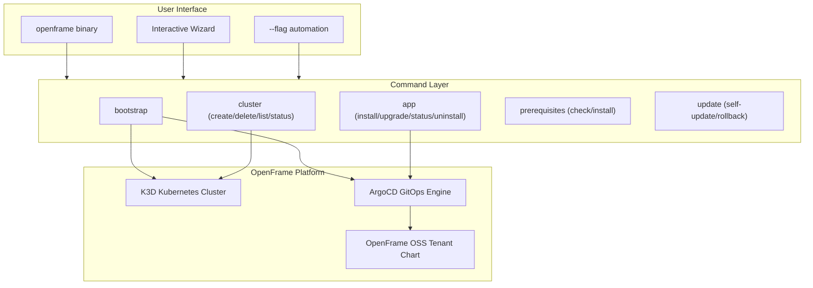
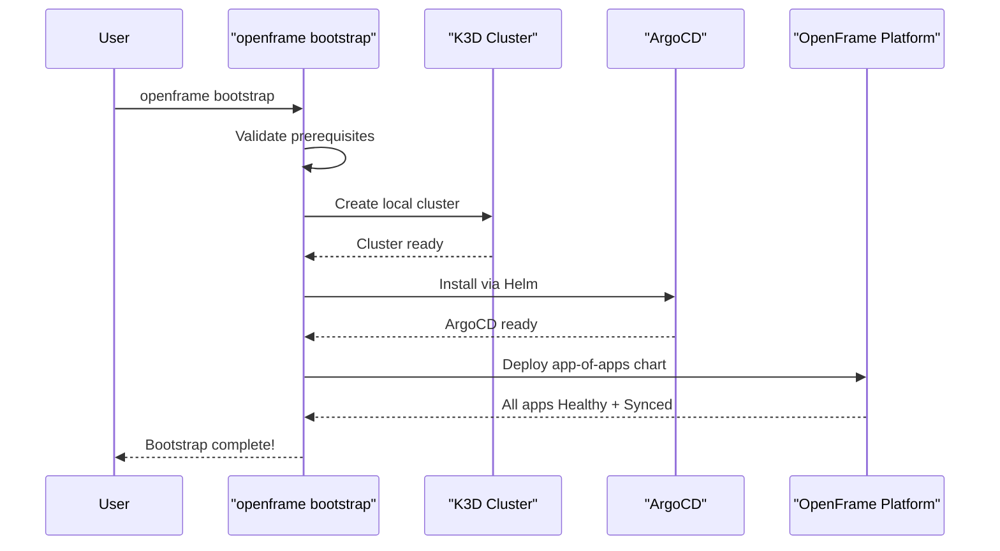

# Introduction to OpenFrame CLI

**OpenFrame CLI** is a modern, interactive command-line tool written in Go that bootstraps and manages OpenFrame Kubernetes environments. With a single `openframe` binary, you can provision local K3D clusters, install the full OpenFrame platform stack via ArgoCD GitOps, and manage the entire lifecycle of your deployment — all through both guided interactive wizards and fully scriptable non-interactive modes.

> **OpenFrame** is the unified platform from [Flamingo](https://flamingo.run) that integrates multiple MSP tools into a single AI-driven interface, automating IT support operations across the stack. Learn more at [openframe.ai](https://openframe.ai).

---

## What is OpenFrame CLI?

OpenFrame CLI is your single entry point for:

- **Bootstrapping** a fully functional OpenFrame environment from scratch in minutes
- **Managing Kubernetes clusters** (K3D) — create, delete, list, inspect, and clean up
- **Deploying and upgrading** the OpenFrame platform chart via ArgoCD GitOps
- **Checking and installing prerequisites** automatically (Docker, k3d, Helm)
- **Self-updating** to the latest version with cryptographic signature verification

It replaces manual shell scripts and disparate tooling with a cohesive, type-safe Go binary that provides real-time progress feedback, friendly error messages, and deep automation support.

---

## Key Features

| Feature | Description |
|---|---|
| **One-command bootstrap** | `openframe bootstrap` provisions a cluster and deploys the full platform in one step |
| **Interactive wizards** | Step-by-step guided prompts for new users — no YAML editing required |
| **Non-interactive / CI mode** | `--non-interactive` flag makes every command scriptable for pipelines |
| **ArgoCD GitOps integration** | Platform deployment is fully GitOps-driven using the `openframe-oss-tenant` chart |
| **Auto-prerequisite management** | Detects and installs Docker, k3d, and Helm automatically on macOS/Linux |
| **Cosign signature verification** | All self-updates are cryptographically verified against the official release workflow |
| **WSL2 support on Windows** | Transparently re-executes inside WSL2 — no manual Linux setup needed |
| **Secret redaction** | Credentials and tokens are automatically scrubbed from all debug output |
| **Machine-readable output** | `--output json/yaml` for clean scripted consumption |

---

## Target Audience

OpenFrame CLI is designed for:

- **MSP technicians and operators** setting up OpenFrame environments
- **DevOps engineers** automating OpenFrame deployment in CI/CD pipelines
- **Developers** contributing to or extending the OpenFrame platform
- **System administrators** managing the lifecycle of OpenFrame Kubernetes clusters

---

## High-Level Architecture

```mermaid
graph TB
    subgraph User["User Interface"]
        cli["openframe binary"]
        wizard["Interactive Wizard"]
        flags["--flag automation"]
    end

    subgraph Commands["Command Layer"]
        bootstrap["bootstrap"]
        cluster["cluster (create/delete/list/status)"]
        app["app (install/upgrade/status/uninstall)"]
        prereq["prerequisites (check/install)"]
        update["update (self-update/rollback)"]
    end

    subgraph Platform["OpenFrame Platform"]
        k3d["K3D Kubernetes Cluster"]
        argocd["ArgoCD GitOps Engine"]
        openframe["OpenFrame OSS Tenant Chart"]
    end

    cli --> Commands
    wizard --> Commands
    flags --> Commands
    bootstrap --> k3d
    bootstrap --> argocd
    argocd --> openframe
    cluster --> k3d
    app --> argocd
```

---

## How It Works

The CLI follows a layered architecture:

1. **Command Layer** (`cmd/`) — Cobra-based subcommands with flag parsing and interactive wizards
2. **Service Layer** (`internal/*/service.go`) — Business logic orchestration
3. **Provider Layer** (`internal/*/providers/`) — K3D, ArgoCD, Helm, and Git integrations
4. **Shared Infrastructure** — Executor, k8s client, UI rendering, error handling, and secret redaction

The **bootstrap** workflow ties it all together:

```mermaid
sequenceDiagram
    participant User
    participant CLI as "openframe bootstrap"
    participant K3D as "K3D Cluster"
    participant ArgoCD as "ArgoCD"
    participant OpenFrame as "OpenFrame Platform"

    User->>CLI: openframe bootstrap
    CLI->>CLI: Validate prerequisites
    CLI->>K3D: Create local cluster
    K3D-->>CLI: Cluster ready
    CLI->>ArgoCD: Install via Helm
    ArgoCD-->>CLI: ArgoCD ready
    CLI->>OpenFrame: Deploy app-of-apps chart
    OpenFrame-->>CLI: All apps Healthy + Synced
    CLI-->>User: Bootstrap complete!
```

---

## External Repository

The OpenFrame platform configuration (Helm charts, values) lives in a separate repository:

- **openframe-oss-tenant**: [https://github.com/flamingo-stack/openframe-oss-tenant](https://github.com/flamingo-stack/openframe-oss-tenant)
- Documentation: [https://github.com/flamingo-stack/openframe-oss-tenant/tree/main/docs](https://github.com/flamingo-stack/openframe-oss-tenant/tree/main/docs)

---

## Community & Support

Join the OpenMSP Slack community for questions, discussions, and support:

https://www.openmsp.ai/

---

## Next Steps

- Follow the [Prerequisites Guide](prerequisites.md) to prepare your environment
- Jump straight to the [Quick Start Guide](quick-start.md) for a 5-minute setup
- Read the [First Steps Guide](first-steps.md) to explore key features after installation
