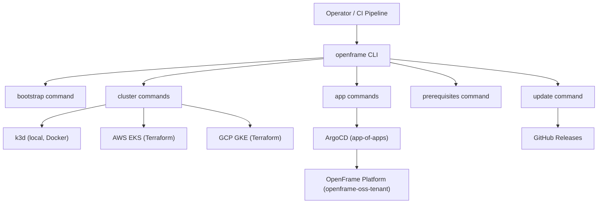

# Introduction to OpenFrame CLI

## What is OpenFrame CLI?

**OpenFrame CLI** (`openframe`) is a Go-based command-line tool for provisioning Kubernetes clusters — locally with [k3d](https://k3d.io/) or in the cloud with AWS EKS / GCP GKE via Terraform — and deploying the [OpenFrame](https://openframe.ai) platform onto them using ArgoCD's app-of-apps pattern.

It is the operator-facing entry point into the broader OpenFrame ecosystem, maintained in the main platform repository, [flamingo-stack/openframe-oss-tenant](https://github.com/flamingo-stack/openframe-oss-tenant). OpenFrame CLI itself lives in [flamingo-stack/openframe-cli](https://github.com/flamingo-stack/openframe-cli) and is published as the Go module `github.com/flamingo-stack/openframe-cli`.

OpenFrame is part of [Flamingo](https://flamingo.run), an AI-powered MSP platform that replaces expensive proprietary tooling with open-source alternatives enhanced by intelligent automation (Mingo AI for technicians, Fae for clients). OpenFrame unifies multiple MSP tools into a single AI-driven interface, and OpenFrame CLI is how you stand up and operate that platform on your own infrastructure.

## Key Features

- **One-command bootstrap** — `openframe bootstrap` creates a cluster and installs the full platform in a single step.
- **Multiple cluster backends** — local `k3d` (Docker-based, for development) or cloud `EKS`/`GKE` (Terraform-based, for production), behind a unified `Provider` interface.
- **Full lifecycle management** — create, list, check status, switch context (`use`), clean up images, and delete clusters.
- **Platform lifecycle** — install, upgrade, check readiness (including a live TUI), retrieve ArgoCD access credentials, and uninstall the OpenFrame platform without touching the underlying cluster.
- **Interactive and scriptable** — fully interactive wizards for humans (`huh`-based prompts, `pterm` rendering) and non-interactive flags/`--plain`/`-o json|yaml` output for CI/CD automation.
- **Secure by design** — checksum-verified, pinned downloads for external tools (k3d, Helm, Terraform, mkcert, infracost) instead of unverified `curl | bash`; self-updates are signed and verified via Sigstore/cosign against a pinned GitHub Actions release identity.
- **Windows support via WSL2** — the CLI transparently forwards execution into WSL2 on Windows, since Docker/k3d and Kubernetes client networking need to run in a Linux environment.

## Who is this for?

- **Platform engineers / DevOps teams** standing up OpenFrame for their organization, whether on a local machine for evaluation or on cloud infrastructure for production.
- **MSP technicians and administrators** who need a repeatable way to install, monitor, and upgrade OpenFrame deployments.
- **Contributors** to the OpenFrame ecosystem who need a local cluster to develop and test platform charts and applications against.

## How It Fits Together

```mermaid
graph TB
    User["Operator / CI Pipeline"] --> CLI["openframe CLI"]
    CLI --> Bootstrap["bootstrap command"]
    CLI --> Cluster["cluster commands"]
    CLI --> App["app commands"]
    CLI --> Prereq["prerequisites command"]
    CLI --> Update["update command"]

    Cluster --> K3d["k3d (local, Docker)"]
    Cluster --> EKS["AWS EKS (Terraform)"]
    Cluster --> GKE["GCP GKE (Terraform)"]

    App --> ArgoCD["ArgoCD (app-of-apps)"]
    ArgoCD --> Platform["OpenFrame Platform (openframe-oss-tenant)"]

    Update --> GitHubReleases["GitHub Releases"]
```

## Next Steps

This getting-started series walks through the essentials of using OpenFrame CLI:

- Review the [Prerequisites](prerequisites.md) to make sure your machine is ready.
- Follow the [Quick Start](quick-start.md) to bootstrap your first cluster and platform install.
- Read [First Steps](first-steps.md) to learn what to do once the platform is running.
