# OpenFrame CLI Introduction

Welcome to OpenFrame CLI, a modern command-line tool designed to streamline Kubernetes cluster management and development workflows. This tool replaces complex shell scripts with an intuitive, wizard-style interface that makes Kubernetes platform bootstrapping accessible to both beginners and experts.

## What is OpenFrame CLI?

OpenFrame CLI is a comprehensive toolkit that combines cluster management, application deployment, and developer tools into a single, cohesive command-line experience. It bridges the gap between local development and production-ready Kubernetes environments.

## Key Features

| Feature | Description | Benefits |
|---------|-------------|----------|
| **Interactive Cluster Management** | Create, manage, and monitor K3D clusters with guided wizards | Reduces complexity, prevents configuration errors |
| **ArgoCD Integration** | Automated GitOps deployment using app-of-apps pattern | Streamlined CI/CD, declarative deployments |
| **Development Tools** | Traffic interception and service scaffolding | Faster development cycles, easier debugging |
| **Bootstrap Orchestration** | One-command environment setup | Quick onboarding, consistent environments |
| **Prerequisites Management** | Automated tool installation and validation | Reduces setup friction, ensures compatibility |

## Architecture Overview

```mermaid
graph TB
    subgraph "OpenFrame CLI"
        Bootstrap[🚀 Bootstrap Command]
        Cluster[🏗️ Cluster Management]
        Chart[📦 Chart Management]
        Dev[⚡ Development Tools]
    end
    
    subgraph "Infrastructure"
        K3D[🐳 K3D/Docker]
        ArgoCD[🔄 ArgoCD]
        Telepresence[🌐 Telepresence]
    end
    
    subgraph "Target Environment"
        K8s[☸️ Kubernetes Cluster]
        Apps[📱 Applications]
    end
    
    Bootstrap --> Cluster
    Bootstrap --> Chart
    Cluster --> K3D
    Chart --> ArgoCD
    Dev --> Telepresence
    
    K3D --> K8s
    ArgoCD --> Apps
    Telepresence --> K8s
    
    style Bootstrap fill:#e1f5fe
    style K8s fill:#f3e5f5
    style Apps fill:#e8f5e8
```

## Target Audience

**Platform Engineers**: Streamline Kubernetes cluster provisioning and management with consistent, repeatable workflows.

**DevOps Teams**: Implement GitOps patterns with integrated ArgoCD deployment pipelines and environment standardization.

**Application Developers**: Focus on code development with simplified local Kubernetes environments and traffic interception tools.

**Site Reliability Engineers**: Maintain reliable development and staging environments with automated health checking and monitoring.

## Benefits

### For Teams
- **Consistency**: Standardized environments across development, staging, and production
- **Speed**: Rapid cluster creation and application deployment (5-minute setup)
- **Reliability**: Built-in health checks and prerequisite validation
- **Flexibility**: Support for multiple deployment modes (OSS Tenant, SaaS Shared)

### For Developers
- **Simplified Workflow**: Interactive wizards guide complex operations
- **Local Development**: K3D integration provides lightweight Kubernetes locally
- **Traffic Interception**: Debug production services from local development environment
- **Service Scaffolding**: Quick generation of boilerplate service configurations

## How It Works

OpenFrame CLI follows a clean architecture pattern with three main operational flows:

1. **Bootstrap Flow**: Complete environment setup combining cluster creation and application deployment
2. **Cluster Flow**: Granular cluster lifecycle management (create, delete, status, cleanup)
3. **Development Flow**: Developer-focused tools for service interaction and scaffolding

## Getting Started Path

Ready to begin? Follow this recommended learning path:

1. **[Prerequisites](prerequisites.md)** - Set up required tools and verify your system
2. **[Quick Start](quick-start.md)** - Get a cluster running in under 5 minutes
3. **[First Steps](first-steps.md)** - Explore core features and common workflows

For developers wanting to contribute or customize:
- **[Development Setup](../development/setup/environment.md)** - Configure development environment
- **[Architecture Deep Dive](../development/architecture/overview.md)** - Understand internal components

## Community and Support

- **Documentation**: Complete reference available in `/docs/reference/`
- **Issues**: Report bugs and request features on the project repository
- **Discussions**: Join the community for questions and best practices

---

> **Next Step**: Ready to install? Head to [Prerequisites](prerequisites.md) to prepare your system for OpenFrame CLI.