# OpenFrame CLI Introduction

Welcome to OpenFrame CLI, a powerful command-line tool designed to simplify Kubernetes cluster management and development workflows for OpenFrame deployments. Whether you're setting up a local development environment or managing production clusters, OpenFrame CLI streamlines your DevOps operations with an intuitive interface and automation features.

## What is OpenFrame CLI?

OpenFrame CLI is a comprehensive Go-based command-line tool that provides:

- **Kubernetes cluster management** using K3d for lightweight local development
- **Automated chart deployment** with Helm and ArgoCD GitOps workflows
- **Development workflow tools** including Skaffold integration and Telepresence traffic interception
- **One-command environment bootstrap** for rapid setup

## Key Features and Benefits

| Feature | Benefit | Use Case |
|---------|---------|----------|
| **Bootstrap Command** | Complete environment setup in minutes | Getting started, CI/CD automation |
| **Cluster Management** | K3d cluster lifecycle operations | Local development, testing |
| **Chart Installation** | Helm + ArgoCD deployment automation | GitOps workflows, application deployment |
| **Development Tools** | Live reloading and traffic interception | Local development, debugging |
| **Interactive UI** | Guided setup with validation | User-friendly onboarding |

## Target Audience

### Developers
- Set up local Kubernetes environments quickly
- Develop and test microservices with live reloading
- Intercept production traffic for local debugging

### DevOps Engineers
- Automate cluster provisioning and application deployment
- Implement GitOps workflows with ArgoCD
- Standardize development environment setup across teams

### Platform Teams
- Provide consistent tooling for application teams
- Enable self-service cluster creation and management
- Integrate with CI/CD pipelines for automated testing

## Architecture Overview

## Deployment Modes

OpenFrame CLI supports three deployment architectures:

| Mode | Description | Best For |
|------|-------------|----------|
| **oss-tenant** | Open source tenant deployment | Individual developers, small teams |
| **saas-tenant** | SaaS tenant with dedicated resources | Enterprise customers, isolated environments |
| **saas-shared** | SaaS shared multi-tenant deployment | Cost-effective scaling, development environments |

## Quick Overview: What You'll Achieve

After completing the getting started guides, you'll have:

1. ✅ **A running Kubernetes cluster** powered by K3d
2. ✅ **ArgoCD installed and configured** for GitOps deployments
3. ✅ **OpenFrame applications deployed** and accessible locally
4. ✅ **Development tools configured** for live reloading and debugging
5. ✅ **Understanding of core workflows** for daily development tasks

## Getting Started Journey

Follow these guides in order to get up and running:

```mermaid
flowchart LR
    A[📋 Prerequisites] --> B[⚡ Quick Start]
    B --> C[👣 First Steps]
    C --> D[🏗️ Architecture]
    
    style A fill:#e1f5fe
    style B fill:#f3e5f5
    style C fill:#e8f5e8
    style D fill:#fff3e0
```

1. **[Prerequisites Guide](./prerequisites.md)** - Ensure your system is ready
2. **[Quick Start Guide](./quick-start.md)** - 5-minute setup to hello world
3. **[First Steps Guide](./first-steps.md)** - Essential tasks after installation
4. **[Development Guides](../development/README.md)** - Deep dive into development workflows

## Community and Support

- **Documentation**: Comprehensive guides for all features and use cases
- **GitHub Issues**: Report bugs, request features, get help
- **Examples**: Real-world configuration templates and workflows

## Next Steps

Ready to get started? Head to the [Prerequisites Guide](./prerequisites.md) to ensure your system is prepared, or jump straight to the [Quick Start Guide](./quick-start.md) if you're already set up with Docker and Go.

> **💡 Pro Tip**: The bootstrap command (`openframe bootstrap`) is the fastest way to get a complete environment running. Perfect for demos and quick prototyping!