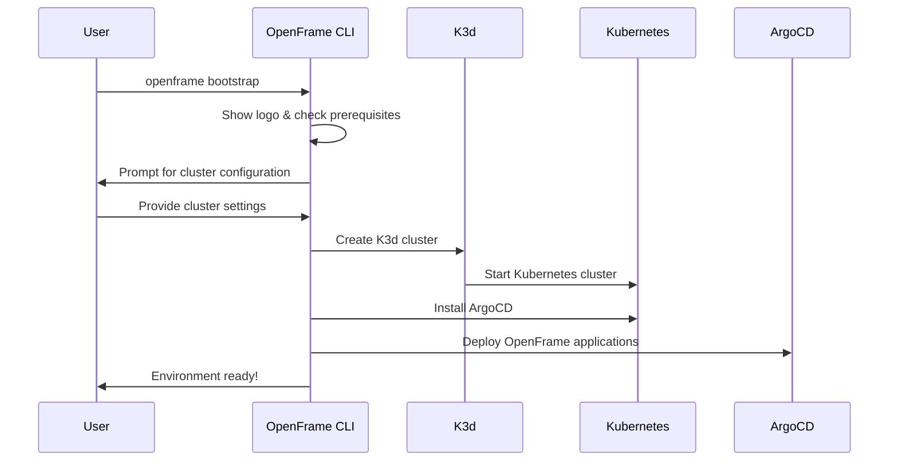

# Quick Start Guide

Get OpenFrame up and running in **5 minutes** with this streamlined setup guide.

## TL;DR - 5-Minute Setup

```bash
# 1. Download and install OpenFrame CLI
curl -fsSL https://get.openframe.sh | bash

# 2. Bootstrap complete environment (one command!)
openframe bootstrap

# 3. Verify installation
openframe cluster status
```

**That's it!** 🎉 You now have a complete OpenFrame environment with Kubernetes cluster and all components installed.

## Step-by-Step Walkthrough

### Step 1: Install OpenFrame CLI

Choose your installation method:

#### Option A: Quick Install Script (Recommended)
```bash
# Download and run installer
curl -fsSL https://get.openframe.sh | bash

# Add to PATH (if not automatically added)
echo 'export PATH="$HOME/.openframe/bin:$PATH"' >> ~/.bashrc
source ~/.bashrc
```

#### Option B: Manual Download
```bash
# Download latest release
wget https://github.com/flamingo-stack/openframe-cli/releases/latest/download/openframe-cli-linux-amd64

# Make executable and move to PATH
chmod +x openframe-cli-linux-amd64
sudo mv openframe-cli-linux-amd64 /usr/local/bin/openframe
```

#### Option C: Build from Source
```bash
# Clone repository
git clone https://github.com/flamingo-stack/openframe-cli.git
cd openframe-cli

# Build and install
make build
make install
```

### Step 2: Verify Installation

```bash
# Check CLI version
openframe --version

# View available commands
openframe --help
```

**Expected Output:**
```text
OpenFrame CLI v1.0.0
```

### Step 3: Bootstrap Your Environment

The bootstrap command performs a complete setup:

```bash
# Run interactive bootstrap
openframe bootstrap
```

**What happens during bootstrap:**



#### Interactive Prompts

During bootstrap, you'll be asked:

1. **Cluster Name**: 
   ```text
   Enter cluster name (default: openframe-dev):
   ```

2. **Deployment Mode**:
   ```text
   Select deployment mode:
   ❯ oss-tenant    (Single tenant, full features)
     saas-tenant   (Multi-tenant, isolated)  
     saas-shared   (Multi-tenant, shared resources)
   ```

3. **Resource Configuration**:
   ```text
   Configure cluster resources:
   CPU cores (default: 2):
   Memory GB (default: 4):
   ```

### Step 4: Verify Your Installation

```bash
# Check cluster status
openframe cluster status

# List running clusters
openframe cluster list

# Check ArgoCD applications
kubectl get applications -n argocd
```

**Expected Output:**
```text
✅ Cluster: openframe-dev
✅ Status: Running
✅ Nodes: 1
✅ ArgoCD: Installed and synced
✅ OpenFrame Apps: 3 deployed
```

## Hello World Example

Let's deploy a simple application to verify everything works:

### 1. Create a Simple App

```bash
# Create app directory
mkdir ~/openframe-hello-world
cd ~/openframe-hello-world

# Create a simple web app
cat > app.yaml << EOF
apiVersion: apps/v1
kind: Deployment
metadata:
  name: hello-openframe
  namespace: default
spec:
  replicas: 1
  selector:
    matchLabels:
      app: hello-openframe
  template:
    metadata:
      labels:
        app: hello-openframe
    spec:
      containers:
      - name: hello
        image: nginx:alpine
        ports:
        - containerPort: 80
        env:
        - name: MESSAGE
          value: "Hello from OpenFrame!"
---
apiVersion: v1
kind: Service
metadata:
  name: hello-openframe-service
  namespace: default
spec:
  selector:
    app: hello-openframe
  ports:
  - port: 80
    targetPort: 80
  type: LoadBalancer
EOF
```

### 2. Deploy the App

```bash
# Apply to your cluster
kubectl apply -f app.yaml

# Wait for deployment
kubectl wait --for=condition=available deployment/hello-openframe --timeout=60s

# Get service details
kubectl get svc hello-openframe-service
```

### 3. Access Your App

```bash
# Forward port to access locally
kubectl port-forward service/hello-openframe-service 8080:80 &

# Open in browser or curl
curl http://localhost:8080
```

**Expected Result:**
You should see the nginx welcome page, confirming your OpenFrame environment is working!

## Non-Interactive Mode

For automation or CI/CD environments:

```bash
# Skip all prompts with defaults
openframe bootstrap --deployment-mode=oss-tenant --non-interactive

# With custom cluster name
openframe bootstrap my-cluster --deployment-mode=oss-tenant --non-interactive

# With verbose logging
openframe bootstrap --deployment-mode=oss-tenant --non-interactive --verbose
```

## Common Quick Start Issues

### Issue: Docker Not Running
```bash
# Error: Cannot connect to Docker daemon
sudo systemctl start docker
# OR
open -a Docker  # On macOS
```

### Issue: Port Already in Use
```bash
# Error: Port 6443 already in use
openframe cluster list  # Check existing clusters
openframe cluster delete old-cluster  # Remove if not needed
```

### Issue: Insufficient Resources
```bash
# Error: Not enough memory/CPU
openframe cluster create --cpu=1 --memory=2  # Reduce resources
# OR
docker system prune  # Free up disk space
```

## Quick Commands Reference

| Command | Purpose | Example |
|---------|---------|---------|
| `openframe bootstrap` | Complete environment setup | `openframe bootstrap my-cluster` |
| `openframe cluster list` | Show all clusters | `openframe cluster list` |
| `openframe cluster status` | Check cluster health | `openframe cluster status` |
| `openframe cluster delete` | Remove cluster | `openframe cluster delete my-cluster` |
| `openframe chart install` | Install OpenFrame charts | `openframe chart install --mode=oss-tenant` |

## Next Steps

Now that OpenFrame is running, here's what to do next:

1. **[First Steps Guide](./first-steps.md)** - Essential post-installation tasks
2. **[Development Environment Setup](../development/setup/environment.md)** - Configure your IDE and tools
3. **[Architecture Overview](../development/architecture/overview.md)** - Understand how OpenFrame works
4. **[Local Development Guide](../development/setup/local-development.md)** - Start developing with OpenFrame

## Cleanup (Optional)

To remove everything and start fresh:

```bash
# Delete cluster and all resources
openframe cluster delete openframe-dev

# Verify cleanup
openframe cluster list
```

---

**🎉 Congratulations!** You now have a fully functional OpenFrame development environment. 

Next up: **[First Steps](./first-steps.md)** to explore what you can do with your new environment!