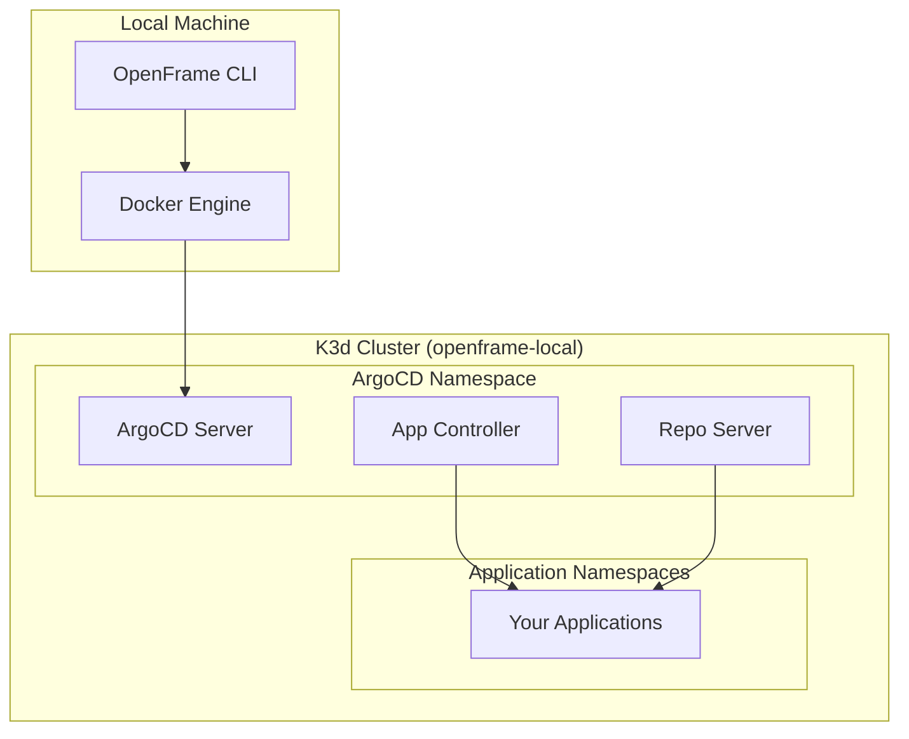

# Quick Start Guide

Get OpenFrame up and running in just 5 minutes with this streamlined quick start guide.

## TL;DR Installation

```bash
# 1. Download and install OpenFrame CLI
curl -sSL https://github.com/flamingo-stack/openframe-cli/releases/latest/download/install.sh | bash

# 2. Bootstrap complete OpenFrame environment
openframe bootstrap

# 3. Verify installation
kubectl get pods -n argocd
```

That's it! You now have a complete OpenFrame environment running locally.

## Step-by-Step Quick Start

### Step 1: Install OpenFrame CLI

Choose your installation method:

#### macOS/Linux (One-liner)
```bash
curl -sSL https://raw.githubusercontent.com/flamingo-stack/openframe-cli/main/install.sh | bash
```

#### Windows (PowerShell)
```bash
iwr -useb https://raw.githubusercontent.com/flamingo-stack/openframe-cli/main/install.ps1 | iex
```

#### Manual Download
Download the appropriate binary from [releases](https://github.com/flamingo-stack/openframe-cli/releases) and add it to your PATH.

### Step 2: Verify Installation

```bash
# Check CLI is installed
openframe --version

# View available commands
openframe --help
```

Expected output:
```text
OpenFrame CLI - Kubernetes cluster bootstrapping and development tools
Version: v1.0.0 (abc123) built on 2024-01-01
```

### Step 3: Bootstrap OpenFrame Environment

The bootstrap command creates a complete OpenFrame environment with one command:

```bash
openframe bootstrap
```

This interactive command will:
1. **Check prerequisites** and install missing tools
2. **Create a K3d cluster** named `openframe-local`
3. **Install ArgoCD** with Helm
4. **Deploy applications** using the app-of-apps pattern
5. **Verify** all components are running correctly

### Step 4: Monitor the Bootstrap Process

The bootstrap process typically takes 3-5 minutes. You'll see progress indicators for each step:

```text
🚀 OpenFrame CLI - Interactive Kubernetes Platform Bootstrapper

✅ Checking prerequisites...
✅ Creating K3d cluster 'openframe-local'...
✅ Installing ArgoCD with Helm...
✅ Deploying app-of-apps pattern...
✅ Waiting for applications to sync...

🎉 OpenFrame environment ready!
```

### Step 5: Verify Your Installation

Check that all components are running correctly:

```bash
# Verify cluster is active
kubectl cluster-info

# Check ArgoCD pods
kubectl get pods -n argocd

# List all applications
kubectl get applications -n argocd
```

Expected ArgoCD pods output:
```text
NAME                                READY   STATUS    RESTARTS   AGE
argocd-server-xxx                   1/1     Running   0          2m
argocd-repo-server-xxx             1/1     Running   0          2m
argocd-application-controller-xxx   1/1     Running   0          2m
```

## Quick Deployment Test

Test your environment by deploying a sample application:

### Deploy a Test Service

```bash
# Create a simple nginx deployment
kubectl create deployment nginx --image=nginx:latest

# Expose as a service
kubectl expose deployment nginx --port=80 --type=NodePort

# Check deployment status
kubectl get pods -l app=nginx
```

### Access Your Application

```bash
# Get service details
kubectl get service nginx

# Forward port to access locally
kubectl port-forward service/nginx 8080:80
```

Open your browser to `http://localhost:8080` to see nginx running.

## Non-Interactive Mode

For automation or CI/CD, use non-interactive flags:

```bash
# Bootstrap with specific options
openframe bootstrap \
  --mode=oss-tenant \
  --non-interactive \
  --verbose
```

### Available Bootstrap Flags

| Flag | Description | Default |
|------|-------------|---------|
| `--mode` | Deployment mode (oss-tenant, saas-tenant, saas-shared) | `oss-tenant` |
| `--cluster-name` | K3d cluster name | `openframe-local` |
| `--non-interactive` | Skip interactive prompts | `false` |
| `--verbose` | Enable detailed logging | `false` |
| `--silent` | Suppress output except errors | `false` |

## Common Quick Start Issues

### Docker Not Running
```bash
# Start Docker (macOS/Linux)
sudo systemctl start docker

# Or start Docker Desktop (Windows/macOS)
```

### Port Conflicts
If port 6443 is in use:
```bash
# Use custom cluster name with different port
openframe cluster create --name openframe-dev --api-port 6444
```

### Permission Issues
```bash
# Add user to docker group (Linux)
sudo usermod -aG docker $USER
# Log out and back in
```

## What You Just Created

Your bootstrap created:



## Next Steps

Now that OpenFrame is running, explore these key features:

1. **[First Steps](first-steps.md)** - Essential operations and workflows
2. **Cluster Management** - Create, manage, and scale clusters
3. **Application Deployment** - Deploy services with ArgoCD
4. **Development Tools** - Use Telepresence for local development

## Clean Up (Optional)

To remove the quick start environment:

```bash
# Delete the cluster and all resources
openframe cluster delete openframe-local

# Confirm removal
openframe cluster list
```

> **🎉 Congratulations!** You've successfully set up OpenFrame and deployed your first Kubernetes environment. The platform is ready for development, testing, and production workloads.

[](https://www.youtube.com/watch?v=bINdW0CQbvY)