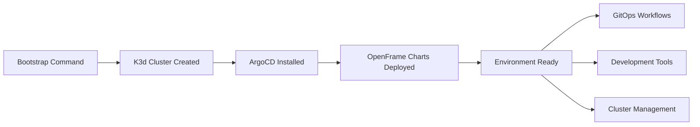

# Quick Start

Get OpenFrame CLI running in 5 minutes! This guide will have you creating Kubernetes clusters and deploying OpenFrame environments in no time.

## TL;DR - 5-Minute Setup

```bash
# 1. Install OpenFrame CLI (replace with actual installation method)
# curl -sSL https://get.openframe.io | sh  # Example - adjust for actual install

# 2. Bootstrap complete environment
openframe bootstrap my-cluster

# 3. Check cluster status
openframe cluster status

# 4. Access ArgoCD (after bootstrap completes)
kubectl port-forward svc/argocd-server -n argocd 8080:443
```

That's it! You now have a complete OpenFrame environment running.

## Step-by-Step Quick Start

### Step 1: Install OpenFrame CLI

> **📋 Prerequisites**: Ensure you have completed the [Prerequisites](prerequisites.md) setup first.

Download and install OpenFrame CLI:

```bash
# Method 1: Direct download (example)
# curl -sSL https://github.com/flamingo-stack/openframe-cli/releases/latest/download/openframe-cli-linux-amd64 -o openframe
# chmod +x openframe && sudo mv openframe /usr/local/bin/

# Method 2: Go install (if building from source)
# go install github.com/flamingo-stack/openframe-cli@latest

# Verify installation
openframe --help
```

### Step 2: Bootstrap Your First Environment

The `bootstrap` command creates everything you need in one go:

```bash
openframe bootstrap my-first-cluster
```

This single command will:
1. ✅ Check all prerequisites (Docker, K3d, kubectl, Helm)
2. 🐳 Create a K3d Kubernetes cluster named "my-first-cluster"
3. ⎈ Install ArgoCD for GitOps workflows
4. 📦 Install OpenFrame charts and applications
5. 🚀 Set up the complete environment

**Expected output:**
```text
🎯 OpenFrame CLI
   
🔍 Checking prerequisites...
✅ Docker found and running
✅ K3d found (v5.4.6)
✅ kubectl found (v1.28.0)
✅ Helm found (v3.12.0)

🐳 Creating K3d cluster 'my-first-cluster'...
✅ Cluster created successfully

⎈ Installing ArgoCD...
✅ ArgoCD installed and ready

📦 Installing OpenFrame charts...
✅ Charts installed successfully

🚀 Environment 'my-first-cluster' is ready!
```

> **⏱ Timing**: Initial bootstrap typically takes 3-5 minutes depending on your internet connection.

### Step 3: Verify Your Environment

Check that everything is working:

```bash
# Check cluster status
openframe cluster status

# List all clusters
openframe cluster list

# Check Kubernetes pods
kubectl get pods --all-namespaces
```

Expected cluster status output:
```text
📊 Cluster Status: my-first-cluster

Cluster: ✅ Running
Nodes: 1/1 Ready
ArgoCD: ✅ Deployed
OpenFrame: ✅ Installed

🌐 Access Points:
- ArgoCD: kubectl port-forward svc/argocd-server -n argocd 8080:443
- Cluster: kubectl cluster-info
```

### Step 4: Access ArgoCD Dashboard

ArgoCD provides the GitOps interface for your OpenFrame environment:

```bash
# Port forward to access ArgoCD
kubectl port-forward svc/argocd-server -n argocd 8080:443

# Get admin password
kubectl get secret argocd-initial-admin-secret -n argocd -o jsonpath="{.data.password}" | base64 -d
```

Open your browser to `https://localhost:8080` and login with:
- **Username**: `admin`
- **Password**: (from the command above)

> **🔒 Security Note**: Accept the self-signed certificate warning in your browser.

### Step 5: Explore Your Environment

Your OpenFrame environment is now ready! Here's what you can do:

```bash
# View all available commands
openframe --help

# See cluster details
kubectl cluster-info

# Check running applications
kubectl get applications -n argocd

# List available development tools
openframe dev --help
```

## What Just Happened?

The bootstrap command created a complete OpenFrame environment:



### Components Installed:
- **K3d Cluster**: Lightweight Kubernetes cluster running in Docker
- **ArgoCD**: GitOps continuous delivery tool
- **OpenFrame Charts**: Core OpenFrame applications and services
- **Helm Charts**: Package management for Kubernetes applications

## Quick Commands Reference

| Task | Command |
|------|---------|
| **Create cluster** | `openframe cluster create [name]` |
| **Delete cluster** | `openframe cluster delete [name]` |
| **List clusters** | `openframe cluster list` |
| **Cluster status** | `openframe cluster status [name]` |
| **Install charts** | `openframe chart install` |
| **Start development** | `openframe dev intercept [service]` |
| **Bootstrap everything** | `openframe bootstrap [name]` |

## Common Next Steps

### Start Development
```bash
# Intercept traffic for local development
openframe dev intercept my-service

# Use Skaffold for live reloading
openframe dev skaffold my-service
```

### Deploy Applications
```bash
# Install additional charts
openframe chart install --deployment-mode=oss-tenant

# Use ArgoCD for GitOps deployments
kubectl apply -f my-app-definition.yaml
```

### Manage Multiple Environments
```bash
# Create development environment
openframe bootstrap dev-cluster

# Create staging environment
openframe bootstrap staging-cluster

# Switch between clusters
kubectl config use-context k3d-dev-cluster
kubectl config use-context k3d-staging-cluster
```

## Troubleshooting Quick Start

### Bootstrap Fails
```bash
# Check prerequisites
openframe cluster --help  # This runs prerequisite checks

# Clean up and retry
openframe cluster cleanup
openframe bootstrap my-cluster --verbose
```

### ArgoCD Not Accessible
```bash
# Check ArgoCD pods
kubectl get pods -n argocd

# Restart port forwarding
kubectl port-forward svc/argocd-server -n argocd 8080:443
```

### Cluster Creation Issues
```bash
# Check Docker
docker info

# View K3d logs
k3d cluster list
k3d cluster delete my-cluster  # Clean up if needed
```

## Next Steps

Now that you have OpenFrame running:

1. **[First Steps](first-steps.md)** - Learn essential tasks and workflows
2. **[Development Setup](../development/setup/local-development.md)** - Configure your development environment
3. **[Architecture Overview](../development/architecture/overview.md)** - Understand how OpenFrame works

> **🎉 Congratulations!** You now have a fully functional OpenFrame environment. Happy developing!