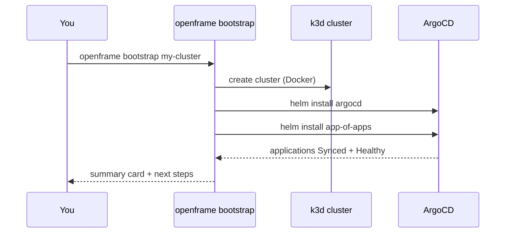

# Quick Start

This guide gets you from zero to a running OpenFrame platform on a local machine in a few commands.

## 1. Install OpenFrame CLI

### Windows

Download the pre-built binary:

- **Windows (amd64)**: [openframe-cli_windows_amd64.zip](https://github.com/flamingo-stack/openframe-cli/releases/latest/download/openframe-cli_windows_amd64.zip)

Extract the archive and run the `openframe` executable the same way you would on any other OS (see below). Because Docker/k3d and Kubernetes networking need to run in a Linux environment, OpenFrame CLI automatically forwards its execution into WSL2 on Windows — make sure WSL2 with an Ubuntu distro is installed and available.

### macOS / Linux

Grab the appropriate archive for your OS/architecture from the [OpenFrame CLI releases page](https://github.com/flamingo-stack/openframe-cli/releases), extract it, and place the `openframe` binary somewhere on your `$PATH` (for example `/usr/local/bin`).

### Build from source (all platforms)

If you have Go 1.26+ installed, you can build directly from the repository:

```bash
git clone https://github.com/flamingo-stack/openframe-cli.git
cd openframe-cli
go build -o openframe .
./openframe --version
```

## 2. Verify the Install

```bash
openframe --version
```

This prints the CLI version along with the pinned versions of the external tools it manages (Terraform, Helm, k3d, mkcert, infracost, ArgoCD chart).

## 3. Check Prerequisites

```bash
openframe prerequisites check
```

If anything is missing (Docker, k3d, Helm for the default local cluster type), install it automatically on macOS/Linux:

```bash
openframe prerequisites install
```

## 4. Bootstrap a Cluster + Platform

The fastest path to a running OpenFrame platform is the `bootstrap` command, which creates a local `k3d` cluster and installs ArgoCD + the app-of-apps in one step:

```bash
openframe bootstrap my-cluster
```

This launches an interactive flow by default. For CI/automation, use `--non-interactive` together with an existing `openframe-helm-values.yaml` file in your working directory:

```bash
openframe bootstrap my-cluster --non-interactive
```

### Expected Output

Bootstrap runs through staged progress (cluster creation → ArgoCD install → app-of-apps install → application readiness wait) and finishes with a summary card showing stage timings and next-step suggestions. Internally, it:

1. Validates your Helm values file (fails fast, before touching your Docker daemon).
2. Creates a k3d cluster via Docker.
3. Installs ArgoCD via Helm.
4. Clones the app-of-apps chart repository and installs it via Helm.
5. Waits until all ArgoCD Applications report `Synced` + `Healthy`.


```mermaid
sequenceDiagram
    participant You
    participant CLI as openframe bootstrap
    participant Cluster as k3d cluster
    participant ArgoCD

    You->>CLI: openframe bootstrap my-cluster
    CLI->>Cluster: create cluster (Docker)
    CLI->>ArgoCD: helm install argocd
    CLI->>ArgoCD: helm install app-of-apps
    ArgoCD-->>CLI: applications Synced + Healthy
    CLI-->>You: summary card + next steps
```

## 5. Check Platform Status

```bash
openframe app status
```

For a live-refreshing view:

```bash
openframe app status --watch
```

Or a full interactive TUI:

```bash
openframe app status --interactive
```

## 6. Access the Platform

Retrieve ArgoCD admin credentials and port-forward instructions:

```bash
openframe app access
```

## Next Steps

Now that you have a running cluster and platform, continue to [First Steps](first-steps.md) to learn about day-2 operations like upgrading, switching clusters, and getting help. You can also revisit [Prerequisites](prerequisites.md) if you plan to target a cloud cluster type (EKS/GKE) instead of local `k3d`.
