# Quick Start Guide

Get OpenFrame CLI running in under 5 minutes! This guide provides the fastest path to a working OpenFrame environment with minimal configuration.

> **Prerequisites**: Ensure you've completed the [Prerequisites Guide](prerequisites.md) before proceeding.

## TL;DR Installation

For experienced users, here's the fastest installation path:

```bash
# 1. Download OpenFrame CLI
wget https://github.com/flamingo-stack/openframe-cli/releases/latest/download/openframe-cli_linux_amd64.tar.gz

# 2. Extract and install
tar -xzf openframe-cli_linux_amd64.tar.gz
sudo mv openframe-cli /usr/local/bin/

# 3. Bootstrap complete environment
openframe bootstrap

# 4. Verify installation
openframe cluster status
```

## Step-by-Step Installation

### Step 1: Download OpenFrame CLI

Choose your platform and download the latest release:

#### Windows
```bash
# Download for Windows AMD64
curl -LO https://github.com/flamingo-stack/openframe-cli/releases/latest/download/openframe-cli_windows_amd64.zip

# Extract the archive
# Right-click → Extract All, or use PowerShell:
Expand-Archive openframe-cli_windows_amd64.zip -DestinationPath .

# Move to a directory in your PATH
move openframe-cli.exe C:\Windows\System32\
```

#### macOS
```bash
# Download for macOS (Universal Binary)
curl -LO https://github.com/flamingo-stack/openframe-cli/releases/latest/download/openframe-cli_darwin_all.tar.gz

# Extract and install
tar -xzf openframe-cli_darwin_all.tar.gz
sudo mv openframe-cli /usr/local/bin/

# Make executable
chmod +x /usr/local/bin/openframe-cli
```

#### Linux
```bash
# Download for Linux AMD64
curl -LO https://github.com/flamingo-stack/openframe-cli/releases/latest/download/openframe-cli_linux_amd64.tar.gz

# Extract and install
tar -xzf openframe-cli_linux_amd64.tar.gz
sudo mv openframe-cli /usr/local/bin/

# Make executable
chmod +x /usr/local/bin/openframe-cli
```

### Step 2: Verify Installation

```bash
# Check version and basic functionality
openframe --version

# Display help to see available commands
openframe --help
```

**Expected Output:**
```text
OpenFrame CLI - Interactive Kubernetes Platform Bootstrapper

OpenFrame CLI replaces the shell scripts with a modern, interactive terminal UI
for managing OpenFrame Kubernetes deployments...

Available Commands:
  bootstrap   Bootstrap complete OpenFrame environment
  chart       Manage Helm charts and ArgoCD installations  
  cluster     Manage Kubernetes clusters
  dev         Developer tools for intercepts and scaffolding
  help        Help about any command
```

### Step 3: Bootstrap Your First Environment

The bootstrap command creates a complete OpenFrame environment in one go:

```bash
# Interactive mode (recommended for first-time users)
openframe bootstrap

# Or with a custom cluster name
openframe bootstrap my-dev-cluster
```

#### What Happens During Bootstrap

```mermaid
sequenceDiagram
    participant User
    participant CLI as OpenFrame CLI
    participant Docker
    participant K3d
    participant ArgoCD
    participant Apps as Applications
    
    User->>CLI: openframe bootstrap
    CLI->>CLI: Check prerequisites
    CLI->>Docker: Verify Docker daemon
    Docker-->>CLI: ✅ Ready
    CLI->>K3d: Create cluster
    K3d-->>CLI: ✅ Cluster created
    CLI->>K3d: Configure kubeconfig
    K3d-->>CLI: ✅ Context set
    CLI->>ArgoCD: Install ArgoCD
    ArgoCD-->>CLI: ✅ ArgoCD ready
    CLI->>Apps: Deploy app-of-apps
    Apps-->>CLI: ✅ Applications synced
    CLI-->>User: 🚀 Environment ready!
```



### Step 4: Verify Your Environment

After bootstrap completes, verify everything is working:

```bash
# Check cluster status
openframe cluster status

# List running clusters
openframe cluster list

# Check ArgoCD applications
kubectl get applications -n argocd
```

**Expected Output:**
```text
✅ Cluster Status: Running
📊 Cluster Info:
   Name: openframe-dev
   Provider: k3d
   Nodes: 3 (1 server, 2 agents)
   Kubernetes Version: v1.27.4+k3s1

🎯 ArgoCD Applications:
   NAME                 SYNC STATUS   HEALTH STATUS
   app-of-apps         Synced        Healthy
   argocd              Synced        Healthy
```

## Your First "Hello World"

Let's deploy a simple application to test your environment:

### Deploy Sample Application

```bash
# Use the scaffold command to create a new application
openframe dev scaffold hello-world

# Follow the interactive prompts to configure your app
```

### Expected Results

After scaffolding, you should see:

```text
✅ Application scaffolded successfully!

📁 Generated files:
   └── hello-world/
       ├── Dockerfile
       ├── k8s/
       │   ├── deployment.yaml
       │   └── service.yaml
       └── argocd/
           └── application.yaml

🚀 Next steps:
   1. Build your application: docker build -t hello-world .
   2. Deploy to cluster: kubectl apply -f k8s/
   3. Access via port-forward: kubectl port-forward svc/hello-world 8080:80
```

### Test the Application

```bash
# Navigate to the generated directory
cd hello-world

# Build the Docker image
docker build -t hello-world .

# Deploy to your cluster
kubectl apply -f k8s/

# Check deployment status
kubectl get pods -l app=hello-world

# Access the application
kubectl port-forward svc/hello-world 8080:80
```

Then open http://localhost:8080 in your browser to see your application running!

## Common Commands Quick Reference

| Task | Command | Description |
|------|---------|-------------|
| **Create cluster** | `openframe cluster create` | Interactive cluster creation |
| **List clusters** | `openframe cluster list` | Show all clusters |
| **Delete cluster** | `openframe cluster delete` | Remove a cluster |
| **Install charts** | `openframe chart install` | Deploy ArgoCD and charts |
| **Intercept service** | `openframe dev intercept` | Route traffic to local development |
| **Scaffold app** | `openframe dev scaffold` | Generate new application template |
| **Get help** | `openframe <command> --help` | Command-specific help |

## Troubleshooting Quick Fixes

### Bootstrap Fails

```bash
# Clean up and retry
openframe cluster cleanup
docker system prune -f
openframe bootstrap --verbose
```

### Cluster Not Accessible

```bash
# Reset kubectl context
openframe cluster status
kubectl config current-context
kubectl get nodes
```

### Docker Issues

```bash
# Restart Docker daemon
# Windows/macOS: Restart Docker Desktop
# Linux:
sudo systemctl restart docker
```

### Permission Errors

```bash
# Linux: Add user to docker group
sudo usermod -aG docker $USER
newgrp docker

# Verify Docker access
docker ps
```

## Performance Optimization Tips

1. **Increase Docker Resources**
   - Windows/macOS: Docker Desktop → Settings → Resources
   - Allocate at least 8GB RAM and 4 CPU cores to Docker

2. **Use Local Registry**
   ```bash
   # Start local registry for faster image pulls
   docker run -d -p 5000:5000 --restart=always --name registry registry:2
   ```

3. **Enable BuildKit**
   ```bash
   # Add to your shell profile
   export DOCKER_BUILDKIT=1
   ```

## Next Steps

Congratulations! You now have a fully functional OpenFrame environment. Here's what to explore next:

### Immediate Next Steps
1. **[First Steps Guide](first-steps.md)** - Explore key features and workflows
2. **[Development Setup](../development/setup/environment.md)** - Configure your development environment
3. **[Architecture Overview](../development/architecture/overview.md)** - Understand the system architecture

### Advanced Topics
- Learn about [service intercepts](../development/setup/local-development.md) for local development
- Explore [ArgoCD GitOps workflows](../development/architecture/overview.md)  
- Set up [automated testing](../development/testing/overview.md)
- Configure [production deployments](../development/contributing/guidelines.md)

### Community Resources
- Join the [OpenMSP Slack](https://join.slack.com/t/openmsp/shared_invite/zt-36bl7mx0h-3~U2nFH6nqHqoTPXMaHEHA) community
- Browse the [OpenFrame documentation](https://openframe.ai)
- Check out the [Flamingo platform](https://flamingo.run)

---

*Ready to dive deeper? Let's explore the [essential first steps](first-steps.md) with your new OpenFrame environment!*